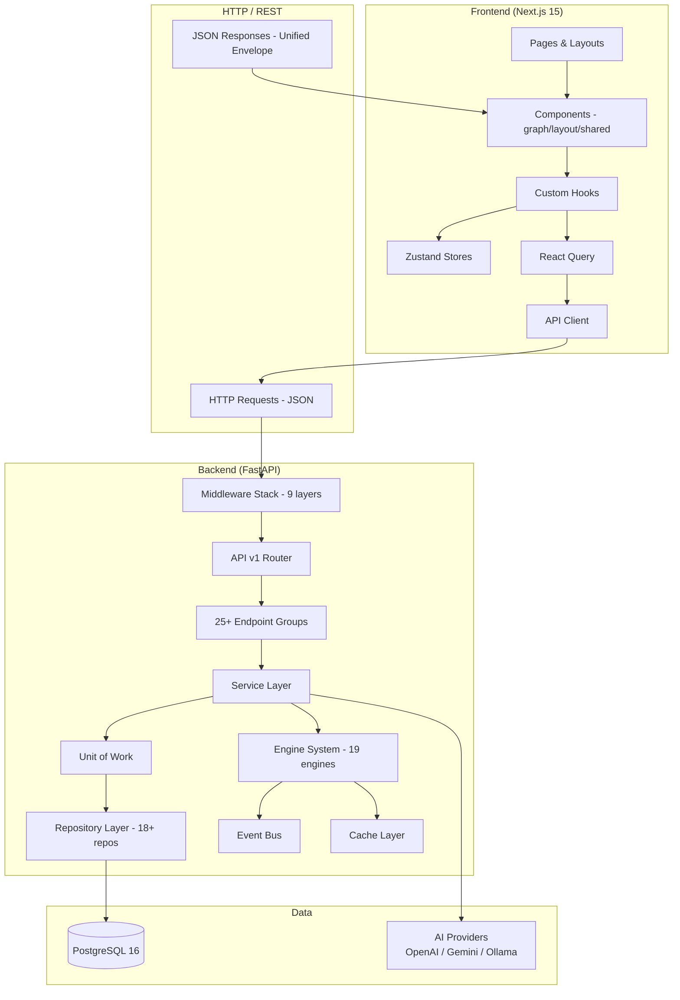
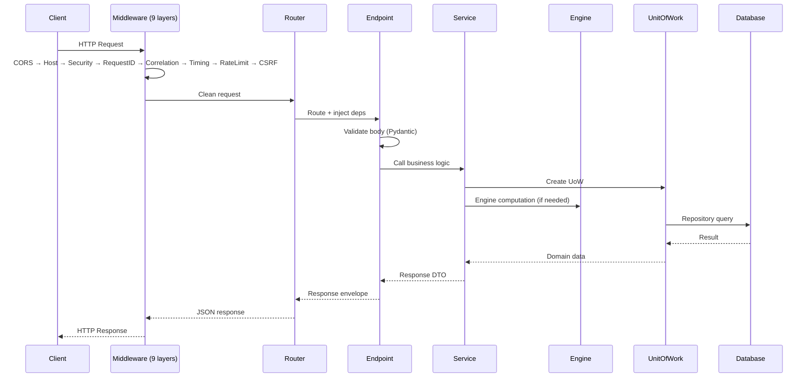
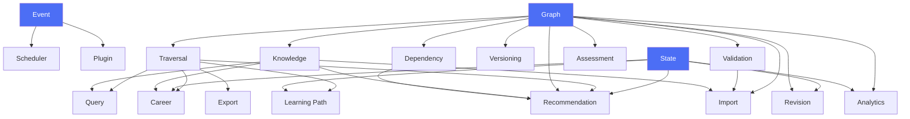
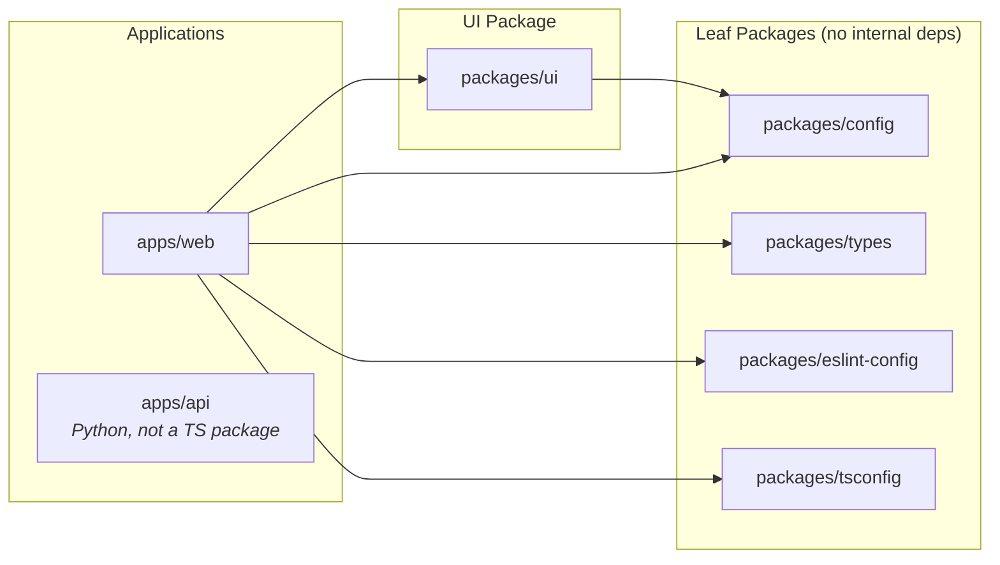
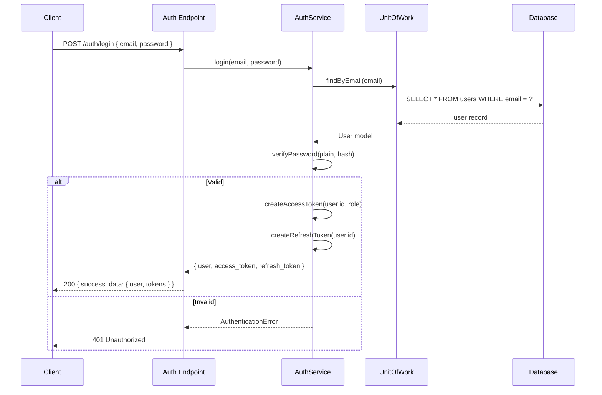
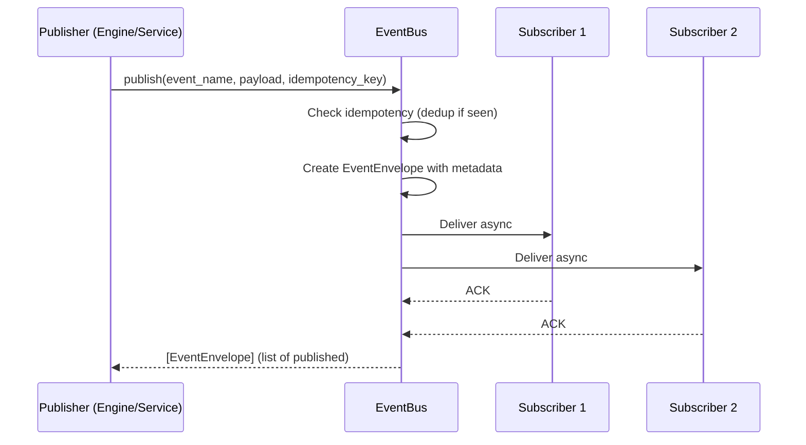

# SV-OS Architecture

> **Version**: 0.3.0 | **Date**: July 22, 2026 | **Status**: Infrastructure v1 ✅

---

## Architecture Overview



---

## Frontend Architecture

### Layer Stack

```
Provider Tree
    └── App Router (layout.tsx)
        ├── Landing (/) — unauthenticated
        └── Auth Pages (login, signup, forgot/reset password)
        └── AppShell (sidebar + top nav + footer)
            ├── Dashboard
            ├── Graph (React Flow)
            ├── Explore
            ├── Careers
            ├── Learning
            ├── Projects
            ├── Progress
            ├── Bookmmarks
            ├── Search
            ├── AI Chat
            ├── Settings
            └── System (health, versions, import/export)
```

### State Management

| State Type         | Tool                     | Purpose                                               |
| ------------------ | ------------------------ | ----------------------------------------------------- |
| **Server state**   | React Query              | Data from API (user, graph, progress, search results) |
| **UI state**       | Zustand (ui-store)       | Sidebar toggle, theme, modals                         |
| **Graph state**    | Zustand (graph-store)    | Selected nodes, viewport, filters                     |
| **Learning state** | Zustand (learning-store) | Active session, current path                          |
| **Platform state** | Zustand (platform-store) | System status, feature flags                          |

### Data Flow Pattern

```
User Interaction → Hook (useGraph, useProgress)
    → Service (graph.ts, progress.ts)
        → API Client (api-client.ts)
            → HTTP Request → Backend
        ← JSON Response
    ← React Query Cache
→ Component Re-render
```

### Component Categories

```
components/
├── auth/          # Protected route wrapper
├── graph/         # React Flow graph, flow config, helpers, layouts
├── layout/        # AppShell, Sidebar, TopNav, Footer, CommandPalette
└── shared/        # ErrorBoundary, PageHeader, Shell, SkipNav, Animations
```

### All Routes

| Route                   | Auth | Layout | Purpose                  |
| ----------------------- | ---- | ------ | ------------------------ |
| `/`                     | No   | None   | Landing page             |
| `/login`                | No   | (auth) | Sign in                  |
| `/signup`               | No   | (auth) | Create account           |
| `/forgot-password`      | No   | (auth) | Password reset request   |
| `/reset-password`       | No   | (auth) | Password reset           |
| `/dashboard`            | Yes  | (main) | Main dashboard           |
| `/explore`              | Yes  | (main) | Browse graph             |
| `/explore/[slug]`       | Yes  | (main) | Node detail              |
| `/graph`                | Yes  | (main) | Full graph visualization |
| `/careers`              | Yes  | (main) | Career paths             |
| `/careers/[slug]`       | Yes  | (main) | Career detail            |
| `/learning`             | Yes  | (main) | Learning paths           |
| `/projects`             | Yes  | (main) | Projects                 |
| `/projects/[slug]`      | Yes  | (main) | Project detail           |
| `/progress`             | Yes  | (main) | Learning analytics       |
| `/bookmarks`            | Yes  | (main) | Saved bookmarks          |
| `/search`               | Yes  | (main) | Search                   |
| `/notifications`        | Yes  | (main) | Notifications            |
| `/ai-chat`              | Yes  | (main) | AI assistant             |
| `/settings`             | Yes  | (main) | Settings hub             |
| `/settings/profile`     | Yes  | (main) | Profile settings         |
| `/settings/preferences` | Yes  | (main) | Preferences              |
| `/settings/account`     | Yes  | (main) | Account settings         |
| `/health`               | Yes  | (main) | System health            |
| `/versions`             | Yes  | (main) | Graph versions           |
| `/import-export`        | Yes  | (main) | Data management          |

---

## Backend Architecture

### Layer Architecture

```
──────────────────────────────────────────────
  MIDDLEWARE LAYER (9 layers, outer→inner)
  CORS → CSRF → Rate Limit → Timing →
  Correlation ID → Request ID → Security Headers →
  Trusted Hosts → GZip
──────────────────────────────────────────────
  API LAYER
  FastAPI Router → Endpoint Handlers →
  Pydantic Validation → Response Envelope
──────────────────────────────────────────────
  SERVICE LAYER
  AuthService, GraphService, UserService,
  SearchService, ProgressService, etc.
──────────────────────────────────────────────
  ENGINE LAYER (19 engines)
  Graph → Knowledge → Traversal → Search →
  Recommendation → Learning Path → Career →
  Analytics → Versioning → Import/Export → etc.
──────────────────────────────────────────────
  INFRASTRUCTURE LAYER
  Event Bus → Cache → Container → Registries →
  Audit → WebSocket → Workers
──────────────────────────────────────────────
  REPOSITORY LAYER (18+ repositories)
  BaseRepository → QueryBuilder → Pagination
  UserRepository, NodeRepository, EdgeRepository, etc.
  UnitOfWork → Transaction Management
──────────────────────────────────────────────
  DATA LAYER
  SQLAlchemy ORM Models → PostgreSQL 16
──────────────────────────────────────────────
```

### Request Flow



### Engine Dependency Graph



---

## Database Architecture

### Schema Design

```
20 tables organized into domains:

User Domain:         users, password_reset_tokens
Graph Domain:        knowledge_nodes, knowledge_edges
Career Domain:       careers, career_requirements
Project Domain:      projects, project_requirements
Learning Domain:     learning_resources
Progress Domain:     user_progress
Interaction Domain:  bookmarks, favorites, activity_logs, search_history
```

### Graph Storage Pattern

The knowledge graph uses an **adjacency list** pattern:

```
knowledge_nodes (vertices)
    id UUID PK
    slug VARCHAR UNIQUE
    title VARCHAR
    node_type ENUM (subject, concept, technology, tool, career, project)
    difficulty ENUM (beginner, intermediate, advanced, expert)

knowledge_edges (directed edges)
    id UUID PK
    source_node_id UUID FK → knowledge_nodes
    target_node_id UUID FK → knowledge_nodes
    relationship_type ENUM (prerequisite, depends_on, uses, enables, part_of, related_to, leads_to, requires)
    weight FLOAT (1.0 default)
```

Graph traversal uses **recursive CTEs**:

```sql
WITH RECURSIVE prereq_chain AS (
    SELECT source_node_id, target_node_id, 1 AS depth
    FROM knowledge_edges
    WHERE target_node_id = :node_id AND relationship_type = 'prerequisite'
    UNION ALL
    SELECT e.source_node_id, e.target_node_id, pc.depth + 1
    FROM knowledge_edges e
    INNER JOIN prereq_chain pc ON e.target_node_id = pc.source_node_id
    WHERE e.relationship_type = 'prerequisite'
)
SELECT * FROM prereq_chain;
```

### Search Architecture

Two search systems coexist:

1. **PostgreSQL Full-Text Search** — Weighted TSVECTOR on `knowledge_nodes` (title=A, description=B, content=C)
2. **SearchEngine** (in-memory) — Exact, prefix, fuzzy (Levenshtein), fulltext, tag, type-based search
3. **Hybrid Search** — Combines PostgreSQL FTS + vector similarity (when AI embedding providers configured)

---

## Packages Architecture



---

## Authentication Flow



---

## Event Flow



### Event Types

| Event                         | Publisher            | Subscribers      |
| ----------------------------- | -------------------- | ---------------- |
| `platform.started`            | Lifespan             | All engines      |
| `recommendation.generated.v1` | RecommendationEngine | Analytics, State |
| `engine.initialized`          | EngineRegistry       | Health checker   |
| `engine.started`              | EngineRegistry       | Health checker   |

---

## Folder Structure

```
sv-os/
├── apps/
│   ├── api/
│   │   ├── app/
│   │   │   ├── api/v1/endpoints/   # 25+ endpoint modules
│   │   │   ├── core/               # Config, database, logging
│   │   │   ├── engines/            # 20 engine files (19 registered)
│   │   │   ├── events/bus/         # EventBus
│   │   │   ├── exceptions/         # Error hierarchy + handlers
│   │   │   ├── infrastructure/     # Container, cache, registries, runtime
│   │   │   ├── middleware/         # 9 middleware modules
│   │   │   ├── models/             # SQLAlchemy ORM models
│   │   │   ├── repositories/       # 18+ repository classes
│   │   │   ├── schemas/            # Pydantic schemas
│   │   │   ├── services/           # Business logic + AI services
│   │   │   ├── startup/            # Lifespan, diagnostics
│   │   │   └── telemetry/          # Health, metrics, tracing
│   │   ├── alembic/                # Migration versions
│   │   └── tests/                  # pytest tests
│   └── web/
│       └── src/
│           ├── app/                # App Router pages & layouts
│           ├── components/         # React components
│           ├── features/           # Feature bundles
│           ├── hooks/              # Custom hooks
│           ├── lib/                # Utilities, clients
│           ├── providers/          # Context providers
│           ├── services/           # API service functions
│           ├── stores/             # Zustand stores
│           └── utils/              # Pure utility functions
├── packages/
│   ├── config/src/                 # Constants, env, tokens
│   ├── types/src/                  # TS interfaces
│   ├── ui/src/                     # React components
│   ├── eslint-config/              # ESLint presets
│   └── tsconfig/                   # TS config presets
├── database/
│   ├── seeds/                      # 9 seed SQL files
│   ├── scripts/                    # backup, restore, seed, reset
│   └── schema.sql                  # Canonical schema
├── docker-compose.yml              # Dev environment
├── docker-compose.prod.yml         # Production environment
└── Dockerfile.api / Dockerfile.web # Production builds
```

---

_Cross-reference: [BACKEND_BLUEPRINT.md](./BACKEND_BLUEPRINT.md), [FRONTEND_BLUEPRINT.md](./FRONTEND_BLUEPRINT.md), [DATABASE_BLUEPRINT.md](./DATABASE_BLUEPRINT.md)_
