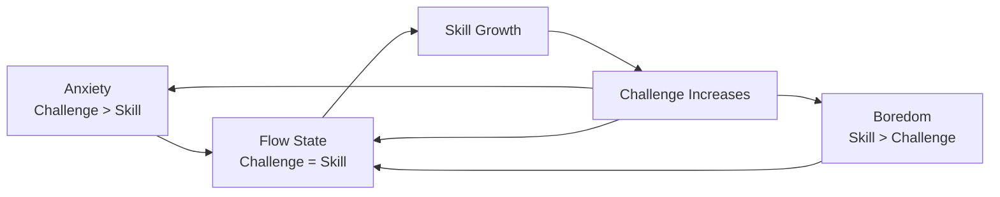

# SV-OS Cognitive Model

> **Design**: How SV-OS leverages learning science principles for maximum retention and understanding  
> **Date**: July 22, 2026 | **Status**: Design Complete  
> **Cross-reference**: [LEARNING_ENGINE.md](./LEARNING_ENGINE.md), [MASTERY_MODEL.md](./MASTERY_MODEL.md), [LEARNING_PHILOSOPHY.md](./LEARNING_PHILOSOPHY.md)

---

## Philosophy

SV-OS is built on the science of how humans learn — not on intuitions about teaching. Every feature in the Learning Engine is grounded in established cognitive science research.

This document maps learning science principles to SV-OS features, showing exactly how each principle influences the system.

---

## Principle Map

```mermaid
graph TB
    subgraph "Cognitive Principles"
        AR[Active Recall]
        SR[Spaced Repetition]
        IL[Interleaving]
        CH[Chunking]
        DC[Dual Coding]
        WE[Worked Examples]
        RP[Retrieval Practice]
        DP[Deliberate Practice]
        FL[Feedback Loops]
        MT[Motivation]
        FS[Flow State]
        CL[Cognitive Load]
        TL[Transfer Learning]
        MC[Metacognition]
    end

    subgraph "SV-OS Features"
        Q[Checkpoints & Quizzes]
        R[Review Scheduler]
        P[Project Interleaving]
        C[Content Sizing]
        V[Visual + Text Combined]
        E[Example Bank]
        S[Simulators]
        PR[Project Engine]
        FB[Immediate Feedback]
        GP[Goal Proximity]
        AD[Adaptive Difficulty]
        SG[Scaffolding]
        CR[Cross-Domain Projects]
        SA[Self-Assessment]
    end

    AR --> Q
    AR --> R
    SR --> R
    IL --> P
    CH --> C
    DC --> V
    WE --> E
    RP --> Q
    RP --> S
    DP --> PR
    FL --> FB
    MT --> GP
    FS --> AD
    CL --> SG
    TL --> CR
    MC --> SA
```



---

## Principle 1: Active Recall

**Science**: Recalling information from memory is more effective than re-reading or reviewing. Each recall strengthens neural pathways.

**SV-OS Implementation**:

```python
class ActiveRecallEngine:
    """
    Every interaction should require the learner to actively
    retrieve information, not passively consume it.
    """

    def design_interaction(self, node: KnowledgeNode) -> LearningInteraction:
        """
        For every teaching moment, prefer active over passive formats.

        Preference order:
        1. ❌ Read explanation (passive — minimum)
        2. ✅ Watch explanation then summarize (active)
        3. ✅ Answer questions about it (active)
        4. ✅ Predict what happens next (active)
        5. ✅ Apply to solve a problem (most active)
        """

        # Video → followed by prediction question
        # Reading → followed by summarizing prompt
        # Example → followed by "what if" variation
        # Code → followed by "fill in the blank"

        return LearningInteraction(
            passive_element=node.content,
            active_element=self._generate_retrieval_prompt(node),
            order="active_after_passive",
            rationale="Retrieval practice after exposure"
        )

    def generate_retrieval_prompts(
        self,
        node: KnowledgeNode,
        count: int = 3
    ) -> list[RetrievalPrompt]:
        """
        Generate different types of retrieval prompts:
        - Fact recall: "What does async/await do?"
        - Explanation: "Explain how Promises work in your own words"
        - Application: "Rewrite this callback as a Promise chain"
        - Prediction: "What happens if we don't catch this error?"
        """
        ...
```

**In Practice**:

```
❌ "Here's how promises work. Read this section."
✅ "Read about promises, then close the explanation and write
    your own summary. Compare with our explanation."

❌ "Watch this video about closures."
✅ "Watch this video, then predict: what will this code output?
    Run it to verify your prediction."
```

---

## Principle 2: Spaced Repetition

**Science**: Information reviewed at increasing intervals moves from short-term to long-term memory more effectively than massed practice.

**SV-OS Implementation**: [See MASTERY_MODEL.md](./MASTERY_MODEL.md) — The entire review scheduling system is based on spaced repetition (modified SM-2 algorithm).

| Review Interval | After Mastery ≥ 0.8 | After Mastery ≥ 0.6 | After Mastery ≥ 0.4 |
| --------------- | ------------------- | ------------------- | ------------------- |
| 1st review      | 7 days              | 3 days              | 1 day               |
| 2nd review      | 21 days             | 7 days              | 3 days              |
| 3rd review      | 60 days             | 16 days             | 7 days              |
| 4th review      | 120 days            | 35 days             | 16 days             |
| 5th review      | 180 days            | 90 days             | 35 days             |

---

## Principle 3: Interleaving

**Science**: Mixing different topics during practice leads to better long-term retention than blocked practice (studying one topic completely before moving to the next).

**SV-OS Implementation**:

```python
class InterleavingEngine:
    """
    Interleave related concepts during review and practice.
    """

    def interleave_review(
        self,
        user_id: UUID,
        due_nodes: list[UUID]
    ) -> list[ReviewSession]:
        """
        Instead of reviewing one node at a time, group related
        but different nodes into sessions.

        Example session: "Arrays, Strings, Hash Tables" (all data structures)
        Instead of: "Arrays, Arrays, Arrays, then Strings, Strings"
        """

        # Categorize due nodes by their parent subject
        by_subject = self._group_by_subject(due_nodes)

        sessions = []
        for subject, nodes in by_subject.items():
            # Mix different node types within the same subject
            shuffled = self._shuffle_within_subject(nodes)

            # Create interleaved session
            sessions.append(ReviewSession(
                subject=subject,
                nodes=shuffled,
                strategy="interleaved",
                rationale="Strengthens discrimination between related concepts"
            ))

        return sessions

    def interleave_projects(
        self,
        user_id: UUID,
        available_projects: list[ProjectSpec]
    ) -> list[ProjectSpec]:
        """
        Suggest projects that combine DIFFERENT concepts the learner knows.

        Example: "Build a dashboard" uses:
        - Frontend (React)
        - Data visualization (D3.js)
        - API integration (fetch)
        - Database (SQL queries)

        This interleaves multiple skills, strengthening all of them.
        """
        ...
```

**In Practice**:

```
Blocked: Sort 10 arrays → then sort 10 linked lists → then sort 10 trees
Interleaved: Sort array → sort linked list → traverse tree → sort array → ...

The interleaved approach forces the brain to discriminate between
different approaches, strengthening understanding of WHEN to use each.
```

---

## Principle 4: Chunking

**Science**: Working memory can hold ~7±2 items. Information should be grouped into meaningful chunks.

**SV-OS Implementation**:

```yaml
chunking_rules:
  content_limits:
    max_new_concepts_per_session: 3 # Never introduce more than 3 new concepts
    max_steps_in_explanation: 5 # Break longer explanations into 5-step max
    max_code_lines_per_example: 15 # Short examples are easier to digest

  session_duration:
    beginner: 25 minutes # Pomodoro-like
    intermediate: 45 minutes
    advanced: 60 minutes
    expert: 90 minutes

  content_structure:
    - 'Title and one-sentence summary' # Orientation
    - 'Prerequisite review (1-2 items)' # Activate prior knowledge
    - 'Core concept (chunked into 3-5 sub-points)' # New content
    - 'Example demonstrating the concept' # Concrete application
    - 'Practice with immediate feedback' # Active recall
    - 'Connection to larger context' # Why this matters
```

---

## Principle 5: Dual Coding

**Science**: Combining verbal and visual information improves encoding and retrieval. The brain processes language and images through separate channels, each reinforcing the other.

**SV-OS Implementation**: [See VISUAL_LEARNING_SYSTEM.md](./VISUAL_LEARNING_SYSTEM.md)

```yaml
dual_coding_rules:
  every_concept_has:
    - verbal: text_explanation
    - visual: diagram | animation | memory_layout | graph

  combinations:
    - 'Code + Execution visualization' # See what code does
    - 'Text + Concept map' # See relationships
    - 'Lecture + Timeline' # See progression
    - 'Example + Before/After' # See transformation

  anti_patterns:
    - 'Never show text-only for concepts that can be visualized'
    - "Never show decorative images that don't teach"
    - 'Never separate related visual and verbal information'
```

---

## Principle 6: Worked Examples

**Science**: Studying worked examples (problems with step-by-step solutions) is more effective for novices than solving problems independently.

**SV-OS Implementation**:

```python
class WorkedExampleEngine:
    """
    Every concept should have worked examples at multiple levels.
    """

    def get_worked_examples(
        self,
        node: KnowledgeNode,
        difficulty: str
    ) -> list[WorkedExample]:
        """
        Provide examples with fading scaffolding:

        Level 1 (Beginner): Full worked example — problem, solution, explanation
        Level 2 (Intermediate): Partial example — problem, start of solution, complete it
        Level 3 (Advanced): Problem only — learner solves independently

        This is known as "faded worked examples" and is highly effective.
        """

        return [
            WorkedExample(
                level=1,
                format="full",
                problem="...",
                solution="...",
                explanation="Step-by-step reasoning",
                scaffolding="Maximum"
            ),
            WorkedExample(
                level=2,
                format="partial",
                problem="...",
                solution_start="First steps...",
                learner_completes=True,
                scaffolding="Medium"
            ),
            WorkedExample(
                level=3,
                format="minimal",
                problem="...",
                solution_hints=["Hint 1", "Hint 2"],
                scaffolding="Minimal"
            ),
        ]
```

---

## Principle 7: Deliberate Practice

**Science**: Improvement requires focused practice on tasks that are at the edge of current ability, with immediate feedback and specific goals.

**SV-OS Implementation**:

```python
class DeliberatePracticeEngine:
    """
    Every practice session should be:
    1. At the right difficulty (not too easy, not too hard)
    2. Focused on weak areas (not what you already know)
    3. Have clear goals (not vague "practice more")
    4. Provide immediate feedback
    """

    def design_practice_session(
        self,
        user_id: UUID,
        available_time_minutes: int = 30
    ) -> PracticeSession:
        # Step 1: Identify weak areas (mastery < 0.6)
        weak_nodes = self._identify_weak_nodes(user_id)

        # Step 2: Select nodes at the edge of ability
        # (mastery between 0.4 and 0.6 — challenging but not impossible)
        sweet_spot = [n for n in weak_nodes if 0.4 <= n.mastery <= 0.6]

        # Step 3: Set specific goals
        goals = [
            SpecificGoal(
                node=n,
                target="increase application dimension to 0.6",
                success_criteria="Complete 3 application exercises with >80% accuracy"
            )
            for n in sweet_spot[:2]  # Focus on 1-2 nodes per session
        ]

        # Step 4: Create focused practice
        return PracticeSession(
            duration_minutes=min(available_time_minutes, 45),
            goals=goals,
            activities=self._generate_practice_activities(sweet_spot[:2]),
            feedback_type="immediate",
            success_criteria="All goals met or 45 minutes elapsed"
        )
```

---

## Principle 8: Feedback Loops

**Science**: Feedback is most effective when it is immediate, specific, and corrective.

**SV-OS Implementation**:

```yaml
feedback_rules:
  timing:
    - 'Quiz answers: Immediate (after each question)'
    - 'Code exercises: Within 5 seconds'
    - 'Project submissions: Within 24 hours (auto-check instant)'
    - 'Open-ended questions: Within 1 hour (AI-generated)'

  quality:
    - "Not just 'correct' or 'incorrect'"
    - 'Explain WHY the answer is correct/incorrect'
    - 'Show the correct approach'
    - 'Link back to relevant content'
    - 'Suggest what to review if wrong'

  types:
    verification:
      - '✅ Correct! Explanation of why'
      - "❌ Not quite. Here's why. Try this approach."

    elaboration:
      - 'Great answer! Did you also know that [related concept]?'
      - 'Good start. Consider also: [alternative approach]'

    hint:
      - 'Think about what happens when the array is empty'
      - 'What if you tried using a hash table here?'
```

---

## Principle 9: Motivation & Self-Determination

**Science**: Intrinsic motivation is driven by autonomy, competence, and relatedness.

**SV-OS Implementation**:

| Driver          | SV-OS Feature                                                 |
| --------------- | ------------------------------------------------------------- |
| **Autonomy**    | Choose your own path, branch freely, set your own pace        |
| **Competence**  | Clear progress visualization, mastery tracking, skill badges  |
| **Relatedness** | Peer matching, community projects, mentoring opportunities    |
| **Purpose**     | Every node explains WHY — career relevance, real-world impact |
| **Curiosity**   | Knowledge graph exploration, "what's nearby" suggestions      |
| **Mastery**     | Visual mastery growth, personal best tracking                 |

---

## Principle 10: Flow State

**Science**: Flow occurs when challenge matches skill. Too hard → anxiety. Too easy → boredom.

**SV-OS Implementation**: [See LEARNING_ENGINE.md — Difficulty Calibrator](./LEARNING_ENGINE.md)



---

## Principle 11: Cognitive Load

**Science**: Working memory has limited capacity. Instruction should minimize extraneous load and maximize germane load.

**SV-OS Implementation**:

```yaml
cognitive_load_management:
  intrinsic_load:
    - 'Break complex concepts into smaller steps'
    - 'Ensure prerequisites are mastered before new content'
    - 'Use progressive disclosure — reveal complexity gradually'

  extraneous_load:
    - 'Clean, distraction-free UI during learning'
    - 'Consistent layout across all content types'
    - 'No ads, no sidebar suggestions during active learning'
    - 'Focus mode — hide everything except current content'

  germane_load:
    - 'Include schema-building activities'
    - 'Explicitly connect new content to existing knowledge'
    - 'Provide varied examples to build flexible understanding'
```

---

## Principle 12: Transfer Learning

**Science**: Knowledge transfers better when learned in multiple contexts with explicit connections.

**SV-OS Implementation**:

```python
class TransferEngine:
    """
    Ensure knowledge transfers across contexts.
    """

    def design_for_transfer(
        self,
        concept: KnowledgeNode
    ) -> TransferDesign:
        """
        For every concept, show it in multiple contexts:

        Example: "Hash Tables"
        - Computer Science: Hash table data structure
        - Database: Hash indexes
        - Security: Password hashing
        - Web: Session storage
        - Languages: Python dict, JavaScript Map, Java HashMap
        """

        contexts = self._find_contexts(concept)

        return TransferDesign(
            core_concept=concept,
            contexts=contexts[:5],  # Show in 5 different contexts
            connections=[  # Explicit cross-context connections
                CrossContextConnection(
                    from_context="Python dict",
                    to_context="Hash table implementation",
                    insight="Python dict IS a hash table"
                )
            ],
            far_transfer=self._find_far_transfer_opportunities(concept)
            # e.g., "How is a hash table like a library catalog system?"
        )
```

---

## Principle 13: Metacognition

**Science**: Learners who monitor their own understanding learn more effectively.

**SV-OS Implementation**:

```yaml
metacognitive_features:
  self_assessment:
    - "Before learning a node: 'How well do you know this?' (1-5)"
    - "After learning: 'Was your prediction accurate?'"
    - 'Compare self-rating with actual performance'

  reflection_prompts:
    - 'What was the most confusing part of this concept?'
    - 'How would you explain this to a beginner?'
    - 'What real-world problem does this solve?'
    - 'What other topics does this connect to?'

  progress_awareness:
    - 'Mastery dashboard with trend lines'
    - 'Confidence vs. actual ability comparison'
    - 'Learning velocity visualization'
    - 'Knowledge graph with your mastery heatmap'
```

---

## Principle Integration

These principles don't operate in isolation. They interact:

```python
class CognitiveModel:
    """
    Integrated cognitive model that applies all principles together.
    """

    def design_learning_experience(
        self,
        node: KnowledgeNode,
        context: LearnerContext
    ) -> LearningExperience:
        return LearningExperience(
            # Principle 4: Chunk content
            chunks=self._chunk_content(node, chunk_size=3),

            # Principle 5: Dual code
            visual=self._find_or_create_visual(node),
            verbal=node.content,

            # Principle 6: Provide worked examples
            worked_examples=self._get_worked_examples(node, context),

            # Principle 1: Include active recall
            retrieval_prompts=self._generate_retrieval_prompts(node),

            # Principle 8: Immediate feedback
            feedback=self._design_feedback(node),

            # Principle 2 & 7: Schedule review + deliberate practice
            review_plan=self._schedule_review(node, context),

            # Principle 10 & 11: Optimize difficulty and load
            difficulty=self._calibrate_difficulty(node, context),

            # Principle 9: Maintain motivation
            motivation_context=self._generate_motivation_context(node, context),

            # Principle 12: Enable transfer
            transfer=self._design_transfer_activities(node),

            # Principle 13: Promote metacognition
            metacognitive=self._design_reflection(node)
        )
```

---

_Cross-reference: [LEARNING_ENGINE.md](./LEARNING_ENGINE.md), [MASTERY_MODEL.md](./MASTERY_MODEL.md), [LEARNING_PHILOSOPHY.md](./LEARNING_PHILOSOPHY.md), [VISUAL_LEARNING_SYSTEM.md](./VISUAL_LEARNING_SYSTEM.md)_
