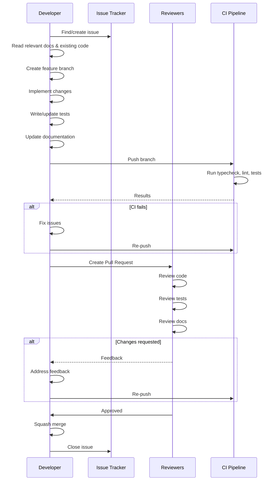
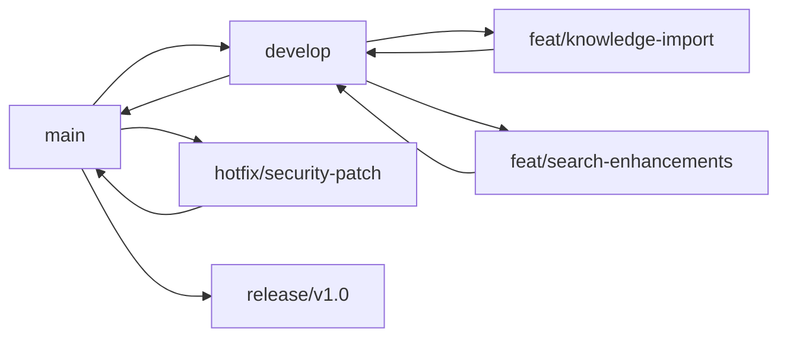
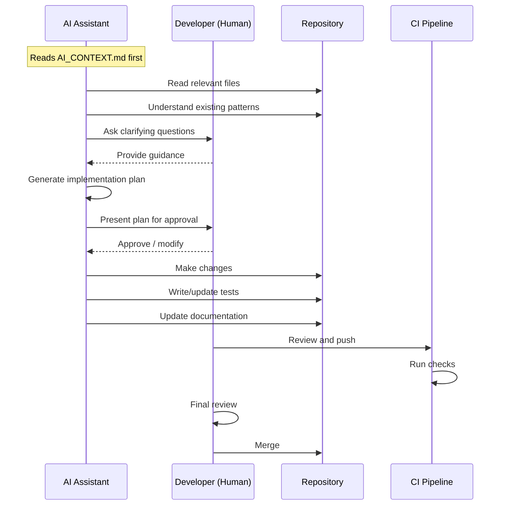
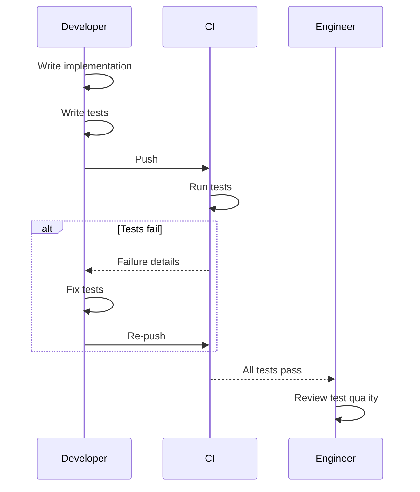
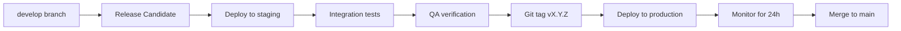

# SV-OS Advanced Contributing Guide

> **Human and AI contribution workflows** | **Date**: July 22, 2026

---

## Contribution Philosophy

1. **Every contribution matters** — From a one-line fix to a new engine, all contributions are valued
2. **Quality over quantity** — A well-tested small feature > a buggy large feature
3. **Documented decisions** — Every change should explain WHY, not just WHAT
4. **Backward compatibility** — Don't break existing functionality without explicit approval

---

## Human Workflow

### Standard Contribution Flow



### Branch Strategy



### Branch Naming

| Prefix      | Purpose               | Example                           |
| ----------- | --------------------- | --------------------------------- |
| `feat/`     | New feature           | `feat/knowledge-import-json`      |
| `fix/`      | Bug fix               | `fix/auth-null-preferences`       |
| `chore/`    | Maintenance           | `chore/upgrade-deps`              |
| `docs/`     | Documentation         | `docs/api-blueprint-update`       |
| `refactor/` | Code refactoring      | `refactor/repository-base`        |
| `test/`     | Testing               | `test/add-engine-lifecycle-tests` |
| `hotfix/`   | Urgent production fix | `hotfix/critical-security-patch`  |

---

## AI Workflow

### AI Contribution Flow



### AI-Specific Rules

| Rule                            | Description                                            |
| ------------------------------- | ------------------------------------------------------ |
| **Read context first**          | Always read `docs/AI_CONTEXT.md` before making changes |
| **Ask before building**         | Present implementation plan before writing code        |
| **Match patterns**              | Follow existing code patterns exactly                  |
| **Minimal changes**             | Change only what's necessary for the task              |
| **Document decisions**          | Record architecture decisions in `.ai/`                |
| **Never change critical files** | See "Things Never to Change" in AI_CONTEXT.md          |

### AI Prompting Guide

```markdown
Good AI prompt:
"I need to implement the JSON knowledge import parser.
The schema is defined in KNOWLEDGE_SCHEMA.md.
The import spec is in KNOWLEDGE_IMPORT_SPEC.md.
Please read those files, then create an implementation plan."

Bad AI prompt:
"Add a knowledge import feature."
(Too vague — AI needs context about existing architecture)
```

---

## Pull Request Standards

### PR Template

```markdown
## Description

<!-- What does this PR do? Why is it needed? -->

## Type of Change

- [ ] Feature
- [ ] Bug fix
- [ ] Refactoring
- [ ] Documentation
- [ ] Tests
- [ ] CI/CD

## Testing

- [ ] Unit tests pass
- [ ] Integration tests pass
- [ ] Manual testing performed

## Documentation

- [ ] Code documentation updated
- [ ] Architecture docs updated
- [ ] README updated (if applicable)

## Breaking Changes

- [ ] No breaking changes
- [ ] Yes — described below:
```

### PR Size Guidelines

| Size    | Lines Changed | Review Time       | Merge Policy                 |
| ------- | ------------- | ----------------- | ---------------------------- |
| Tiny    | < 20          | < 5 min           | Single reviewer              |
| Small   | 20-100        | 10-15 min         | Single reviewer              |
| Medium  | 100-500       | 30 min            | Two reviewers                |
| Large   | 500-2000      | 1+ hour           | Two reviewers, design review |
| Massive | 2000+         | Multiple sessions | Must be broken down          |

---

## Review Process

### Architectural Review

Before large features, an architectural review ensures:

```markdown
## Architecture Review Checklist

- [ ] Does this fit the existing architecture?
- [ ] Are we following the layer rules? (API → Service → Repo)
- [ ] Are we following engine lifecycle patterns?
- [ ] Are we following repository patterns?
- [ ] Are we maintaining backward compatibility?
- [ ] Are we introducing new dependencies?
- [ ] Are we following the naming conventions?
- [ ] Is the documentation updated?
```

### Code Review

```markdown
## Code Review Checklist

- [ ] Code is clean and readable
- [ ] Tests cover the change
- [ ] Error handling is comprehensive
- [ ] No security vulnerabilities
- [ ] No performance regressions
- [ ] Follows coding standards
- [ ] No unnecessary complexity
- [ ] Changes are minimal
```

### Documentation Review

```markdown
## Documentation Review Checklist

- [ ] Public API is documented
- [ ] Architecture decisions are recorded
- [ ] Cross-references are correct
- [ ] Diagrams are up to date
- [ ] Examples are accurate
```

---

## Testing Requirements

### By Change Type

| Change Type    | Required Tests              | Minimum Coverage |
| -------------- | --------------------------- | ---------------- |
| Bug fix        | Regression test for the bug | 1 test           |
| New repository | Full CRUD tests             | 10+ tests        |
| New service    | All business logic paths    | 15+ tests        |
| New endpoint   | Success + error cases       | 5+ tests         |
| New engine     | Lifecycle + core operations | 20+ tests        |
| New component  | Rendering + interactions    | 5+ tests         |
| New hook       | All states                  | 5+ tests         |

### Test PR Lifecycle



---

## Commit Conventions

### Format

```markdown
<type>(<scope>): <description>

[optional body]

[optional footer]
```

### Examples

```
feat(import): add JSON knowledge import parser
fix(auth): handle null user preferences in profile endpoint
chore(deps): bump react-query to v5.75
docs(architecture): add engine lifecycle state diagram
refactor(repository): extract base pagination logic
test(engine): add traversal algorithm tests
ci(pipeline): add frontend test step
```

### Allowed Types

| Type       | Purpose                 | Release Note |
| ---------- | ----------------------- | ------------ |
| `feat`     | New feature             | Included     |
| `fix`      | Bug fix                 | Included     |
| `chore`    | Maintenance             | Not included |
| `docs`     | Documentation           | Not included |
| `refactor` | Code restructuring      | Not included |
| `test`     | Test additions          | Not included |
| `perf`     | Performance improvement | Included     |
| `ci`       | CI changes              | Not included |
| `style`    | Formatting              | Not included |

---

## Release Conventions

### Versioning

SV-OS follows **Semantic Versioning**:

```
MAJOR.MINOR.PATCH (e.g., 0.3.0)

MAJOR: Breaking changes (API, database, architecture)
MINOR: New features (backward compatible)
PATCH: Bug fixes (backward compatible)
```

### Release Process



### Release Checklist

```markdown
## Release Checklist

- [ ] All PRs merged to develop
- [ ] Staging deployment successful
- [ ] All integration tests pass
- [ ] Manual QA completed
- [ ] Changelog updated
- [ ] Version bumped in config
- [ ] Git tag created
- [ ] Production deployment completed
- [ ] Health checks passing
- [ ] Monitoring dashboards green
- [ ] Team notified
```

---

_Cross-reference: [ENGINEERING_STANDARDS.md](./ENGINEERING_STANDARDS.md), [IMPLEMENTATION_GUIDE.md](./IMPLEMENTATION_GUIDE.md)_
