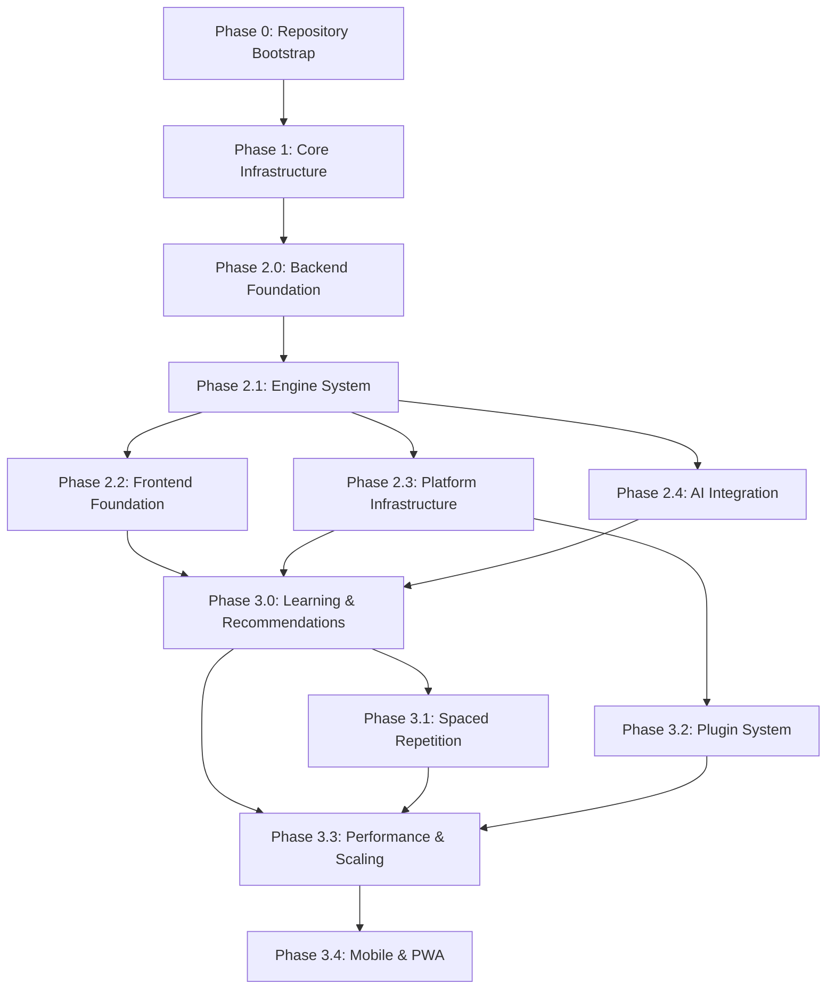

# SV-OS Development Roadmap

> **Version**: 0.3.0 | **Last Updated**: July 22, 2026

---

## Phase Overview

| Phase   | Name                           | Status         | Timeline      |
| ------- | ------------------------------ | -------------- | ------------- |
| 0       | Repository Bootstrap           | ✅ Completed   | Pre-July 2026 |
| 1       | Core Infrastructure            | ✅ Completed   | Pre-July 2026 |
| 2.0     | Backend Foundation             | ✅ Completed   | Pre-July 2026 |
| 2.1     | Engine System                  | ✅ Completed   | Pre-July 2026 |
| 2.2     | Frontend Foundation            | ✅ Completed   | Pre-July 2026 |
| 2.3     | Platform Infrastructure        | ✅ Completed   | Pre-July 2026 |
| 2.4     | AI Integration                 | ✅ Completed   | Pre-July 2026 |
| **3.0** | **Learning & Recommendations** | **🟡 Current** | **July 2026** |
| 3.1     | Spaced Repetition & Revision   | 🟡 In Progress | July-Aug 2026 |
| 3.2     | Plugin System & Community      | ⬜ Planned     | Aug-Sept 2026 |
| 3.3     | Performance & Scaling          | ⬜ Planned     | Sept-Oct 2026 |
| 3.4     | Mobile & PWA                   | ⬜ Planned     | Oct-Dec 2026  |

---

## Phase 0 — Repository Bootstrap ✅ COMPLETED

### Scope

Set up the monorepo structure, toolchain, and development environment.

### Tasks

- [x] Initialize monorepo with pnpm workspaces
- [x] Configure Turborepo with caching and task pipeline
- [x] Set up TypeScript with strict mode across workspaces
- [x] Configure ESLint (base, next.js, react.js presets)
- [x] Configure Prettier with Tailwind CSS plugin
- [x] Install and configure Husky + commitlint + lint-staged
- [x] Create base tsconfig presets (api, nextjs, react-library)
- [x] Create shared packages scaffolding (config, types, ui)
- [x] Define `.editorconfig`, `.gitignore`, `.npmrc`, `.prettierrc`
- [x] Create `.github/` templates (issues, PRs, CODEOWNERS, dependabot)

### Deliverables

- Functional monorepo with pnpm + Turborepo
- Pre-commit hooks enforcing conventional commits + linting
- Shared TypeScript and ESLint configuration presets

### Dependencies

- None

---

## Phase 1 — Core Infrastructure ✅ COMPLETED

### Scope

Set up the backend framework, database schema, Docker environment, and CI/CD.

### Tasks

- [x] Initialize FastAPI application with structured logging
- [x] Configure Pydantic Settings with environment validation
- [x] Set up SQLAlchemy async engine with asyncpg
- [x] Create Alembic migration framework
- [x] Define complete database schema (20 tables, 13 enums)
- [x] Create full-text search with weighted TSVECTOR and triggers
- [x] Set up PostgreSQL with uuid-ossp, pg_trgm, unaccent extensions
- [x] Create database utility scripts (backup, restore, seed, reset, health check)
- [x] Write seed data (9 SQL files covering subjects, concepts, technologies, careers, etc.)
- [x] Create Docker Compose for development (PostgreSQL + pgAdmin)
- [x] Create Docker Compose for production (PostgreSQL + API + Web)
- [x] Write multi-stage Dockerfiles for API (Python) and Web (Node.js)
- [x] Set up GitHub Actions CI pipeline (type check, lint, test, build, Docker)
- [x] Set up GitHub Actions lint workflow for non-main branches
- [x] Create database migration documentation with index strategy

### Deliverables

- Running FastAPI application with database connectivity
- Fully migrated PostgreSQL schema
- Development environment via Docker Compose
- CI pipeline validating every PR

### Dependencies

- Phase 0

---

## Phase 2.0 — Backend Foundation ✅ COMPLETED

### Scope

Build the complete backend application including models, repositories, services, and API endpoints.

### Tasks

- [x] Create ORM models with AppBaseMixin (UUID PK, timestamps, soft-delete, versioning)
- [x] Implement custom PgEnumType (TypeDecorator-based) for enum handling
- [x] Build generic BaseRepository with CRUD, pagination, soft-delete, optimistic locking
- [x] Implement UnitOfWork pattern with lazy repository instantiation
- [x] Create QueryBuilder for fluent query construction
- [x] Build all concrete repositories (18+ repositories)
- [x] Implement AuthService (JWT, bcrypt, password reset, token refresh)
- [x] Build authentication endpoints (login, register, refresh, forgot/reset password)
- [x] Create Pydantic schemas for all request/response models
- [x] Implement GraphService with neighborhood exploration and statistics
- [x] Build graph API endpoints (full graph, explore, statistics, prerequisites)
- [x] Implement UserService (profile CRUD, preferences)
- [x] Build CareerService and career endpoints
- [x] Build ProjectService and project endpoints
- [x] Create ProgressService and progress tracking endpoints
- [x] Implement BookmarkService + FavoritesService
- [x] Build SearchService with full-text search
- [x] Implement unified response envelope pattern
- [x] Build exception hierarchy and global handlers
- [x] Create health endpoint suite (live, ready, checks)

### Deliverables

- Complete backend API with 25+ endpoint groups
- Full authentication system with tokens
- Graph exploration and navigation APIs
- User progress tracking system

### Dependencies

- Phase 1

---

## Phase 2.1 — Engine System ✅ COMPLETED

### Scope

Design and implement the pluggable engine system with lifecycle management.

### Tasks

- [x] Create EngineBase ABC with formal lifecycle (UNINITIALIZED → READY → RUNNING → STOPPED → FAILED)
- [x] Implement EngineMetadata, EngineHealth, EngineDependency descriptors
- [x] Build DependencyGraph with topological sort and cycle detection
- [x] Create EngineRegistry with lazy initialization and startup/shutdown ordering
- [x] Implement EventBus with async handlers, idempotency, and metadata
- [x] Build GraphEngine with in-memory graph, indexes, versioning, snapshots
- [x] Implement KnowledgeEngine
- [x] Build TraversalEngine
- [x] Implement QueryEngine (depends on graph + traversal + knowledge)
- [x] Create StateEngine
- [x] Build RecommendationEngine
- [x] Implement LearningPathEngine
- [x] Build CareerEngine
- [x] Create AssessmentEngine
- [x] Implement VersioningEngine
- [x] Build ExportEngine + ImportEngine
- [x] Create SchedulerEngine + RevisionEngine
- [x] Implement AnalyticsEngine + PluginEngine + ValidationEngine
- [x] Build DomainEvent definitions
- [x] Create PlatformContainer (DI container) with all engines registered
- [x] Implement startup lifecycle (validate → init → start → verify)
- [x] Implement shutdown lifecycle (stop all → dispose pool)

### Deliverables

- 20 production-ready engines with formal lifecycle
- Event-driven architecture with in-process event bus
- Dependency injection container for platform services
- Startup diagnostics and engine health monitoring

### Dependencies

- Phase 2.0

---

## Phase 2.2 — Frontend Foundation ✅ COMPLETED

### Scope

Build the complete Next.js frontend application with all pages, components, and state management.

### Tasks

- [x] Initialize Next.js 15 with App Router
- [x] Configure TypeScript strict mode
- [x] Set up Tailwind CSS v4 with design tokens (colors, shadows, animations)
- [x] Create CSS animations and utility classes (glass morphism, scrollbar, focus ring)
- [x] Set up next-themes with forced dark mode default
- [x] Implement React Query provider for server state management
- [x] Configure Zustand stores (UI, graph, learning, platform)
- [x] Build Radix UI-based component library (23 components)
- [x] Create auth provider with login/signup/logout context
- [x] Build AppShell layout with sidebar, top navigation, footer
- [x] Design responsive sidebar with collapsible navigation
- [x] Create command palette (⌘K) wrapper
- [x] Implement landing page with background gradients and feature cards
- [x] Build authentication pages (login, signup, forgot/reset password)
- [x] Create dashboard with stat cards, quick actions, activity feed
- [x] Build knowledge graph visualization with React Flow
- [x] Implement graph page with custom KnowledgeNode component
- [x] Create explore page for browsing the knowledge graph
- [x] Build careers page with career paths
- [x] Create learning page with learning paths
- [x] Build projects page
- [x] Create progress page with user statistics
- [x] Build search page with results
- [x] Create bookmarks page
- [x] Build settings pages (profile, preferences, account)
- [x] Create notifications page
- [x] Build health/status page
- [x] Create import-export page
- [x] Build versions page
- [x] Create AI chat page
- [x] Implement error boundary, loading states, not-found page
- [x] Create skip-navigation for accessibility
- [x] Build API client with unified error handling
- [x] Create auth client for token management
- [x] Implement all custom hooks (20+ hooks)
- [x] Build feature components (bookmarks, careers, graph, knowledge, progress, projects, search, settings)

### Deliverables

- Complete Next.js 15 application with 18+ pages
- Reusable UI component library with 23 components
- Full state management with React Query + Zustand
- Interactive knowledge graph visualization
- Responsive design with dark mode

### Dependencies

- Phase 2.0 (for API contracts)

---

## Phase 2.3 — Platform Infrastructure ✅ COMPLETED

### Scope

Implement production-ready infrastructure: middleware, monitoring, caching, security.

### Tasks

- [x] Implement middleware stack (9 middleware layers)
- [x] Build CORS middleware with flexible origin parsing
- [x] Implement CSRF middleware (double-submit cookie pattern)
- [x] Build rate limiting middleware (token bucket)
- [x] Create request ID and correlation ID middleware
- [x] Implement request timing middleware
- [x] Build security headers middleware (CSP, HSTS, X-Frame-Options, etc.)
- [x] Create trusted hosts middleware
- [x] Implement in-memory cache backend
- [x] Build graph cache for efficient graph data caching
- [x] Create audit logger
- [x] Implement health checker with plugin architecture
- [x] Build platform status API
- [x] Create startup diagnostics
- [x] Implement telemetry module (health, metrics, tracing, performance)
- [x] Build WebSocket manager (stub)
- [x] Create worker manager (stub)
- [x] Implement capability registry
- [x] Build plugin registry with manifest loading
- [x] Implement Sentry error tracking integration

### Deliverables

- Production-grade middleware stack
- Caching layer for graph and API responses
- Comprehensive health monitoring
- Security hardening (CSP, CSRF, rate limiting, host validation)

### Dependencies

- Phase 2.1

---

## Phase 2.4 — AI Integration ✅ COMPLETED

### Scope

Integrate AI capabilities including embeddings, semantic search, RAG, and chat.

### Tasks

- [x] Create abstract embedding provider interface
- [x] Implement OpenAI embedding provider
- [x] Implement Gemini embedding provider
- [x] Implement Ollama (local) embedding provider
- [x] Build embedding service with provider selection
- [x] Implement RAG (Retrieval-Augmented Generation) engine
- [x] Build semantic search service
- [x] Create hybrid search (PostgreSQL FTS + vector similarity)
- [x] Implement context engine for AI responses
- [x] Build chat service with session management
- [x] Create AI chat API endpoints
- [x] Implement AI security service (prompt injection detection)
- [x] Build observability for AI operations
- [x] Create ranking service for result relevance
- [x] Implement domain-aware AI engines (knowledge, recommendation)

### Deliverables

- Pluggable embedding provider system (OpenAI, Gemini, Ollama)
- Semantic and hybrid search capabilities
- RAG engine for context-aware AI responses
- AI chat with security filtering

### Dependencies

- Phase 2.0, Phase 2.1

---

## Phase 3.0 — Learning & Recommendations 🟡 CURRENT

### Scope

Complete the learning path generation and recommendation engine integration.

### Tasks

- [ ] Complete LearningPathGenerator service
- [ ] Integrate LearningPathEngine with API endpoints
- [ ] Complete RecommendationEngine scoring algorithms
- [ ] Build personalized recommendation API
- [ ] Create learning path visualization in frontend
- [ ] Implement "Next Step" recommendation on dashboard
- [ ] Add skill gap analysis
- [ ] Build career roadmap generation
- [ ] Create assessment integration with learning paths
- [ ] End-to-end testing of learning flows

### Dependencies

- Phase 2.4

---

## Phase 3.1 — Spaced Repetition & Revision 🟡 IN PROGRESS

### Scope

Implement the spaced repetition system for effective long-term learning.

### Tasks

- [ ] Complete RevisionEngine scheduling algorithms
- [ ] Create revision dashboard
- [ ] Build review session UI
- [ ] Implement progress decay tracking
- [ ] Add notification reminders for reviews
- [ ] Create revision statistics and insights
- [ ] Build scheduling configuration (user preferences)

### Dependencies

- Phase 3.0

---

## Phase 3.2 — Plugin System & Community ⬜ PLANNED

### Scope

Enable community contributions through a plugin system.

### Tasks

- [ ] Implement plugin loading and sandboxing
- [ ] Create plugin API
- [ ] Build plugin marketplace UI
- [ ] Implement community node contributions
- [ ] Add moderation tools
- [ ] Create contribution review workflow
- [ ] Build community content ratings

### Dependencies

- Phase 2.3 (PluginRegistry exists as scaffold)

---

## Phase 3.3 — Performance & Scaling ⬜ PLANNED

### Scope

Optimize performance for large-scale usage.

### Tasks

- [ ] Implement Redis caching layer
- [ ] Add database read replicas
- [ ] Implement graph partitioning for large graphs
- [ ] Add query optimization and N+1 prevention
- [ ] Implement CDN for static assets
- [ ] Add response compression tuning
- [ ] Implement database query profiling
- [ ] Add lazy loading for graph visualization
- [ ] Implement virtual scrolling for large lists

### Dependencies

- Phase 3.0

---

## Phase 3.4 — Mobile & PWA ⬜ PLANNED

### Scope

Extend the platform to mobile devices.

### Tasks

- [ ] Implement responsive design for all pages
- [ ] Add PWA support (service worker, manifest)
- [ ] Implement offline-first architecture
- [ ] Add touch-friendly interactions
- [ ] Create mobile-optimized graph visualization
- [ ] Implement push notifications
- [ ] Add biometric authentication support

### Dependencies

- Phase 3.3

---

## Dependency Graph

## Priority Order

| Priority | Phase     | Reason                                                |
| -------- | --------- | ----------------------------------------------------- |
| 1        | Phase 3.0 | Core product value (learning paths + recommendations) |
| 2        | Phase 3.1 | Learning retention (spaced repetition)                |
| 3        | Phase 3.2 | Community growth (plugins)                            |
| 4        | Phase 3.3 | Production readiness (performance)                    |
| 5        | Phase 3.4 | Market reach (mobile)                                 |

## Risk Analysis

| Phase | Risk                                      | Severity | Mitigation                                                                    |
| ----- | ----------------------------------------- | -------- | ----------------------------------------------------------------------------- |
| 3.0   | Learning path algorithm quality           | Medium   | Human-curated seed paths, iterative algorithm improvement                     |
| 3.1   | Spaced repetition requires real user data | Medium   | SM-2 algorithm is well-studied, implement with configurable parameters        |
| 3.2   | Plugin security sandboxing                | High     | Heavy isolation, capability-based permissions, manual review                  |
| 3.3   | Graph performance at scale                | High     | GraphEngine redesign may be needed — consider DB-backed traversal or graph DB |
| 3.4   | Mobile graph interaction                  | Medium   | React Flow has mobile support but may require custom gestures                 |

---

_Cross-reference: [SV_OS_MASTER_SPEC.md](./SV_OS_MASTER_SPEC.md), [ARCHITECTURE.md](./ARCHITECTURE.md), [CONTRIBUTING_AI.md](./CONTRIBUTING_AI.md)_
