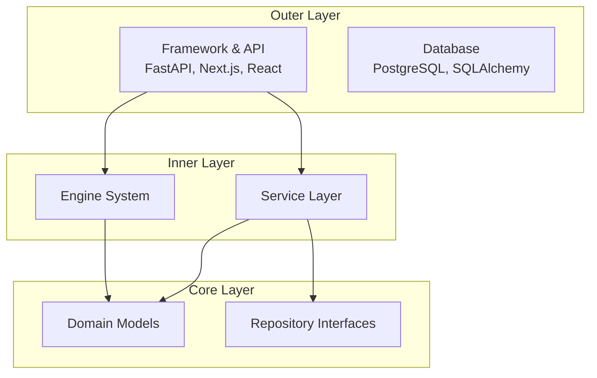

# SV-OS Engineering Standards

> **Repository standards and best practices** | **Date**: July 22, 2026

---

## Architecture Principles

### SOLID

| Principle                 | Meaning                                       | SV-OS Application                                                             |
| ------------------------- | --------------------------------------------- | ----------------------------------------------------------------------------- |
| **S**ingle Responsibility | Each class has one reason to change           | Repositories own data access; Services own business logic; Endpoints own HTTP |
| **O**pen/Closed           | Open for extension, closed for modification   | EngineBase allows adding engines without changing framework                   |
| **L**iskov Substitution   | Subtypes must be substitutable for base types | All repositories extend BaseRepository with same interface                    |
| **I**nterface Segregation | Many specific interfaces > one general        | Separate Repository, Service, Engine, Event interfaces                        |
| **D**ependency Inversion  | Depend on abstractions, not concretions       | Services depend on UnitOfWork interface, not concrete DB session              |

### DRY (Don't Repeat Yourself)

- **Do**: Extract repeated logic into BaseRepository, shared utilities, helper functions
- **Don't**: Copy-paste validation, pagination, error handling across modules
- **Exceptions**: Test fixtures may have some duplication for clarity

### KISS (Keep It Simple, Stupid)

- **Do**: Use the simplest solution that works
- **Don't**: Over-engineer for hypothetical future requirements
- **Rule of thumb**: If you're explaining for more than 30 seconds, it's too complex

### YAGNI (You Ain't Gonna Need It)

- **Don't**: Add features/flexibility until you need them
- **Don't**: Build for "what if" scenarios
- **Do**: Add extensibility points (JSONB metadata, plugin registry, strategy pattern) but don't implement extensions until needed

---

## Clean Architecture

### Dependency Rule



**Inner layers never depend on outer layers**. Domain models never import FastAPI, SQLAlchemy, or HTTP modules.

### Layer Rules

| Layer           | Can Import From                 | Cannot Import From               |
| --------------- | ------------------------------- | -------------------------------- |
| API (endpoints) | Services, Schemas, Dependencies | Engines (directly), Repositories |
| Services        | Repositories, Engines, Schemas  | API, HTTP, Middleware            |
| Engines         | Event Bus, Domain Models        | HTTP, ORM, FastAPI               |
| Repositories    | ORM Models, UnitOfWork          | Services, Engines, API           |
| Models          | Core Database, Base Mixin       | Services, API, Engines           |

---

## Domain-Driven Design (DDD) Elements

| DDD Concept      | SV-OS Implementation                      |
| ---------------- | ----------------------------------------- |
| **Entity**       | SQLAlchemy models with UUID identity      |
| **Value Object** | Pydantic schemas, domain dataclasses      |
| **Aggregate**    | UnitOfWork boundary                       |
| **Repository**   | BaseRepository + concrete implementations |
| **Domain Event** | Event Bus + EventEnvelope                 |
| **Service**      | Service classes with business logic       |
| **Factory**      | EngineRegistry lazy initialization        |

---

## Repository Pattern

### Contract

```python
class BaseRepository[ModelT]:
    """Every repository MUST implement or inherit these:"""

    # Read
    async def get_by_id(self, id: UUID) -> ModelT | None
    async def get_many(self, ids: list[UUID]) -> list[ModelT]
    async def get_all(self, ...) -> list[ModelT]
    async def exists(self, **filters) -> bool
    async def count(self, filters) -> int

    # Write
    async def create(self, **data) -> ModelT
    async def update(self, id: UUID, **data) -> ModelT
    async def delete(self, id: UUID, hard: bool = False)
    async def restore(self, id: UUID) -> ModelT
    async def upsert(self, constraints, data) -> ModelT

    # Pagination
    async def paginate(self, ...) -> PageResult
    async def paginate_cursor(self, ...) -> CursorPageResult
```

### Rules

- All repositories extend `BaseRepository[ModelT]`
- Set `model = ModelClass` as class attribute
- Use `session` from constructor (injected by UnitOfWork)
- Never commit — only flush
- All public methods return domain objects or None

---

## Service Pattern

### Contract

```python
class SomeService:
    """Service classes follow this contract:"""

    def __init__(self, uow: UnitOfWork) -> None:
        """Inject UnitOfWork (not session directly)."""
        self._uow = uow

    async def operation(self, params) -> DTO:
        """
        1. Validate input
        2. Call repositories via UoW
        3. Call engines if needed
        4. Apply business rules
        5. Return DTO (not ORM model)
        """
```

### Rules

- Services never access HTTP (no request/response objects)
- Services never commit — UnitOfWork handles transactions
- Services convert ORM models to DTOs before returning
- Services log significant operations via structlog

---

## Error Handling

### Hierarchy

```
AppError (base, with status_code + message)
├── AuthenticationError (401)
├── AuthorizationError (403)
├── RepositoryError (500)
│   ├── EntityNotFoundError (404)
│   ├── DuplicateEntityError (409)
│   └── ConcurrentModificationError (409)
```

### Rules

- Always raise specific exceptions (never generic `Exception`)
- Exception handlers in `app/exceptions/handlers.py` convert to response
- Validation errors use Pydantic's built-in 422 response
- Log errors at appropriate level: `logger.warning` for expected, `logger.error` for unexpected

---

## Logging

### Configuration

```python
# Use structlog with these conventions
from structlog.stdlib import get_logger

logger = get_logger(__name__)

# Logging levels:
logger.debug("detailed_info")      # Development only
logger.info("operation_complete")  # Normal operations
logger.warning("unusual_state")    # Expected but notable
logger.error("operation_failed")   # Unexpected failure
logger.critical("system_down")     # Production emergency
```

### Conventions

- Use structured logging with named fields: `logger.info("user_created", user_id=str(user.id), role=user.role)`
- Never use `print()` or `f-string` interpolation in log messages
- Include correlation_id in logs for request tracing

---

## Naming Conventions

### Python

| Element   | Convention            | Example                   | Rule                  |
| --------- | --------------------- | ------------------------- | --------------------- |
| Files     | `snake_case`          | `knowledge_node.py`       | Match class name      |
| Classes   | `PascalCase`          | `KnowledgeNodeRepository` | Noun phrase           |
| Functions | `snake_case`          | `create_access_token()`   | Verb phrase           |
| Variables | `snake_case`          | `user_id`                 | Descriptive           |
| Constants | `UPPER_SNAKE_CASE`    | `MAX_RETRY_COUNT`         | Module-level          |
| Private   | `_leading_underscore` | `_initialize_impl()`      | Implementation detail |
| Dunder    | `__dunder__`          | `__init__`                | Python protocols      |

### TypeScript

| Element    | Convention             | Example                |
| ---------- | ---------------------- | ---------------------- |
| Files      | `kebab-case`           | `knowledge-node.ts`    |
| Components | `PascalCase`           | `KnowledgeNode`        |
| Hooks      | `camelCase` with `use` | `useAuth()`            |
| Functions  | `camelCase`            | `formatRelativeTime()` |
| Interfaces | `PascalCase`           | `UserProfile`          |
| Types      | `PascalCase`           | `SearchResult`         |
| Constants  | `UPPER_SNAKE_CASE`     | `API_BASE_URL`         |

---

## Documentation Standards

### Code Documentation

- **Public API**: Every exported function/class needs docstring
- **Complex logic**: Inline comments explaining WHY (not WHAT)
- **Config**: Every environment variable documented
- **Schemas**: Every Pydantic/TypeScript field documented

### Docstring Format (Python)

```python
def function_name(param1: str, param2: int | None = None) -> bool:
    """Short description of what this does.

    Optional longer description with details.

    Args:
        param1: Description of first parameter.
        param2: Description of second parameter (optional).

    Returns:
        Description of return value.

    Raises:
        SomeError: When something bad happens.
    """
```

### Documentation Files

- Every new feature must update relevant `.md` files
- Architecture decisions go in `.ai/ARCHITECTURE_DECISIONS.md`
- API changes update `docs/API_BLUEPRINT.md`

---

## Accessibility Standards

| Criterion            | WCAG Level | SV-OS Implementation                       |
| -------------------- | ---------- | ------------------------------------------ |
| Keyboard navigation  | A          | All interactive elements reachable via Tab |
| Focus indicators     | AA         | Visible focus rings on all elements        |
| Color contrast       | AA         | Tailwind color system meets 4.5:1 ratio    |
| Screen reader labels | A          | `aria-label` on icon-only buttons          |
| Semantic HTML        | A          | Proper headings, landmarks, `<main>`       |
| Reduced motion       | AA         | `prefers-reduced-motion` query             |
| Skip navigation      | A          | Skip-to-content link as first tabbable     |

---

## Review Checklist

### Before Submitting PR

```markdown
## Checklist

- [ ] Code follows coding standards (lint passes)
- [ ] TypeScript type checks pass
- [ ] All existing tests pass
- [ ] New tests cover the change
- [ ] Error handling covers edge cases
- [ ] Documentation updated
- [ ] No breaking changes
- [ ] Branch up to date with target
```

### Code Review Criteria

| Criterion     | Must Have                | Nice to Have         |
| ------------- | ------------------------ | -------------------- |
| Correctness   | ✅ Logic is correct      | Edge cases tested    |
| Security      | ✅ No vulnerabilities    | Auth checked         |
| Performance   | ✅ No regressions        | Benchmarks           |
| Testing       | ✅ Tests for new code    | Integration tests    |
| Documentation | ✅ Public API documented | Usage examples       |
| Accessibility | ✅ Keyboard navigable    | Screen reader tested |

---

## Performance Standards

| Metric                      | Target  | Measurement          |
| --------------------------- | ------- | -------------------- |
| API p95 response time       | < 200ms | Prometheus + Grafana |
| API p99 response time       | < 500ms | Prometheus + Grafana |
| Graph load time (500 nodes) | < 2s    | Lighthouse           |
| Search response time        | < 500ms | Custom benchmark     |
| Initial page load           | < 3s    | Lighthouse           |
| Bundle size (initial JS)    | < 200KB | next/bundle-analyzer |

---

## Security Standards

| Area             | Requirement                   | Verification     |
| ---------------- | ----------------------------- | ---------------- |
| Passwords        | bcrypt (12 rounds)            | Code review      |
| Auth tokens      | JWT HS256, 60-min expiry      | Code review      |
| API access       | Bearer token required         | Integration test |
| Input validation | Pydantic schemas              | Automated        |
| SQL injection    | Parameterized queries         | SQLAlchemy       |
| XSS              | CSP headers + React escaping  | Headers check    |
| CSRF             | Double-submit cookie          | Integration test |
| Rate limiting    | 100 req/min (auth), 20 (anon) | Load test        |
| Dependencies     | Dependabot alerts             | Weekly review    |

---

_Cross-reference: [IMPLEMENTATION_GUIDE.md](./IMPLEMENTATION_GUIDE.md), [TESTING_STRATEGY.md](./TESTING_STRATEGY.md)_
