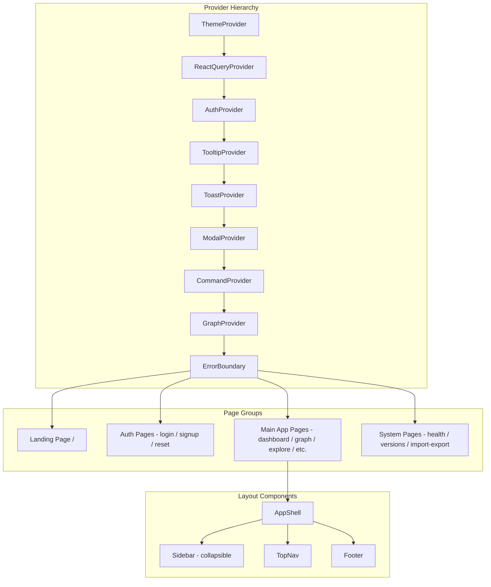

# SV-OS Frontend Blueprint

> **Framework**: Next.js 15 (App Router) | **Language**: TypeScript 5.8+ | **Styling**: Tailwind CSS v4  
> **Runtime**: Node.js 22+ | **Status**: Stable ✅ | **Pages**: 18+

---

## Application Architecture



---

## Pages

### Landing Page (`/`)

| Aspect            | Details                                                          |
| ----------------- | ---------------------------------------------------------------- |
| **Purpose**       | First impression for unauthenticated users                       |
| **Auth**          | None (public)                                                    |
| **Layout**        | No AppShell (standalone header + main)                           |
| **Components**    | Background gradient orbs, feature cards (3), CTA buttons, footer |
| **States**        | Static page — no loading state needed                            |
| **Error**         | N/A (static content)                                             |
| **Responsive**    | Stack feature cards vertically on mobile                         |
| **Accessibility** | Semantic HTML, proper heading hierarchy                          |

### Auth Pages (`/(auth)/`)

| Page               | Purpose                       | Key Components                        |
| ------------------ | ----------------------------- | ------------------------------------- |
| `/login`           | Sign in with email + password | Form, validation, error display       |
| `/signup`          | Create account                | Form, validation, duplicate detection |
| `/forgot-password` | Request reset link            | Email input, success message          |
| `/reset-password`  | Set new password              | Token validation, password inputs     |

**Shared Components**: Form fields, validation errors, loading buttons, auth layout wrapper

**Hooks Used**: `useAuth` (login, signup), `useForm` (react-hook-form)

### Dashboard (`/dashboard`)

| Aspect         | Details                                                                                                                                             |
| -------------- | --------------------------------------------------------------------------------------------------------------------------------------------------- |
| **Purpose**    | Main landing after login — overview of learning status                                                                                              |
| **Sections**   | Stats grid (4 cards), quick actions, continue learning, activity feed, popular nodes, trending, quick stats                                         |
| **Components** | `StatCard`, `QuickAction`, `ContinueLearningCard`, `ActivityItem`, `DifficultyBadge`                                                                |
| **Hooks**      | `useAuth`, `useProgressStats`, `useProgressList`, `usePopularNodes`, `useGraphStatistics`, `useTrendingSearches`, `useBookmarks`, `useActivityFeed` |
| **Stores**     | None (server data via React Query)                                                                                                                  |
| **Loading**    | Skeleton components for stat cards and lists                                                                                                        |
| **Empty**      | Empty state with CTA when no progress                                                                                                               |
| **Error**      | Error boundary per section                                                                                                                          |
| **Responsive** | 4-col → 2-col → 1-col stats grid                                                                                                                    |

### Graph (`/graph`)

| Aspect            | Details                                                                     |
| ----------------- | --------------------------------------------------------------------------- |
| **Purpose**       | Full interactive knowledge graph visualization                              |
| **Components**    | `ReactFlowGraph` (custom), `KnowledgeNode` (custom node), MiniMap, Controls |
| **Hooks**         | `useGraph` (full graph data)                                                |
| **Stores**        | `graph-store` (selected node, viewport)                                     |
| **Routing**       | Client-side graph nav via reactflow                                         |
| **Loading**       | Full-page spinner during graph load                                         |
| **Error**         | Error state if graph API fails                                              |
| **Accessibility** | Node selection via keyboard, ARIA labels on controls                        |

### Explore (`/explore`, `/explore/[slug]`)

| Aspect         | Details                                            |
| -------------- | -------------------------------------------------- |
| **Purpose**    | Browse knowledge graph in a more structured layout |
| **Components** | Node cards, type filter, difficulty filter, search |
| **Hooks**      | `useKnowledge`, `useSearch`                        |
| **States**     | Loading skeleton, empty results, pagination        |

### Careers (`/careers`, `/careers/[slug]`)

| Aspect         | Details                                                               |
| -------------- | --------------------------------------------------------------------- |
| **Purpose**    | Browse career paths and view detailed roadmaps                        |
| **Components** | Career cards, demand badges, requirement lists, roadmap visualization |
| **Hooks**      | `useCareers`, `useGraph`                                              |
| **States**     | Loading skeleton, empty if no careers                                 |

### Learning (`/learning`)

| Aspect         | Details                                                             |
| -------------- | ------------------------------------------------------------------- |
| **Purpose**    | View and manage learning paths                                      |
| **Components** | Path cards, milestone progress, node lists                          |
| **Hooks**      | `useLearning`                                                       |
| **States**     | Empty state ("Generate your first learning path"), loading skeleton |

### Projects (`/projects`, `/projects/[slug]`)

| Aspect         | Details                                                              |
| -------------- | -------------------------------------------------------------------- |
| **Purpose**    | Browse learning projects                                             |
| **Components** | Project cards, difficulty badges, tech stack tags, requirement lists |
| **Hooks**      | `useProjects`                                                        |

### Progress (`/progress`)

| Aspect         | Details                                                           |
| -------------- | ----------------------------------------------------------------- |
| **Purpose**    | Detailed learning analytics and statistics                        |
| **Components** | Progress charts, completion stats, time tracking, mastery metrics |
| **Hooks**      | `useProgress`, `useProgressStats`                                 |

### Search (`/search`)

| Aspect         | Details                                                            |
| -------------- | ------------------------------------------------------------------ |
| **Purpose**    | Search knowledge graph                                             |
| **Components** | Search input, filters (type, difficulty), results list, pagination |
| **Hooks**      | `useSearch`, `useDebounce`                                         |
| **States**     | Initial (no query), loading, results, empty, error                 |

### AI Chat (`/ai-chat`)

| Aspect         | Details                                                           |
| -------------- | ----------------------------------------------------------------- |
| **Purpose**    | AI assistant for learning Q&A                                     |
| **Components** | Chat messages, input bar, session list                            |
| **Hooks**      | `useChat` (TODO)                                                  |
| **States**     | Empty (start a conversation), loading (streaming response), error |

### Bookmarks (`/bookmarks`)

| Aspect         | Details                  |
| -------------- | ------------------------ |
| **Purpose**    | View saved bookmarks     |
| **Components** | Bookmark list with notes |
| **Hooks**      | `useBookmarks`           |

### Settings (`/settings`, `/settings/profile`, `/settings/preferences`, `/settings/account`)

| Aspect         | Details                                            |
| -------------- | -------------------------------------------------- |
| **Purpose**    | User preferences and account management            |
| **Components** | Profile form, preferences toggles, account actions |
| **Hooks**      | `useAuth`, `usePreferences`                        |

### System Pages

| Page             | Purpose                                            |
| ---------------- | -------------------------------------------------- |
| `/health`        | Display system health status from health endpoints |
| `/versions`      | Graph version history and snapshot management      |
| `/import-export` | Data import/export interface                       |
| `/notifications` | User notification list                             |

---

## Component Architecture

### Component Categories

| Category   | Path                 | Examples                                                  |
| ---------- | -------------------- | --------------------------------------------------------- |
| **Layout** | `components/layout/` | AppShell, Sidebar, TopNav, Footer, CommandPalette         |
| **Graph**  | `components/graph/`  | ReactFlowGraph, KnowledgeNode, flow-config, graph-layouts |
| **Auth**   | `components/auth/`   | ProtectedRoute                                            |
| **Shared** | `components/shared/` | ErrorBoundary, PageHeader, Shell, SkipNav, Animations     |

### UI Package Components (from `@sv-os/ui`)

```
23 components:
Button, Badge, Card (Header, Title, Description, Content, Footer),
Input, Label, Textarea, Alert (Title, Description),
Separator, Avatar, Skeleton, LoadingSpinner, LoadingState,
EmptyState, ErrorState, Progress, ScrollArea, Breadcrumb,
Dialog, Popover, Tooltip, Tabs, DropdownMenu, Accordion,
Select, Table, Pagination, HoverCard, ContextMenu, CommandPalette
```

---

## Hook Architecture

### Hook Categories

| Category      | Hooks                                                                                                                                              | Purpose                            |
| ------------- | -------------------------------------------------------------------------------------------------------------------------------------------------- | ---------------------------------- |
| **Auth**      | `useAuth`, `useCurrentUser`, `useLogin`, `useSignup`                                                                                               | Authentication state and mutations |
| **Graph**     | `useGraph`, `useGraphStatistics`                                                                                                                   | Knowledge graph data               |
| **Knowledge** | `useKnowledge`, `usePopularNodes`                                                                                                                  | Node browsing                      |
| **Progress**  | `useProgress`, `useProgressStats`, `useProgressList`                                                                                               | Learning progress                  |
| **Career**    | `useCareers`                                                                                                                                       | Career paths                       |
| **Projects**  | `useProjects`                                                                                                                                      | Learning projects                  |
| **Search**    | `useSearch`, `useTrendingSearches`                                                                                                                 | Search functionality               |
| **Bookmarks** | `useBookmarks`                                                                                                                                     | User bookmarks                     |
| **Learning**  | `useLearning`                                                                                                                                      | Learning paths                     |
| **Activity**  | `useActivityFeed`                                                                                                                                  | Activity feed                      |
| **System**    | `usePlatformStatus`, `useVersioning`                                                                                                               | System operations                  |
| **Utility**   | `useDebounce`, `useMediaQuery`, `useLocalStorage`, `useKeyboardShortcut`, `useWindowSize`, `useTheme`, `useMounted`, `usePreferences`, `useSystem` | Cross-cutting concerns             |

### Hook Pattern

```typescript
// Standard pattern for all data-fetching hooks
export function useGraphStatistics() {
  return useQuery({
    queryKey: ['graph', 'statistics'],
    queryFn: () => graphService.getStatistics(),
    staleTime: 5 * 60 * 1000, // 5 minutes
  });
}
```

---

## Store Architecture (Zustand)

### UI Store (`ui-store.ts`)

```typescript
interface UIState {
  sidebarOpen: boolean;
  toggleSidebar: () => void;
  theme: 'light' | 'dark';
  setTheme: (theme: 'light' | 'dark') => void;
}
```

### Graph Store (`graph-store.ts`)

```typescript
interface GraphState {
  selectedNodeId: string | null;
  setSelectedNode: (id: string | null) => void;
  viewport: Viewport;
  setViewport: (viewport: Viewport) => void;
  filters: GraphFilters;
  setFilters: (filters: Partial<GraphFilters>) => void;
}
```

### Learning Store (`learning-store.ts`)

```typescript
interface LearningState {
  activeSessionId: string | null;
  setActiveSession: (id: string | null) => void;
  currentPathId: string | null;
  setCurrentPath: (id: string | null) => void;
}
```

### Platform Store (`platform-store.ts`)

```typescript
interface PlatformState {
  status: PlatformStatus | null;
  setStatus: (status: PlatformStatus) => void;
  featureFlags: Record<string, boolean>;
  setFeatureFlags: (flags: Record<string, boolean>) => void;
}
```

---

## Data Flow

```
┌─────────────────────────────────────────────┐
│                React Component               │
│  ┌─────────────────────────────────────┐     │
│  │  useQuery / useMutation (React Query)│     │
│  └──────────────┬──────────────────────┘     │
│                 │                            │
│  ┌──────────────▼──────────────────────┐     │
│  │      Service Function (services/)   │     │
│  └──────────────┬──────────────────────┘     │
│                 │                            │
│  ┌──────────────▼──────────────────────┐     │
│  │      API Client (lib/api-client.ts) │     │
│  │      Auth Client (lib/auth-client.ts)│     │
│  └──────────────┬──────────────────────┘     │
└─────────────────┼────────────────────────────┘
                  │ HTTP
                  ▼
           Backend API (FastAPI)
```

---

## Error Handling Strategy

| Layer           | Strategy                                     |
| --------------- | -------------------------------------------- |
| **API Client**  | Catch HTTP errors, transform to typed errors |
| **React Query** | `onError` callbacks, `error` states in hooks |
| **Components**  | Error boundaries per section (not per page)  |
| **Global**      | Root error boundary in layout.tsx            |
| **Not Found**   | `not-found.tsx` in app directory             |

---

## Accessibility

| Feature              | Implementation                                           |
| -------------------- | -------------------------------------------------------- |
| **Skip navigation**  | `SkipNavigation` component (first tabbable element)      |
| **Keyboard nav**     | All interactive elements keyboard-accessible             |
| **Focus management** | Visible focus rings via Tailwind `focus-ring` utility    |
| **Reduced motion**   | `prefers-reduced-motion` media query disables animations |
| **ARIA labels**      | Buttons have `aria-label`, nav has `aria-label`          |
| **Semantic HTML**    | Proper heading hierarchy, `<main>`, `<nav>`, `<aside>`   |
| **Color contrast**   | Tailwind color system meets WCAG AA                      |

---

## Responsive Design

| Breakpoint | Target  | Layout Changes                               |
| ---------- | ------- | -------------------------------------------- |
| < 640px    | Mobile  | Single column, stacked cards, hamburger menu |
| 640-1023px | Tablet  | 2-column grids, sidebar collapses            |
| 1024px+    | Desktop | Full sidebar (260px), multi-column layouts   |

---

_Cross-reference: [ARCHITECTURE.md](./ARCHITECTURE.md), [API_BLUEPRINT.md](./API_BLUEPRINT.md)_
