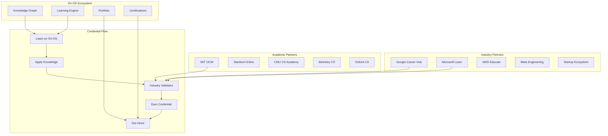

# SV-OS: The Future of Learning

> **Design**: 10-year vision for the evolution of SV-OS learning  
> **Date**: July 22, 2026 | **Status**: Vision Document  
> **Cross-reference**: [LEARNING_PHILOSOPHY.md](./LEARNING_PHILOSOPHY.md), [LEARNING_ENGINE.md](./LEARNING_ENGINE.md), [PRODUCT_EVOLUTION.md](./PRODUCT_EVOLUTION.md)

---

## The Long View

SV-OS is not building another course platform. It is building the **operating system for human knowledge** — a system that organizes, navigates, and teaches all of computer science as a connected ecosystem.

This document imagines how that system evolves over the next decade.

---

## Near-Term (2026-2028)

### Year 1: Foundation

| Area                | Milestone                                              |
| ------------------- | ------------------------------------------------------ |
| **Knowledge Graph** | 10,000+ nodes covering core CS curriculum              |
| **Learning Engine** | Adaptive journeys, mastery tracking, spaced repetition |
| **Simulators**      | 50+ interactive simulators for core concepts           |
| **Projects**        | 100+ tiered projects from beginner to advanced         |
| **Community**       | Early adopter community (1,000+ active learners)       |
| **AI**              | AI tutor for Q&A, alternative explanations             |
| **Content**         | Import pipeline for Wikipedia, OSS docs, roadmaps      |

**Key Metric**: Learner mastery depth ≥ 0.7 on first attempt for 80% of core concepts.

### Year 2: Scale

| Area                | Milestone                                             |
| ------------------- | ----------------------------------------------------- |
| **Knowledge Graph** | 50,000+ nodes, automated edge discovery               |
| **Personalization** | ML models predict optimal paths from learner behavior |
| **Simulators**      | 200+ simulators; user-contributed simulators          |
| **Peer Learning**   | Study groups, pair programming, peer reviews          |
| **AI Tutor**        | Personalized tutoring — adapts to learning style      |
| **Certifications**  | Skill certifications tied to industry standards       |
| **Mobile**          | Full mobile experience with offline learning          |

**Key Metric**: 10,000+ monthly active learners.

### Year 3: Maturity

| Area                | Milestone                                                |
| ------------------- | -------------------------------------------------------- |
| **Knowledge Graph** | 200,000+ nodes, community-contributed content            |
| **Adaptive Engine** | Real-time path optimization across entire graph          |
| **Simulators**      | 500+ simulators; VR support for key concepts             |
| **Industry**        | Industry partnerships for project validation             |
| **Research**        | Integration with ArXiv, research paper nodes             |
| **AI**              | AI generates practice problems at exact difficulty level |
| **Global**          | Multi-language content, localized knowledge graphs       |

**Key Metric**: University adoption — 10+ universities using SV-OS.

---

## Mid-Term (2028-2031)

### AI Tutor Evolution

```
Year 1: "The AI answers questions about predefined content"
    → Rule-based Q&A with LLM fallback

Year 2: "The AI generates alternative explanations"
    → LLM generates personalized explanations based on learner model

Year 3: "The AI creates personalized learning paths"
    → ML model trained on 10,000+ successful learner journeys

Year 4: "The AI diagnoses misconceptions"
    → AI identifies WHY a learner is struggling (not just WHAT)

Year 5: "The AI co-creates curriculum"
    → AI suggests new content, fills gaps in knowledge graph

Year 6+: "The AI is a learning companion"
   → Persistent AI that knows your entire learning history, adapts
     to your thinking style, and grows with you
```

### Simulator Evolution

```
Year 1: Interactive visualizations
    → 2D animations of algorithms, data structures

Year 2: Sandbox environments
    → Learners modify parameters, see real-time effects

Year 3: Collaborative simulators
    → Multiple learners interact with the same simulation

Year 4: VR/AR simulations
    → Walk through a computer, see data flow in 3D space

Year 5: Generative simulations
    → AI creates new simulation scenarios based on learner needs

Year 6+: Simulation as assessment
    → Learners demonstrate mastery by building their own simulations
```

### Project Evolution

```
Year 1: Guided projects
    → Step-by-step instructions with milestone checks

Year 2: Auto-evaluated projects
    → Automated test suites verify project completeness

Year 3: Real-world projects
    → Partner with companies for industry-grade projects

Year 4: Open source contributions
    → Guided contributions to real open source projects

Year 5: Capstone projects
    → Full-stack projects evaluated by industry mentors

Year 6+: Portfolio as credential
    → Your SV-OS portfolio becomes your primary credential
```

---

## Long-Term (2031-2036)

### Industry Integration



### University Integration Model

Universities can adopt SV-OS in three tiers:

| Tier           | Integration                                   | Benefits                                                          |
| -------------- | --------------------------------------------- | ----------------------------------------------------------------- |
| **Supplement** | Students use SV-OS alongside existing courses | Better learning outcomes, analytics for professors                |
| **Hybrid**     | Courses use SV-OS knowledge graph as backbone | Automated grading, personalized pacing, data-driven curriculum    |
| **Full**       | Entire CS programs run on SV-OS               | Complete learning analytics, adaptive curriculum, reduced dropout |

### Research Integration

SV-OS becomes a platform for CS education research:

```
Research Opportunities on SV-OS:
- Optimal spacing intervals for different concept types
- Transfer effects between programming languages
- Impact of visualizations on algorithm understanding
- Prerequisite relationships discovered from learner data
- Effectiveness of different teaching approaches per concept
- Knowledge decay rates across different difficulty levels
- Most effective learning path structures for different goals
```

---

## Ten-Year Vision

### Year 10 Snapshot

```
┌─────────────────────────────────────────────────────────────┐
│  SV-OS — Year 10                                          │
│  ─────────────────────────────────────────────────────────  │
│                                                             │
│  🌐 Knowledge Graph:                                       │
│  • 10+ million nodes covering all of CS and adjacent fields │
│  • Auto-discovered edges from learner behavior patterns     │
│  • Community-maintained with AI-assisted curation           │
│                                                             │
│  🧠 Learning Engine:                                        │
│  • Self-improving — learns from every learner interaction   │
│  • Cross-modal — text, visual, auditory, kinesthetic       │
│  • Emotion-aware — adapts to frustration, excitement, flow │
│                                                             │
│  🤖 AI:                                                     │
│  • Personal AI companion for every learner                  │
│  • Generates content, exercises, and projects on demand     │
│  • Diagnoses misconceptions before they form                │
│  • Facilitates peer learning and group projects             │
│                                                             │
│  🌍 Global:                                                 │
│  • Available in 50+ languages                               │
│  • Culturally adapted content and examples                  │
│  • Works offline in low-connectivity regions                │
│  • Free for learners in developing countries                │
│                                                             │
│  💼 Industry:                                               │
│  • SV-OS portfolio accepted by 1000+ companies              │
│  • Direct hiring partnerships                               │
│  • Industry-recognized certifications                       │
│  • Continuous upskilling for professionals                  │
│                                                             │
│  🏛 Academic:                                               │
│  • Used by 500+ universities worldwide                      │
│  • PhD program integration                                  │
│  • Research platform for CS education                       │
│  • Credit-eligible courses                                  │
└─────────────────────────────────────────────────────────────┘
```

---

## Principles That Endure

As SV-OS evolves, these principles must never change:

| Principle                      | Why It's Immutable                                         |
| ------------------------------ | ---------------------------------------------------------- |
| **Connected knowledge**        | The core insight — isolation is the enemy of understanding |
| **Learner-first**              | Every decision serves the learner, not the institution     |
| **Deterministic core**         | Always explain WHY — never hide behind black boxes         |
| **Open graph**                 | Knowledge must be free. The graph is open and extensible   |
| **Adaptive, not prescriptive** | Paths adapt to the learner, not the other way around       |
| **Evidence-based**             | Every feature grounded in learning science, not fashion    |
| **Global access**              | Quality CS education should be available to everyone       |

---

## The Ultimate Goal

In ten years, SV-OS aims to:

1. **Educate 100 million people** in computer science
2. **Reduce the global CS talent shortage** by 50%
3. **Make quality CS education free** for everyone with internet access
4. **Become the standard way** people learn computer science — replacing scattered courses with a connected journey
5. **Prove that connected knowledge** is fundamentally superior to isolated courses — changing how education works everywhere

---

_Cross-reference: [LEARNING_PHILOSOPHY.md](./LEARNING_PHILOSOPHY.md), [PRODUCT_EVOLUTION.md](./PRODUCT_EVOLUTION.md), [LEARNING_ENGINE.md](./LEARNING_ENGINE.md)_
