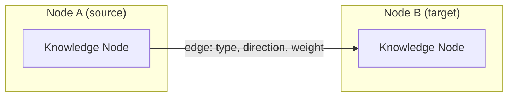
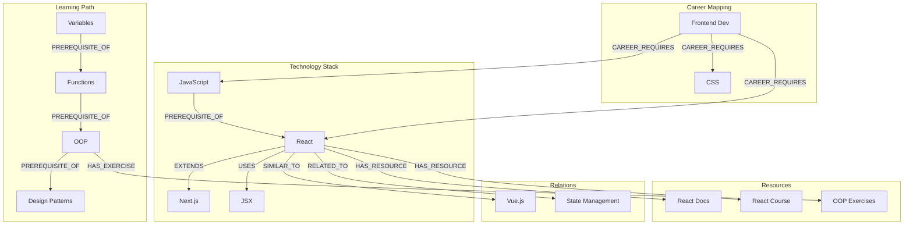

# SV-OS Graph Relationships

> **Design**: Complete specification for every graph edge type  
> **Date**: July 22, 2026 | **Status**: Design Complete

---

## Edge Fundamentals

Every edge in the SV-OS knowledge graph connects two nodes and carries:

| Attribute           | Type   | Description                                  |
| ------------------- | ------ | -------------------------------------------- |
| `source_node_id`    | UUID   | Where the edge originates                    |
| `target_node_id`    | UUID   | Where the edge points                        |
| `relationship_type` | Enum   | The semantic type (see catalog below)        |
| `direction`         | Enum   | `forward`, `bidirectional`, `unidirectional` |
| `cardinality`       | String | How many instances allowed (see below)       |
| `weight`            | Float  | 0.0–1.0 strength of relationship             |
| `description`       | Text   | Human-readable explanation                   |
| `metadata`          | JSON   | Type-specific metadata                       |



---

## Edge Type Catalog

### 1. PREREQUISITE_OF

**Purpose**: Node A must be learned BEFORE Node B.

| Attribute      | Value             |
| -------------- | ----------------- |
| Direction      | `forward` (A → B) |
| Cardinality    | Many-to-many      |
| Default Weight | 0.9               |
| Inverse        | `DEPENDS_ON`      |

**Examples**:

| Source         | Target           | Weight | Description                  |
| -------------- | ---------------- | ------ | ---------------------------- |
| JavaScript     | React            | 0.95   | Must know JS before React    |
| Variables      | Functions        | 0.90   | Variables before functions   |
| SQL Basics     | Advanced SQL     | 0.85   | Fundamentals before advanced |
| Linear Algebra | Machine Learning | 0.95   | Math foundation for ML       |

**Validation Rules**:

- No circular prerequisites (detected via cycle detection)
- Weight < 0.7 suggests a "recommended" rather than "required" prerequisite
- A path from A to B via PREREQUISITE_OF edges implies A must be completed before B

---

### 2. DEPENDS_ON

**Purpose**: Node A depends on Node B (inverse of PREREQUISITE_OF).

| Attribute      | Value             |
| -------------- | ----------------- |
| Direction      | `forward` (A → B) |
| Cardinality    | Many-to-many      |
| Default Weight | 0.9               |
| Inverse        | `PREREQUISITE_OF` |

**Examples**:

| Source     | Target     | Description                      |
| ---------- | ---------- | -------------------------------- |
| React      | JavaScript | React depends on JavaScript      |
| Docker     | Linux      | Docker depends on Linux concepts |
| TypeScript | JavaScript | TypeScript depends on JavaScript |

**Note**: This edge is the semantic inverse of PREREQUISITE_OF. Systems should typically use PREREQUISITE_OF for path generation and DEPENDS_ON for dependency analysis.

---

### 3. RELATED_TO

**Purpose**: Nodes A and B are related but neither is a prerequisite.

| Attribute      | Value            |
| -------------- | ---------------- |
| Direction      | `bidirectional`  |
| Cardinality    | Many-to-many     |
| Default Weight | 0.5              |
| Inverse        | Self (symmetric) |

**Examples**:

| Node A | Node B     | Weight | Description                   |
| ------ | ---------- | ------ | ----------------------------- |
| React  | Vue.js     | 0.7    | Both are frontend frameworks  |
| Python | JavaScript | 0.5    | Popular programming languages |
| REST   | GraphQL    | 0.8    | API design approaches         |
| Docker | Kubernetes | 0.9    | Container ecosystem           |

**Validation Rules**:

- Should NOT be used when a stronger relationship exists
- If a PREREQUISITE_OF edge makes sense, use that instead
- Can be used for cross-domain connections

---

### 4. USES

**Purpose**: Node A uses Node B in its implementation or operation.

| Attribute      | Value                |
| -------------- | -------------------- |
| Direction      | `forward` (A → B)    |
| Cardinality    | Many-to-many         |
| Default Weight | 0.7                  |
| Inverse        | `USED_BY` (computed) |

**Examples**:

| Source             | Target     | Description             |
| ------------------ | ---------- | ----------------------- |
| React              | JSX        | React uses JSX          |
| Webpack            | Node.js    | Webpack uses Node.js    |
| FastAPI            | Pydantic   | FastAPI uses Pydantic   |
| Visual Studio Code | TypeScript | VS Code uses TypeScript |

---

### 5. IMPLEMENTS

**Purpose**: Node A is an implementation of Node B (concept/standard).

| Attribute      | Value             |
| -------------- | ----------------- |
| Direction      | `forward` (A → B) |
| Cardinality    | Many-to-one       |
| Default Weight | 0.8               |
| Inverse        | `IMPLEMENTED_BY`  |

**Examples**:

| Source     | Target                  | Description                                |
| ---------- | ----------------------- | ------------------------------------------ |
| React      | Component-Based UI      | React implements component-based UI        |
| Django     | MVC Pattern             | Django implements MVC                      |
| NumPy      | Linear Algebra          | NumPy implements linear algebra operations |
| Kubernetes | Container Orchestration | K8s implements container orchestration     |

---

### 6. EXTENDS

**Purpose**: Node A extends or builds upon Node B.

| Attribute      | Value             |
| -------------- | ----------------- |
| Direction      | `forward` (A → B) |
| Cardinality    | Many-to-one       |
| Default Weight | 0.7               |
| Inverse        | `EXTENDED_BY`     |

**Examples**:

| Source       | Target     | Description                   |
| ------------ | ---------- | ----------------------------- |
| Next.js      | React      | Next.js extends React         |
| TypeScript   | JavaScript | TypeScript extends JavaScript |
| Express.js   | Node.js    | Express extends Node.js HTTP  |
| Tailwind CSS | CSS        | Tailwind extends CSS          |

---

### 7. BELONGS_TO

**Purpose**: Node A is a member or part of Node B's category.

| Attribute      | Value             |
| -------------- | ----------------- |
| Direction      | `forward` (A → B) |
| Cardinality    | Many-to-one       |
| Default Weight | 0.6               |
| Inverse        | `CONTAINS`        |

**Examples**:

| Source        | Target               | Description                                |
| ------------- | -------------------- | ------------------------------------------ |
| Binary Search | Search Algorithms    | Binary Search belongs to Search Algorithms |
| React         | Frontend Frameworks  | React belongs to Frontend Frameworks       |
| PostgreSQL    | Relational Databases | PostgreSQL belongs to Relational Databases |

---

### 8. LEADS_TO

**Purpose**: Learning/using Node A naturally leads to Node B.

| Attribute      | Value             |
| -------------- | ----------------- |
| Direction      | `forward` (A → B) |
| Cardinality    | Many-to-many      |
| Default Weight | 0.6               |
| Inverse        | `FOLLOWED_BY`     |

**Examples**:

| Source       | Target      | Description                                           |
| ------------ | ----------- | ----------------------------------------------------- |
| JavaScript   | TypeScript  | Learning JS leads to TypeScript                       |
| React Basics | React Hooks | React basics lead to Hooks                            |
| SQL          | NoSQL       | SQL knowledge leads to understanding NoSQL trade-offs |

---

### 9. CAREER_REQUIRES

**Purpose**: A career path requires knowledge of a node.

| Attribute        | Value                              |
| ---------------- | ---------------------------------- |
| Direction        | `forward` (Career → Node)          |
| Cardinality      | Many-to-many                       |
| Default Weight   | 0.8                                |
| Requirement Type | `required`, `recommended`, `bonus` |

**Examples**:

| Career             | Required Node | Type        |
| ------------------ | ------------- | ----------- |
| Frontend Developer | JavaScript    | required    |
| Frontend Developer | React         | required    |
| Frontend Developer | TypeScript    | recommended |
| Frontend Developer | Docker        | bonus       |
| ML Engineer        | Python        | required    |
| ML Engineer        | Calculus      | required    |
| ML Engineer        | Kubernetes    | bonus       |

**Metadata**:

```json
{
  "requirement_type": "required",
  "order_index": 1,
  "importance": 0.95,
  "typical_timeline": "months 1-3"
}
```

---

### 10. PROJECT_REQUIRES

**Purpose**: A project requires knowledge of a node to complete.

| Attribute        | Value                      |
| ---------------- | -------------------------- |
| Direction        | `forward` (Project → Node) |
| Cardinality      | Many-to-many               |
| Default Weight   | 0.7                        |
| Requirement Type | `required`, `recommended`  |

**Examples**:

| Project          | Required Node | Type        |
| ---------------- | ------------- | ----------- |
| Build a REST API | HTTP Protocol | required    |
| Build a REST API | Node.js       | recommended |
| Deploy ML Model  | Docker        | required    |
| Deploy ML Model  | AWS SageMaker | recommended |

---

### 11. USES_TOOL / USES_LANGUAGE / USES_FRAMEWORK

**Purpose**: Specialized "uses" edges for specific entity types.

| Edge Type        | Direction | Source Type            | Target Type | Default Weight |
| ---------------- | --------- | ---------------------- | ----------- | -------------- |
| `USES_TOOL`      | forward   | Project/Belongs_To     | Tool        | 0.7            |
| `USES_LANGUAGE`  | forward   | Project/Framework/Tool | Language    | 0.8            |
| `USES_FRAMEWORK` | forward   | Project                | Framework   | 0.7            |

**Examples**:

| Source           | Type           | Target     |
| ---------------- | -------------- | ---------- |
| Build a REST API | USES_LANGUAGE  | JavaScript |
| Build a REST API | USES_FRAMEWORK | Express.js |
| Build a REST API | USES_TOOL      | Git        |
| React            | USES_LANGUAGE  | JavaScript |

---

### 12. LEARNS_AFTER

**Purpose**: Soft recommendation for learning sequence (not a hard prerequisite).

| Attribute      | Value                            |
| -------------- | -------------------------------- |
| Direction      | `forward`                        |
| Cardinality    | Many-to-many                     |
| Default Weight | 0.4                              |
| Differentiator | Less strict than PREREQUISITE_OF |

**Examples**:

| Source  | Target  | Description                              |
| ------- | ------- | ---------------------------------------- |
| Node.js | Deno    | Learning Node.js helps understand Deno   |
| Python  | Julia   | Python makes Julia easier                |
| MySQL   | MongoDB | Relational DB knowledge helps with NoSQL |

---

### 13. RECOMMENDED_AFTER

**Purpose**: Node B is a good next step after completing Node A.

| Attribute      | Value                       |
| -------------- | --------------------------- |
| Direction      | `forward`                   |
| Cardinality    | Many-to-many                |
| Default Weight | 0.5                         |
| Use Case       | Recommendation engine input |

**Examples**:

| After         | Recommended  | Reason                        |
| ------------- | ------------ | ----------------------------- |
| React Basics  | React Router | Natural progression           |
| Python Basics | Data Science | Popular next step             |
| HTML/CSS      | JavaScript   | Completes frontend foundation |

---

### 14. SIMILAR_TO

**Purpose**: Nodes A and B are similar in purpose or function.

| Attribute      | Value            |
| -------------- | ---------------- |
| Direction      | `bidirectional`  |
| Cardinality    | Many-to-many     |
| Default Weight | 0.3–0.7          |
| Inverse        | Self (symmetric) |

**Examples**:

| Node A     | Node B | Similarity |
| ---------- | ------ | ---------- |
| React      | Vue.js | 0.85       |
| PostgreSQL | MySQL  | 0.80       |
| Docker     | Podman | 0.75       |
| Python     | Ruby   | 0.60       |

**Validation**: Similarity should be symmetric (if A is 0.8 similar to B, B should be 0.8 similar to A).

---

### 15. PART_OF

**Purpose**: Node A is a component or subset of Node B.

| Attribute      | Value             |
| -------------- | ----------------- |
| Direction      | `forward` (A → B) |
| Cardinality    | Many-to-one       |
| Default Weight | 0.6               |
| Inverse        | `CONTAINS`        |

**Examples**:

| Child       | Parent     | Description                   |
| ----------- | ---------- | ----------------------------- |
| React Hooks | React      | Hooks are part of React       |
| arrays      | JavaScript | Arrays are part of JS         |
| Sorting     | Algorithms | Sorting is part of Algorithms |

---

### 16. CONTAINS

**Purpose**: Node A contains or encompasses Node B (inverse of PART_OF).

Same as PART_OF with reversed direction.

---

### 17. HAS_RESOURCE

**Purpose**: A knowledge node has a learning resource associated.

| Attribute      | Value                                              |
| -------------- | -------------------------------------------------- |
| Direction      | `forward` (Node → Resource)                        |
| Cardinality    | One-to-many                                        |
| Default Weight | 0.5                                                |
| Resource Types | book, course, video, article, paper, documentation |

**Examples**:

| Node  | Resource                              |
| ----- | ------------------------------------- |
| React | "React Documentation" (documentation) |
| React | "Learn React" (course)                |
| React | "React Tutorial" (video)              |

---

### 18. HAS_EXAMPLE

**Purpose**: A concept has a code example or practical illustration.

| Attribute      | Value                         |
| -------------- | ----------------------------- |
| Direction      | `forward` (Concept → Example) |
| Cardinality    | One-to-many                   |
| Default Weight | 0.4                           |

---

### 19. HAS_EXERCISE

**Purpose**: A topic has a practice exercise.

| Attribute      | Value                             |
| -------------- | --------------------------------- |
| Direction      | `forward` (Topic → Exercise)      |
| Cardinality    | One-to-many                       |
| Default Weight | 0.4                               |
| Exercise Types | quiz, coding, project, discussion |

---

### 20. HAS_PROJECT

**Purpose**: A topic or set of topics has a project for application.

| Attribute      | Value                       |
| -------------- | --------------------------- |
| Direction      | `forward` (Topic → Project) |
| Cardinality    | Many-to-one                 |
| Default Weight | 0.5                         |

---

## Relationship Type Summary

| #   | Type                | Direction     | Cardinality | Weight  | Inverse         |
| --- | ------------------- | ------------- | ----------- | ------- | --------------- |
| 1   | `PREREQUISITE_OF`   | forward       | M:N         | 0.9     | DEPENDS_ON      |
| 2   | `DEPENDS_ON`        | forward       | M:N         | 0.9     | PREREQUISITE_OF |
| 3   | `RELATED_TO`        | bidirectional | M:N         | 0.5     | RELATED_TO      |
| 4   | `USES`              | forward       | M:N         | 0.7     | USED_BY         |
| 5   | `IMPLEMENTS`        | forward       | N:1         | 0.8     | IMPLEMENTED_BY  |
| 6   | `EXTENDS`           | forward       | N:1         | 0.7     | EXTENDED_BY     |
| 7   | `BELONGS_TO`        | forward       | N:1         | 0.6     | CONTAINS        |
| 8   | `LEADS_TO`          | forward       | M:N         | 0.6     | FOLLOWED_BY     |
| 9   | `CAREER_REQUIRES`   | forward       | M:N         | 0.8     | —               |
| 10  | `PROJECT_REQUIRES`  | forward       | M:N         | 0.7     | —               |
| 11  | `USES_TOOL`         | forward       | M:N         | 0.7     | —               |
| 12  | `USES_LANGUAGE`     | forward       | M:N         | 0.8     | —               |
| 13  | `USES_FRAMEWORK`    | forward       | M:N         | 0.7     | —               |
| 14  | `LEARNS_AFTER`      | forward       | M:N         | 0.4     | —               |
| 15  | `RECOMMENDED_AFTER` | forward       | M:N         | 0.5     | —               |
| 16  | `SIMILAR_TO`        | bidirectional | M:N         | 0.3-0.7 | SIMILAR_TO      |
| 17  | `PART_OF`           | forward       | N:1         | 0.6     | CONTAINS        |
| 18  | `CONTAINS`          | forward       | 1:N         | 0.6     | PART_OF         |
| 19  | `HAS_RESOURCE`      | forward       | 1:N         | 0.5     | —               |
| 20  | `HAS_EXAMPLE`       | forward       | 1:N         | 0.4     | —               |
| 21  | `HAS_EXERCISE`      | forward       | 1:N         | 0.4     | —               |
| 22  | `HAS_PROJECT`       | forward       | N:1         | 0.5     | —               |

---

## Composite Relationship Diagram



---

## Edge Validation Rules

| Rule                          | Description                              | Severity |
| ----------------------------- | ---------------------------------------- | -------- |
| No self-loops                 | `source_id != target_id`                 | Blocking |
| No duplicate edges            | Same source+target+type cannot repeat    | Blocking |
| No circular prerequisites     | PREREQUISITE_OF path must not cycle      | Blocking |
| Prerequisite weight ≥ 0.7     | Weak prerequisite weights flagged        | Warning  |
| Bidirectional edges symmetric | SIMILAR_TO weight should match both ways | Warning  |
| Node existence                | Edge endpoints must exist                | Blocking |
| Type consistency              | Certain types restricted to node types   | Blocking |

---

## Future Expansion

| Edge Type                  | Purpose                                        | Priority |
| -------------------------- | ---------------------------------------------- | -------- |
| `TEACHES`                  | Node A teaches Node B (inverse of LEARNS_FROM) | P2       |
| `CERTIFIES`                | Certification validates knowledge of a node    | P2       |
| `REQUIRED_BY`              | Node required by market/job                    | P2       |
| `PRECEDES`                 | Historical precedence (A came before B)        | P3       |
| `INSPIRED_BY`              | Intellectual influence                         | P3       |
| `CONTRASTS_WITH`           | Explicit contrast for learning                 | P3       |
| `PREREQUISITE_ALTERNATIVE` | One of several possible prerequisites          | P3       |
| `RECOMMENDS`               | Community recommendation                       | P3       |

---

_Cross-reference: [KNOWLEDGE_SCHEMA.md](./KNOWLEDGE_SCHEMA.md), [KNOWLEDGE_IMPORT_SPEC.md](./KNOWLEDGE_IMPORT_SPEC.md)_
