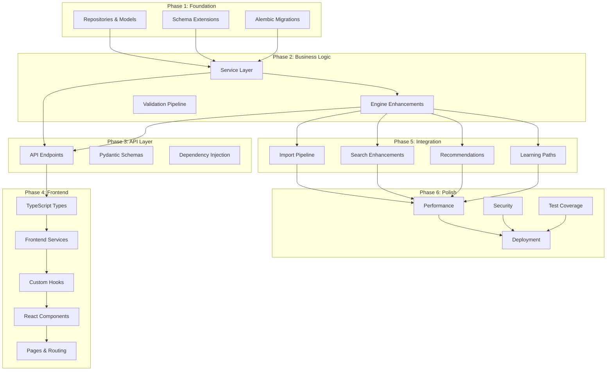
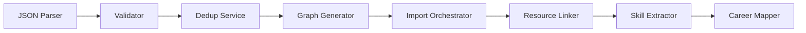

# SV-OS Implementation Guide

> **Engineering Playbook** | **Date**: July 22, 2026 | **Status**: Infrastructure v1 Complete

---

## Implementation Philosophy

1. **Bottom-up**: Implement foundational layers first (repositories → services → endpoints → UI)
2. **Test-first**: Write tests alongside implementation, not after
3. **Small batches**: Each PR should be focused and mergeable within a day
4. **Don't break main**: All changes must pass CI before merge
5. **Document as you go**: Update docs alongside code changes

---

## Implementation Order Overview



---

## Module Dependency Order

### Dependency Graph

```
Layer 1 (Foundation):
  Config → Constants → Enums → Types
  Database → Models → BaseRepository → UnitOfWork

Layer 2 (Data Access):
  Concrete Repositories (18 files)

Layer 3 (Business Logic):
  Services → Auth Service → Core Services
  Validation Engine → Graph Engine

Layer 4 (Engines):
  Event Engine → Graph Engine → Knowledge Engine
  Traversal Engine → Search Engine → Recommendation Engine
  Learning Path Engine → Career Engine

Layer 5 (API):
  Pydantic Schemas → Endpoints → Router

Layer 6 (Frontend):
  API Client → Services → Hooks → Components → Pages
```

### Strict Build Order

```python
BUILD_ORDER = [
    # ── Layer 1: Foundation ──
    "packages/config",
    "packages/types",

    # ── Layer 2: Backend Data ──
    "apps/api/app/core/config.py",
    "apps/api/app/core/database.py",
    "apps/api/app/models/*.py",
    "apps/api/app/repositories/base.py",
    "apps/api/app/repositories/unit_of_work.py",
    "apps/api/app/repositories/*.py",
    "apps/api/alembic/versions/*.py",

    # ── Layer 3: Backend Business Logic ──
    "apps/api/app/engines/base.py",
    "apps/api/app/engines/*.py",
    "apps/api/app/services/*.py",
    "apps/api/app/schemas/*.py",

    # ── Layer 4: Backend API ──
    "apps/api/app/api/v1/endpoints/*.py",
    "apps/api/app/api/v1/router.py",
    "apps/api/app/middleware/*.py",
    "apps/api/app/main.py",

    # ── Layer 5: Frontend ──
    "packages/ui/src/*.tsx",
    "apps/web/src/lib/*.ts",
    "apps/web/src/hooks/*.ts",
    "apps/web/src/components/**/*.tsx",
    "apps/web/src/app/**/*.tsx",
]
```

---

## Repository Implementation Order

| Priority | Repository                | Why                      | Dependencies         |
| -------- | ------------------------- | ------------------------ | -------------------- |
| 1        | `BaseRepository`          | Foundation for all repos | models               |
| 2        | `UnitOfWork`              | Transaction management   | base_repo            |
| 3        | `UserRepository`          | Auth needs it first      | base_repo            |
| 4        | `KnowledgeNodeRepository` | Graph content            | base_repo            |
| 5        | `KnowledgeEdgeRepository` | Graph structure          | base_repo            |
| 6        | `UserProgressRepository`  | User data                | user_repo, node_repo |
| 7        | All remaining repos       | Parallel                 | base_repo            |
| 8        | `GraphRepository`         | Complex queries          | node_repo, edge_repo |

### Success Criteria

```yaml
repository_complete:
  - All CRUD operations working
  - Pagination working (offset + cursor)
  - Soft delete working
  - Optimistic locking working
  - Tests passing for all operations
  - Error handling tested
```

---

## Module Implementation Stages

### Stage 1: Repository & Model

```yaml
purpose: 'Create data access layer for new entity'
files_affected:
  - apps/api/app/models/new_entity.py
  - apps/api/app/repositories/new_entity.py
  - apps/api/alembic/versions/new_migration.py
dependencies:
  - BaseRepository
  - Database models
success_criteria:
  - ORM model matches schema
  - All CRUD operations testable
  - Migration up/down reversible
common_mistakes:
  - Missing `__tablename__`
  - Forgetting to register in UnitOfWork
  - Not handling soft delete properly
estimated_complexity: Low
estimated_time: 2-4 hours
```

### Stage 2: Service

```yaml
purpose: 'Implement business logic for new feature'
files_affected:
  - apps/api/app/services/new_feature.py
  - apps/api/app/schemas/new_feature_schemas.py
dependencies:
  - Repository
  - Engines (if needed)
success_criteria:
  - All business rules implemented
  - Error handling covers edge cases
  - Integration tests pass
common_mistakes:
  - Business logic in endpoint instead of service
  - Not using UnitOfWork for transactions
  - Missing validation
estimated_complexity: Medium
estimated_time: 4-8 hours
```

### Stage 3: API Endpoint

```yaml
purpose: 'Expose service through REST API'
files_affected:
  - apps/api/app/api/v1/endpoints/new_endpoints.py
  - apps/api/app/schemas/request_schemas.py
  - apps/api/app/schemas/response_schemas.py
  - apps/api/app/api/v1/router.py
dependencies:
  - Service
  - Auth dependency
success_criteria:
  - All endpoints return correct status codes
  - Request validation working (422 on invalid input)
  - Auth protection working (401 without token)
  - Response envelope format correct
  - API tests passing
common_mistakes:
  - Not using `get_current_user_id` for protected endpoints
  - Returning raw data instead of envelope
  - Missing pagination parameters
estimated_complexity: Low-Medium
estimated_time: 2-4 hours
```

### Stage 4: Frontend Types

```yaml
purpose: 'Define TypeScript interfaces matching API'
files_affected:
  - packages/types/src/new_types.ts
  - packages/types/src/index.ts
dependencies:
  - API response format
success_criteria:
  - All API response fields covered
  - No `any` types
  - Exported from index.ts
estimated_complexity: Low
estimated_time: 1 hour
```

### Stage 5: Frontend Services

```yaml
purpose: 'API client methods for new endpoints'
files_affected:
  - apps/web/src/services/new_service.ts
  - apps/web/src/services/index.ts
dependencies:
  - API client
  - TypeScript types
success_criteria:
  - All endpoints callable
  - Error handling consistent
  - Types correctly applied
estimated_complexity: Low
estimated_time: 1 hour
```

### Stage 6: Frontend Hook

```yaml
purpose: 'React Query hooks for data fetching'
files_affected:
  - apps/web/src/hooks/use-new-feature.ts
  - apps/web/src/hooks/index.ts
dependencies:
  - Frontend services
success_criteria:
  - Loading state exposed
  - Error state exposed
  - Cache invalidation configured
  - Stale time appropriate
estimated_complexity: Low
estimated_time: 1-2 hours
```

### Stage 7: Frontend Component/Page

```yaml
purpose: 'UI for new feature'
files_affected:
  - apps/web/src/components/new-feature/*.tsx
  - apps/web/src/app/(main)/new-feature/page.tsx
dependencies:
  - Hooks
  - UI components
success_criteria:
  - All states handled (loading, empty, error, success)
  - Responsive design
  - Keyboard navigable
  - Dark mode compatible
common_mistakes:
  - Missing loading state
  - Not handling empty state
  - Not responsive on mobile
estimated_complexity: Medium-High
estimated_time: 4-16 hours
```

---

## Knowledge Pipeline Order



| Stage                  | Purpose                        | Dependencies    | Est. Time |
| ---------------------- | ------------------------------ | --------------- | --------- |
| 1. JSON Parser         | Parse structured JSON import   | Schema defs     | 4 hrs     |
| 2. Validator           | Schema + constraint validation | Parser          | 6 hrs     |
| 3. Dedup Service       | Fuzzy deduplication            | GraphEngine     | 8 hrs     |
| 4. Graph Generator     | Auto-generate edges            | GraphEngine     | 6 hrs     |
| 5. Import Orchestrator | Full pipeline coordination     | Stages 1-4      | 8 hrs     |
| 6. Resource Linker     | Link resources to nodes        | GraphEngine     | 4 hrs     |
| 7. Skill Extractor     | Extract skills from content    | KnowledgeEngine | 6 hrs     |
| 8. Career Mapper       | Map careers to requirements    | CareerEngine    | 4 hrs     |

---

## Backend Implementation Order

| Phase | Modules                            | Files     | Est. Time |
| ----- | ---------------------------------- | --------- | --------- |
| 1     | Models, migrations, BaseRepository | 5-10      | 1-2 days  |
| 2     | All repositories                   | 18+       | 2-3 days  |
| 3     | Core services (auth, user, graph)  | 5         | 2-3 days  |
| 4     | All API endpoints                  | 25+ files | 3-5 days  |
| 5     | Pydantic schemas                   | 20+       | 1-2 days  |
| 6     | Middleware stack                   | 9         | 1 day     |
| 7     | Engine system                      | 20        | 3-5 days  |
| 8     | AI integration                     | 15        | 3-5 days  |

**Total**: ~15-25 days for complete backend

---

## Frontend Implementation Order

| Phase | Modules                                       | Files | Est. Time |
| ----- | --------------------------------------------- | ----- | --------- |
| 1     | Config, types, UI packages                    | 25    | 2-3 days  |
| 2     | API client, auth client, utilities            | 10    | 1-2 days  |
| 3     | Providers (auth, theme, query, etc.)          | 8     | 1 day     |
| 4     | Layout components (sidebar, topnav, appshell) | 6     | 2 days    |
| 5     | Auth pages (login, signup, reset)             | 5     | 2 days    |
| 6     | Dashboard                                     | 3     | 1-2 days  |
| 7     | Graph visualization (React Flow)              | 5     | 3-5 days  |
| 8     | Feature pages (explore, careers, learning)    | 12    | 5-8 days  |
| 9     | System pages (settings, health, versions)     | 8     | 3-4 days  |
| 10    | AI chat                                       | 3     | 2-3 days  |

**Total**: ~20-30 days for complete frontend

---

## Testing Order

| Priority | Test Type         | Coverage Target | Timing                          |
| -------- | ----------------- | --------------- | ------------------------------- |
| 1        | Repository tests  | 90%+            | During repo implementation      |
| 2        | Service tests     | 85%+            | During service implementation   |
| 3        | API tests         | 80%+            | During endpoint implementation  |
| 4        | Engine tests      | 75%+            | During engine implementation    |
| 5        | Component tests   | 70%+            | During component implementation |
| 6        | Integration tests | 60%+            | After features stable           |
| 7        | E2E tests         | Key flows       | Before release                  |
| 8        | Performance tests | Latency targets | Before deployment               |

---

## Deployment Order

| Step | Action                           | Duration  | Rollback            |
| ---- | -------------------------------- | --------- | ------------------- |
| 1    | Deploy staging environment       | 1 day     | —                   |
| 2    | Run integration tests on staging | Automated | —                   |
| 3    | Deploy database migration        | 15 min    | `alembic downgrade` |
| 4    | Deploy API (blue-green)          | 10 min    | Switch to old       |
| 5    | Deploy frontend (blue-green)     | 10 min    | Switch to old       |
| 6    | Smoke tests in production        | 15 min    | Rollback if failed  |
| 7    | Monitor for 24 hours             | —         | Rollback if issues  |
| 8    | Scale up gradually               | 1 hour    | Scale down          |

---

_Cross-reference: [ENGINEERING_STANDARDS.md](./ENGINEERING_STANDARDS.md), [MASTER_ENGINEERING_CHECKLIST.md](./MASTER_ENGINEERING_CHECKLIST.md)_
