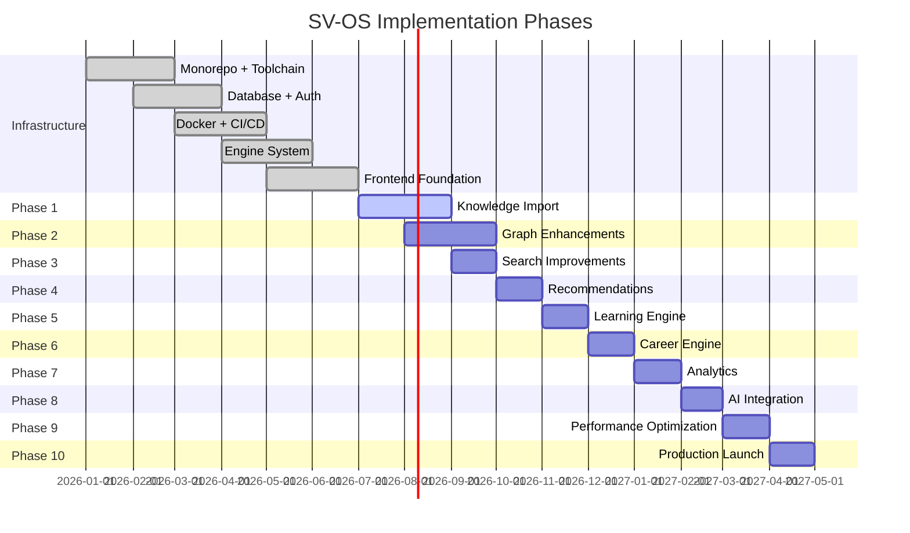
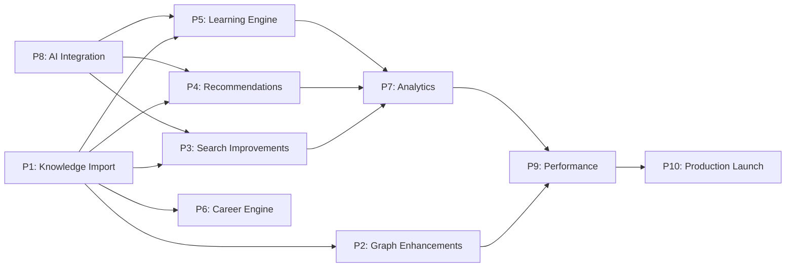

# SV-OS Implementation Roadmap

> **Status**: Infrastructure v1 Complete | **Next Phase**: Knowledge Import  
> **Date**: July 22, 2026

---

## Phase Overview



---

## Phase 1 — Knowledge Import 🟡 CURRENT

**Status**: Next phase — design complete, implementation ready to begin.

### Goals

- Build the pipeline for importing knowledge into the graph
- Support multiple source formats (JSON, CSV, Markdown, Wikipedia dumps, OSS docs)
- Validate, deduplicate, and version imported content
- Auto-generate graph edges from hierarchical data

### Deliverables

| Deliverable              | Description                              | Est. Files |
| ------------------------ | ---------------------------------------- | ---------- |
| Import API endpoints     | POST /platform/import (JSON, CSV, MD)    | 3          |
| ImportEngine integration | Wire import_engine.py into platform      | 2          |
| Wikipedia parser         | Extract nodes from Wikipedia infoboxes   | 2          |
| OSS doc parser           | Extract from README/documentation repos  | 2          |
| Roadmap parser           | Convert roadmap files → node/edge sets   | 1          |
| Deduplication service    | Fuzzy matching for duplicate detection   | 2          |
| Validation pipeline      | Schema, constraint, integrity validation | 2          |
| Import job tracking      | Async job with status reporting          | 2          |

### Dependencies

- ImportEngine (file exists, needs API integration)
- ValidationEngine (file exists, needs tuning)
- GraphEngine (ready)

### Estimated Complexity: **High** (data quality is hard)

### Completion Criteria

- [ ] Import CSV → valid nodes + edges in graph
- [ ] Import JSON → valid nodes + edges in graph
- [ ] Import Markdown → valid nodes + edges in graph
- [ ] Deduplication detects >80% of duplicates
- [ ] Validation catches all constraint violations
- [ ] Import job with progress reporting
- [ ] Test coverage >80% on import pipeline

---

## Phase 2 — Graph Enhancements 📋 PLANNED

### Goals

- Extend GraphEngine with advanced traversal capabilities
- Add visual layout engine for graph visualization
- Improve graph caching performance

### Deliverables

| Deliverable                                               | Est. Complexity |
| --------------------------------------------------------- | --------------- |
| Advanced layout algorithms (force-directed, hierarchical) | Medium          |
| Graph diff visualization (version comparison)             | Medium          |
| Subgraph export (JSON, GraphML)                           | Low             |
| Graph statistics API enhancements                         | Low             |
| GraphEngine persistence (optional Redis-backed)           | High            |

### Dependencies

- Phase 1 (graph needs data to enhance)

### Estimated Complexity: **Medium**

### Completion Criteria

- [ ] Layout engine produces readable graphs for 500+ nodes
- [ ] Graph diff visible in UI
- [ ] Export outputs valid GraphML
- [ ] Statistics endpoints return real-time data

---

## Phase 3 — Search Improvements 📋 PLANNED

### Goals

- Enhance hybrid search (FTS + semantic)
- Add faceted search with aggregated counts
- Implement search analytics and trending

### Deliverables

| Deliverable                                    | Est. Complexity |
| ---------------------------------------------- | --------------- |
| Faceted search (type, difficulty, tags)        | Medium          |
| Search autocomplete (prefix + fuzzy)           | Low             |
| Trending search terms API                      | Low             |
| Search analytics dashboard                     | Medium          |
| pgvector integration for persistent embeddings | High            |

### Dependencies

- Phase 1 (content to search)
- AI Infrastructure (Phase 8 for semantic)

### Estimated Complexity: **Medium-High**

---

## Phase 4 — Recommendations 📋 PLANNED

### Goals

- Wire RecommendationEngine into API
- Build recommendation UI on dashboard
- Add personalized daily/weekly digests

### Deliverables

| Deliverable                                   | Est. Complexity |
| --------------------------------------------- | --------------- |
| Recommendation API endpoints                  | Low             |
| Dashboard recommendation widgets              | Medium          |
| Daily digest email/notification               | Medium          |
| Recommendation feedback loop (thumbs up/down) | Low             |
| A/B testing framework for priority rules      | Medium          |

### Dependencies

- Phase 1 (content to recommend)
- Phase 3 (search context)

### Estimated Complexity: **Medium**

---

## Phase 5 — Learning Engine 📋 PLANNED

### Goals

- Complete LearningPathEngine integration
- Build learning path UI with progress tracking
- Implement spaced repetition (RevisionEngine)

### Deliverables

| Deliverable                            | Est. Complexity |
| -------------------------------------- | --------------- |
| Learning path generation API           | Medium          |
| Path visualization UI (milestone view) | High            |
| Progress tracking with auto-advance    | Medium          |
| Spaced repetition review scheduling    | High            |
| Revision dashboard                     | Medium          |
| SM-2 algorithm implementation          | Medium          |

### Dependencies

- Phase 1 (content)
- Phase 4 (recommendations feed into paths)

### Estimated Complexity: **High**

---

## Phase 6 — Career Engine 📋 PLANNED

### Goals

- Enhance career path mapping
- Build career roadmap visualization
- Add skill gap analysis

### Deliverables

| Deliverable                    | Est. Complexity |
| ------------------------------ | --------------- |
| Career requirement API         | Low             |
| Career roadmap visualization   | High            |
| Skill gap analysis engine      | Medium          |
| Salary/demand data integration | Low             |
| Career comparison tool         | Medium          |

### Dependencies

- Phase 1 (content)
- Phase 5 (learning paths)

### Estimated Complexity: **Medium-High**

---

## Phase 7 — Analytics 📋 PLANNED

### Goals

- Build comprehensive platform analytics
- User learning insights and patterns
- Graph growth and health metrics

### Deliverables

| Deliverable                  | Est. Complexity |
| ---------------------------- | --------------- |
| User analytics dashboard     | High            |
| Graph growth metrics         | Low             |
| Learning pattern analysis    | Medium          |
| Content coverage reports     | Low             |
| Exportable analytics reports | Medium          |

### Dependencies

- Phase 3 (search analytics)
- Phase 4 (recommendation performance)

### Estimated Complexity: **Medium**

---

## Phase 8 — AI Integration 📋 PLANNED

### Goals

- Deploy AI embedding providers to production
- Implement semantic search fully
- Build AI-powered recommendations
- Add content summarization

### Deliverables

| Deliverable                   | Est. Complexity |
| ----------------------------- | --------------- |
| Production embedding pipeline | Medium          |
| Semantic search API           | Low             |
| AI-powered recommendations    | High            |
| Content summarization         | Medium          |
| AI usage monitoring dashboard | Low             |

### Dependencies

- AI Services already exist (Phase 2.4 in original roadmap)
- Embedding providers implemented (OpenAI, Gemini, Ollama)
- RAG engine implemented

### Estimated Complexity: **High**

---

## Phase 9 — Performance Optimization 📋 PLANNED

### Goals

- Optimize database queries
- Implement Redis caching
- Improve frontend bundle size
- Implement lazy loading and code splitting

### Deliverables

| Deliverable                             | Est. Complexity |
| --------------------------------------- | --------------- |
| Redis cache integration                 | Medium          |
| Database query optimization             | Medium          |
| Frontend bundle analysis + optimization | Low             |
| Graph lazy loading (chunked)            | High            |
| API response compression tuning         | Low             |
| CDN configuration                       | Low             |

### Dependencies

- Production load data

### Estimated Complexity: **Medium**

---

## Phase 10 — Production Launch 📋 PLANNED

### Goals

- Deploy to production environment
- Set up monitoring and alerting
- Create production runbook
- Performance baseline + stress testing

### Deliverables

| Deliverable                                        | Est. Complexity |
| -------------------------------------------------- | --------------- |
| Production deployment (Render/Railway/self-hosted) | Medium          |
| Sentry alerting configuration                      | Low             |
| Grafana dashboard for monitoring                   | Medium          |
| Database backup automation                         | Low             |
| SSL/TLS configuration                              | Low             |
| Load testing (k6/locust)                           | Medium          |
| Production runbook                                 | Low             |

### Dependencies

- All preceding phases

### Estimated Complexity: **Medium**

---

## Dependency Graph



---

## Risk Analysis

| Phase | Risk                                      | Severity | Mitigation                                      |
| ----- | ----------------------------------------- | -------- | ----------------------------------------------- |
| P1    | Data quality from external sources        | High     | Strong validation, dedup, human review          |
| P1    | Wikipedia parsing complexity              | Medium   | Start with structured JSON, add MD later        |
| P2    | Graph layout performance with 1000+ nodes | High     | Chunked rendering, level-of-detail              |
| P5    | Spaced repetition algorithm tuning        | Medium   | Start with SM-2 (well-studied), tune parameters |
| P8    | OpenAI API costs                          | Medium   | Ollama for dev, OpenAI for prod caching         |
| P10   | Unexpected production issues              | Medium   | Staging environment, canary deployments         |

---

## Estimated Implementation Order

```
Phase 1  →  Knowledge Import     [HIGHEST PRIORITY — Start now]
   │
   ├──→  Phase 2  →  Graph Enhancements
   ├──→  Phase 3  →  Search Improvements
   ├──→  Phase 4  →  Recommendations
   ├──→  Phase 5  →  Learning Engine
   ├──→  Phase 6  →  Career Engine
   │
   └──→  Phase 8  →  AI Integration  (parallel with 3-6)

Phases 7, 9, 10 after the above are stable
```

---

_Cross-reference: [MASTER_TODO.md](./MASTER_TODO.md), [CURRENT_PROGRESS.md](./CURRENT_PROGRESS.md)_
