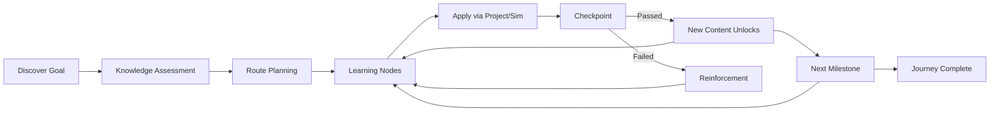
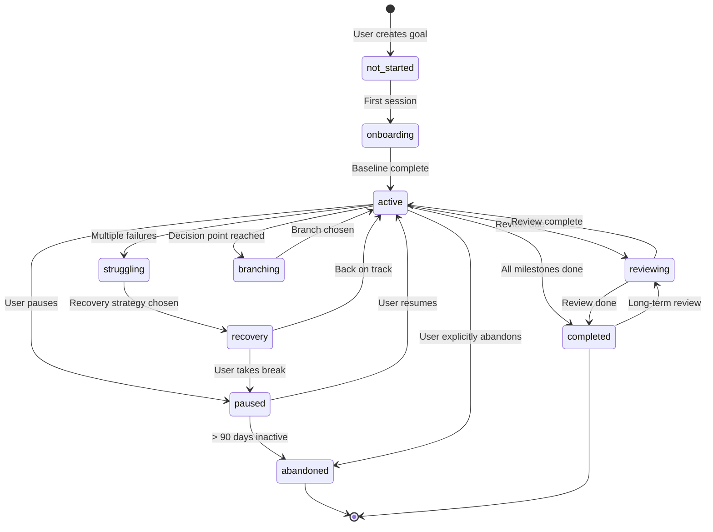

# SV-OS Journey Design

> **Design**: Complete specification for the learner journey through knowledge space  
> **Date**: July 22, 2026 | **Status**: Design Complete  
> **Cross-reference**: [LEARNING_ENGINE.md](./LEARNING_ENGINE.md), [KNOWLEDGE_NAVIGATION_SYSTEM.md](./KNOWLEDGE_NAVIGATION_SYSTEM.md), [LEARNING_PATH_ENGINE.md](./LEARNING_PATH_ENGINE.md)

---

## Journey Structure

Every learner journey in SV-OS follows a consistent structure:



---

## Journey Phases

### Phase 0: Onboarding

**Purpose**: First-time experience. Establish the learner's starting position.

```yaml
Steps:
  1. Welcome & Philosophy:
     - "SV-OS treats Computer Science as a connected ecosystem"
     - 30-second animated overview of the knowledge graph

  2. Goal Setting:
     - "What brings you here?"
     - Options: Career change, Academic learning, Curiosity, Specific project

  3. Knowledge Baseline:
     - Adaptive quiz (5-20 questions, adjusts difficulty based on answers)
     - Covers: Programming, Data Structures, Algorithms, Systems, Math
     - Result: Mastery vector across all major domains

  4. Journey Selection:
     - Based on goal + baseline, suggest 3 starting routes
     - "Recommended", "Fast", "Deep" options

  5. First Node:
     - Immediately start the first learning node
     - Zero friction — no account required until first checkpoint
```

### Phase 1: Foundations

**Purpose**: Build the minimum viable knowledge to start the journey.

```yaml
Characteristics:
  - Duration: First 10% of journey
  - Pace: Gentle (1.0x estimated time)
  - Format: Mixed (video for intuition, reading for depth, exercises for practice)
  - Checkpoints: After every 3 nodes
  - Support: Maximum scaffolding (hints, alternative explanations available)

Context:
  - Every node explains WHY it matters for the learner's goal
  - Prerequisites are clearly marked
  - "You are here" map visible at all times
```

### Phase 2: Core Learning

**Purpose**: Deep, structured learning through the main body of the journey.

```yaml
Characteristics:
  - Duration: Middle 70% of journey
  - Pace: Adaptive (0.5x - 2.0x based on velocity)
  - Format: Learner's preferred format (adjusted by performance)
  - Checkpoints: After every 5-8 nodes (increasing with mastery)
  - Support: Tapering scaffolding

Context:
  - Every node answers:
      - What is this?
      - Why do I need it?
      - Where is it used?
      - What depends on it?
      - What careers require it?
      - What project uses it?
      - What simulator explains it?
      - What mistakes are common?
      - What should I learn next?
```

### Phase 3: Application

**Purpose**: Apply knowledge through projects and simulators.

```yaml
Characteristics:
  - Duration: Interleaved with Core Learning
  - Projects unlock naturally as prerequisite nodes are mastered
  - Simulators available for every concept that can be visualized
  - Real-world case studies for every major topic

Integration:
  - After every 3-5 learning nodes, a project milestone becomes available
  - Projects are tiered: beginner → intermediate → advanced → industry
  - Simulators allow experimentation without project overhead
```

### Phase 4: Specialization

**Purpose**: Deep dive into chosen area.

```yaml
Characteristics:
  - Duration: Last 20% of journey
  - Pace: Self-directed
  - Format: Research-grade content, papers, advanced projects
  - Checkpoints: Milestone-based (complete a project, write a paper)

Options:
  - Industry specialization (deep focus on one area)
  - Breadth expansion (explore adjacent areas)
  - Research preparation (academic track)
  - Teaching preparation (mentor track)
```

### Phase 5: Mastery

**Purpose**: Demonstrate and solidify deep understanding.

```yaml
Characteristics:
  - Capstone project (integrates multiple major concepts)
  - Peer teaching (explain concepts to other learners)
  - Contribution (add new content to the knowledge graph)
  - Portfolio (curated showcase of completed work)

Recognition:
  - Mastery certificates for completed journeys
  - Skill badges for individual competencies
  - Contributor status for graph additions
```

---

## Every Learning Node

Every node in SV-OS provides a complete teaching experience:

```yaml
node_template:
  metadata:
    slug: unique-identifier
    title: Human-readable name
    node_type: concept | technology | tool | skill | algorithm
    difficulty: beginner | intermediate | advanced | expert
    estimated_minutes: 15-180

  context:
    what_is_this: >
      "A promise is an object representing the eventual completion
       or failure of an asynchronous operation."

    why_do_i_need_it: >
      "Required for: Full Stack Developer, Frontend Engineer.
       Used in: React API calls, Node.js file operations,
       every modern JavaScript application."

    where_is_it_used:
      - 'React useEffect cleanup'
      - 'Node.js async file operations'
      - 'Fetch API responses'
      - 'Database queries'

    what_depends_on_it:
      - 'Async/Await (syntax sugar over Promises)'
      - 'Promise.all, Promise.race patterns'
      - 'React Suspense'

    what_careers_require_it:
      - 'Frontend Developer'
      - 'Full Stack Developer'
      - 'Node.js Backend Developer'

    what_project_uses_it:
      - 'Build a REST API client'
      - 'Create an image loader with loading states'

    what_simulator_explains_it:
      - 'Promise Lifecycle Visualizer'

    common_mistakes:
      - 'Forgetting to return a promise in .then chains'
      - 'Not handling errors with .catch'
      - 'Creating callback hell instead of chaining'
      - 'Mixing async/await with .then (inconsistent style)'

    what_to_learn_next:
      - 'Async/Await (natural progression)'
      - 'Promise combinators (all, race, allSettled)'
      - 'Event Loop (deeper understanding)'

  content:
    introduction: '2-3 minute overview'
    core_explanation: 'The main teaching content'
    examples: '3-5 code examples with comments'
    visual_aid: 'Diagram or animation URL'
    analogy: 'Real-world comparison'

  practice:
    exercises:
      - 'Multiple choice quiz (5 questions)'
      - 'Code completion exercise'
      - 'Debug the broken code'
    project:
      - 'Mini project applying this concept'

  assessment:
    checkpoint_questions: 3
    pass_threshold: 0.8
    max_attempts: 3
```

---

## Journey Progress Visualization

### High-Level Journey View

```
┌─────────────────────────────────────────────────────────────┐
│  🧭 Journey: Machine Learning Engineer                      │
│  ─────────────────────────────────────────────────────────  │
│                                                             │
│  Phase 1: Foundations (5/10 nodes) 🟡                       │
│  ■■■■■□□□□□ 50%                                            │
│  ├── ✅ Python Basics                                       │
│  ├── ✅ Functions & Modules                                 │
│  ├── ✅ Data Structures                                     │
│  ├── 🟡 NumPy (in progress)                                │
│  └── ⬜ Pandas                                              │
│                                                             │
│  Phase 2: Core Math (0/6 nodes) 🔒                         │
│  ■□□□□□□□□□ 0% — Unlocks when Phase 1 ≥ 80%                │
│                                                             │
│  Phase 3: ML Fundamentals (0/8 nodes) 🔒                   │
│                                                             │
│  Phase 4: Specialization (0/5 nodes) 🔒                    │
│                                                             │
│  Phase 5: Capstone (0/2 nodes) 🔒                          │
│                                                             │
│  📊 Overall: 8% ■■□□□□□□□□□□□□□□□□□□□□□□□□□□              │
│  ⏱ ETA: 85 hours remaining (at current pace)               │
│  📅 Started: July 15, 2026                                  │
└─────────────────────────────────────────────────────────────┘
```

### Detailed Node View

```
┌─────────────────────────────────────────────────────────────┐
│  📘 NumPy Fundamentals                                      │
│  ─────────────────────────────────────────────────────────  │
│                                                             │
│  📍 Context                                                 │
│  Why: "NumPy is the foundation of all data science in       │
│        Python. Pandas, scikit-learn, and TensorFlow all     │
│        build on NumPy arrays."                              │
│                                                             │
│  🔗 Connections                                             │
│  Requires: Python Lists ✅, Functions ✅                    │
│  Enables: Pandas, Data Visualization, ML                    │
│  Careers: Data Scientist, ML Engineer, Researcher           │
│                                                             │
│  📖 Content (25 min)                                        │
│  ┌─────────────────────────────────────────────────────┐   │
│  │ [Video] NumPy Arrays vs Python Lists (5 min)        │   │
│  │ [Reading] Array Operations (10 min)                 │   │
│  │ [Interactive] NumPy Playground (10 min)             │   │
│  └─────────────────────────────────────────────────────┘   │
│                                                             │
│  🧪 Try It                                                   │
│  [Launch NumPy Simulator] [Start Mini Project]              │
│                                                             │
│  ✅ Checkpoint (pass: 0/3)                                  │
│  [▶ Continue]  [📁 Save for Later]  [🚩 Report Issue]      │
└─────────────────────────────────────────────────────────────┘
```

---

## Journey States & Transitions



---

## Journey Events

Every journey generates events that feed into analytics and personalization:

```python
@dataclass
class JourneyEvent:
    """Every meaningful action in a journey is logged."""
    event_id: UUID
    journey_id: UUID
    user_id: UUID
    timestamp: datetime

    event_type: str  # node_started, node_completed, checkpoint_passed,
                     # checkpoint_failed, project_started, project_completed,
                     # simulation_launched, branch_chosen, route_switched,
                     # pause, resume, abandon, review_due

    metadata: dict  # Type-specific data
```

---

## Journey Analytics

| Metric          | Purpose               | Display               |
| --------------- | --------------------- | --------------------- |
| Completion %    | Overall progress      | Progress bar          |
| Velocity        | Nodes mastered/week   | Trend graph           |
| Confidence      | Knowledge retention   | Heatmap               |
| Streak          | Consecutive days      | Badge                 |
| Time investment | Total hours           | Cumulative chart      |
| Depth score     | Average mastery depth | Radar chart           |
| Breadth score   | Graph coverage        | Network visualization |
| Engagement      | Sessions/week         | Calendar heatmap      |

---

_Cross-reference: [LEARNING_ENGINE.md](./LEARNING_ENGINE.md), [KNOWLEDGE_NAVIGATION_SYSTEM.md](./KNOWLEDGE_NAVIGATION_SYSTEM.md), [MASTERY_MODEL.md](./MASTERY_MODEL.md), [COGNITIVE_MODEL.md](./COGNITIVE_MODEL.md)_
