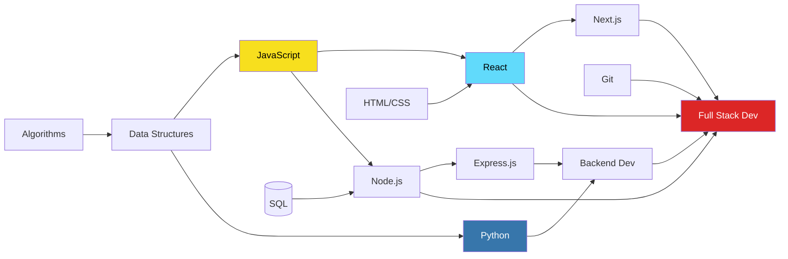
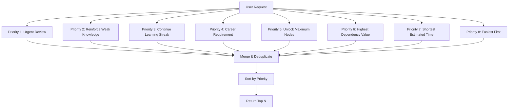

# SV-OS Knowledge Graph Design

> **Blueprint for the entire knowledge system** | **Date**: July 22, 2026

---

## Philosophy

The knowledge graph is the **core data structure** of SV-OS. Everything else — careers, projects, learning paths, recommendations, search — is derived from this graph. The graph is designed to be:

1. **Extensible** — New node types, edge types, and attributes can be added without schema changes
2. **Navigable** — Clear prerequisite chains enable automatic path generation
3. **Weighted** — Edges carry weight for shortest-path computations
4. **Versioned** — Graph snapshots enable rollback and history
5. **Dual-representation** — Persistent in PostgreSQL, fast in-memory via GraphEngine

---

## Knowledge Nodes

### Node Types

| Type       | Enum Value   | Color            | Example                               |
| ---------- | ------------ | ---------------- | ------------------------------------- |
| Subject    | `subject`    | Purple `#7c3aed` | "Computer Science", "Data Science"    |
| Concept    | `concept`    | Blue `#2563eb`   | "Big O Notation", "Polymorphism"      |
| Technology | `technology` | Green `#16a34a`  | "React", "PostgreSQL", "Docker"       |
| Tool       | `tool`       | Amber `#d97706`  | "VS Code", "Git", "Figma"             |
| Career     | `career`     | Red `#dc2626`    | "Frontend Developer", "ML Engineer"   |
| Project    | `project`    | Pink `#db2777`   | "Build a REST API", "Deploy ML Model" |

### Node Attributes

| Attribute           | Type         | Required | Description                                         |
| ------------------- | ------------ | -------- | --------------------------------------------------- |
| `id`                | UUID         | ✅       | Auto-generated primary key                          |
| `slug`              | VARCHAR(200) | ✅       | URL-safe unique identifier (e.g., "big-o-notation") |
| `title`             | VARCHAR(300) | ✅       | Human-readable title                                |
| `description`       | TEXT         | ✅       | Short summary (1-3 sentences)                       |
| `content`           | TEXT         | ❌       | Detailed content / learning material                |
| `node_type`         | ENUM         | ✅       | One of the 6 node types                             |
| `difficulty`        | ENUM         | ✅       | beginner, intermediate, advanced, expert            |
| `estimated_minutes` | INTEGER      | ✅       | Estimated time to learn (default: 30)               |
| `icon`              | VARCHAR(50)  | ❌       | Icon identifier for UI                              |
| `color`             | VARCHAR(7)   | ❌       | Hex color for visualization                         |
| `metadata`          | JSONB        | ✅       | Extensible metadata (default: `{}`)                 |
| `search_vector`     | TSVECTOR     | ✅       | Full-text search (auto-updated)                     |
| `view_count`        | INTEGER      | ✅       | Popularity metric (default: 0)                      |
| `is_published`      | BOOLEAN      | ✅       | Visibility flag (default: true)                     |
| `is_deleted`        | BOOLEAN      | ✅       | Soft delete flag                                    |
| `version`           | INTEGER      | ✅       | Optimistic locking counter                          |
| `created_at`        | TIMESTAMPTZ  | ✅       | Creation timestamp                                  |
| `updated_at`        | TIMESTAMPTZ  | ✅       | Last update timestamp                               |

### Example Node (JSON Representation)

```json
{
  "id": "550e8400-e29b-41d4-a716-446655440000",
  "slug": "react-hooks",
  "title": "React Hooks",
  "description": "Hooks are functions that let you use state and other React features in functional components.",
  "content": "React Hooks were introduced in React 16.8...",
  "node_type": "technology",
  "difficulty": "intermediate",
  "estimated_minutes": 120,
  "icon": "atom",
  "color": "#61dafb",
  "metadata": {
    "keywords": ["useState", "useEffect", "useContext"],
    "year_introduced": 2019
  },
  "view_count": 1500,
  "is_published": true
}
```

---

## Knowledge Edges

### Edge Types & Their Semantics

| Type           | Meaning                                  | Direction     | Example                             |
| -------------- | ---------------------------------------- | ------------- | ----------------------------------- |
| `prerequisite` | A must be learned before B               | forward       | "JavaScript → React Hooks"          |
| `depends_on`   | A depends on B (inverse of prerequisite) | forward       | "React Hooks ← JavaScript"          |
| `uses`         | A uses B in its implementation           | forward       | "React Hooks → Web APIs"            |
| `enables`      | Learning A enables understanding B       | forward       | "React Hooks → Custom Hooks"        |
| `part_of`      | A is a component of B                    | forward       | "useState → React Hooks"            |
| `related_to`   | A and B are related but not dependent    | bidirectional | "React Hooks ↔ Vue Composition API" |
| `leads_to`     | A naturally leads to learning B          | forward       | "React Hooks → React Context"       |
| `requires`     | A requires knowledge of B                | forward       | "React Hooks → JavaScript"          |

### Edge Attributes

| Attribute           | Type  | Required | Description                              |
| ------------------- | ----- | -------- | ---------------------------------------- |
| `id`                | UUID  | ✅       | Auto-generated primary key               |
| `source_node_id`    | UUID  | ✅       | Source node FK                           |
| `target_node_id`    | UUID  | ✅       | Target node FK                           |
| `relationship_type` | ENUM  | ✅       | One of 8 relationship types              |
| `direction`         | ENUM  | ✅       | forward, bidirectional, unidirectional   |
| `description`       | TEXT  | ✅       | Edge description (default: "")           |
| `weight`            | FLOAT | ✅       | Edge weight for traversal (default: 1.0) |
| `metadata`          | JSONB | ✅       | Extensible metadata                      |

### Constraints

- **No self-loops**: `CHECK (source_node_id != target_node_id)`
- **Unique pairs**: `UNIQUE (source_node_id, target_node_id, relationship_type)`
- **Cascade delete**: Nodes → edges on DELETE CASCADE

### Example Edge

```json
{
  "id": "660e8400-e29b-41d4-a716-446655440001",
  "source_node_id": "550e8400-e29b-41d4-a716-446655440000",
  "target_node_id": "770e8400-e29b-41d4-a716-446655440002",
  "relationship_type": "prerequisite",
  "direction": "forward",
  "description": "JavaScript fundamentals are required before learning React Hooks",
  "weight": 1.0
}
```

---

## Graph Relationship Examples

### Prerequisite Chain Example

```
Subject: "Computer Science"
  └── Concept: "Data Structures"
      ├── Prerequisite: "Programming Basics"
      │   └── Prerequisite: "Variables & Types"
      ├── Prerequisite: "Arrays"
      ├── Concept: "Linked Lists"
      │   └── Prerequisite: "Pointers / References"
      ├── Concept: "Trees"
      │   ├── Prerequisite: "Recursion"
      │   └── Prerequisite: "Linked Lists"
      └── Technology: "Python"
          ├── Uses: "Data Structures"
          └── Part of: "Backend Development"

Career: "Full Stack Developer"
  ├── Requires: "Frontend Development"
  │   ├── Requires: "HTML/CSS"
  │   ├── Requires: "JavaScript"
  │   └── Requires: "React"
  │       └── Prerequisite: "JavaScript"
  ├── Requires: "Backend Development"
  │   ├── Requires: "Node.js / Python"
  │   └── Requires: "Databases"
  └── Requires: "DevOps Basics"
      ├── Requires: "Git"
      └── Requires: "CI/CD Concepts"
```

### Graph Diagram (Mermaid)



---

## Learning Paths

### Path Generation Strategies

The LearningPathEngine supports 8 strategies for generating paths:

| Strategy             | Description                            | Best For               |
| -------------------- | -------------------------------------- | ---------------------- |
| `dependency_roadmap` | Topological sort by prerequisite depth | General learning       |
| `shortest_roadmap`   | Minimum total time to goal             | Time-sensitive goals   |
| `career_roadmap`     | Path toward a career node              | Career switchers       |
| `skill_roadmap`      | Path to acquire specific skills        | Skill-focused learning |
| `custom_roadmap`     | User-defined path                      | Advanced users         |
| `semester_roadmap`   | Structured by 15-week blocks           | Academic context       |
| `daily_roadmap`      | Day-by-day plan                        | Intensive learning     |
| `weekly_roadmap`     | Week-by-week plan                      | Balanced pace          |

### Path Structure

Each learning path contains:

- **Milestones** — Groups of related nodes organized by level
- **PathNodes** — Individual node entries with completion status
- **Metadata** — Total time, completion %, strategy, user ID

```json
{
  "path_id": "abc-123",
  "goal_title": "Full Stack Developer",
  "strategy": "dependency_roadmap",
  "milestones": [
    {
      "level": 1,
      "title": "Foundations",
      "nodes": [
        { "node_id": "...", "title": "HTML/CSS", "completed": true },
        { "node_id": "...", "title": "JavaScript Basics", "completed": false }
      ],
      "estimated_minutes": 240
    },
    {
      "level": 2,
      "title": "Frontend",
      "nodes": [{ "node_id": "...", "title": "React", "completed": false }],
      "estimated_minutes": 480
    }
  ],
  "completion_percentage": 15.5,
  "total_estimated_minutes": 2400
}
```

---

## Roadmaps

Career roadmaps connect career nodes to their required knowledge nodes:

```
Career: "Machine Learning Engineer"
  Level 1 (Foundation):
    └── Python                    [required]
    └── Linear Algebra            [required]
    └── Probability & Statistics  [required]
    └── Calculus                  [required]
  Level 2 (Core ML):
    └── Supervised Learning       [required]
    └── Unsupervised Learning     [required]
    └── Neural Networks           [required]
    └── Feature Engineering       [recommended]
  Level 3 (Specialization):
    └── Deep Learning             [bonus]
    └── NLP                       [bonus]
    └── Computer Vision           [bonus]
  Level 4 (Production):
    └── MLOps                     [recommended]
    └── Docker                    [recommended]
    └── Cloud ML Services         [bonus]
```

### Requirement Types

| Type          | Description                          |
| ------------- | ------------------------------------ |
| `required`    | Must-know for this career/project    |
| `recommended` | Strongly advised for better outcomes |
| `bonus`       | Nice-to-have differentiator          |

---

## Difficulty System

| Level        | Value          | Estimated Time | Target Audience     |
| ------------ | -------------- | -------------- | ------------------- |
| Beginner     | `beginner`     | 15-30 min      | New to topic        |
| Intermediate | `intermediate` | 30-60 min      | Has foundation      |
| Advanced     | `advanced`     | 60-120 min     | Solid understanding |
| Expert       | `expert`       | 120-180 min    | Deep specialization |

---

## Resources

Each knowledge node can have multiple learning resources:

| Resource Type   | Description              | Example                 |
| --------------- | ------------------------ | ----------------------- |
| `video`         | YouTube, course video    | "React Hooks Tutorial"  |
| `article`       | Blog post, documentation | "Using the State Hook"  |
| `course`        | Structured course        | "Complete React Course" |
| `book`          | Published book           | "Learning React"        |
| `documentation` | Official docs            | "react.dev"             |
| `tool`          | Interactive tool         | "CodeSandbox"           |
| `podcast`       | Audio content            | "React Podcast"         |
| `interactive`   | Coding exercise          | "Scrimba React Hooks"   |

---

## Projects

Projects connect knowledge to practical application:

```json
{
  "slug": "build-react-todo-app",
  "title": "Build a Todo App with React",
  "difficulty": "beginner",
  "estimated_hours": 4,
  "tech_stack": ["React", "CSS", "localStorage"],
  "requirements": [
    { "node": "JavaScript", "type": "required" },
    { "node": "React Basics", "type": "required" },
    { "node": "CSS Flexbox", "type": "recommended" }
  ]
}
```

---

## Skills

Skills are discrete, measurable abilities mapped to knowledge nodes:

| Skill                      | Category | Mapped To   |
| -------------------------- | -------- | ----------- |
| "Write SQL queries"        | Database | SQL node    |
| "Create React components"  | Frontend | React node  |
| "Deploy Docker containers" | DevOps   | Docker node |

Skills have relationships:

- `prerequisite` — Skill A must come before B
- `builds_upon` — Skill B builds on A
- `complement` — Skills work well together
- `specialization` — B is a specialization of A
- `alternative` — A or B can fulfill the same need

---

## Progress System

| Status        | Meaning            | Next Action                   |
| ------------- | ------------------ | ----------------------------- |
| `not_started` | Haven't engaged    | Start learning                |
| `learning`    | Currently studying | Continue                      |
| `completed`   | Finished content   | Review or move on             |
| `mastered`    | Can teach others   | Help others / advanced topics |

Progress is tracked per (user, node) pair with:

- Time spent (minutes)
- Status transitions with timestamps
- Optional notes
- Auto-calculated completion metrics

---

## Bookmark & Favorites

| Feature      | Purpose                            | Difference       |
| ------------ | ---------------------------------- | ---------------- |
| **Bookmark** | Save for later with optional notes | More intentional |
| **Favorite** | One-click like/save                | Quick action     |

---

## Search System

The SearchEngine supports these search modes:

| Mode       | Algorithm                     | Use Case            |
| ---------- | ----------------------------- | ------------------- |
| `exact`    | Exact string match            | Known titles/slugs  |
| `prefix`   | String starts with            | Autocomplete        |
| `fuzzy`    | Levenshtein distance ≤ 2      | Misspellings        |
| `fulltext` | Word token matching + scoring | General search      |
| `tag`      | Tag name lookup               | Tag-based discovery |
| `type`     | Node type filter + search     | Category browsing   |

Ranking (fulltext mode):

- Title exact match: 1.0
- Title contains query: 0.9
- Word overlap score: 0.7 × overlap_ratio
- Title prefix match: 0.4
- Description / content: lower weights

---

## Recommendations

The RecommendationEngine uses 8 deterministic priority rules:



Each recommendation includes an **explanation** of WHY it was recommended.

---

## Future AI Recommendations

The knowledge graph is designed to support these AI-enhanced features:

| Feature                         | Data Needed               | Status         |
| ------------------------------- | ------------------------- | -------------- |
| **Semantic search**             | Node embeddings (vector)  | ✅ Implemented |
| **RAG-based Q&A**               | Node content + embeddings | ✅ Implemented |
| **Personalized path ranking**   | User history + embeddings | 🟡 Planned     |
| **Content gap analysis**        | Embedding coverage maps   | ⬜ Planned     |
| **Difficulty calibration**      | User completion data      | ⬜ Planned     |
| **Concept prerequisite mining** | Edge pattern analysis     | ⬜ Planned     |
| **Automated resource tagging**  | Resource embeddings       | ⬜ Planned     |

The embedding infrastructure (providers, services, indexes) is fully in place. The remaining work is on the application layer that uses these embeddings for enhanced recommendations.

---

## Extensibility

The graph design is extensible in multiple dimensions:

### Adding New Node Types

Add a value to `NodeType` enum → add to schema (if native enum) → frontend color mapping

### Adding New Edge Types

Add a value to `EdgeType` enum → update traversal filters → frontend styling

### Adding Node Metadata

Add keys to the existing `metadata` JSONB column — no schema change needed

### Adding New Resources

Add a value to `ResourceType` enum → add resources to existing nodes

### Adding Custom Attributes

Use `metadata` JSONB for extensible properties; promote to dedicated columns when patterns emerge

---

_Cross-reference: [DATABASE_BLUEPRINT.md](./DATABASE_BLUEPRINT.md), [API_BLUEPRINT.md](./API_BLUEPRINT.md), [BACKEND_BLUEPRINT.md](./BACKEND_BLUEPRINT.md)_
