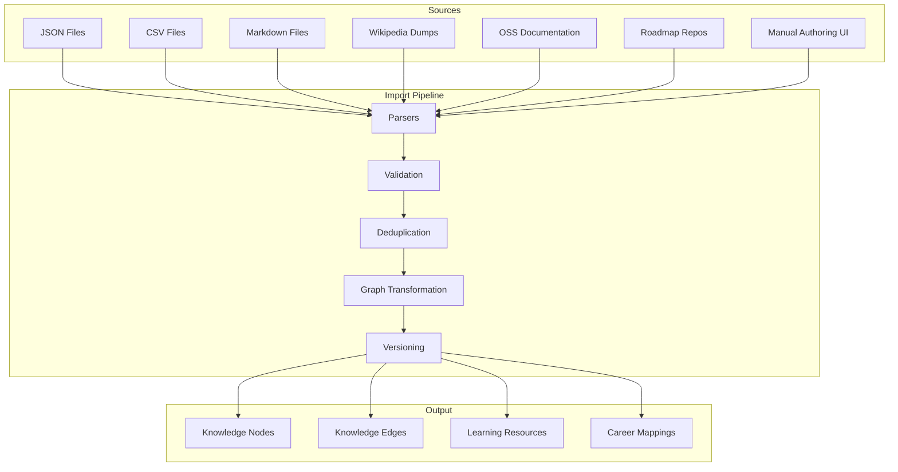
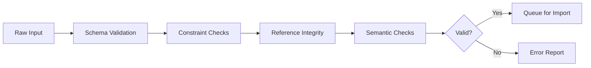
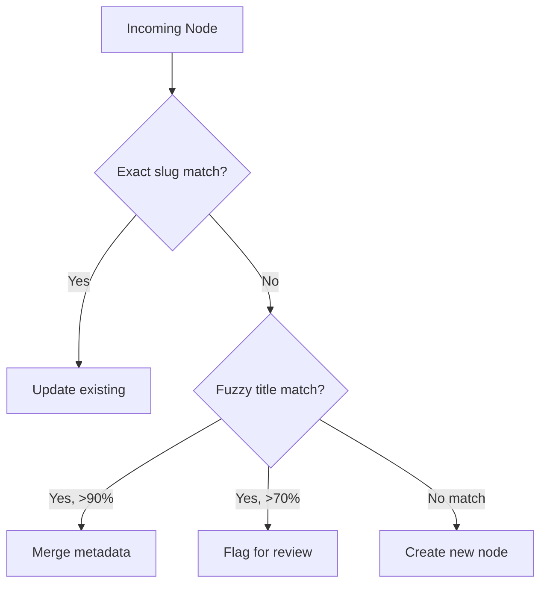

# SV-OS Knowledge Import Plan

> **Phase**: 1 — Next Up | **Status**: Design Complete, Ready for Implementation  
> **Priority**: HIGHEST — The graph needs content

---

## Overview

The Knowledge Import System is the pipeline for populating the SV-OS knowledge graph with real content. Without this, the graph is an empty shell. This phase builds the import infrastructure to ingest knowledge from multiple sources, validate it, deduplicate it, and transform it into nodes and edges.



---

## Sources

### 1. JSON Import (Primary Format)

**Format**: Structured JSON representing nodes, edges, and resources.

```json
{
  "format_version": "1.0",
  "source": "community-contribution",
  "nodes": [
    {
      "slug": "machine-learning-basics",
      "title": "Machine Learning Basics",
      "description": "Fundamental concepts of machine learning...",
      "node_type": "subject",
      "difficulty": "beginner",
      "estimated_minutes": 60,
      "metadata": {
        "keywords": ["supervised", "unsupervised", "regression"]
      }
    }
  ],
  "edges": [
    {
      "source_slug": "python",
      "target_slug": "machine-learning-basics",
      "relationship_type": "prerequisite",
      "description": "Python is commonly used for ML"
    }
  ],
  "resources": [
    {
      "node_slug": "machine-learning-basics",
      "title": "ML for Beginners",
      "url": "https://example.com/ml-intro",
      "resource_type": "course",
      "platform": "Coursera",
      "is_free": true
    }
  ]
}
```

**Files needed**: JSON parser, JSON schema validator, sample import files

### 2. CSV Import (Bulk)

**Format**: Standard CSV with headers for nodes and edges.

```
nodes.csv:
slug,title,description,node_type,difficulty,estimated_minutes
python,"Python Programming","A high-level language...",technology,beginner,120

edges.csv:
source_slug,target_slug,relationship_type,description
python,machine-learning,prerequisite,"Python is used for ML"
```

**Files needed**: CSV parser with header mapping, column validators

### 3. Markdown Import (Developer Docs)

**Format**: Markdown files with YAML frontmatter.

```markdown
---
slug: docker-basics
title: Docker Basics
type: technology
difficulty: intermediate
estimated_minutes: 90
tags: [containers, devops, deployment]
---

## Overview

Docker is a platform for developing, shipping, and running applications in containers...

## Prerequisites

- Linux command line
- Basic understanding of virtualization

## Resources

- [Docker Documentation](https://docs.docker.com/) - documentation
- [Docker for Beginners](https://example.com/docker) - course
```

**Files needed**: Markdown parser, frontmatter extractor, content → description extractor

### 4. Wikipedia Dumps

**Source**: Wikipedia API or XML dumps for CS-related pages.

**Extraction strategy**:

1. Query Wikipedia for CS categories (Computer science, Programming, Technology)
2. Extract infobox data → node attributes
3. Extract links between pages → edge candidates
4. Extract introductory paragraphs → descriptions
5. Extract external links → learning resources

**Challenges**:

- Vast amount of data (need filtering)
- Infobox schema varies by topic
- Link quality varies (not all are prerequisites)

**Files needed**: Wikipedia API client, infobox parser, link extractor, quality filter

### 5. Open Source Documentation

**Source**: README files, documentation sites for popular OSS projects.

**Extraction strategy**:

1. Start with known OSS projects (React, Vue, Django, etc.)
2. Parse README for: title, description, prerequisites, related projects
3. Extract installation guides → resource links
4. Map prerequisites to existing graph nodes

**Files needed**: README parser, OSS project index, GitHub API client

### 6. Roadmap Repositories

**Source**: Public learning roadmaps (like roadmap.sh, OSS University, etc.)

**Extraction strategy**:

1. Parse roadmap data structures (JSON, Markdown lists)
2. Extract hierarchical relationships → edges
3. Map to SV-OS node types
4. Validate against existing graph structure

**Files needed**: Roadmap parser, hierarchical → graph converter

### 7. Manual Authoring UI

**Source**: Web-based form for manual node/edge creation.

**Components**:

- Node creation form (slug, title, description, type, difficulty)
- Edge creation UI (source → type → target selector with autocomplete)
- Resource addition form
- Bulk import with preview

**Files needed**: React components, form schemas, preview/validation

---

## Validation Pipeline



### Validation Stages

| Stage           | Checks                                                 | Error Action            |
| --------------- | ------------------------------------------------------ | ----------------------- |
| **Schema**      | Required fields, type correctness, format compliance   | Reject immediately      |
| **Constraints** | Slug uniqueness, edge no-self-loop, difficulty values  | Flag and skip           |
| **Reference**   | Edge targets exist, resource nodes exist               | Skip edges, log warning |
| **Semantic**    | Title length, description quality, node type relevance | Warning (human review)  |

### Validation Engine Integration

The `ValidationEngine` (`app/engines/validation_engine.py`) already exists and provides:

```python
async def validate_node(node_id: UUID) -> dict:
    """Validate node structural integrity."""

async def validate_edge(edge_id: UUID) -> dict:
    """Validate edge structural integrity."""

async def integrity_check() -> dict:
    """Full graph integrity check."""
```

The import pipeline will extend this with pre-import validation.

---

## Deduplication Strategy



### Algorithm

1. **Exact match**: Check `slug` against existing graph nodes
2. **Fuzzy title match**: Levenshtein distance on `title` (threshold: ≤3 for short, ≤5 for long)
3. **Semantic match**: If embeddings available, cosine similarity on descriptions
4. **Context match**: Compare prerequisite sets — similar prerequisites → likely duplicate

### Dedup Merge Strategy

| Scenario         | Action                               |
| ---------------- | ------------------------------------ |
| Exact slug match | Update existing (version bump)       |
| Title match >90% | Merge descriptions, combine metadata |
| Title match >70% | Flag for human review                |
| No match         | Create new node                      |

---

## Versioning

### Import Version Strategy

Each import produces a **versioned snapshot**:

```json
{
  "version_id": "v20260722-001",
  "source": "wikipedia-dump",
  "nodes_added": 150,
  "nodes_updated": 23,
  "edges_added": 450,
  "validation_errors": 5,
  "imported_at": "2026-07-22T12:00:00Z",
  "status": "completed"
}
```

### Integration with VersioningEngine

The `VersioningEngine` (`app/engines/versioning_engine.py`) already supports:

```python
async def graph_snapshot() -> GraphSnapshot:
    """Take point-in-time snapshot."""

async def restore_snapshot(snapshot: GraphSnapshot) -> int:
    """Restore to previous state."""
```

Import will auto-create snapshots before and after each import operation.

---

## Graph Generation from Imports

### Edge Auto-Generation

When importing hierarchical data, edges can be auto-generated:

| Source Structure  | Generated Edge Type | Example                 |
| ----------------- | ------------------- | ----------------------- |
| Nested categories | `part_of`           | "React Hooks → React"   |
| Ordered lists     | `prerequisite`      | "Variables → Functions" |
| Cross-references  | `related_to`        | "React ↔ Vue"           |
| Resource tags     | `uses`              | "React → JSX"           |

### Node Relationship Inference

```python
# Example: Inferring edges from hierarchical data
def infer_edges_from_hierarchy(nodes: list[dict]) -> list[Edge]:
    edges = []
    for node in nodes:
        if 'parent_slug' in node['metadata']:
            edges.append({
                'source_slug': node['metadata']['parent_slug'],
                'target_slug': node['slug'],
                'relationship_type': get_relationship_from_context(node),
            })
    return edges
```

---

## Resource Linking

### Auto-Linking Resources

When importing resources, the system will:

1. **Link to existing nodes**: Match resource topic to graph nodes via title/description similarity
2. **Extract from content**: Parse resource URLs from node content
3. **Categorize**: Auto-detect resource type from URL pattern (youtube.com → video, github.com → tool)
4. **Validate URLs**: Check links are accessible (HTTP HEAD)

```python
RESOURCE_TYPE_PATTERNS = {
    'youtube.com': ResourceType.VIDEO,
    'coursera.org': ResourceType.COURSE,
    'udemy.com': ResourceType.COURSE,
    'github.com': ResourceType.TOOL,
    'docs.', 'dev.to': ResourceType.DOCUMENTATION,
    '.pdf': ResourceType.ARTICLE,
}
```

---

## Skill Extraction

### From Imported Content

Skills can be extracted from:

1. **Node metadata** — Explicit keyword lists
2. **Node content** — Key phrase extraction (TF-IDF)
3. **Resource descriptions** — Technology mentions
4. **Career requirements** — Explicitly listed skills

### Skill → Node Mapping

```python
skill_node_map = {
    "Python Programming": "python",
    "SQL Queries": "sql",
    "React Development": "react",
    "Docker Containerization": "docker",
    # ... mapped from existing nodes
}
```

---

## Career Mapping

### From Imported Content

Career mappings can be derived from:

1. **LinkedIn/Glassdoor data** — Required skills per role
2. **Job descriptions** — Technology mentions and frequency
3. **Curriculum paths** — University course sequences for majors
4. **Community expertise** — Peer-reviewed career roadmaps

### Career → Node Mapping

```python
career_node_map = {
    "Frontend Developer": ["html", "css", "javascript", "react", "git"],
    "Backend Developer": ["python", "sql", "node.js", "docker", "apis"],
    "ML Engineer": ["python", "linear-algebra", "statistics", "ml-basics", "deep-learning"],
    # ... defined via career_requirements table
}
```

---

## Files to Create

| File                                        | Purpose                            | Complexity |
| ------------------------------------------- | ---------------------------------- | ---------- |
| `app/import/sources/json_parser.py`         | Parse JSON import format           | Low        |
| `app/import/sources/csv_parser.py`          | Parse CSV import format            | Low        |
| `app/import/sources/markdown_parser.py`     | Parse Markdown with frontmatter    | Medium     |
| `app/import/sources/wikipedia_parser.py`    | Extract from Wikipedia API         | High       |
| `app/import/sources/oss_parser.py`          | Parse OSS documentation            | Medium     |
| `app/import/sources/roadmap_parser.py`      | Parse roadmap formats              | Medium     |
| `app/import/validation/import_validator.py` | Pre-import validation              | Medium     |
| `app/import/dedup/dedup_service.py`         | Fuzzy deduplication                | High       |
| `app/import/graph_generator.py`             | Auto-generate edges from structure | Medium     |
| `app/import/importer.py`                    | Main import orchestrator           | Medium     |
| `app/import/resource_linker.py`             | Auto-link resources to nodes       | Low        |
| `app/import/skill_extractor.py`             | Extract skills from content        | Medium     |
| `app/import/models.py`                      | Import job models                  | Low        |
| `app/api/v1/endpoints/import_endpoints.py`  | Import API endpoints               | Medium     |
| `app/schemas/import/`                       | Import request/response schemas    | Low        |
| Frontend: import components                 | Import UI + progress               | Medium     |
| Tests: import tests                         | Comprehensive import testing       | High       |

**Total estimated files**: ~25-30

---

## Implementation Order

```
1. JSON parser + validator     [Foundation]
2. Import API endpoints         [Interface]
3. Deduplication service        [Critical]
4. Graph generator              [Core transformation]
5. Import orchestrator          [Pipeline]
6. CSV parser                   [Extension]
7. Markdown parser              [Extension]
8. Resource linker              [Enhancement]
9. Skill extractor              [Enhancement]
10. Wikipedia parser            [Advanced]
11. OSS parser                  [Advanced]
12. Roadmap parser              [Advanced]
13. Manual authoring UI         [Frontend]
14. Import tests                [Quality]
```

---

## Completion Criteria

- [ ] Import JSON → valid nodes + edges in graph (end-to-end)
- [ ] Import CSV → valid nodes + edges in graph (end-to-end)
- [ ] Import Markdown → valid nodes + edges in graph (end-to-end)
- [ ] Validation catches all schema, constraint, and reference errors
- [ ] Deduplication detects >80% of duplicate nodes
- [ ] Auto-generated edges are >70% accurate (human review ready)
- [ ] Import jobs report progress and can be tracked
- [ ] All import operations are versioned (snapshot before/after)
- [ ] Test coverage >80% on import pipeline
- [ ] Documentation complete for all import formats

---

_Cross-reference: [MASTER_TODO.md](./MASTER_TODO.md), [IMPLEMENTATION_ROADMAP.md](./IMPLEMENTATION_ROADMAP.md), [BACKEND_BLUEPRINT.md](./BACKEND_BLUEPRINT.md)_
