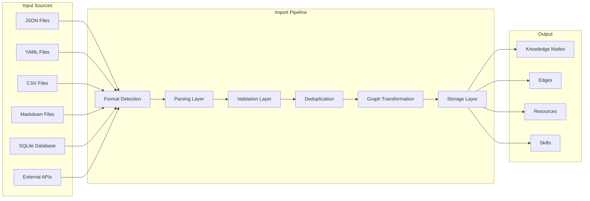

# SV-OS Knowledge Import Specification

> **Design**: Complete import format specification and pipeline architecture  
> **Date**: July 22, 2026 | **Status**: Design Complete

---

## Import Architecture



---

## Format Specifications

### 1. JSON Import Format

**File Extension**: `.json`  
**MIME Type**: `application/json`  
**Version**: `1.0` (current)

#### Top-Level Structure

```json
{
  "format": "sv-os-knowledge",
  "version": "1.0",
  "meta": {
    "source": "community-contribution",
    "author": "SV-OS Team",
    "created_at": "2026-07-22T12:00:00Z",
    "description": "Initial import of frontend development knowledge"
  },
  "nodes": [],
  "edges": [],
  "resources": [],
  "skills": []
}
```

#### Node Object

```json
{
  "slug": "react-hooks",
  "title": "React Hooks",
  "description": "Functions that let you use state and other React features in functional components.",
  "content": "## React Hooks\n\nIntroduced in React 16.8...",
  "node_type": "technology",
  "difficulty": "intermediate",
  "estimated_minutes": 120,
  "icon": "atom",
  "color": "#61dafb",
  "keywords": ["useState", "useEffect", "useContext"],
  "prerequisites": ["javascript", "react-basics"],
  "status": "published",
  "metadata": {
    "source_url": "https://react.dev",
    "year_introduced": 2019
  }
}
```

#### Edge Object

```json
{
  "source_slug": "javascript",
  "target_slug": "react-hooks",
  "relationship_type": "prerequisite",
  "weight": 0.95,
  "description": "JavaScript fundamentals are required before learning React Hooks",
  "direction": "forward"
}
```

#### Resource Object

```json
{
  "node_slug": "react-hooks",
  "title": "Using the State Hook",
  "url": "https://react.dev/reference/react/useState",
  "resource_type": "documentation",
  "platform": "react.dev",
  "is_free": true,
  "language": "en",
  "difficulty": "beginner",
  "duration_minutes": 30
}
```

#### Skill Object

```json
{
  "slug": "use-react-hooks",
  "title": "Use React Hooks",
  "description": "Ability to use useState, useEffect, and custom hooks",
  "category": "programming",
  "nodes": ["react-hooks"],
  "related_skills": ["react-component-design"],
  "demand_level": "high"
}
```

**Validation Rules (JSON)**:

| Rule                         | Check                                | Action            |
| ---------------------------- | ------------------------------------ | ----------------- |
| Required fields              | slug, title, description, node_type  | Reject            |
| Slug format                  | lowercase, hyphens only, 3-200 chars | Reject            |
| Node type validity           | Must be in enum                      | Reject            |
| Difficulty validity          | Must be in enum                      | Reject            |
| Edge source/target existence | Must match node slugs                | Skip edge, log    |
| Status validity              | draft, review, published, archived   | Default: draft    |
| Duplicate slugs              | Within same import file              | Reject duplicates |

---

### 2. YAML Import Format

**File Extension**: `.yaml` or `.yml`  
**MIME Type**: `application/x-yaml`

```yaml
format: sv-os-knowledge
version: '1.0'
meta:
  source: 'manual-authoring'
  author: 'johndoe'
  created_at: '2026-07-22T12:00:00Z'

nodes:
  - slug: docker-basics
    title: Docker Basics
    description: 'Container platform for dev and ops'
    node_type: technology
    difficulty: intermediate
    estimated_minutes: 90
    prerequisites:
      - linux-command-line
      - virtualization-concepts

edges:
  - source_slug: linux-command-line
    target_slug: docker-basics
    relationship_type: prerequisite
    weight: 0.85
```

**Advantages over JSON**: More readable for manual authoring. Supports comments.

**Validation**: Same rules as JSON format.

---

### 3. CSV Import Format

**File Extension**: `.csv`  
**MIME Type**: `text/csv`  
**Multiple Files**: Nodes and edges in separate files.

#### nodes.csv

```csv
slug,title,description,node_type,difficulty,estimated_minutes,status,prerequisites
python,"Python Programming","A high-level programming language",technology,beginner,120,published,
react,"React","A JavaScript library for building UIs",technology,intermediate,180,published,"javascript,html-css"
docker,"Docker","Container platform",technology,intermediate,90,published,"linux-command-line"
```

#### edges.csv

```csv
source_slug,target_slug,relationship_type,weight,description
javascript,react,prerequisite,0.95,"JavaScript is required for React"
react,nextjs,extends,0.80,"Next.js extends React"
```

#### resources.csv

```csv
node_slug,title,url,resource_type,platform,is_free
react,"React Documentation",https://react.dev,documentation,react.dev,true
react,"Learn React",https://react.dev/learn,course,react.dev,true
```

**Column Mapping**: Users can provide a column mapping file if headers differ:

```json
{
  "node_slug_column": "slug",
  "node_title_column": "title",
  "node_type_column": "type"
}
```

**Validation Rules (CSV)**:

| Rule                     | Check                      |
| ------------------------ | -------------------------- |
| Header row exists        | First row must be header   |
| Column count consistent  | All rows same column count |
| Required columns present | slug, title, node_type     |
| No empty slugs           | Slug must not be empty     |
| UTF-8 encoding           | File must be UTF-8         |

---

### 4. Markdown Import Format

**File Extension**: `.md`  
**MIME Type**: `text/markdown`

Standard Markdown with YAML frontmatter:

```markdown
---
slug: docker-basics
title: Docker Basics
type: technology
difficulty: intermediate
estimated_minutes: 90
status: published
tags: [containers, devops]
prerequisites:
  - linux-command-line
keywords: docker, containers, images, compose
icon: docker
color: '#2496ED'
resources:
  - title: Docker Documentation
    url: https://docs.docker.com/
    type: documentation
    is_free: true
  - title: Docker for Beginners
    url: https://example.com/docker-course
    type: course
    platform: Coursera
    is_free: false
---

## Overview

Docker is a platform for developing, shipping, and running applications in containers...

## What You'll Learn

- Container basics and images
- Dockerfiles and multi-stage builds
- Docker Compose for multi-container apps
- Docker networking and volumes

## Key Concepts

- Images are read-only templates
- Containers are running instances
- Dockerfiles define image builds

## Prerequisites

- Basic Linux command line knowledge
- Understanding of virtualization concepts (helpful but not required)

## Exercises

1. Create a Dockerfile for a Node.js app
2. Use Docker Compose for a web + database setup
3. Build a multi-stage Dockerfile

## Resources

- [Docker Documentation](https://docs.docker.com/) - Official reference
- [Play with Docker](https://labs.play-with-docker.com/) - Free online lab
```

#### Frontmatter Schema

| Field               | Type     | Required | Maps To                 |
| ------------------- | -------- | -------- | ----------------------- |
| `slug`              | String   | ✅       | Node slug               |
| `title`             | String   | ✅       | Node title              |
| `type`              | String   | ✅       | node_type               |
| `difficulty`        | String   | ✅       | difficulty              |
| `estimated_minutes` | Integer  | ✅       | estimated_minutes       |
| `status`            | String   | ❌       | status (default: draft) |
| `tags`              | String[] | ❌       | metadata.tags           |
| `prerequisites`     | String[] | ❌       | Edges (PREREQUISITE_OF) |
| `keywords`          | String   | ❌       | metadata.keywords       |
| `icon`              | String   | ❌       | icon                    |
| `color`             | String   | ❌       | color                   |
| `resources`         | Object[] | ❌       | Learning resources      |

#### Content Parsing Rules

| Content Section        | Extraction                         |
| ---------------------- | ---------------------------------- |
| `## Overview`          | First paragraph → description      |
| `## What You'll Learn` | List items → learning objectives   |
| `## Key Concepts`      | List items → metadata key concepts |
| `## Prerequisites`     | List items → edge generation       |
| `## Exercises`         | List items → exercise resources    |
| `## Resources`         | Links → learning resources         |

---

### 5. SQLite Import Format

**File Extension**: `.sqlite` or `.db`  
**MIME Type**: `application/vnd.sqlite3`

#### Expected Schema

```sql
-- Required tables for SQLite import
CREATE TABLE IF NOT EXISTS nodes (
    slug TEXT PRIMARY KEY,
    title TEXT NOT NULL,
    description TEXT,
    node_type TEXT NOT NULL,
    difficulty TEXT DEFAULT 'beginner',
    estimated_minutes INTEGER DEFAULT 30,
    content TEXT,
    status TEXT DEFAULT 'draft',
    metadata TEXT  -- JSON string
);

CREATE TABLE IF NOT EXISTS edges (
    source_slug TEXT NOT NULL,
    target_slug TEXT NOT NULL,
    relationship_type TEXT NOT NULL,
    weight REAL DEFAULT 0.5,
    description TEXT DEFAULT '',
    PRIMARY KEY (source_slug, target_slug, relationship_type),
    FOREIGN KEY (source_slug) REFERENCES nodes(slug),
    FOREIGN KEY (target_slug) REFERENCES nodes(slug)
);

CREATE TABLE IF NOT EXISTS resources (
    id INTEGER PRIMARY KEY AUTOINCREMENT,
    node_slug TEXT NOT NULL,
    title TEXT NOT NULL,
    url TEXT NOT NULL,
    resource_type TEXT NOT NULL,
    platform TEXT,
    is_free INTEGER DEFAULT 1,
    FOREIGN KEY (node_slug) REFERENCES nodes(slug)
);
```

#### Import Process

1. Connect to SQLite file (read-only)
2. Validate table existence
3. Read all rows from nodes, edges, resources
4. Transform to internal representation
5. Run through standard import pipeline

---

### 6. Future API Import Sources

| Source             | Method    | Format                 |
| ------------------ | --------- | ---------------------- |
| Wikipedia API      | REST GET  | JSON (API response)    |
| GitHub API         | REST GET  | JSON (README parsing)  |
| Stack Overflow API | REST GET  | XML/JSON (tag data)    |
| OSS Repository     | Git clone | Markdown (README/docs) |
| Roadmap.sh         | REST GET  | JSON (roadmap data)    |
| Dev.to API         | REST GET  | JSON (articles)        |
| Coursera API       | REST GET  | JSON (course catalog)  |

---

## Import Pipeline Stages

### Stage 1: Format Detection

```python
FORMAT_DETECTORS = {
    '.json': detect_json,
    '.yaml': detect_yaml,
    '.yml': detect_yaml,
    '.csv': detect_csv,
    '.md': detect_markdown,
    '.sqlite': detect_sqlite,
    '.db': detect_sqlite,
}
```

### Stage 2: Parsing

Each format has a dedicated parser that converts raw input to a **normalized internal representation**:

```python
@dataclass
class ImportData:
    nodes: list[NodeImport]
    edges: list[EdgeImport]
    resources: list[ResourceImport]
    skills: list[SkillImport]
    meta: ImportMeta
```

### Stage 3: Validation

| Validation Step                   | Scope                   | Severity            |
| --------------------------------- | ----------------------- | ------------------- |
| Schema compliance                 | All entities            | Blocking            |
| Required fields                   | All entities            | Blocking            |
| Slug format                       | Nodes, skills           | Blocking            |
| Type enum validity                | Nodes, edges, resources | Blocking            |
| Difficulty enum validity          | Nodes, resources        | Blocking            |
| Edge reference integrity          | Edges                   | Warning (skip edge) |
| URL format                        | Resources               | Warning             |
| Description length (min 10 chars) | Nodes                   | Warning             |
| Duplicate detection               | All entities            | Flag                |

### Stage 4: Deduplication

See [KNOWLEDGE_VALIDATION.md](./KNOWLEDGE_VALIDATION.md) for full dedup strategy.

### Stage 5: Graph Transformation

```python
class GraphTransformer:
    """Transforms import data into graph-compatible structures."""

    def generate_edges_from_prerequisites(self, nodes):
        """Create PREREQUISITE_OF edges from node.prerequisites list."""

    def infer_node_type(self, data):
        """Auto-detect node type from content patterns."""

    def create_hierarchy_edges(self, slugs):
        """Create PART_OF/BELONGS_TO edges from slug hierarchy."""
```

### Stage 6: Storage

```python
class ImportStorage:
    async def store_nodes(self, nodes, strategy: MergeStrategy):
        """Upsert nodes with specified merge strategy."""

    async def store_edges(self, edges):
        """Create edges, skipping invalid references."""

    async def store_resources(self, resources):
        """Link resources to existing nodes."""
```

---

## Versioning & Schema Evolution

### Import Version Format

```json
{
  "format": "sv-os-knowledge",
  "version": "1.0"
}
```

### Version Migration Path

| Version | Changes        | Backward Compatible |
| ------- | -------------- | ------------------- |
| 1.0     | Initial format | —                   |

### Compatible Changes (minor version bump)

- Adding new optional fields
- Adding new entity types
- Relaxing validation rules

### Incompatible Changes (major version bump)

- Removing required fields
- Changing field semantics
- Restructuring node format

---

## Conflict Handling

| Conflict Type                               | Default Strategy    | Configurable |
| ------------------------------------------- | ------------------- | ------------ |
| Same slug, same content                     | Skip (no-op)        | Yes          |
| Same slug, different content                | Update (newer wins) | Yes          |
| Same slug, same content, different metadata | Merge metadata      | Yes          |
| Edge already exists                         | Skip duplicate      | Yes          |
| Resource already exists                     | Skip duplicate      | Yes          |

### Merge Strategies

| Strategy    | Behavior                  | When to Use           |
| ----------- | ------------------------- | --------------------- |
| `skip`      | Keep existing, ignore new | Preserve manual edits |
| `overwrite` | Replace with new          | Fresh imports         |
| `merge`     | Combine fields            | Incremental updates   |
| `versioned` | Keep both as versions     | Content evolution     |

---

## Incremental Updates

### Detection

```python
async def detect_changes(self, incoming: ImportData, existing: ImportData) -> ImportDiff:
    """Compare incoming vs existing and return only changes."""

@dataclass
class ImportDiff:
    nodes_to_add: list[NodeImport]
    nodes_to_update: list[NodeImport]
    nodes_to_delete: list[str]  # slugs
    edges_to_add: list[EdgeImport]
    edges_to_remove: list[tuple[str, str, str]]  # source, target, type
```

### Update Process

1. Compute diff between incoming and existing data
2. Apply additions (create new nodes/edges)
3. Apply updates (merge/overwrite existing)
4. Handle deletions (based on strategy)
5. Create version snapshot
6. Validate graph integrity post-import

---

_Cross-reference: [KNOWLEDGE_VALIDATION.md](./KNOWLEDGE_VALIDATION.md), [CONTENT_AUTHORING_GUIDE.md](./CONTENT_AUTHORING_GUIDE.md)_
