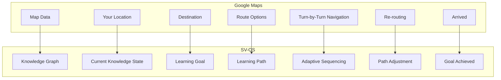

# SV-OS Knowledge Navigation System

> **Design**: Complete Google Maps-style navigation model for Computer Science knowledge space  
> **Date**: July 22, 2026 | **Status**: Design Complete  
> **Cross-reference**: [LEARNING_ENGINE.md](./LEARNING_ENGINE.md), [LEARNING_PHILOSOPHY.md](./LEARNING_PHILOSOPHY.md), [JOURNEY_DESIGN.md](./JOURNEY_DESIGN.md), [GRAPH_RELATIONSHIPS.md](./GRAPH_RELATIONSHIPS.md)

---

## Navigation Metaphor

SV-OS treats Computer Science exactly like Google Maps treats a city. The knowledge graph is the map. The learner is the traveler. The Learning Engine is the navigation system.



---

## Navigation Primitives

### Current Location (Knowledge State)

The learner's position in knowledge space is defined by their mastery vector — a multi-dimensional representation of what they know:

```python
@dataclass
class KnowledgeLocation:
    """Where the learner is in knowledge space."""

    # Current active node (what they're studying right now)
    current_node_id: UUID | None

    # Mastery heatmap — every node they've interacted with
    mastery_map: dict[UUID, float]  # node_id -> mastery score 0.0-1.0

    # Active journey context
    active_journey_id: UUID | None
    journey_progress: float  # 0.0 - 1.0

    # Recent history (last 30 days)
    recent_nodes: list[NodeVisit]
    recent_projects: list[ProjectProgress]
    recent_simulations: list[SimulationSession]

    # Derived metrics
    knowledge_coverage: float  # % of graph explored
    active_streak_days: int
    current_velocity: float    # nodes mastered per week

    # Weak spots
    nodes_due_for_review: list[UUID]
    struggling_nodes: list[UUID]

    # Geographical metaphor
    neighborhood: str     # "primitives", "data-structures", "web-dev", etc.
    territory: str        # "foundations", "intermediate", "advanced", "expert"
```

### Destination (Learning Goal)

```python
@dataclass
class NavigationDestination:
    """Where the learner wants to go."""

    type: str  # "career", "skill", "project", "concept", "exploration"
    target_id: UUID
    title: str

    # Optional constraints
    max_time_hours: int | None       # "I have 100 hours"
    available_hours_per_week: int | None  # "I can study 10 hours/week"
    start_date: datetime | None
    deadline: datetime | None        # "I need to learn this by December"
    budget: str | None               # "free only", "willing to pay"

    # Learner preferences
    preferred_formats: list[str]     # "video", "reading", "hands-on"
    depth: str                       # "overview", "working-knowledge", "deep-dive"
```

---

## Route Generation Strategies

SV-OS generates multiple routes for every destination, just like Google Maps:

### 1. Shortest Path

**Goal**: Minimum number of prerequisite nodes.

```
Route: Python Basics → Functions → OOP → Data Structures → Algorithms
Nodes: 12
Time: 40 hours
Best for: Time-constrained learners who already have programming exposure
```

```python
async def shortest_path(
    start: KnowledgeLocation,
    destination: NavigationDestination
) -> LearningRoute:
    """
    BFS through the knowledge graph to find the path with
    the fewest intermediate nodes.
    """
    # BFS from start to destination following PREREQUISITE_OF edges
    ...
```

### 2. Fastest Path

**Goal**: Minimum total estimated learning time.

```
Route: Python (skip basics, start with functions) → Data Structures (focus on array-based) → Sorting → Searching
Nodes: 8 (skip 4 foundational nodes)
Time: 25 hours
Best for: Experienced learners who can skip fundamentals
```

```python
async def fastest_path(
    start: KnowledgeLocation,
    destination: NavigationDestination
) -> LearningRoute:
    """
    Dijkstra's algorithm where edge weight = estimated_minutes of target node.
    Skips nodes the learner already has mastery > 0.5 on.
    Skips optional nodes that add time without contributing to goal.
    """
    ...
```

### 3. Foundation-First Path

**Goal**: Build deep understanding from the ground up.

```
Route: Computer Science Basics → Programming Fundamentals → Data Structures → Algorithms → Advanced Topics
Nodes: 24
Time: 80 hours
Best for: Complete beginners, academic learners
```

```python
async def foundation_path(
    start: KnowledgeLocation,
    destination: NavigationDestination
) -> LearningRoute:
    """
    Topological sort by prerequisite depth.
    Every prerequisite chain is fully traversed before moving on.
    Includes optional foundations even if not strictly required.
    """
    ...
```

### 4. Project-First Path

**Goal**: Start with a project, learn concepts as needed.

```
Route: Start "Build a REST API" project → Need HTTP? Learn HTTP → Need Routing? Learn Express → Need Database? Learn SQL → Continue project
Nodes: Discovered on demand
Time: Varies by project
Best for: Hands-on learners, builders
```

```python
async def project_first_path(
    project_id: UUID,
    start: KnowledgeLocation
) -> LearningRoute:
    """
    1. Load the project requirements
    2. For each requirement, check if learner meets it
    3. For unmet requirements, add prerequisite chain
    4. Interleave: minimal explanation → apply to project → deeper if needed
    """
    project = await project_service.get(project_id)
    route = LearningRoute(goal=project.title, strategy="project_first")

    for requirement in project.requirements:
        if not self._is_met(start, requirement):
            # Add just-in-time learning node
            prereq_chain = await self._minimal_prereq_chain(
                requirement.node_id, start
            )
            route.add_milestone(
                title=f"Learn: {requirement.title}",
                nodes=prereq_chain,
                apply_to_project=True
            )

    return route
```

### 5. Interview Path

**Goal**: Prepare for technical interviews.

```
Route: Arrays → Strings → Hash Tables → Linked Lists → Trees → Graphs → DP → System Design
Nodes: 30
Time: 60 hours (intensive)
Best for: Job seekers
```

```python
async def interview_path(
    target_company: str | None,  # "Google", "Meta", "Startup"
    start: KnowledgeLocation
) -> LearningRoute:
    """
    Prioritizes:
    1. Most commonly asked topics for target company
    2. LeetCode-style problem-solving
    3. Time-boxed (X problems per topic)
    4. Mock interview checkpoints
    """
    company_patterns = {
        "Google": ["arrays", "strings", "trees", "graphs", "dp", "system-design"],
        "Meta": ["arrays", "strings", "graphs", "recursion", "system-design"],
        "Startup": ["full-stack", "system-design", "architecture"],
    }
    ...
```

### 6. GATE / Academic Path

**Goal**: Prepare for GATE CS or university exams.

```
Route: Discrete Math → Programming → Data Structures → Algorithms → Theory of Computation → Compiler Design → OS → DBMS → Networks
Nodes: 50
Time: 200 hours
Best for: Students preparing for competitive exams
```

### 7. Research Path

**Goal**: Prepare for research in a specific area.

```
Route: Linear Algebra → Probability → Optimization → ML Fundamentals → Deep Learning → [Specialization]
Nodes: 40
Time: 160 hours
Best for: Graduate students, researchers
```

### 8. Specialized Career Paths

**AI Engineer Path**:

```
Route: Python → Linear Algebra → Calculus → Probability → ML Fundamentals → Deep Learning → NLP/CV → MLOps
Nodes: 35
Time: 150 hours
```

**Full Stack Path**:

```
Route: HTML/CSS → JavaScript → React → Node.js → Databases → DevOps → Deployment
Nodes: 25
Time: 100 hours
```

**Cybersecurity Path**:

```
Route: Networking → Operating Systems → Cryptography → Web Security → Network Security → Pen Testing → Forensics
Nodes: 30
Time: 120 hours
```

**Data Science Path**:

```
Route: Python → Statistics → SQL → Data Wrangling → Visualization → ML → Big Data → Deployment
Nodes: 28
Time: 110 hours
```

**DevOps / SRE Path**:

```
Route: Linux → Scripting → Networking → Containers → CI/CD → Cloud → Monitoring → Infrastructure as Code
Nodes: 25
Time: 100 hours
```

---

## Dynamic Route Adjustment

Routes are not static. They change based on:

### 1. Learner Velocity Adjustments

```python
class DynamicRouter:
    """
    Routes adapt in real-time based on learner performance.
    """

    async def adjust_route(
        self,
        route: LearningRoute,
        context: LearnerContext
    ) -> LearningRoute:
        velocity = self._calculate_velocity(context)

        if velocity > 1.3:
            # Learner is fast — suggest acceleration
            route = await self._offer_acceleration(route, context)

        elif velocity < 0.6:
            # Learner is struggling — offer modification
            route = await self._offer_simplification(route, context)

        return route

    async def _offer_acceleration(
        self,
        route: LearningRoute,
        context: LearnerContext
    ) -> LearningRoute:
        """
        Suggest skipping intermediate nodes where the learner
        has demonstrated proficiency through assessments.
        """
        for milestone in route.milestones:
            for node in milestone.nodes:
                if node.node_type in ["example", "practice"]:
                    # Check if learner already has relevant mastery
                    prereqs = [n for n in route.get_prerequisites(node.node_id)]
                    prereq_mastery = [
                        context.location.mastery_map.get(p.node_id, 0)
                        for p in prereqs
                    ]
                    if all(m > 0.8 for m in prereq_mastery):
                        node.mark_skippable()

        return route

    async def _offer_simplification(
        self,
        route: LearningRoute,
        context: LearnerContext
    ) -> LearningRoute:
        """
        Insert extra support for struggling learners:
        - Add prerequisite refresher nodes
        - Reduce node density per session
        - Add more practice checkpoints
        """
        struggling_nodes = context.location.struggling_nodes

        for node_id in struggling_nodes:
            # Find and insert prerequisite refresher
            prereqs = await graph.get_incoming(node_id, "PREREQUISITE_OF")
            for edge in prereqs:
                if context.location.mastery_map.get(edge.source_id, 0) < 0.4:
                    route.insert_before(
                        node_id,
                        ReviewNode(node_id=edge.source_id)
                    )

        # Add extra checkpoints
        route.add_checkpoints(frequency="high")

        return route
```

### 2. Time-Based Adjustments

| Learner Signal         | Adjustment                                       |
| ---------------------- | ------------------------------------------------ |
| Available 2 hours/day  | Normal pace                                      |
| Available 30 min/day   | Micro-learning — break nodes into smaller chunks |
| Available 6+ hours/day | Intensive — deeper projects, more simulators     |
| Weekend warrior        | Weekly milestones, light daily review            |
| Night owl              | Adjust scheduling, batch difficult content       |

### 3. Interest-Based Branching

When the learner expresses interest in a topic, the route branches:

```
Learner studying: Python Basics
Shows interest in: "How do games use Python?"
Route branches to: Game Development path (applied)
Alternative branch: Data Science path (analytical)
Both paths cover Python fundamentals but in different contexts
```

---

## Navigation UI Components

### 1. Knowledge Map View

```
┌─────────────────────────────────────────────────────────────┐
│  📍 Your Location: Python Functions              [AI Path] │
│  🎯 Destination: Machine Learning Engineer                  │
│  ─────────────────────────────────────────────────────────  │
│                                                             │
│        [Variables] ─── [Functions] ─── [OOP] ── ...        │
│            │                │                               │
│            │                ├── [Scope]                     │
│            │                ├── [Closures] 🟡               │
│            │                └── [Decorators]                │
│            │                                   [ML Path]    │
│        [Data Types] ──── [Data Structures] ── ... ═══════> │
│                                                             │
│  ⏱ ETA: 150 hours (at current pace)                        │
│  📊 Progress: 15% ■■■□□□□□□□□□□□□□□□□□                    │
│  🚦 Traffic: Moderate (confidence: 0.7)                    │
└─────────────────────────────────────────────────────────────┘
```

### 2. Turn-by-Turn View

```
┌─────────────────────────────────────────────────────────────┐
│  Next: JavaScript Promises                                  │
│  ─────────────────────────────────────────────────────────  │
│                                                             │
│  📍 You are here: JavaScript Async                          │
│  👣 Next step: JavaScript Promises (25 min)                │
│  🎯 After that: Async/Await (20 min)                       │
│                                                             │
│  Why this matters:                                         │
│  ┌─────────────────────────────────────────────────────┐   │
│  │ "Promises are used by every modern web application. │   │
│  │  React uses them for API calls. Node.js uses them   │   │
│  │  for file operations. You need them before you      │   │
│  │  can build full-stack applications."                │   │
│  └─────────────────────────────────────────────────────┘   │
│                                                             │
│  Alternate routes available: [2 min faster] [Skip to Async] │
│                                                             │
│  [▶ Continue Learning]  [🔄 Try Simulator]  [📁 Practice] │
└─────────────────────────────────────────────────────────────┘
```

### 3. Route Comparison View

```
┌─────────────────────────────────────────────────────────────┐
│  Compare routes to: Machine Learning Engineer                │
│  ─────────────────────────────────────────────────────────  │
│                                                             │
│  Route      │ Duration │ Difficulty │ Depth    │ Best For  │
│  ───────────┼──────────┼────────────┼──────────┼───────────│
│  🏁 Fastest │ 120 hrs  │ Advanced   │ Working  │ Career    │
│  📚 Deep    │ 250 hrs  │ Moderate   │ Research │ Academic  │
│  🛤 Balanced│ 180 hrs  │ Moderate   │ Solid    │ Most      │
│  🎮 Project │ 200 hrs  │ Beginner   │ Applied  │ Hands-on  │
│  💼 Custom  │ Variable │ Adaptive   │ Adaptive │ You       │
│                                                             │
│  [Select Fastest]  [Select Deep]  [Select Balanced]         │
└─────────────────────────────────────────────────────────────┘
```

### 4. Neighborhood View

Shows what's nearby in knowledge space:

```
┌─────────────────────────────────────────────────────────────┐
│  Explore: Your Knowledge Neighborhood                        │
│  ─────────────────────────────────────────────────────────  │
│                                                             │
│  🌐 Current Area: Web Development Fundamentals               │
│                                                             │
│  Areas you can reach:                                       │
│  ├── 🟢 Frontend (prerequisites met)                        │
│  ├── 🟡 Backend (needs 2 more concepts)                    │
│  └── 🔴 DevOps (needs 5 more concepts — far away)          │
│                                                             │
│  Nearby concepts you haven't explored:                      │
│  ├── 📘 CSS Grid Layout (10 min) — Quick win!               │
│  ├── 📗 Responsive Design (20 min) — Unlocks mobile dev     │
│  └── 📙 CSS Animations (15 min) — Fun detour               │
└─────────────────────────────────────────────────────────────┘
```

---

## Path Persistence

Routes are persistent but dynamic. The learner can:

| Action          | Result                                        |
| --------------- | --------------------------------------------- |
| Save route      | Route and progress persist across sessions    |
| Switch routes   | Progress on completed nodes preserved         |
| Take a detour   | Branch path, return to main path later        |
| Pause journey   | System keeps state, suggests review on return |
| Abandon journey | Logged for analysis, can restart later        |
| Share route     | Generate shareable link to route              |

```python
class RoutePersistence:
    """
    Routes persist in the database and are updated incrementally.
    """

    async def save_route(self, route: LearningRoute) -> UUID:
        """Persist route with all milestones and progress."""
        ...

    async def load_route(self, route_id: UUID) -> LearningRoute:
        """Load route and merge with current learner state."""
        route = await self._get_from_db(route_id)
        context = await self._get_learner_context(route.user_id)

        # Merge saved progress with current state
        route.sync_with_mastery(context.mastery_map)

        # Adjust for any changes in the graph since route was saved
        route = await self._update_for_graph_changes(route)

        return route
```

---

## Route Ranking

When multiple routes are available, SV-OS ranks them for the learner:

| Factor             | Weight | Description                                |
| ------------------ | ------ | ------------------------------------------ |
| Goal alignment     | 30%    | How directly this leads to the destination |
| Time efficiency    | 20%    | Total estimated hours                      |
| Difficulty match   | 20%    | Matches learner's current level            |
| Depth              | 15%    | Foundation quality                         |
| Learner preference | 10%    | Preferred format, pace                     |
| Popularity         | 5%     | Rated by similar learners                  |

---

_Cross-reference: [LEARNING_ENGINE.md](./LEARNING_ENGINE.md), [JOURNEY_DESIGN.md](./JOURNEY_DESIGN.md), [GRAPH_RELATIONSHIPS.md](./GRAPH_RELATIONSHIPS.md), [RECOMMENDATION_ENGINE.md](./RECOMMENDATION_ENGINE.md)_
