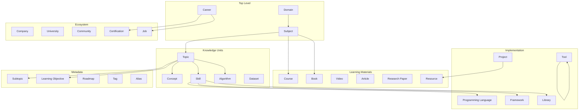
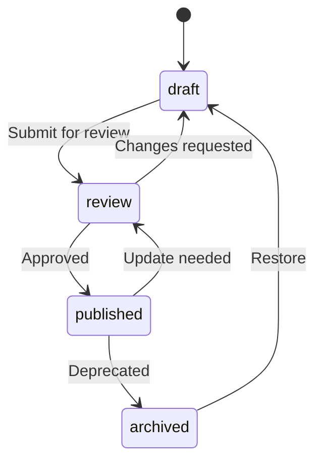

# SV-OS Knowledge Schema

> **Design**: Complete specification for every knowledge entity in the system  
> **Date**: July 22, 2026 | **Status**: Design Complete

---

## Entity Hierarchy



---

## Entity Catalog

### 1. Domain

**Purpose**: The broadest categorization of knowledge areas. Top-level organizers.

| Field         | Type   | Required | Description                                    |
| ------------- | ------ | -------- | ---------------------------------------------- |
| `slug`        | String | ✅       | URL-safe identifier (e.g., "computer-science") |
| `title`       | String | ✅       | Human-readable name (e.g., "Computer Science") |
| `description` | Text   | ✅       | What this domain encompasses                   |
| `icon`        | String | ❌       | Icon identifier for UI                         |
| `color`       | Hex    | ❌       | Brand color for visualization                  |
| `version`     | String | ❌       | Schema version for this domain                 |
| `metadata`    | JSON   | ❌       | Extensible metadata                            |

**Example**:

```json
{
  "slug": "computer-science",
  "title": "Computer Science",
  "description": "The study of computation, algorithms, and information processing",
  "icon": "computer",
  "color": "#7c3aed"
}
```

---

### 2. Subject

**Purpose**: Major branches within a domain. Direct children of domains.

| Field               | Type    | Required | Description                              |
| ------------------- | ------- | -------- | ---------------------------------------- |
| `slug`              | String  | ✅       | URL-safe identifier                      |
| `domain_slug`       | String  | ✅       | Parent domain reference                  |
| `title`             | String  | ✅       | Subject name                             |
| `description`       | Text    | ✅       | Subject overview                         |
| `difficulty`        | Enum    | ✅       | beginner, intermediate, advanced, expert |
| `estimated_minutes` | Integer | ✅       | Total estimated time                     |
| `icon`              | String  | ❌       | Icon identifier                          |
| `color`             | Hex     | ❌       | Color for UI                             |
| `node_type`         | String  | ✅       | Always "subject"                         |

**Examples**: Data Structures, Algorithms, Operating Systems, Networking, Databases, Machine Learning

---

### 3. Topic

**Purpose**: Specific teachable unit within a subject.

| Field                 | Type     | Required | Description                        |
| --------------------- | -------- | -------- | ---------------------------------- |
| `slug`                | String   | ✅       | URL-safe identifier                |
| `subject_slug`        | String   | ✅       | Parent subject                     |
| `title`               | String   | ✅       | Topic title                        |
| `description`         | Text     | ✅       | What this topic covers             |
| `content`             | Markdown | ❌       | Full learning content              |
| `learning_objectives` | String[] | ❌       | What learner will achieve          |
| `difficulty`          | Enum     | ✅       | Learning difficulty                |
| `estimated_minutes`   | Integer  | ✅       | Time to complete                   |
| `keywords`            | String[] | ❌       | Search keywords                    |
| `prerequisites`       | Slug[]   | ❌       | Required prior topics              |
| `status`              | Enum     | ✅       | draft, review, published, archived |
| `popularity`          | Float    | ❌       | 0.0 to 1.0 popularity score        |
| `importance`          | Float    | ❌       | 0.0 to 1.0 importance score        |

**Examples**: "Big O Notation", "Recursion", "Polymorphism", "HTTP Protocol"

---

### 4. Subtopic

**Purpose**: Finer granularity within a topic. Used for detailed curriculum design.

| Field               | Type    | Required | Description                |
| ------------------- | ------- | -------- | -------------------------- |
| `slug`              | String  | ✅       | URL-safe identifier        |
| `topic_slug`        | String  | ✅       | Parent topic               |
| `title`             | String  | ✅       | Subtopic name              |
| `description`       | Text    | ✅       | What this subtopic covers  |
| `difficulty`        | Enum    | ✅       | Learning difficulty        |
| `estimated_minutes` | Integer | ✅       | Time to complete           |
| `order`             | Integer | ✅       | Display order within topic |

---

### 5. Skill

**Purpose**: Discrete, measurable ability. Mapped to topics and technologies.

| Field                | Type     | Required | Description                                     |
| -------------------- | -------- | -------- | ----------------------------------------------- |
| `slug`               | String   | ✅       | URL-safe identifier                             |
| `title`              | String   | ✅       | Skill name                                      |
| `description`        | Text     | ✅       | What this skill entails                         |
| `category`           | Enum     | ✅       | programming, design, devops, soft-skill, domain |
| `proficiency_levels` | Text     | ❌       | Description of beginner/intermediate/expert     |
| `demand_level`       | Enum     | ❌       | market demand: low, medium, high, very-high     |
| `related_skills`     | Slug[]   | ❌       | Complementary skills                            |
| `keywords`           | String[] | ❌       | Alternative names                               |

**Examples**: "REST API Design", "SQL Querying", "React Component Architecture", "Docker Containerization"

---

### 6. Concept

**Purpose**: Abstract idea or fundamental principle. Cross-cuts topics.

| Field                   | Type   | Required | Description                          |
| ----------------------- | ------ | -------- | ------------------------------------ |
| `slug`                  | String | ✅       | URL-safe identifier                  |
| `title`                 | String | ✅       | Concept name                         |
| `definition`            | Text   | ✅       | Precise definition                   |
| `analogy`               | Text   | ❌       | Real-world analogy for understanding |
| `visual_aid`            | URL    | ❌       | Diagram or illustration URL          |
| `common_misconceptions` | Text[] | ❌       | Frequent misunderstandings           |
| `checkpoints`           | Text[] | ❌       | Self-assessment questions            |

**Examples**: "Abstraction", "Encapsulation", "Time Complexity", "Functional Purity"

---

### 7. Algorithm

**Purpose**: Specific computational procedure with well-defined steps.

| Field              | Type           | Required | Description                        |
| ------------------ | -------------- | -------- | ---------------------------------- |
| `slug`             | String         | ✅       | URL-safe identifier                |
| `title`            | String         | ✅       | Algorithm name                     |
| `description`      | Text           | ✅       | What it does                       |
| `time_complexity`  | String         | ✅       | Big O notation for time            |
| `space_complexity` | String         | ✅       | Big O notation for space           |
| `use_cases`        | Text[]         | ✅       | When to use this algorithm         |
| `pseudocode`       | Code           | ❌       | Implementation-agnostic pseudocode |
| `implementations`  | Map<Lang,Code> | ❌       | Code examples by language          |
| `best_case`        | String         | ❌       | Best-case complexity               |
| `worst_case`       | String         | ❌       | Worst-case complexity              |
| `average_case`     | String         | ❌       | Average-case complexity            |
| `stability`        | Boolean        | ❌       | For sorting algorithms             |

**Examples**: "Binary Search", "QuickSort", "Dijkstra's Algorithm", "BFS/DFS"

---

### 8. Dataset

**Purpose**: Reference datasets used for learning or practice.

| Field            | Type   | Required | Description                     |
| ---------------- | ------ | -------- | ------------------------------- |
| `slug`           | String | ✅       | URL-safe identifier             |
| `title`          | String | ✅       | Dataset name                    |
| `description`    | Text   | ✅       | Contents and purpose            |
| `source_url`     | URL    | ✅       | Where to obtain                 |
| `size`           | String | ❌       | e.g., "10GB", "50K rows"        |
| `format`         | String | ❌       | CSV, JSON, Parquet, etc.        |
| `license`        | String | ❌       | Usage license                   |
| `related_topics` | Slug[] | ❌       | Topics this dataset is used for |

---

### 9–14. Learning Resources

**Shared schema** for all resource types:

| Field              | Type     | Required | Description              |
| ------------------ | -------- | -------- | ------------------------ |
| `slug`             | String   | ✅       | URL-safe identifier      |
| `title`            | String   | ✅       | Resource title           |
| `url`              | URL      | ✅       | Link to resource         |
| `description`      | Text     | ✅       | Summary                  |
| `language`         | String   | ❌       | ISO code (default: "en") |
| `difficulty`       | Enum     | ✅       | Target difficulty        |
| `duration_minutes` | Integer  | ❌       | Length in minutes        |
| `is_free`          | Boolean  | ✅       | Free or paid             |
| `rating`           | Float    | ❌       | 0.0 to 5.0 rating        |
| `tags`             | String[] | ❌       | Content tags             |
| `metadata`         | JSON     | ❌       | Type-specific metadata   |

#### 9. Book

| Field           | Specific | Description      |
| --------------- | -------- | ---------------- |
| `resource_type` | "book"   | Constant         |
| `author`        | String   | Author name(s)   |
| `isbn`          | String   | ISBN identifier  |
| `publisher`     | String   | Publisher name   |
| `year`          | Integer  | Publication year |
| `pages`         | Integer  | Page count       |
| `chapters`      | String[] | Chapter titles   |

**Example**:

```json
{
  "slug": "clean-code",
  "title": "Clean Code",
  "author": "Robert C. Martin",
  "isbn": "978-0132350884",
  "publisher": "Prentice Hall",
  "year": 2008,
  "pages": 464,
  "difficulty": "intermediate",
  "is_free": false
}
```

#### 10. Course

| Field             | Specific | Description                |
| ----------------- | -------- | -------------------------- |
| `resource_type`   | "course" | Constant                   |
| `platform`        | String   | Coursera, Udemy, edX, etc. |
| `instructor`      | String   | Instructor name            |
| `syllabus`        | String[] | Module titles              |
| `has_certificate` | Boolean  | Offers completion cert     |
| `weeks`           | Integer  | Course duration in weeks   |

#### 11. Video

| Field            | Specific | Description          |
| ---------------- | -------- | -------------------- |
| `resource_type`  | "video"  | Constant             |
| `platform`       | String   | YouTube, Vimeo, etc. |
| `channel`        | String   | Creator/channel name |
| `video_id`       | String   | Platform video ID    |
| `has_transcript` | Boolean  | Transcript available |
| `resolution`     | String   | e.g., "1080p"        |

#### 12. Article

| Field               | Specific  | Description             |
| ------------------- | --------- | ----------------------- |
| `resource_type`     | "article" | Constant                |
| `publication`       | String    | Blog, magazine, journal |
| `author`            | String    | Author name             |
| `published_date`    | Date      | Publication date        |
| `reading_time`      | Integer   | Estimated minutes       |
| `has_code_examples` | Boolean   | Includes code           |

#### 13. Research Paper

| Field           | Specific | Description               |
| --------------- | -------- | ------------------------- |
| `resource_type` | "paper"  | Constant                  |
| `authors`       | String[] | All authors               |
| `conference`    | String   | Venue name                |
| `year`          | Integer  | Publication year          |
| `doi`           | String   | Digital Object Identifier |
| `citations`     | Integer  | Citation count            |
| `abstract`      | Text     | Paper abstract            |
| `arxiv_id`      | String   | arXiv identifier          |

#### 14. Documentation

| Field           | Specific        | Description          |
| --------------- | --------------- | -------------------- |
| `resource_type` | "documentation" | Constant             |
| `project`       | String          | Documented project   |
| `version`       | String          | API/library version  |
| `section`       | String          | Specific section URL |

---

### 15. Project

**Purpose**: Hands-on application of knowledge.

| Field                 | Type          | Required | Description              |
| --------------------- | ------------- | -------- | ------------------------ |
| `slug`                | String        | ✅       | URL-safe identifier      |
| `title`               | String        | ✅       | Project name             |
| `description`         | Text          | ✅       | What the project entails |
| `difficulty`          | Enum          | ✅       | Project difficulty       |
| `estimated_hours`     | Integer       | ✅       | Time to complete         |
| `tech_stack`          | String[]      | ✅       | Technologies used        |
| `learning_objectives` | String[]      | ✅       | What you'll learn        |
| `deliverables`        | String[]      | ❌       | What you'll build        |
| `starter_code_url`    | URL           | ❌       | GitHub repo link         |
| `requirements`        | Requirement[] | ✅       | Required skills/nodes    |
| `milestones`          | Milestone[]   | ❌       | Project milestones       |

---

### 16. Roadmap

**Purpose**: Structured learning path toward a goal.

| Field                   | Type        | Required | Description                   |
| ----------------------- | ----------- | -------- | ----------------------------- |
| `slug`                  | String      | ✅       | URL-safe identifier           |
| `title`                 | String      | ✅       | Roadmap name                  |
| `goal`                  | String      | ✅       | What this roadmap achieves    |
| `target_audience`       | String      | ❌       | Who this is for               |
| `estimated_total_hours` | Integer     | ✅       | Total time estimate           |
| `milestones`            | Milestone[] | ✅       | Ordered learning milestones   |
| `alternative_paths`     | Path[]      | ❌       | Alternative routes            |
| `source`                | String      | ❌       | e.g., "community", "official" |

---

### 17–21. Ecosystem Entities

#### 17. Tool

| Field      | Type    | Description                                |
| ---------- | ------- | ------------------------------------------ |
| `slug`     | String  | ✅ e.g., "vscode", "git"                   |
| `title`    | String  | "Visual Studio Code"                       |
| `category` | Enum    | editor, testing, monitoring, ci-cd, design |
| `platform` | String  | Cross-platform, macOS, web                 |
| `is_free`  | Boolean | Free or paid                               |
| `website`  | URL     | Official site                              |

#### 18. Programming Language

| Field            | Type    | Description                              |
| ---------------- | ------- | ---------------------------------------- |
| `slug`           | String  | "python", "javascript"                   |
| `paradigm`       | Enum[]  | oop, functional, procedural, declarative |
| `typed`          | Enum    | static, dynamic, gradual                 |
| `first_appeared` | Integer | Year introduced                          |
| `creator`        | String  | Original creator                         |
| `latest_version` | String  | Current stable version                   |

#### 19. Framework

| Field               | Type   | Description                    |
| ------------------- | ------ | ------------------------------ |
| `slug`              | String | "react", "django", "spring"    |
| `language`          | String | Primary language               |
| `type`              | Enum   | web, mobile, testing, data, ml |
| `latest_version`    | String | Current version                |
| `repository`        | URL    | GitHub URL                     |
| `documentation_url` | URL    | Official docs                  |

#### 20. Library

| Field              | Type    | Description                 |
| ------------------ | ------- | --------------------------- |
| `slug`             | String  | "lodash", "axios", "pandas" |
| `language`         | String  | Primary language            |
| `package_manager`  | String  | npm, pip, cargo, gem        |
| `package_name`     | String  | Registry package name       |
| `weekly_downloads` | Integer | Popularity metric           |
| `dependencies`     | Slug[]  | Dependent libraries         |

#### 21. Company

| Field          | Type     | Description           |
| -------------- | -------- | --------------------- |
| `slug`         | String   | "google", "microsoft" |
| `industry`     | String   | Technology sector     |
| `known_for`    | String[] | Products/technologies |
| `headquarters` | String   | Location              |
| `careers_page` | URL      | Jobs URL              |

---

### 22–24. Career & Employment

#### 22. Career

| Field                 | Type   | Required | Description                             |
| --------------------- | ------ | -------- | --------------------------------------- |
| `slug`                | String | ✅       | e.g., "frontend-developer"              |
| `title`               | String | ✅       | "Frontend Developer"                    |
| `description`         | Text   | ✅       | Role description                        |
| `demand_level`        | Enum   | ✅       | declining, stable, growing, high_demand |
| `average_salary`      | String | ❌       | "120,000-160,000 USD"                   |
| `required_experience` | String | ❌       | "2-5 years"                             |
| `satisfaction_rating` | Float  | ❌       | 0.0 to 5.0                              |
| `growth_outlook`      | String | ❌       | "Faster than average"                   |

#### 23. Job

| Field              | Type   | Description          |
| ------------------ | ------ | -------------------- |
| `slug`             | String | Specific job posting |
| `career_slug`      | String | Parent career        |
| `company_slug`     | String | Hiring company       |
| `title`            | String | Job title            |
| `location`         | String | Remote, city, etc.   |
| `salary_range`     | String | Compensation range   |
| `required_skills`  | Slug[] | Required skills      |
| `preferred_skills` | Slug[] | Nice-to-have skills  |
| `posted_date`      | Date   | When listed          |

#### 24. Certification

| Field             | Type     | Description                         |
| ----------------- | -------- | ----------------------------------- |
| `slug`            | String   | "aws-saa-c03"                       |
| `title`           | String   | "AWS Solutions Architect Associate" |
| `provider`        | String   | AWS, Google, Microsoft, CompTIA     |
| `difficulty`      | Enum     | Certification difficulty            |
| `cost`            | String   | Exam cost                           |
| `validity_period` | String   | e.g., "3 years"                     |
| `required_exams`  | String[] | Exams needed                        |

---

### 25. University

| Field              | Type     | Description           |
| ------------------ | -------- | --------------------- |
| `slug`             | String   | "stanford", "mit"     |
| `name`             | String   | Full institution name |
| `location`         | String   | City, country         |
| `website`          | URL      | Official site         |
| `known_programs`   | String[] | Renowned CS programs  |
| `online_offerings` | Boolean  | Has online courses    |

---

### 26. Community

| Field          | Type    | Description                  |
| -------------- | ------- | ---------------------------- |
| `slug`         | String  | "r-reactjs", "stackoverflow" |
| `name`         | String  | Display name                 |
| `type`         | Enum    | forum, chat, social, meetup  |
| `url`          | URL     | Community link               |
| `language`     | String  | Primary language             |
| `member_count` | Integer | Approximate size             |

---

### 27. Learning Objective

**Purpose**: Specific, measurable outcome for a topic or resource.

| Field                   | Type   | Description                                            |
| ----------------------- | ------ | ------------------------------------------------------ |
| `id`                    | UUID   | Unique identifier                                      |
| `topic_slug`            | String | Parent topic                                           |
| `description`           | Text   | e.g., "Implement a binary search tree from scratch"    |
| `bloom_level`           | Enum   | remember, understand, apply, analyze, evaluate, create |
| `assessment_type`       | Enum   | quiz, code-exercise, project, discussion               |
| `verification_criteria` | Text   | How to verify achievement                              |

---

### 28. Tag

**Purpose**: Free-form categorization and filtering.

| Field      | Type   | Description       |
| ---------- | ------ | ----------------- |
| `slug`     | String | URL-safe tag name |
| `name`     | String | Display name      |
| `category` | String | Optional group    |
| `color`    | Hex    | UI color          |

---

### 29. Alias

**Purpose**: Alternative names for entities (search optimization).

| Field         | Type   | Description       |
| ------------- | ------ | ----------------- |
| `entity_type` | String | Entity type       |
| `entity_slug` | String | Target entity     |
| `alias`       | String | Alternative name  |
| `language`    | String | ISO code for i18n |

**Example**: Entity "javascript" could have aliases: "JS", "ECMAScript", "Java Script"

---

### 30. Learning Objective

| Bloom Level  | Description           | Example Verb           |
| ------------ | --------------------- | ---------------------- |
| `remember`   | Recall facts          | "List", "Define"       |
| `understand` | Explain concepts      | "Describe", "Explain"  |
| `apply`      | Use in new situations | "Implement", "Build"   |
| `analyze`    | Break down structure  | "Compare", "Contrast"  |
| `evaluate`   | Justify decisions     | "Critique", "Evaluate" |
| `create`     | Produce new work      | "Design", "Develop"    |

---

## Metadata Model

All entities share common metadata fields through a `metadata` JSON field:

```json
{
  "metadata": {
    "created_by": "system",
    "created_at": "2026-07-22T12:00:00Z",
    "updated_at": "2026-07-22T12:00:00Z",
    "version": 1,
    "source": "wikipedia-import",
    "quality_score": 0.85,
    "review_status": "auto-approved",
    "tags": ["beginner-friendly", "core-concept"],
    "external_ids": {
      "wikipedia": "Big_O_notation",
      "wikidata": "Q324523"
    }
  }
}
```

---

## Entity Status Lifecycle



---

## Difficulty Levels

| Level        | Value          | Time Range  | Description               |
| ------------ | -------------- | ----------- | ------------------------- |
| Beginner     | `beginner`     | 15-30 min   | No prior knowledge needed |
| Intermediate | `intermediate` | 30-90 min   | Basic familiarity assumed |
| Advanced     | `advanced`     | 90-180 min  | Solid foundation required |
| Expert       | `expert`       | 180-360 min | Deep specialization       |

---

## Popularity & Importance Scoring

### Popularity (0.0 – 1.0)

| Factor           | Weight | Source               |
| ---------------- | ------ | -------------------- |
| View count       | 40%    | `view_count` on node |
| Search frequency | 30%    | Search history       |
| Bookmark count   | 15%    | Bookmarks            |
| Resource count   | 15%    | Linked resources     |

### Importance (0.0 – 1.0)

| Factor             | Weight | Source                    |
| ------------------ | ------ | ------------------------- |
| Prerequisite count | 35%    | Nodes that depend on this |
| Career relevance   | 30%    | Career requirement count  |
| Depth in hierarchy | 20%    | Number of dependents      |
| Expert rating      | 15%    | Community review rating   |

---

_Cross-reference: [GRAPH_RELATIONSHIPS.md](./GRAPH_RELATIONSHIPS.md), [KNOWLEDGE_IMPORT_SPEC.md](./KNOWLEDGE_IMPORT_SPEC.md)_
