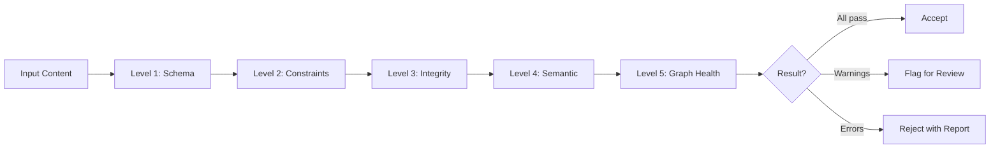

# SV-OS Knowledge Validation

> **Design**: Complete validation rules for knowledge content, graph integrity, and automated quality checks  
> **Date**: July 22, 2026 | **Status**: Design Complete

---

## Validation Philosophy

1. **Validate early, validate often** — Catch errors at import time, not at query time
2. **Blocking vs. warnings** — Some errors prevent import; others flag for human review
3. **Self-healing where possible** — Auto-fix trivial issues (whitespace, formatting)
4. **Auditable** — Every validation decision is logged with rationale



---

## Validation Levels

### Level 1: Schema Validation

**Checks format compliance**. Runs before any data transformation.

| Rule                    | Check                                | Severity | Example                                |
| ----------------------- | ------------------------------------ | -------- | -------------------------------------- |
| Required fields present | slug, title, description, node_type  | Blocking | Missing `slug` → reject                |
| Field type correctness  | string, integer, boolean             | Blocking | `estimated_minutes: "thirty"` → reject |
| Field value format      | slug pattern, URL pattern, color hex | Blocking | `slug: "My Topic!"` → reject           |
| Version compatibility   | format version matches supported     | Blocking | Unknown format version → reject        |
| Enum value validity     | node_type, difficulty, status        | Blocking | `difficulty: "easy"` → reject          |

**Slug Validation Rules**:

```python
SLUG_PATTERN = r'^[a-z0-9]+(?:-[a-z0-9]+)*$'
SLUG_MIN_LENGTH = 3
SLUG_MAX_LENGTH = 200

def validate_slug(slug: str) -> list[str]:
    errors = []
    if not slug:
        errors.append("Slug is required")
    if len(slug) < SLUG_MIN_LENGTH:
        errors.append(f"Slug too short ({len(slug)} < {SLUG_MIN_LENGTH})")
    if len(slug) > SLUG_MAX_LENGTH:
        errors.append(f"Slug too long ({len(slug)} > {SLUG_MAX_LENGTH})")
    if not re.match(SLUG_PATTERN, slug):
        errors.append(f"Slug format invalid: '{slug}'. Use lowercase, hyphens, no spaces")
    return errors
```

---

### Level 2: Constraint Validation

**Checks business rules and data integrity**.

| Rule                    | Scope         | Severity | Check                            |
| ----------------------- | ------------- | -------- | -------------------------------- |
| Slug uniqueness         | Within import | Blocking | No duplicate slugs in same batch |
| No self-loops           | Edges         | Blocking | source_id != target_id           |
| Edge type validity      | Edges         | Blocking | Must be valid enum value         |
| Edge weight range       | Edges         | Warning  | 0.0 <= weight <= 1.0             |
| Description length      | Nodes         | Warning  | >= 10 characters                 |
| Estimated minutes range | Nodes         | Warning  | 1 <= estimated_minutes <= 9999   |
| URL format validity     | Resources     | Warning  | Must match URL pattern           |
| Resource type validity  | Resources     | Blocking | Must be valid enum               |
| Language format         | Any           | Warning  | ISO 639-1 code (2 chars)         |

```python
async def validate_constraints(data: ImportData) -> ValidationReport:
    report = ValidationReport()

    # Check slug uniqueness within import
    slugs = [n.slug for n in data.nodes]
    duplicates = [s for s in slugs if slugs.count(s) > 1]
    for slug in set(duplicates):
        report.add_error(f"Duplicate slug in import: '{slug}'")

    # Check edge self-loops
    for edge in data.edges:
        if edge.source_slug == edge.target_slug:
            report.add_error(f"Self-loop edge: {edge.source_slug} → {edge.target_slug}")

    # Check estimated minutes
    for node in data.nodes:
        if node.estimated_minutes and node.estimated_minutes < 1:
            report.add_warning(f"Node '{node.slug}' has estimated_minutes < 1")

    return report
```

---

### Level 3: Integrity Validation

**Checks references and consistency against existing graph data**.

| Rule                   | Check                                          | Severity                 |
| ---------------------- | ---------------------------------------------- | ------------------------ |
| Edge source exists     | source_slug resolves to existing node          | Blocking (skip edge)     |
| Edge target exists     | target_slug resolves to existing node          | Blocking (skip edge)     |
| Prerequisite existence | All prerequisites exist in graph or import     | Warning (create missing) |
| Type consistency       | Edge type appropriate for node types           | Warning                  |
| Status transitions     | Valid status flow (draft → review → published) | Warning                  |

```python
async def validate_integrity(data: ImportData, graph: GraphEngine) -> ValidationReport:
    report = ValidationReport()
    existing_nodes = await graph.all_nodes()
    existing_slugs = {n['slug'] for n in existing_nodes}
    import_slugs = {n.slug for n in data.nodes}
    all_slugs = existing_slugs | import_slugs

    # Check edge references
    for edge in data.edges:
        if edge.source_slug not in all_slugs:
            report.add_warning(f"Edge source '{edge.source_slug}' not found (will be created)")
        if edge.target_slug not in all_slugs:
            report.add_warning(f"Edge target '{edge.target_slug}' not found (will be created)")

    # Check prerequisite references
    for node in data.nodes:
        for prereq_slug in (node.prerequisites or []):
            if prereq_slug not in all_slugs:
                report.add_error(f"Prerequisite '{prereq_slug}' for '{node.slug}' does not exist")

    return report
```

---

### Level 4: Semantic Validation

**Checks content quality and meaningfulness**.

| Rule                  | Check                               | Severity | Threshold                        |
| --------------------- | ----------------------------------- | -------- | -------------------------------- |
| Description quality   | Minimum meaningful content          | Warning  | > 20 chars with substance        |
| Title capitalization  | Proper casing                       | Warning  | Not all caps or all lower        |
| Keyword relevance     | Keywords match content              | Warning  | At least 1 keyword in title/desc |
| Content-to-type match | Content matches node_type           | Warning  | See mapping below                |
| Resource description  | Resource has meaningful description | Warning  | > 10 chars                       |

```python
MIN_DESCRIPTION_LENGTH = 20
MIN_TITLE_LENGTH = 3

def validate_semantic(node: NodeImport) -> list[str]:
    warnings = []

    # Description quality
    if len(node.description) < MIN_DESCRIPTION_LENGTH:
        warnings.append(f"Description too short ({len(node.description)} chars)")

    if len(node.description.split()) < 3:
        warnings.append("Description should be at least 3 words")

    # Title quality
    if node.title.isupper() and len(node.title) > 5:
        warnings.append("Title is all uppercase — use title case")

    if node.title.islower():
        warnings.append("Title is all lowercase — use title case")

    # Content-type match
    type_keywords = {
        'concept': ['what is', 'definition', 'concept', 'fundamental'],
        'technology': ['language', 'framework', 'library', 'platform'],
        'tool': ['editor', 'cli', 'debugger', 'manager'],
        'career': ['developer', 'engineer', 'architect', 'manager'],
        'project': ['build', 'create', 'implement', 'develop'],
    }
    type_words = type_keywords.get(node.node_type, [])
    if type_words and not any(w in node.description.lower() for w in type_words):
        warnings.append(f"Description may not match node_type '{node.node_type}'")

    return warnings
```

---

### Level 5: Graph Health Validation

**Checks overall graph structure and integrity**.

| Rule                    | Check                                     | Severity |
| ----------------------- | ----------------------------------------- | -------- |
| Circular dependencies   | No cyclic prerequisite chains             | Blocking |
| Orphan nodes            | Nodes with no incoming/outgoing edges     | Warning  |
| Disconnected components | Graph should be mostly connected          | Warning  |
| Depth explosion         | Prerequisite chain too deep (> 10 levels) | Warning  |
| Density anomalies       | Too few edges for node count              | Warning  |
| Node type balance       | Reasonable distribution of types          | Info     |

#### Circular Dependency Detection

```python
async def detect_cycles() -> list[list[str]]:
    """Find all circular dependency chains in the graph."""
    cycles = []
    all_nodes = await graph_engine.all_nodes()

    # Build adjacency list for prerequisite edges
    adj = defaultdict(list)
    for node in all_nodes:
        edges = await graph_engine.get_outgoing(node['id'], 'prerequisite')
        for edge in edges:
            adj[edge['source_id']].append(edge['target_id'])

    # DFS cycle detection
    visited = set()
    in_stack = set()

    def dfs(node_id: str, path: list[str]) -> list[str] | None:
        visited.add(node_id)
        in_stack.add(node_id)
        path.append(node_id)

        for neighbor in adj[node_id]:
            if neighbor not in visited:
                result = dfs(neighbor, path)
                if result:
                    return result
            elif neighbor in in_stack:
                # Cycle found
                idx = path.index(neighbor)
                return path[idx:]

        path.pop()
        in_stack.discard(node_id)
        return None

    for node in all_nodes:
        nid = node['id']
        if nid not in visited:
            cycle = dfs(nid, [])
            if cycle:
                cycles.append(cycle)

    return cycles
```

#### Orphan Detection

```python
async def find_orphans() -> list[dict]:
    """Find nodes with no connections to other nodes."""
    orphans = []
    all_nodes = await graph_engine.all_nodes()

    for node in all_nodes:
        outgoing = await graph_engine.get_outgoing(node['id'])
        incoming = await graph_engine.get_incoming(node['id'])

        if not outgoing and not incoming:
            orphans.append(node)

    return orphans
```

---

## Validation Pipeline

### Combined Validation

```python
class ValidationPipeline:
    """Runs all validation levels and produces a comprehensive report."""

    async def validate(self, data: ImportData | None = None) -> ValidationReport:
        report = ValidationReport()

        if data:
            # Level 1: Schema
            report.merge(await self.validate_schema(data))
            if report.has_blocking_errors():
                return report  # Fast-fail on schema errors

            # Level 2: Constraints
            report.merge(await self.validate_constraints(data))

            # Level 3: Integrity (needs graph access)
            report.merge(await self.validate_integrity(data))

            # Level 4: Semantic
            report.merge(await self.validate_semantic(data))

        # Level 5: Graph health (always runs)
        report.merge(await self.validate_graph_health())

        return report
```

### Validation Report Format

```json
{
  "passed": false,
  "summary": {
    "total_checks": 47,
    "passed": 42,
    "warnings": 4,
    "errors": 1,
    "blocking": 1
  },
  "errors": [
    {
      "level": 3,
      "rule": "edge_reference",
      "entity": "edge: javascript → react-hooks",
      "message": "Target 'react-hooks' does not exist in graph or import",
      "severity": "error",
      "action": "skip_edge"
    }
  ],
  "warnings": [
    {
      "level": 4,
      "entity": "node: docker-basics",
      "message": "Description too short (15 chars)",
      "severity": "warning",
      "action": "flag_for_review"
    }
  ],
  "graph_health": {
    "total_nodes": 150,
    "total_edges": 450,
    "cycles": 0,
    "orphans": 3,
    "avg_depth": 4.2,
    "connectivity": 0.89,
    "density": 0.02
  }
}
```

---

## Broken Link Detection

### Resource URL Validation

```python
async def validate_resource_urls() -> list[BrokenLink]:
    """Check all resource URLs are accessible (HTTP HEAD)."""
    broken_links = []
    resources = await resource_service.get_all()

    async with httpx.AsyncClient(timeout=10.0) as client:
        for resource in resources:
            try:
                response = await client.head(resource.url, follow_redirects=True)
                if response.status_code >= 400:
                    broken_links.append(BrokenLink(
                        resource_id=resource.id,
                        url=resource.url,
                        status_code=response.status_code
                    ))
            except Exception as exc:
                broken_links.append(BrokenLink(
                    resource_id=resource.id,
                    url=resource.url,
                    error=str(exc)
                ))

    return broken_links
```

### Scheduled Link Checking

| Frequency | Scope                  | Action                   |
| --------- | ---------------------- | ------------------------ |
| Daily     | High-traffic resources | Auto-flag broken links   |
| Weekly    | All resources          | Report with broken count |
| Monthly   | Full audit             | Update resource status   |

---

## Duplicate Detection

### Algorithm

```python
class DuplicateDetector:
    """Detect and resolve duplicate nodes."""

    SIMILARITY_THRESHOLD = 0.85  # Cosine similarity
    FUZZY_THRESHOLD = 3          # Levenshtein distance

    async def find_duplicates(self, incoming_nodes: list[NodeImport]) -> list[DuplicateGroup]:
        """Find groups of duplicate nodes."""
        duplicates = []
        existing_nodes = await graph_engine.all_nodes()

        for incoming in incoming_nodes:
            matches = []

            # Level 1: Exact slug match
            for existing in existing_nodes:
                if existing['slug'] == incoming.slug:
                    matches.append(DuplicateMatch(existing, 1.0, 'exact_slug'))

            # Level 2: Fuzzy title match
            for existing in existing_nodes:
                distance = levenshtein_distance(
                    incoming.title.lower(),
                    existing['title'].lower()
                )
                if distance <= FUZZY_THRESHOLD:
                    similarity = 1.0 - (distance / max(len(incoming.title), 1))
                    matches.append(DuplicateMatch(existing, similarity, 'fuzzy_title'))

            if matches:
                matches.sort(key=lambda m: m.similarity, reverse=True)
                best_match = matches[0]

                if best_match.similarity >= SIMILARITY_THRESHOLD:
                    duplicates.append(DuplicateGroup(
                        incoming=incoming,
                        existing=best_match.node,
                        similarity=best_match.similarity,
                        strategy=self.determine_strategy(best_match)
                    ))

        return duplicates
```

### Merge Strategies

| Similarity  | Strategy         | Behavior                        |
| ----------- | ---------------- | ------------------------------- |
| 1.0 (exact) | `skip`           | Keep existing entirely          |
| 0.95+       | `merge_metadata` | Merge metadata only             |
| 0.85+       | `merge_content`  | Merge descriptions, keep longer |
| < 0.85      | `flag`           | Flag for human review           |

```python
async def resolve_duplicate(group: DuplicateGroup) -> NodeImport:
    """Apply merge strategy to resolve duplicate."""
    if group.strategy == 'skip':
        return None  # Keep existing

    if group.strategy == 'merge_metadata':
        merged = group.incoming.copy()
        merged.metadata = {**group.existing.metadata, **merged.metadata}
        return merged

    if group.strategy == 'merge_content':
        merged = group.incoming.copy()
        # Keep longer description
        if len(group.existing.description) > len(merged.description):
            merged.description = group.existing.description
        # Merge keywords
        existing_kw = set(group.existing.get('metadata', {}).get('keywords', []))
        incoming_kw = set(merged.metadata.get('keywords', []))
        merged.metadata['keywords'] = list(existing_kw | incoming_kw)
        return merged

    return group.incoming  # Flagged — return as-is for human review
```

---

## Version Validation

### Snapshot Integrity

```python
async def validate_snapshot(snapshot: GraphSnapshot) -> ValidationReport:
    """Validate a graph snapshot for internal consistency."""
    report = ValidationReport()
    node_ids = set()

    # All nodes must have unique IDs
    for node in snapshot.nodes:
        if node.node_id in node_ids:
            report.add_error(f"Duplicate node ID in snapshot: {node.node_id}")
        node_ids.add(node.node_id)

    # All edges must reference existing nodes
    edge_ids = set()
    for edge in snapshot.edges:
        if edge.edge_id in edge_ids:
            report.add_error(f"Duplicate edge ID: {edge.edge_id}")
        edge_ids.add(edge.edge_id)

        if edge.source_node_id not in node_ids:
            report.add_error(f"Edge {edge.edge_id}: source not in snapshot")
        if edge.target_node_id not in node_ids:
            report.add_error(f"Edge {edge.edge_id}: target not in snapshot")

    # Version format
    if not re.match(r'^\d+\.\d+\.\d+$', snapshot.version):
        report.add_warning(f"Version '{snapshot.version}' doesn't follow semver")

    return report
```

---

## Content Quality Metrics

### Automated Quality Scoring

```python
class QualityScorer:
    """Compute a quality score for knowledge content."""

    def score_node(self, node: NodeImport) -> float:
        """Score a node 0.0–1.0 based on content quality."""
        score = 0.0
        checks = 0

        # Description length (max score at 200 chars)
        desc_len = len(node.description)
        score += min(1.0, desc_len / 200)
        checks += 1

        # Has content (vs. just description)
        if node.content and len(node.content) > 500:
            score += 1.0
        elif node.content:
            score += 0.5
        checks += 1

        # Has prerequisites defined
        if node.prerequisites and len(node.prerequisites) > 0:
            score += 1.0
        else:
            score += 0.0
        checks += 1

        # Has keywords
        keywords = node.metadata.get('keywords', [])
        if len(keywords) >= 3:
            score += 1.0
        elif len(keywords) > 0:
            score += 0.5
        checks += 1

        # Has resources
        if hasattr(node, 'resources') and node.resources:
            score += min(1.0, len(node.resources) / 3)
        checks += 1

        return score / checks
```

### Quality Thresholds

| Score   | Label      | Action                        |
| ------- | ---------- | ----------------------------- |
| 0.8+    | Excellent  | Auto-publish                  |
| 0.6–0.8 | Good       | Auto-publish with flag        |
| 0.4–0.6 | Needs Work | Requires human review         |
| 0.2–0.4 | Poor       | Requires significant revision |
| < 0.2   | Incomplete | Reject                        |

---

## Automated Validation Schedule

| Frequency          | Validation                     | Action on Failure     |
| ------------------ | ------------------------------ | --------------------- |
| **On import**      | Schema, constraints, integrity | Block/fail import     |
| **On node create** | Schema, constraints            | Reject with error     |
| **On node update** | Constraint, semantic           | Warning logged        |
| **Daily**          | Broken link check              | Report generated      |
| **Weekly**         | Graph health (cycles, orphans) | Report + notification |
| **Monthly**        | Full audit + duplicate scan    | Report + review queue |

---

_Cross-reference: [KNOWLEDGE_SCHEMA.md](./KNOWLEDGE_SCHEMA.md), [KNOWLEDGE_IMPORT_SPEC.md](./KNOWLEDGE_IMPORT_SPEC.md), [CONTENT_AUTHORING_GUIDE.md](./CONTENT_AUTHORING_GUIDE.md)_
