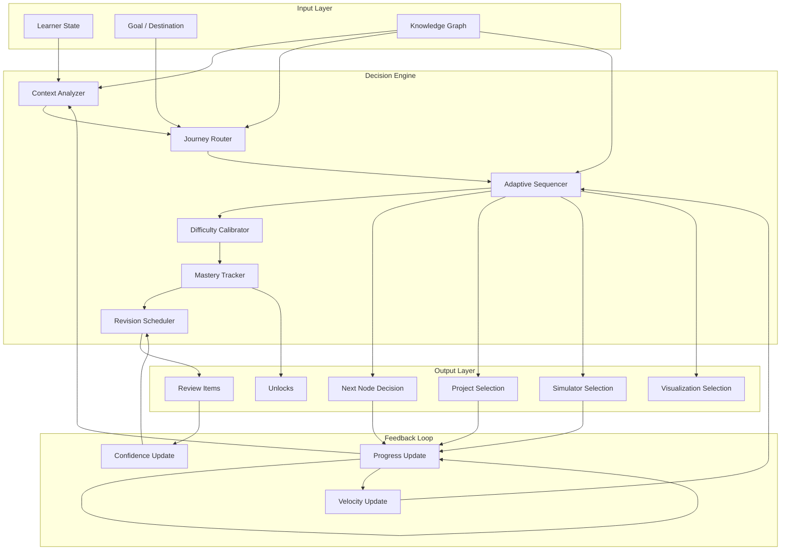

# SV-OS Learning Engine

> **Design**: Complete specification for the Learning Engine — the heart of SV-OS  
> **Date**: July 22, 2026 | **Status**: Design Complete  
> **Cross-reference**: [LEARNING_PHILOSOPHY.md](./LEARNING_PHILOSOPHY.md), [LEARNING_PATH_ENGINE.md](./LEARNING_PATH_ENGINE.md), [RECOMMENDATION_ENGINE.md](./RECOMMENDATION_ENGINE.md), [COGNITIVE_MODEL.md](./COGNITIVE_MODEL.md), [MASTERY_MODEL.md](./MASTERY_MODEL.md)

---

## Executive Summary

The Learning Engine is the decision-making core of SV-OS. It determines:

- **What** to teach next
- **When** to teach it
- **Why** it should appear now
- **How** it should be presented
- **Which** simulator to launch
- **What** project should unlock
- **What** should be revised
- **What** should be skipped

Unlike traditional LMS platforms that sequence courses linearly, the Learning Engine treats Computer Science as a **connected ecosystem** and navigates it like Google Maps — dynamically routing the learner through knowledge space based on their current position, destination, learning velocity, and cognitive state.

---

## Core Philosophy

```
Traditional Learning:
  Subject → Complete Subject → Next Subject → Complete → Done

SV-OS Learning:
  Problem → Required Knowledge → Learn → Apply → Unlock → Next Journey
```

**Tenets:**

1. **Connected, not isolated** — No subject exists in isolation. Every concept connects to every other concept.
2. **Journey, not course** — Learning is a journey through knowledge space, not a checklist of courses.
3. **Adaptive, not fixed** — The path changes based on learner velocity, confidence, and goals.
4. **Applied, not abstract** — Every concept has a project, simulator, or problem that makes it tangible.
5. **Contextual, not generic** — Why you need this knowledge is as important as the knowledge itself.

---

## Architecture Overview



---

## Decision Engine Components

### 1. Context Analyzer

**Purpose**: Build a complete picture of the learner's current state.

```python
@dataclass
class LearnerContext:
    identity: LearnerIdentity
    state: LearnerState
    environment: LearningEnvironment
    goals: list[LearningGoal]
    history: LearningHistory

@dataclass
class LearnerIdentity:
    user_id: UUID
    background: str           # "student", "professional", "career-switcher"
    educational_level: str    # "high-school", "undergrad", "graduate", "self-taught"
    known_languages: list[str]
    learning_style: str       # "visual", "reading", "hands-on", "mixed"
    time_availability: str    # "intensive", "moderate", "casual"
    primary_motivation: str   # "career", "academic", "curiosity", "problem-solving"

@dataclass
class LearnerState:
    current_node_id: UUID | None      # Where they are in knowledge space
    active_path_id: UUID | None        # Current journey
    current_simulation_id: UUID | None # Active simulator session
    current_project_id: UUID | None    # Active project
    session_started_at: datetime
    session_duration_minutes: int
    consecutive_days: int              # Streak counter
    today_completed_count: int

@dataclass
class LearningHistory:
    completed_node_ids: set[UUID]
    mastered_node_ids: set[UUID]
    struggling_node_ids: set[UUID]     # Nodes with low confidence after multiple attempts
    skipped_node_ids: set[UUID]        # Nodes explicitly skipped
    nodes_in_progress: set[UUID]
    projects_completed: list[UUID]
    simulations_completed: list[UUID]
    total_learning_minutes: int
    average_session_minutes: float
    weak_areas: list[UUID]             # Nodes due for review
    revision_history: dict[UUID, list[datetime]]
```

**Output**: A structured context object fed into all downstream decisions.

---

### 2. Journey Router

**Purpose**: Determine the optimal route through knowledge space to reach the learner's goal.

```python
class JourneyRouter:
    """
    Routes the learner through knowledge space like Google Maps.

    The router considers:
    - Where the learner is (current knowledge)
    - Where they want to go (goal)
    - Multiple possible routes (different strategies)
    - Dynamic factors (time available, learning velocity)
    """

    ROUTE_STRATEGIES = {
        "shortest": ShortestPathRouter,
        "fastest": FastestPathRouter,
        "foundation": FoundationFirstRouter,
        "project_first": ProjectFirstRouter,
        "interview": InterviewPrepRouter,
        "comprehensive": ComprehensiveRouter,
        "research": ResearchRouter,
        "career": CareerRouter,
    }

    async def route(
        self,
        context: LearnerContext,
        destination: str,  # Career slug, skill slug, or concept slug
        preferences: RoutePreferences = None
    ) -> JourneyRoute:
        # Step 1: Determine which router strategy to use
        strategy = self._select_strategy(context, destination, preferences)

        # Step 2: Generate primary route
        route = await strategy.generate(context, destination)

        # Step 3: Generate alternate routes
        alternates = await self._generate_alternates(context, destination, route)

        # Step 4: Annotate every node with context
        route = await self._annotate_route(route, context)

        return route
```

#### Route Generation Algorithms

**Shortest Path**: Minimum number of prerequisite nodes to reach destination.

```python
async def shortest_path(
    graph: GraphEngine,
    start_node_id: UUID,
    goal_node_id: UUID
) -> list[UUID]:
    """
    BFS through prerequisite edges to find the shortest chain
    from current knowledge to destination.
    """
    visited = {start_node_id}
    queue = deque([(start_node_id, [])])

    while queue:
        current, path = queue.popleft()
        if current == goal_node_id:
            return path + [current]

        for edge in await graph.get_outgoing(current, "PREREQUISITE_OF"):
            if edge.target_id not in visited:
                visited.add(edge.target_id)
                queue.append((edge.target_id, path + [current]))

    return []  # No route found
```

**Fastest Path**: Minimum total estimated learning time.

```python
async def fastest_path(
    graph: GraphEngine,
    start_node_id: UUID,
    goal_node_id: UUID
) -> list[UUID]:
    """
    Dijkstra's algorithm where edge weight = estimated_minutes of target node.
    """
    # Standard Dijkstra over prerequisite edges
    ...
```

**Foundation-First Path**: Deep prerequisite chains first, then build up.

```
Route: Variables → Data Types → Functions → Control Flow → OOP → Design Patterns
vs. Shortest: Variables → Functions → OOP (skips intermediate depth)
```

**Project-First Path**: Start with a project, discover prerequisites on demand.

```
Route: Build Web App → Discover: Need Database → Learn SQL → Continue Project
```

---

### 3. Adaptive Sequencer

**Purpose**: Dynamically adjust what comes next based on real-time performance.

```python
class AdaptiveSequencer:
    """
    The sequencer decides the NEXT node at any moment.
    It adapts based on:
    - Learning velocity (how fast the learner progresses)
    - Confidence scores (how well they retain)
    - Time available (session length)
    - Current cognitive state (fatigue, flow)
    - Streak state (continuing momentum vs. cold start)
    """

    async def next(self, context: LearnerContext) -> LearningAction:
        """
        Determine the single best next action for the learner.
        Returns one of: LearnNode, ReviewNode, StartProject, LaunchSimulator, TakeBreak
        """

        # Priority 1: Urgent review needed?
        urgent = await self._urgent_review_needed(context)
        if urgent:
            return LearningAction(
                type="review",
                node_id=urgent.node_id,
                reason=f"Confidence dropping on {urgent.title} — needs review"
            )

        # Priority 2: In the middle of something?
        if context.state.current_simulation_id:
            return LearningAction(
                type="continue_simulation",
                simulation_id=context.state.current_simulation_id
            )

        # Priority 3: Continue current path
        if context.state.active_path_id:
            return await self._continue_path(context)

        # Priority 4: New journey needed
        return await self._start_new_journey(context)
```

#### Velocity-Based Adjustment

```python
class VelocityTracker:
    """
    Tracks how quickly the learner is progressing and adjusts accordingly.
    """

    async def adjust_path(
        self,
        path: JourneyRoute,
        context: LearnerContext
    ) -> JourneyRoute:
        velocity = self._calculate_velocity(context)

        if velocity >= 1.5:  # Accelerating (>50% faster than estimated)
            # Suggest skipping intermediate nodes
            return await self._accelerate_path(path, context)

        elif velocity <= 0.5:  # Struggling (<50% of estimated pace)
            # Insert reinforcement and simpler alternatives
            return await self._slow_path(path, context)

        else:  # Normal pace
            return path

    def _calculate_velocity(self, context: LearnerContext) -> float:
        """
        Velocity = actual completion rate / expected completion rate

        > 1.0 means learner is faster than expected
        < 1.0 means learner is slower than expected
        """
        expected_minutes_completed = sum(
            node.estimated_minutes for node in context.history.completed_node_ids
        )
        actual_minutes_spent = context.history.total_learning_minutes

        if expected_minutes_completed == 0:
            return 1.0

        return expected_minutes_completed / max(actual_minutes_spent, 1)
```

---

### 4. Difficulty Calibrator

**Purpose**: Match content difficulty to the learner's current ability level.

```python
class DifficultyCalibrator:
    """
    Calibrates difficulty based on:
    - Past performance on similar concepts
    - Time spent vs. estimated time
    - Number of attempts on assessments
    - Confidence scores on prerequisites
    - Self-reported comfort level
    """

    DIFFICULTY_LEVELS = ["beginner", "intermediate", "advanced", "expert"]

    async def calibrate(
        self,
        context: LearnerContext,
        target_node: KnowledgeNode
    ) -> AdjustedNode:
        """
        Return an adjusted version of the node that matches the learner's level.
        """

        # Determine current ability level (0.0 - 1.0)
        ability = await self._estimate_ability(context)

        # Map ability to difficulty
        if ability < 0.25:
            effective_difficulty = "beginner"
        elif ability < 0.5:
            effective_difficulty = "intermediate"
        elif ability < 0.75:
            effective_difficulty = "advanced"
        else:
            effective_difficulty = "expert"

        # If the node's difficulty is too far from the learner's level, adjust
        if self._difficulty_gap(target_node.difficulty, effective_difficulty) > 1:
            # Suggest an alternative node at the right level
            alternative = await self._find_alternative(
                target_node, effective_difficulty
            )
            return AdjustedNode(
                original=target_node,
                suggested=alternative,
                reason=f"This topic is available at {effective_difficulty} level"
            )

        return AdjustedNode(original=target_node, suggested=target_node)
```

#### Difficulty Adjustment Strategies

| Learner Signal                      | Adjustment    | Effect                        |
| ----------------------------------- | ------------- | ----------------------------- |
| Completing in < 70% estimated time  | +0.1 ability  | Skip intermediate nodes       |
| Completing in > 150% estimated time | -0.1 ability  | Insert reinforcement          |
| 3+ failed assessment attempts       | -0.2 ability  | Revert to prerequisite review |
| 10+ consecutive days of learning    | +0.05 ability | Momentum bonus                |
| Returning after 7+ day break        | -0.15 ability | Insert refresher nodes        |
| High confidence on prerequisites    | +0.15 ability | Enable faster path            |

---

### 5. Mastery Tracker

**Purpose**: Track and update mastery scores for every (learner, node) pair.

```python
class MasteryTracker:
    """
    Mastery is not binary. It's a multi-dimensional score that captures:
    - Knowledge (can recall)
    - Understanding (can explain)
    - Application (can use)
    - Analysis (can evaluate)
    - Creation (can build new things)

    Each dimension is scored 0.0 - 1.0.
    Overall mastery = weighted average of dimensions.
    """

    DIMENSION_WEIGHTS = {
        "knowledge": 0.15,
        "understanding": 0.25,
        "application": 0.30,
        "analysis": 0.20,
        "creation": 0.10,
    }

    async def update_mastery(
        self,
        user_id: UUID,
        node_id: UUID,
        event: LearningEvent
    ) -> float:
        """
        Update mastery based on a learning event.
        Returns new overall mastery score.
        """

        current = await self._get_current_mastery(user_id, node_id)

        match event.event_type:
            case "node_completed":
                current.knowledge = min(1.0, current.knowledge + 0.3)
                current.understanding = min(1.0, current.understanding + 0.2)

            case "assessment_passed":
                score = event.score  # 0.0 - 1.0
                current.knowledge = max(current.knowledge, score * 0.8)
                current.understanding = max(current.understanding, score * 0.7)
                current.application = max(current.application, score * 0.5)

            case "project_completed":
                current.application = min(1.0, current.application + 0.4)
                current.analysis = min(1.0, current.analysis + 0.3)

            case "simulation_completed":
                current.application = min(1.0, current.application + 0.3)
                current.analysis = min(1.0, current.analysis + 0.2)

            case "explained_to_others":
                current.creation = min(1.0, current.creation + 0.3)

            case "review_completed":
                # Reviews prevent decay more than they boost
                current.knowledge = max(current.knowledge, current.knowledge)
                # Reset decay timer

            case "knowledge_decay":
                decay_amount = event.decay_amount
                current.knowledge = max(0.0, current.knowledge - decay_amount)
                current.understanding = max(0.0, current.understanding - decay_amount * 0.7)

        new_overall = self._calculate_overall(current)
        await self._persist_mastery(user_id, node_id, current)

        return new_overall

    def _calculate_overall(self, mastery: MasteryScore) -> float:
        return (
            mastery.knowledge * self.DIMENSION_WEIGHTS["knowledge"]
            + mastery.understanding * self.DIMENSION_WEIGHTS["understanding"]
            + mastery.application * self.DIMENSION_WEIGHTS["application"]
            + mastery.analysis * self.DIMENSION_WEIGHTS["analysis"]
            + mastery.creation * self.DIMENSION_WEIGHTS["creation"]
        )
```

**Mastery → Path Impact**:

| Overall Score | Label       | Action                                |
| ------------- | ----------- | ------------------------------------- |
| 0.0 – 0.2     | Not Started | Show introductory content             |
| 0.2 – 0.4     | Learning    | Continue with current approach        |
| 0.4 – 0.6     | Competent   | Can move to dependent topics          |
| 0.6 – 0.8     | Proficient  | Can teach others, skip review         |
| 0.8 – 0.9     | Advanced    | Unlocks advanced applications         |
| 0.9 – 1.0     | Mastered    | Unlocks teaching / mentoring features |

---

### 6. Revision Scheduler

**Purpose**: Schedule optimal review times using spaced repetition.

```python
class RevisionScheduler:
    """
    Uses a modified SM-2 algorithm adapted for knowledge graph nodes.

    Key differences from standard SM-2:
    - Review entire prerequisite chains, not individual cards
    - Confidence is derived from multiple signals (not self-reported)
    - Review is contextual (shows related nodes together)
    """

    def calculate_next_review(
        self,
        node_id: UUID,
        current_confidence: float,
        previous_interval_days: int
    ) -> datetime:
        """
        Calculate the optimal next review time.

        SM-2 adapted formula:
        next_interval = previous_interval * easiness_factor

        easiness_factor is adjusted based on confidence:
        - confidence > 0.9: EF += 0.1
        - confidence > 0.7: EF unchanged
        - confidence > 0.5: EF -= 0.15
        - confidence < 0.5: Reset interval to 1 day
        """

        # Base intervals (in days)
        INTERVALS = [1, 3, 7, 16, 35, 90]

        if current_confidence >= 0.5:
            # Normal progression
            idx = min(len(INTERVALS) - 1, previous_interval_days)
            next_idx = min(idx + 1, len(INTERVALS) - 1)
            interval_days = INTERVALS[next_idx]
        else:
            # Reset to day 1
            interval_days = 1

        return datetime.now() + timedelta(days=interval_days)

    async def get_daily_review_plan(
        self,
        context: LearnerContext,
        max_items: int = 5
    ) -> list[ReviewItem]:
        """
        Generate the list of items due for review today.
        Prioritizes:
        1. Critical items (confidence < 0.3)
        2. Due items (past scheduled review date)
        3. Near-due items (within 3 days of due date)
        """
        review_items = []

        for node_id in context.history.completed_node_ids:
            mastery = await self._get_mastery(context.user_id, node_id)
            schedule = await self._get_review_schedule(context.user_id, node_id)

            if mastery.confidence < 0.3:
                review_items.append(ReviewItem(
                    node_id=node_id,
                    priority=1,
                    reason="Critical — confidence very low"
                ))
            elif schedule.next_review <= datetime.now():
                review_items.append(ReviewItem(
                    node_id=node_id,
                    priority=2,
                    reason="Due for review"
                ))
            elif schedule.next_review <= datetime.now() + timedelta(days=3):
                review_items.append(ReviewItem(
                    node_id=node_id,
                    priority=3,
                    reason="Review due soon"
                ))

        review_items.sort(key=lambda x: x.priority)
        return review_items[:max_items]
```

---

## Unlock System

**Purpose**: Determine what content, projects, and simulators become available as the learner progresses.

```python
class UnlockSystem:
    """
    Nothing is unlocked by default except the entry points.
    As the learner masters prerequisite chains, new content unlocks.

    Unlock rules:
    1. A node is unlocked when ALL its PREREQUISITE_OF ancestors have mastery >= 0.5
    2. A project is unlocked when ALL its required nodes have mastery >= 0.6
    3. A simulator is unlocked when its target node is in progress or completed
    4. Advanced paths unlock only when foundation paths reach mastery >= 0.7
    """

    async def get_unlocked_nodes(
        self,
        user_id: UUID,
        graph: GraphEngine
    ) -> list[KnowledgeNode]:
        """Return all nodes the learner can currently access."""
        all_nodes = await graph.all_nodes()
        unlocked = []

        for node in all_nodes:
            if await self._is_unlocked(user_id, node, graph):
                unlocked.append(node)

        return unlocked

    async def _is_unlocked(
        self,
        user_id: UUID,
        node: KnowledgeNode,
        graph: GraphEngine
    ) -> bool:
        """Check if a specific node is unlocked for this user."""

        # Get all prerequisite chains
        prerequisites = await graph.get_incoming(node.id, "PREREQUISITE_OF")
        depends_on = await graph.get_incoming(node.id, "DEPENDS_ON")

        all_prereqs = prerequisites + depends_on

        if not all_prereqs:
            # Root node — always unlocked
            return True

        # All prerequisites must have mastery >= 0.5
        for edge in all_prereqs:
            mastery = await self._get_mastery(user_id, edge.source_id)
            if mastery < 0.5:
                return False

        return True
```

#### Unlock Notifications

When a new node becomes unlocked, the system generates a contextual notification:

```
🎉 New content unlocked!
Because you mastered "JavaScript Functions" (mastery: 0.75),
the following are now available:
→ "JavaScript Closures" (concept)
→ "Build a Calculator" (project)
→ "Function Visualizer" (simulator)
```

---

## Failure Recovery

**Purpose**: When a learner struggles or gives up, the engine must provide recovery paths.

```python
class FailureRecovery:
    """
    Failure is a signal, not a dead end.

    Recovery strategies:
    1. Alternative explanation — Different teaching approach for the same node
    2. Prerequisite review — Go back and strengthen foundations
    3. Skip and return — Move forward, revisit later with more context
    4. Different format — Switch from reading to video, or simulation to project
    5. Peer assistance — Connect with a mentor or study group
    """

    RECOVERY_STRATEGIES = {
        "low_confidence": [
            "alternative_explanation",
            "prerequisite_review",
            "different_format"
        ],
        "multiple_failures": [
            "skip_and_return",
            "prerequisite_review",
            "peer_assistance"
        ],
        "gave_up": [
            "different_approach",
            "smaller_goal",
            "mentor_connect"
        ],
        "boredom": [
            "skip_ahead",
            "project_focus",
            "simulation_focus"
        ]
    }

    async def recover(
        self,
        context: LearnerContext,
        failure_type: str,
        node_id: UUID
    ) -> RecoveryAction:
        strategies = self.RECOVERY_STRATEGIES.get(failure_type, ["alternative_explanation"])

        for strategy in strategies:
            match strategy:
                case "alternative_explanation":
                    alternative = await self._find_alternative_content(node_id)
                    if alternative:
                        return RecoveryAction(
                            type="switch_content",
                            content_id=alternative.id,
                            message="Let's try a different explanation..."
                        )

                case "prerequisite_review":
                    prereqs = await self._weak_prerequisites(context, node_id)
                    if prereqs:
                        return RecoveryAction(
                            type="review_prerequisites",
                            node_ids=[n.id for n in prereqs],
                            message="Let's strengthen your foundation first"
                        )

                case "skip_and_return":
                    return RecoveryAction(
                        type="skip_node",
                        node_id=node_id,
                        message="Let's come back to this later with more context"
                    )

                case "different_format":
                    formats = ["video", "simulation", "project", "article"]
                    for fmt in formats:
                        content = await self._find_content_in_format(node_id, fmt)
                        if content:
                            return RecoveryAction(
                                type="switch_format",
                                format=fmt,
                                content_id=content.id,
                                message=f"Let's try learning this through a {fmt}"
                            )

        # Last resort: Connect with a human mentor
        return RecoveryAction(
            type="mentor_request",
            message="Would you like to connect with a mentor who can help?"
        )
```

---

## Branching & Specialization

**Purpose**: Allow the learning path to fork based on learner interests and goals.

```python
class BranchManager:
    """
    Learning paths branch naturally when:
    1. Foundations are complete — choose specialization
    2. A concept has multiple applications — choose direction
    3. A project is complete — choose next project
    4. The learner expresses interest — choose exploration path

    Each branch is presented with context:
    - What it leads to
    - How long it takes
    - What careers it enables
    - What projects it unlocks
    """

    async def get_available_branches(
        self,
        context: LearnerContext,
        path: JourneyRoute
    ) -> list[Branch]:
        branches = []

        # After CS foundations, learner can branch into:
        if self._foundations_complete(context):
            branches.extend([
                Branch(
                    id="frontend",
                    title="Frontend Development",
                    description="Build user interfaces with HTML, CSS, JavaScript, and frameworks",
                    estimated_hours=200,
                    unlocks_careers=["Frontend Developer", "UI Engineer"],
                    unlocks_projects=["Portfolio", "E-commerce App"],
                    difficulty="intermediate"
                ),
                Branch(
                    id="backend",
                    title="Backend Development",
                    description="Build servers, APIs, and databases",
                    estimated_hours=250,
                    unlocks_careers=["Backend Developer", "API Engineer"],
                    unlocks_projects=["REST API", "Microservices"],
                    difficulty="intermediate"
                ),
                Branch(
                    id="datascience",
                    title="Data Science & ML",
                    description="Analyze data and build predictive models",
                    estimated_hours=300,
                    unlocks_careers=["Data Scientist", "ML Engineer"],
                    unlocks_projects=["Predictive Model", "Data Pipeline"],
                    difficulty="advanced"
                ),
            ])

        # Algorithm branches after sorting algorithms
        if self._sorting_mastered(context):
            branches.extend([
                Branch(
                    id="graph-algorithms",
                    title="Graph Algorithms",
                    description="BFS, DFS, shortest path, network flow",
                    estimated_hours=60,
                    unlocks_careers=["Software Engineer", "Research Engineer"],
                    unlocks_projects=["Social Network Analyzer"],
                ),
                Branch(
                    id="dp",
                    title="Dynamic Programming",
                    description="Optimization, memoization, tabulation",
                    estimated_hours=80,
                    unlocks_careers=["Competitive Programmer", "SWE"],
                    unlocks_projects=["Optimization Solver"],
                ),
            ])

        # Present branches with clear comparison
        return branches
```

---

## Context-Aware Teaching

Every learning node presented to the learner must answer five questions:

```python
@dataclass
class ContextualNode:
    """
    Every node rendered to the learner includes contextual information
    that answers: What, Why, Where, How, What's Next
    """

    # Core content
    node: KnowledgeNode

    # What is this?
    title: str
    description: str

    # Why do I need it?
    relevance_to_goal: str      # "This is required for: Full Stack Developer"
    real_world_use: str         # "Used by companies like Google, Netflix"
    prerequisite_for: list[str] # "Enables: React, Next.js, TypeScript"

    # Where is it used?
    used_in_careers: list[str]     # ["Frontend Developer", "UI Engineer"]
    used_in_projects: list[str]    # ["Build a Todo App", "E-commerce Site"]
    used_in_simulations: list[str] # ["CPU Scheduler Visualizer"]

    # How should I learn it?
    recommended_format: str        # "video", "reading", "interactive", "project"
    estimated_minutes: int
    difficulty: str
    alternative_formats: list[str]

    # What's next?
    next_nodes: list[NextNode]      # What to learn after this
    unlocks_when_mastered: list[str] # What becomes available

    # Common mistakes
    common_mistakes: list[str]      # "Many beginners confuse this with..."

    # Cognitive support
    prerequisites_to_review: list[str]  # "Before starting, review: Variables"
    analogous_concepts: list[str]       # "Similar to: Recipe following (functions)"
```

---

## Learning Velocity

**Purpose**: Measure and optimize how fast the learner is moving through knowledge space.

```python
@dataclass
class LearningVelocity:
    """
    Measures learning speed across multiple dimensions.
    """

    # Raw velocity
    nodes_per_hour: float
    concepts_per_day: float
    projects_per_week: float

    # Adjusted velocity (weighted by node depth)
    knowledge_depth_per_hour: float  # Deeper nodes count more

    # Comparison
    vs_estimated: float  # 1.0 = on track, >1.0 = ahead, <1.0 = behind
    vs_peers: float      # Comparison to similar learners

    # Trend
    trend: str           # "accelerating", "steady", "slowing"
    momentum: float      # 7-day moving average of daily completion rate

class VelocityOptimizer:
    """
    Optimizes learning velocity by adjusting:
    - Content density (how much per session)
    - Difficulty progression (how fast difficulty increases)
    - Review frequency (how often to revisit)
    - Format switching (when to change learning modalities)
    """

    async def optimize(
        self,
        context: LearnerContext,
        velocity: LearningVelocity
    ) -> VelocityAdjustment:

        adjustments = []

        if velocity.trend == "slowing" and velocity.vs_estimated < 0.8:
            # Learner is struggling — reduce density
            adjustments.append(VelocityAdjustment(
                type="reduce_density",
                amount=0.3,
                reason="Learning velocity dropping — reducing content density"
            ))
            adjustments.append(VelocityAdjustment(
                type="increase_review",
                amount=0.2,
                reason="More review may help build confidence"
            ))

        elif velocity.trend == "accelerating" and velocity.vs_estimated > 1.3:
            # Learner is breezing through — increase challenge
            adjustments.append(VelocityAdjustment(
                type="increase_difficulty",
                amount=1,
                reason="Learner is accelerating — advancing difficulty level"
            ))
            adjustments.append(VelocityAdjustment(
                type="reduce_review",
                amount=0.3,
                reason="High velocity suggests strong retention — reducing review"
            ))

        return VelocityAdjustment(adjustments=adjustments)
```

---

## Confidence Scoring

**Purpose**: Quantify how confident the system is that the learner truly knows a concept.

```python
@dataclass
class ConfidenceScore:
    """
    Confidence is NOT the same as mastery.

    Mastery = What the learner knows
    Confidence = How sure we are about our mastery estimate

    A learner might have 0.8 mastery but 0.3 confidence (we haven't
    gathered enough evidence to be sure).
    """

    score: float           # 0.0 - 1.0
    evidence_count: int    # How many data points support this
    last_updated: datetime
    certainty: str         # "low", "medium", "high"

    # Evidence breakdown
    assessment_evidence: list[AssessmentResult]
    project_evidence: list[ProjectResult]
    time_evidence: TimeEvidence  # Time spent vs. estimated
    review_evidence: list[ReviewResult]

class ConfidenceEngine:
    """
    Confidence increases with:
    - More assessment attempts passed
    - Projects completed that use this concept
    - Explanations given to others
    - Consistent review performance

    Confidence decreases with:
    - Time since last interaction
    - Failed assessments
    - Struggling on dependent nodes
    - Inconsistent review performance
    """

    MIN_EVIDENCE_FOR_HIGH_CONFIDENCE = 5

    async def estimate(
        self,
        user_id: UUID,
        node_id: UUID
    ) -> ConfidenceScore:
        mastery = await self._get_mastery(user_id, node_id)
        evidence = await self._count_evidence(user_id, node_id)

        # Base confidence on evidence count
        if evidence >= self.MIN_EVIDENCE_FOR_HIGH_CONFIDENCE:
            certainty = "high"
            # Score = mastery adjusted by consistency
            score = mastery * (1 - self._inconsistency_penalty(user_id, node_id))
        elif evidence >= 3:
            certainty = "medium"
            score = mastery * 0.9
        else:
            certainty = "low"
            score = mastery * 0.7  # Discount due to uncertainty

        return ConfidenceScore(
            score=min(1.0, score),
            evidence_count=evidence,
            certainty=certainty
        )
```

---

## Cognitive Model Integration

The Learning Engine's decisions are directly grounded in cognitive science principles documented in [COGNITIVE_MODEL.md](./COGNITIVE_MODEL.md). Key mappings:

| Engine Component      | Cognitive Principle               | Application                       |
| --------------------- | --------------------------------- | --------------------------------- |
| Adaptive Sequencer    | Flow State (Principle 10)         | Matches challenge to skill level  |
| Difficulty Calibrator | Cognitive Load (Principle 11)     | Manages intrinsic/extraneous load |
| Revision Scheduler    | Spaced Repetition (Principle 2)   | Optimal review intervals          |
| Mastery Tracker       | Active Recall (Principle 1)       | Multiple evidence dimensions      |
| Journey Router        | Transfer Learning (Principle 12)  | Cross-context connections         |
| Failure Recovery      | Deliberate Practice (Principle 7) | Targeted remediation              |
| Context Analyzer      | Metacognition (Principle 13)      | Self-assessment integration       |

---

## AI Integration

The Learning Engine integrates with AI services at multiple points:

```python
class LearningAI:
    """
    AI enhances the Learning Engine without replacing its deterministic core.

    AI Integration Points:
    1. Difficulty calibration — LLM assesses content difficulty
    2. Alternative explanations — LLM generates different teaching approaches
    3. Confidence assessment — LLM evaluates open-ended learner responses
    4. Path personalization — ML model predicts optimal next steps
    5. Content gap detection — Embeddings identify missing prerequisite edges
    6. Question generation — LLM generates practice questions at the right level
    7. Project generation — LLM creates personalized project specifications
    """

    async def generate_alternative_explanation(
        self,
        node: KnowledgeNode,
        learner_context: LearnerContext
    ) -> Explanation:
        """Generate a personalized explanation using the learner's background."""

        prompt = f"""
        Explain '{node.title}' to a {learner_context.identity.background}
        who knows {learner_context.identity.known_languages}.
        Use analogies from {learner_context.identity.primary_motivation}.
        Avoid jargon from: {', '.join(node.metadata.get('advanced_jargon', []))}.
        """

        response = await self.llm_service.generate(prompt)

        return Explanation(
            node_id=node.id,
            text=response,
            based_on=learner_context.identity.user_id
        )

    async def detect_knowledge_gaps(
        self,
        user_id: UUID,
        graph: GraphEngine
    ) -> list[KnowledgeGap]:
        """
        Use embeddings + graph topology to detect missing prerequisite edges.

        For example, if many learners who study React struggle with Hooks,
        the system might detect that "JavaScript Closures" should be a
        prerequisite for "React Hooks" even if no edge was manually defined.
        """
        # Get all user nodes with low confidence on advanced topics
        # Check if they share un-mastered prerequisites
        # Cluster common failure patterns
        # Suggest new prerequisite edges
        ...
```

---

## Future Evolution

| Feature                           | Description                                       | Priority | Dependencies           |
| --------------------------------- | ------------------------------------------------- | -------- | ---------------------- |
| **Group Learning**                | Synchronized learning paths for cohorts           | P2       | Multi-user support     |
| **Peer Matching**                 | Connect learners at similar nodes                 | P2       | User profiles, graph   |
| **Adaptive Content Generation**   | LLM generates exercises at current level          | P2       | AI infrastructure      |
| **Knowledge Graph Mining**        | Auto-detect missing edges from learner data       | P2       | Analytics pipeline     |
| **Emotion-Aware Learning**        | Adjust based on frustration/boredom signals       | P3       | Sentiment analysis     |
| **Collaborative Problem Solving** | Multi-learner projects                            | P3       | Real-time sync         |
| **Cross-Language Learning**       | Learn concepts in one language, apply in another  | P3       | Multi-language content |
| **Spaced Repetition 2.0**         | Contextual review (review related nodes together) | P3       | Graph traversal        |
| **Neural Path Optimization**      | ML model trained on successful learner paths      | P4       | Training data volume   |

---

_Cross-reference: [LEARNING_PHILOSOPHY.md](./LEARNING_PHILOSOPHY.md), [COGNITIVE_MODEL.md](./COGNITIVE_MODEL.md), [MASTERY_MODEL.md](./MASTERY_MODEL.md), [KNOWLEDGE_NAVIGATION_SYSTEM.md](./KNOWLEDGE_NAVIGATION_SYSTEM.md), [JOURNEY_DESIGN.md](./JOURNEY_DESIGN.md), [LEARNING_PATH_ENGINE.md](./LEARNING_PATH_ENGINE.md), [RECOMMENDATION_ENGINE.md](./RECOMMENDATION_ENGINE.md)_
