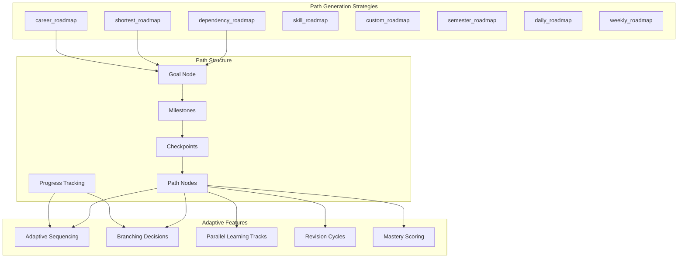
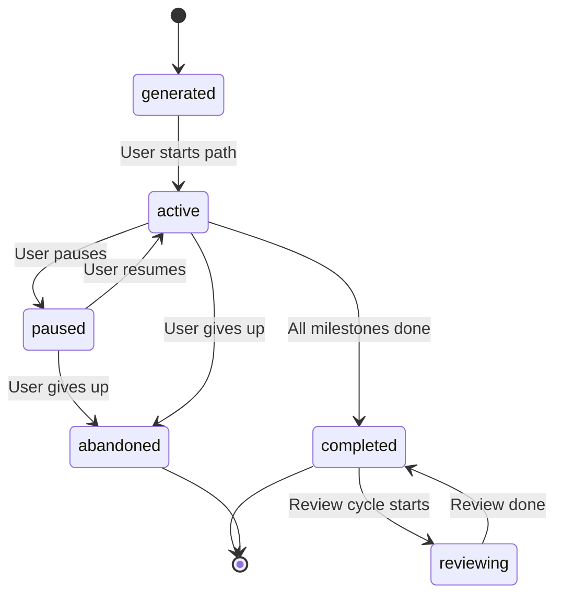

# SV-OS Learning Path Engine

> **Design**: Complete specification for learning path generation, sequencing, and mastery tracking  
> **Date**: July 22, 2026 | **Status**: Design Complete

---

## Learning Path Architecture



---

## Path Structure

### Goal

The target outcome the learner wants to achieve:

```json
{
  "goal_node_id": "550e8400-e29b-41d4-a716-446655440000",
  "goal_title": "Full Stack Developer",
  "goal_type": "career",
  "strategy": "dependency_roadmap",
  "user_id": "660e8400-e29b-41d4-a716-446655440001"
}
```

### Milestones

Learning path is divided into milestones (groups of related nodes). Milestones represent meaningful waypoints:

| Milestone Level | Title                  | Description                  |
| --------------- | ---------------------- | ---------------------------- |
| 1               | Foundations            | Core programming concepts    |
| 2               | Frontend               | HTML, CSS, JavaScript, React |
| 3               | Backend                | Node.js, Express, Databases  |
| 4               | DevOps                 | Git, Docker, CI/CD           |
| 5               | Full Stack Integration | Capstone project             |

```json
{
  "milestones": [
    {
      "level": 1,
      "title": "Foundations",
      "description": "Core programming concepts every developer needs",
      "node_count": 8,
      "estimated_minutes": 480,
      "completed": false,
      "nodes": [
        {
          "node_id": "...",
          "title": "Variables & Data Types",
          "slug": "variables",
          "node_type": "concept",
          "difficulty": "beginner",
          "estimated_minutes": 30,
          "completed": true,
          "mastered": true
        },
        {
          "node_id": "...",
          "title": "Functions",
          "slug": "functions",
          "node_type": "concept",
          "difficulty": "beginner",
          "estimated_minutes": 45,
          "completed": false
        }
      ]
    }
  ]
}
```

### Checkpoints

Checkpoints are assessment points within milestones:

```json
{
  "checkpoints": [
    {
      "id": "cp-foundations-1",
      "milestone": 1,
      "position": "after-node-4",
      "type": "quiz",
      "questions": 5,
      "pass_threshold": 0.8,
      "passed": false
    }
  ]
}
```

### Progress Tracking

```python
@dataclass
class PathProgress:
    path_id: str
    total_nodes: int
    completed_nodes: int
    mastered_nodes: int
    total_estimated_minutes: int
    completed_minutes: int
    current_milestone: int
    completion_percentage: float
    started_at: datetime
    last_activity_at: datetime
    estimated_completion: datetime

    @property
    def completion_percentage(self) -> float:
        return (self.completed_nodes / self.total_nodes) * 100

    @property
    def pace(self) -> str:
        """'ahead', 'on_track', 'behind' based on elapsed time vs planned"""
```

---

## Path Generation Strategies

### 1. Dependency Roadmap (Default)

**Algorithm**: Topological sort by prerequisite depth.

```python
async def generate_dependency_roadmap(goal_node_id: UUID) -> LearningPath:
    """
    Orders nodes by prerequisite depth (foundation → goal).

    Level 0: Direct prerequisites of goal
    Level 1: Prerequisites of level 0 nodes
    Level N: ... until no more prerequisites

    Each level becomes a milestone.
    """
    chain = await traversal_engine.dependency_chain(goal_node_id, max_depth=10)

    milestones = []
    for level, nodes_at_level in enumerate(chain):
        milestone = Milestone(
            level=level + 1,
            title=f"Level {level + 1}",
            nodes=[PathNode(node_id=n['node_id'], ...) for n in nodes_at_level]
        )
        milestones.append(milestone)

    return LearningPath(goal_node_id=goal_node_id, milestones=milestones)
```

**Strengths**: Pedagogically sound — builds proper foundations.
**Weaknesses**: May be longer than necessary.

---

### 2. Shortest Roadmap

**Algorithm**: Minimum total time to reach goal.

```python
async def generate_shortest_roadmap(goal_node_id: UUID) -> LearningPath:
    """
    Find the path with minimum total estimated time.
    Uses weighted BFS where edge weight = estimated_minutes of target node.
    """
    all_nodes = await graph_engine.all_nodes()
    all_edges = await graph_engine.all_edges()

    # Dijkstra's algorithm
    distances = {goal_node_id: 0}
    previous = {}
    unvisited = set(n['id'] for n in all_nodes)

    while unvisited:
        current = min(unvisited, key=lambda n: distances.get(n, float('inf')))
        unvisited.remove(current)

        for edge in all_edges:
            if edge['target_id'] == current:
                neighbor = edge['source_id']
                node = await graph_engine.get_node(neighbor)
                time_cost = node['estimated_minutes']
                alt = distances[current] + time_cost

                if alt < distances.get(neighbor, float('inf')):
                    distances[neighbor] = alt
                    previous[neighbor] = current

    # Reconstruct path
    return reconstruct_path(goal_node_id, previous)
```

**Strengths**: Fastest path to goal. Good for time-constrained learners.
**Weaknesses**: May skip important foundation material.

---

### 3. Career Roadmap

**Algorithm**: Follow career requirement edges.

```python
async def generate_career_roadmap(career_node_id: UUID) -> LearningPath:
    """
    Generates a path organized by career requirement types:
    Required → Recommended → Bonus
    Each category becomes a milestone level.
    """
    requirements = await career_engine.get_requirements(career_node_id)

    milestones = []
    for req_type in ['required', 'recommended', 'bonus']:
        nodes_for_type = [r for r in requirements if r.requirement_type == req_type]
        if nodes_for_type:
            milestones.append(Milestone(
                level=...,
                title=f"{req_type.title()} Skills",
                nodes=[...]
            ))

    return LearningPath(goal_node_id=career_node_id, milestones=milestones)
```

**Strengths**: Directly aligned with career goals.
**Weaknesses**: May assume too much or too little prior knowledge.

---

### 4. Skill Roadmap

**Algorithm**: Sequence by skill dependencies.

```python
async def generate_skill_roadmap(skill_slugs: list[str]) -> LearningPath:
    """
    Generate a path that teaches specified skills.
    Nodes are ordered by skill prerequisites.
    """
    # Collect all nodes that teach these skills
    skill_nodes = []
    for slug in skill_slugs:
        skill = await skill_service.get_by_slug(slug)
        nodes = await skill_service.get_teaching_nodes(skill.id)
        skill_nodes.extend(nodes)

    # Order by prerequisite depth
    ordered = topological_sort(skill_nodes)

    return LearningPath(...)
```

---

### 5. Semester Roadmap

**Algorithm**: Time-boxed structure (15 weeks, ~10 hours/week).

```python
async def generate_semester_roadmap(goal_node_id: UUID, weeks: int = 15) -> LearningPath:
    """
    Distribute path nodes across a semester.
    Each week = 1 milestone.
    Each week = ~10 hours of content.
    """
    path = await generate_dependency_roadmap(goal_node_id)
    all_nodes = flatten_path(path)
    total_hours = sum(n.estimated_minutes for n in all_nodes) / 60

    hours_per_week = total_hours / weeks
    milestones = distribute_nodes_into_weeks(all_nodes, hours_per_week)

    return LearningPath(milestones=milestones)
```

---

### 6. Daily Roadmap

**Algorithm**: Day-by-day breakdown.

```python
async def generate_daily_roadmap(goal_node_id: UUID) -> LearningPath:
    """
    Generate intensive daily plan.
    Each day = 4-6 hours of focused learning.
    """
    path = await generate_dependency_roadmap(goal_node_id)
    all_nodes = flatten_path(path)

    # Group nodes into days (4-6 hours each)
    days = []
    current_day = []
    current_minutes = 0

    for node in all_nodes:
        if current_minutes + node.estimated_minutes > 360:  # 6 hours max
            days.append(current_day)
            current_day = [node]
            current_minutes = node.estimated_minutes
        else:
            current_day.append(node)
            current_minutes += node.estimated_minutes

    if current_day:
        days.append(current_day)

    return LearningPath(milestones=[...], strategy='daily_roadmap')
```

---

### 7. Weekly Roadmap

**Algorithm**: Week-by-week balanced plan.

Similar to daily but each week = 10-15 hours spread across days with review sessions included.

---

## Adaptive Sequencing

### Real-Time Path Adjustment

```python
class AdaptiveSequencer:
    """Adjusts learning path based on learner performance."""

    async def next_node(self, user_id: UUID, path: LearningPath) -> PathNode:
        """Determine the best next node considering current progress."""

        # 1. Check if current node has assessment
        current = path.current_node()
        if current and not self.checkpoint_passed(current):
            return current  # Must complete assessment first

        # 2. If user is accelerating, suggest skipping intermediate nodes
        if self.is_accelerating(user_id):
            path = await self.accelerate(path)

        # 3. If user is struggling, suggest review
        if self.is_struggling(user_id):
            path = await self.add_remediation(path, user_id)

        # 4. Return next node in adjusted path
        return path.next_uncompleted()

    async def accelerate(self, path: LearningPath) -> LearningPath:
        """Skip nodes where user has demonstrated proficiency."""
        # Logic: if prerequisite assessment scores > 90%, skip to next milestone
        ...

    async def add_remediation(self, path: LearningPath, user_id: UUID) -> LearningPath:
        """Insert review nodes for weak areas."""
        weak_nodes = await self.identify_weak_nodes(user_id)
        for weak in weak_nodes:
            path.insert_review(weak)
        return path
```

---

## Branching

### Decision Points

```python
class BranchingDecision:
    """Where a learning path can fork based on user choice."""

    @dataclass
    class Branch:
        label: str           # "Frontend", "Backend", "Full Stack"
        description: str
        path: LearningPath
        prerequisites_met: bool
        estimated_duration: int

    async def get_branches(self, path: LearningPath) -> list[Branch]:
        """Find decision points where the path can branch."""
        branches = []

        # After core programming foundations, learner can choose:
        if path.current_milestone() == "foundations":
            branches.extend([
                Branch("Frontend", "...", frontend_path, True, 1200),
                Branch("Backend", "...", backend_path, True, 1200),
                Branch("Full Stack", "...", fullstack_path, False, 2400),
            ])

        return branches
```

---

## Parallel Learning

### Multi-Track Paths

```python
class ParallelTrack:
    """Multiple learning tracks that can be studied simultaneously."""

    @dataclass
    class Track:
        name: str
        nodes: list[PathNode]
        is_active: bool
        progress: float

    async def get_parallel_tracks(self, path: LearningPath) -> list[Track]:
        """
        Decompose path into parallel tracks.
        E.g., learn React (frontend) + Node.js (backend) simultaneously.
        """
        tracks = []

        # Group independent node clusters
        independent_clusters = find_independent_subgraphs(path)
        for cluster in independent_clusters:
            if len(cluster) >= 3:  # Minimum size for a track
                tracks.append(Track(
                    name=generate_track_name(cluster),
                    nodes=cluster,
                    is_active=False,
                    progress=0.0
                ))

        return tracks
```

---

## Revision Cycles

### Spaced Repetition Integration

```python
class RevisionCycle:
    """Integrate spaced repetition into learning paths."""

    def calculate_review_schedule(self, completion_date: datetime) -> list[datetime]:
        """SM-2 based review schedule."""
        return [
            completion_date + timedelta(days=1),   # 1 day
            completion_date + timedelta(days=3),   # 3 days
            completion_date + timedelta(days=7),   # 1 week
            completion_date + timedelta(days=16),  # ~2 weeks
            completion_date + timedelta(days=35),  # 1 month
            completion_date + timedelta(days=90),  # 3 months
        ]

    def insert_reviews_into_path(self, path: LearningPath) -> LearningPath:
        """Insert review nodes at optimal intervals."""
        for milestone in path.milestones:
            for node in milestone.nodes:
                if node.completed:
                    schedule = self.calculate_review_schedule(node.completed_at)
                    for review_date in schedule:
                        path.insert_review_node(node, review_date)
        return path
```

---

## Mastery Scoring

### Mastery Calculation

```python
class MasteryScorer:
    """Calculate and track mastery levels."""

    def calculate_mastery(self, user_id: UUID, node_id: UUID) -> float:
        """Compute mastery score 0.0–1.0."""
        scores = []

        # Assessment score (0-1)
        scores.append(self.get_assessment_score(user_id, node_id) * 0.4)

        # Completion status
        status_weights = {
            'not_started': 0.0,
            'learning': 0.3,
            'completed': 0.6,
            'mastered': 1.0,
        }
        scores.append(status_weights[self.get_status(user_id, node_id)] * 0.3)

        # Time spent vs estimated
        time_ratio = min(1.0, self.get_time_spent(user_id, node_id) /
                        estimated_time(node_id))
        scores.append(time_ratio * 0.15)

        # Review consistency
        review_score = self.get_review_consistency(user_id, node_id)
        scores.append(review_score * 0.15)

        return sum(scores)

    def get_mastery_level(self, score: float) -> str:
        if score >= 0.9: return "expert"
        if score >= 0.75: return "mastered"
        if score >= 0.5: return "competent"
        if score >= 0.25: return "learning"
        return "beginner"
```

### Mastery → Path Impact

| Mastery Level    | Path Impact                |
| ---------------- | -------------------------- |
| Expert (≥0.9)    | Skip related review nodes  |
| Mastered (≥0.75) | Normal path progression    |
| Competent (≥0.5) | Include in periodic review |
| Learning (≥0.25) | Add reinforcement nodes    |
| Beginner (<0.25) | Restart node learning      |

---

## Path Lifecycle



---

_Cross-reference: [RECOMMENDATION_ENGINE.md](./RECOMMENDATION_ENGINE.md), [KNOWLEDGE_VALIDATION.md](./KNOWLEDGE_VALIDATION.md)_
