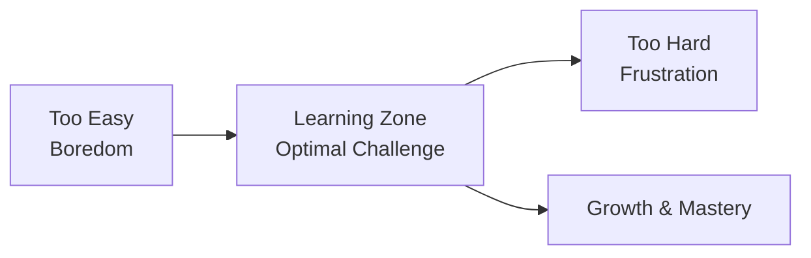
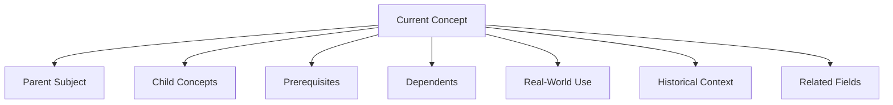

# SV-OS Learning Philosophy

> **Design**: The educational philosophy that governs all learning in SV-OS  
> **Date**: July 22, 2026 | **Status**: Design Complete  
> **Cross-reference**: [LEARNING_ENGINE.md](./LEARNING_ENGINE.md), [COGNITIVE_MODEL.md](./COGNITIVE_MODEL.md), [KNOWLEDGE_NAVIGATION_SYSTEM.md](./KNOWLEDGE_NAVIGATION_SYSTEM.md)

---

## Manifesto

**Computer Science is not a collection of subjects. It is a connected ecosystem.**

Most learning platforms treat CS as a series of silos:

- "Complete the Python course"
- "Take the Algorithms course"
- "Move to the Machine Learning track"

This is wrong. It teaches learners to see knowledge as isolated boxes rather than an interconnected web.

**SV-OS fundamentally rejects this model.**

Instead, SV-OS treats every concept, every tool, every algorithm, every project as a node in a vast, interconnected graph. The learner navigates this graph like a traveler navigating a city — not like a student progressing through a syllabus.

---

## Why SV-OS is Different

### Comparison: Coursera / edX

| Dimension         | Coursera / edX                        | SV-OS                                                        |
| ----------------- | ------------------------------------- | ------------------------------------------------------------ |
| **Structure**     | Fixed courses with start/end dates    | Dynamic journeys that adapt in real-time                     |
| **Prerequisites** | Whole courses as prerequisites        | Individual concepts as prerequisites                         |
| **Pacing**        | Instructor-paced or self-paced weekly | Millisecond-precision adaptive pacing                        |
| **Connection**    | Courses are isolated                  | Every concept connected to every other                       |
| **Context**       | "You need this for the course"        | "You need this because X career requires it"                 |
| **Format**        | Video lectures + quizzes              | Any format at any time (video, reading, simulation, project) |
| **Goal**          | Complete the course                   | Master the knowledge space                                   |

**The fundamental difference**: Coursera sells courses. SV-OS sells journeys. A course is a product. A journey is an experience.

---

### Comparison: roadmap.sh

| Dimension         | roadmap.sh                  | SV-OS                                                      |
| ----------------- | --------------------------- | ---------------------------------------------------------- |
| **Structure**     | Static, hand-drawn roadmaps | Dynamic, auto-generated paths                              |
| **Adaptivity**    | None — same for everyone    | Personalized to learner velocity and goals                 |
| **Depth**         | Topic list                  | Full knowledge graph with mastery tracking                 |
| **Interactivity** | Checkmark tracking          | Adaptive pacing, simulators, projects                      |
| **Context**       | "Learn X"                   | "Learn X because Y depends on it, and Z career requires Y" |

**The fundamental difference**: roadmap.sh tells you what to learn. SV-OS guides you through the learning experience, adapting in real-time.

---

### Comparison: freeCodeCamp

| Dimension           | freeCodeCamp                      | SV-OS                                                 |
| ------------------- | --------------------------------- | ----------------------------------------------------- |
| **Scope**           | Web development focus             | Entire computer science                               |
| **Path**            | Fixed curriculum                  | Infinite possible paths                               |
| **Project model**   | Complete projects at fixed points | Projects unlock naturally as you master prerequisites |
| **Knowledge model** | Skill-based                       | Graph-based (skills, concepts, subjects, careers)     |
| **Personalization** | None (same for everyone)          | Complete personalization via Learning Engine          |

**The fundamental difference**: freeCodeCamp is a curriculum. SV-OS is a learning operating system.

---

### Comparison: GeeksforGeeks

| Dimension       | GeeksforGeeks                     | SV-OS                                                 |
| --------------- | --------------------------------- | ----------------------------------------------------- |
| **Navigation**  | Search + browse                   | Google Maps-style navigation through knowledge space  |
| **Structure**   | Articles sorted by category       | Graph with semantic relationships                     |
| **Progression** | None — read articles in any order | Guided path that adapts to learner                    |
| **Mastery**     | Not tracked                       | 5-dimensional mastery model                           |
| **Projects**    | Separate section                  | Integrated — projects unlock based on knowledge state |

**The fundamental difference**: GeeksforGeeks is a reference. SV-OS is a learning journey.

---

### Comparison: LeetCode

| Dimension     | LeetCode                     | SV-OS                                                   |
| ------------- | ---------------------------- | ------------------------------------------------------- |
| **Focus**     | Interview preparation        | Complete computer science education                     |
| **Structure** | Problem sets                 | Knowledge graph with learning paths                     |
| **Teaching**  | Learn by solving             | Learn by concepts + application + projects + simulators |
| **Scope**     | Algorithms + data structures | Everything from programming to AI to systems            |

**The fundamental difference**: LeetCode prepares for interviews. SV-OS builds computer scientists.

---

### Comparison: MIT OCW

| Dimension         | MIT OCW                | SV-OS                                            |
| ----------------- | ---------------------- | ------------------------------------------------ |
| **Structure**     | Semester-based courses | Continuous, adaptive journeys                    |
| **Prerequisites** | Course-level           | Concept-level (granular prerequisite chains)     |
| **Interactivity** | Lecture recordings     | Interactive simulators, real-time adaptation     |
| **Assessment**    | Exams + assignments    | Continuous mastery tracking across 5 dimensions  |
| **Scale**         | MIT curriculum         | Infinite scale — graph grows with every addition |

**The fundamental difference**: MIT OCW is a library of courses. SV-OS is a living, adapting learning environment.

---

### Comparison: CS50

| Dimension      | CS50                     | SV-OS                                  |
| -------------- | ------------------------ | -------------------------------------- |
| **Philosophy** | One amazing course       | An entire learning operating system    |
| **Structure**  | Fixed 12-week curriculum | Infinite paths through knowledge space |
| **Scope**      | CS fundamentals          | All of computer science                |
| **Teaching**   | David Malan (lectures)   | Adaptive Learning Engine + AI tutors   |
| **Community**  | Campus + online cohort   | Global, topic-connected communities    |

**The fundamental difference**: CS50 is the world's best introduction to CS. SV-OS is the world's best way to learn all of CS — from first principles to cutting-edge research.

---

## Connected Knowledge: The Core Insight

### Why Isolated Subjects Fail

```
Learner studies Python — completes Python course
Learner studies Data Structures — starts from scratch (no Python context applied)
Learner studies Algorithms — starts from scratch (no DS context applied)
Learner studies Machine Learning — starts from scratch (no algorithms context applied)

Result: The learner has taken 4 separate courses but cannot connect them.
They can write Python but can't implement a data structure in Python.
They can describe algorithms but can't implement them for ML.
```

### Why Connected Knowledge Works

```
Learner wants to become an ML Engineer
Learning Engine determines path:
1. Python (with ML libraries as motivation)
2. NumPy (applies Python, enables data manipulation)
3. Linear Algebra (applied with NumPy examples)
4. Basic Statistics (with Python implementation)
5. Supervised Learning (uses Python + stats + linear algebra)

Result: Every concept is learned in context. Each new concept
reinforces previous ones. The learner sees connections because
the system teaches connections.
```

### The Google Maps Principle

SV-OS treats knowledge navigation exactly like Google Maps treats physical navigation:

| Google Maps           | SV-OS                                    |
| --------------------- | ---------------------------------------- |
| Your current location | Your current knowledge state             |
| Destination           | Learning goal (career, skill, project)   |
| Routes                | Multiple possible learning paths         |
| Shortest route        | Minimum prerequisite chain               |
| Fastest route         | Minimum total time                       |
| Scenic route          | Foundation-heavy path                    |
| Traffic               | Learning velocity (struggling = traffic) |
| Alternate routes      | Branch paths when stuck                  |
| Landmarks             | Milestones (projects, checkpoints)       |
| ETA                   | Estimated completion time                |
| Re-routing            | Dynamic path adjustment                  |
| Recently viewed       | Review schedule                          |
| Saved places          | Bookmarks                                |

This is not an analogy. This is the **operating model** of SV-OS.

---

## Educational Design Principles

### 1. The Problem-First Principle

Never start with an abstract concept. Start with a problem the learner already understands.

```
❌ "Today we'll learn about hash tables."
✅ "You need to store 10,000 student records and look them up instantly.
    How would you do it? Let's explore hash tables."

❌ "Let's study recursion."
✅ "You need to search through a folder containing 1000 nested subfolders.
    How would you write a program that explores every folder? Let's discover recursion."
```

### 2. The Context Principle

Every piece of knowledge must answer:

- **What** is this?
- **Why** do I need it?
- **Where** is it used?
- **What** depends on it?
- **What** careers require it?
- **What** project uses it?
- **What** mistakes are common?

If a node cannot answer all seven questions, it's not ready for the learner.

### 3. The Application Principle

Knowledge without application is trivia. Every concept must have:

- A **simulator** that visualizes it
- A **project** that applies it
- An **exercise** that tests it
- A **real-world** reference that shows it

### 4. The Scaffolding Principle

Knowledge should be taught at the edge of the learner's ability — not too easy (boredom) and not too hard (frustration).



### 5. The Connection Principle

Every node should link to related nodes in multiple directions:



### 6. The Mastery-Not-Completion Principle

Completing content is not the goal. Mastering it is.

SV-OS distinguishes between:

- **Completed**: You've seen the content
- **Competent**: You can use it with guidance
- **Proficient**: You can use it independently
- **Mastered**: You can teach it to others

The engine does not move on until the learner reaches at least **competent**.

### 7. The Spiral Principle

Concepts should be revisited at increasing levels of depth:

```
First encounter: "What is a database?"
Second encounter: "How does a database store data?"
Third encounter: "How does indexing work?"
Fourth encounter: "How does query optimization work?"
Fifth encounter: "How do distributed databases maintain consistency?"
```

Each spiral deepens understanding while reinforcing the previous layer.

### 8. The Diversity Principle

Every concept should be taught in at least two different ways:

| Primary Format    | Secondary Format       | Learner Benefit       |
| ----------------- | ---------------------- | --------------------- |
| Video explanation | Interactive simulation | Visual + kinesthetic  |
| Reading           | Project                | Theoretical + applied |
| Lecture           | Discussion             | Passive + active      |
| Tutorial          | Problem set            | Guided + independent  |

---

## What SV-OS Does Not Do

| DON'T                         | Why                                                                       |
| ----------------------------- | ------------------------------------------------------------------------- |
| Teach subjects in isolation   | Contradicts the connected knowledge philosophy                            |
| Lock content behind courses   | All content is potentially accessible — mastery gates determine readiness |
| Use fixed curricula           | Paths must adapt to learner velocity                                      |
| Grade with A-F                | Binary grades are meaningless — mastery is continuous                     |
| Enforce start/end dates       | Learning should be continuous, not semester-bound                         |
| Separate theory from practice | Every concept has application                                             |
| Use timers for completion     | Time is guidance, not a constraint                                        |
| Require specific browsers     | Open web standards only                                                   |

---

## The SV-OS Graduate

After learning with SV-OS, a graduate should:

1. **Navigate knowledge** — Can explore any new topic by finding its place in the knowledge graph
2. **Connect concepts** — Can explain how any two CS concepts relate to each other
3. **Apply knowledge** — Can build projects that combine multiple disciplines
4. **Self-assess** — Accurately knows what they know and what they don't
5. **Learn independently** — Has internalized the learning process itself

The goal is not to fill a bucket with facts. The goal is to build a navigator who can traverse the entire landscape of computer science — and beyond.

---

_Cross-reference: [LEARNING_ENGINE.md](./LEARNING_ENGINE.md), [COGNITIVE_MODEL.md](./COGNITIVE_MODEL.md), [KNOWLEDGE_NAVIGATION_SYSTEM.md](./KNOWLEDGE_NAVIGATION_SYSTEM.md), [MASTERY_MODEL.md](./MASTERY_MODEL.md)_
