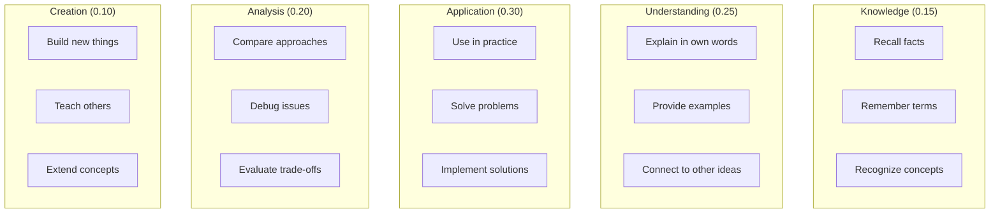

# SV-OS Mastery Model

> **Design**: Complete specification for knowledge mastery measurement and tracking  
> **Date**: July 22, 2026 | **Status**: Design Complete  
> **Cross-reference**: [LEARNING_ENGINE.md](./LEARNING_ENGINE.md), [COGNITIVE_MODEL.md](./COGNITIVE_MODEL.md), [LEARNING_PATH_ENGINE.md](./LEARNING_PATH_ENGINE.md)

---

## Philosophy

Mastery is not binary. You don't "know" or "not know" something. Mastery is a continuous, multi-dimensional property that changes over time.

SV-OS measures mastery across five dimensions — aligned with Bloom's Taxonomy — and tracks it as a dynamic value that grows through learning and decays without reinforcement.

---

## Five Dimensions of Mastery



| Dimension         | Weight | Definition                                          | Evidence Sources                       |
| ----------------- | ------ | --------------------------------------------------- | -------------------------------------- |
| **Knowledge**     | 15%    | Can recall facts, terms, and basic concepts         | Quiz scores, flashcard accuracy        |
| **Understanding** | 25%    | Can explain concepts in own words, provide examples | Open-ended questions, explanations     |
| **Application**   | 30%    | Can use knowledge to solve real problems            | Projects, coding exercises, simulators |
| **Analysis**      | 20%    | Can evaluate, compare, and debug                    | Code reviews, optimization tasks       |
| **Creation**      | 10%    | Can build new things and teach others               | Capstone projects, peer mentoring      |

---

## Mastery Score Calculation

```python
class MasteryCalculator:
    """
    Calculates mastery for a (user, node) pair.
    """

    DIMENSION_WEIGHTS = {
        "knowledge": 0.15,
        "understanding": 0.25,
        "application": 0.30,
        "analysis": 0.20,
        "creation": 0.10,
    }

    def calculate(
        self,
        dimension_scores: dict[str, float],
        confidence: float,
        time_since_last_interaction: timedelta
    ) -> float:
        """
        Calculate overall mastery as weighted average of dimensions,
        adjusted for confidence and decay.
        """

        # Step 1: Weighted average of dimension scores
        weighted = sum(
            score * self.DIMENSION_WEIGHTS[dim]
            for dim, score in dimension_scores.items()
        )

        # Step 2: Apply confidence discount
        # If we have low confidence in our measurement, discount the score
        confidence_discount = 0.5 + (confidence * 0.5)  # 0.5-1.0 range
        adjusted = weighted * confidence_discount

        # Step 3: Apply decay
        decay_rate = self._calculate_decay(time_since_last_interaction)
        adjusted *= (1 - decay_rate)

        return min(1.0, max(0.0, adjusted))

    def _calculate_decay(self, elapsed: timedelta) -> float:
        """
        Knowledge decays following an exponential forgetting curve.

        - After 1 day: 10% decay
        - After 7 days: 30% decay
        - After 30 days: 50% decay
        - After 90 days: 70% decay
        - After 365 days: 85% decay (never reaches zero)
        """
        days = elapsed.days
        # Ebbinghaus-inspired decay: 0.5^(days/30)
        return 0.5 ** (days / 30) * 0.85  # Max 85% decay
```

---

## Mastery Levels

| Level | Score Range | Label       | Learner Can                     | Action                      |
| ----- | ----------- | ----------- | ------------------------------- | --------------------------- |
| 0     | 0.00 – 0.15 | Not Started | —                               | Show introductory content   |
| 1     | 0.15 – 0.35 | Exposed     | Recall with prompting           | Continue current approach   |
| 2     | 0.35 – 0.55 | Learning    | Recall independently, basic use | Recommend more practice     |
| 3     | 0.55 – 0.70 | Competent   | Apply with guidance             | Can move to dependents      |
| 4     | 0.70 – 0.85 | Proficient  | Apply independently, debug      | Skip review; start advanced |
| 5     | 0.85 – 0.95 | Advanced    | Teach, optimize, extend         | Unlock advanced content     |
| 6     | 0.95 – 1.00 | Mastered    | Create new knowledge            | Unlock mentoring features   |

---

## Knowledge Decay Model

```python
class KnowledgeDecayEngine:
    """
    Models how knowledge fades over time without reinforcement.
    Based on the Ebbinghaus Forgetting Curve adapted for knowledge graphs.
    """

    def forge_curve(
        self,
        initial_mastery: float,
        days_elapsed: float,
        node_difficulty: str
    ) -> float:
        """
        Forgetting curve: R = e^(-t/S)

        Where:
        - R = retention after time t
        - t = time elapsed (days)
        - S = relative strength of memory (varies by difficulty and review history)
        """

        # Base strength depends on difficulty
        strength_map = {
            "beginner": 30,      # Remember for ~30 days
            "intermediate": 45,  # Remember for ~45 days
            "advanced": 60,      # Remember for ~60 days
            "expert": 90,        # Remember for ~90 days
        }

        base_strength = strength_map.get(node_difficulty, 30)

        # Strength increases with number of reviews
        review_boost = self._review_boost(initial_mastery, days_elapsed)
        effective_strength = base_strength * review_boost

        # Calculate retention
        retention = math.exp(-days_elapsed / effective_strength)

        return initial_mastery * retention

    def _review_boost(
        self,
        mastery: float,
        days_elapsed: float
    ) -> float:
        """
        Each review increases memory strength.
        A learner who has reviewed a concept multiple times
        will forget it more slowly.
        """
        # Estimate number of reviews from mastery history
        estimated_reviews = self._estimate_review_count(mastery)

        # Each review increases strength by 20%
        return (1.2 ** estimated_reviews)
```

---

## Adaptive Review Scheduling

```python
class ReviewScheduler:
    """
    Determines when to schedule reviews based on mastery and decay.
    """

    def next_review_date(
        self,
        current_mastery: float,
        days_since_last_review: int,
        threshold: float = 0.6
    ) -> datetime:
        """
        Calculate the optimal next review date.

        The goal is to schedule the review just before mastery
        drops below the threshold.
        """

        # Project decay forward
        for days_ahead in range(1, 365):
            projected = self._project_mastery(
                current_mastery, days_ahead
            )
            if projected < threshold:
                # Schedule review at this point
                return datetime.now() + timedelta(days=days_ahead)

        # If mastery stays above threshold for a year
        return datetime.now() + timedelta(days=365)

    def daily_review_plan(
        self,
        user_id: UUID,
        max_items: int = 5
    ) -> list[ReviewItem]:
        """
        Generate the optimal review plan for today.

        Selection algorithm:
        1. Collect all nodes where mastery is below threshold
        2. Sort by urgency (current_mastery / days_until_critical)
        3. Take top N items
        4. Prioritize prerequisite chains (review all nodes in a chain together)
        """

        nodes_due = []

        for node_id in self._get_known_nodes(user_id):
            state = self._get_node_state(user_id, node_id)
            if state.projected_mastery_30d < state.mastery_threshold:
                urgency = (state.mastery_threshold - state.current_mastery) / (
                    state.days_since_last_review + 1
                )
                nodes_due.append((urgency, node_id, state))

        # Sort by urgency descending
        nodes_due.sort(key=lambda x: x[0], reverse=True)

        # Group by prerequisite chain for contextual review
        review_sessions = self._group_into_sessions(nodes_due[:max_items])

        return review_sessions
```

---

## Mastery Thresholds by Node Type

| Node Type  | Competent Threshold | Proficient Threshold | Mastery Threshold |
| ---------- | ------------------- | -------------------- | ----------------- |
| Subject    | 0.50                | 0.70                 | 0.90              |
| Concept    | 0.55                | 0.75                 | 0.90              |
| Technology | 0.50                | 0.70                 | 0.85              |
| Tool       | 0.40                | 0.60                 | 0.80              |
| Career     | 0.30                | 0.50                 | 0.70              |
| Project    | 0.60                | 0.80                 | 0.95              |

---

## Mastery Visualization

```
┌─────────────────────────────────────────────────────────────┐
│  Your Mastery: JavaScript Promises                          │
│  ─────────────────────────────────────────────────────────  │
│                                                             │
│  Overall: 0.72 (Proficient)                                 │
│  ─────────────────────────────────────────────────────      │
│                                                             │
│  Knowledge     ████████████░░░░░░  0.85                     │
│  Understanding ██████████░░░░░░░░  0.70                     │
│  Application   █████████████░░░░░  0.80                     │
│  Analysis      ████████░░░░░░░░░░  0.55                     │
│  Creation      █████░░░░░░░░░░░░░  0.35                     │
│                                                             │
│  Decay: Last reviewed 14 days ago (-0.15 since peak)       │
│  Confidence: High (based on 8 evidence points)              │
│                                                             │
│  Next review due: July 29, 2026                             │
│  Projected mastery at review date: 0.58                     │
└─────────────────────────────────────────────────────────────┘
```

---

## Mastery Events

Every mastery change is an event:

```python
@dataclass
class MasteryEvent:
    user_id: UUID
    node_id: UUID
    timestamp: datetime
    event_type: str  # "increased", "decreased", "threshold_crossed",
                     # "level_up", "level_down", "decayed"
    previous_mastery: float
    new_mastery: float
    reason: str      # "completed_node", "passed_assessment", "decay",
                     # "completed_project", "completed_review"
    evidence: dict   # Type-specific evidence data
```

---

_Cross-reference: [LEARNING_ENGINE.md](./LEARNING_ENGINE.md), [COGNITIVE_MODEL.md](./COGNITIVE_MODEL.md), [LEARNING_PATH_ENGINE.md](./LEARNING_PATH_ENGINE.md) (see MasteryScorer there for the simpler operational model; this document defines the richer conceptual model), [RECOMMENDATION_ENGINE.md](./RECOMMENDATION_ENGINE.md)_
