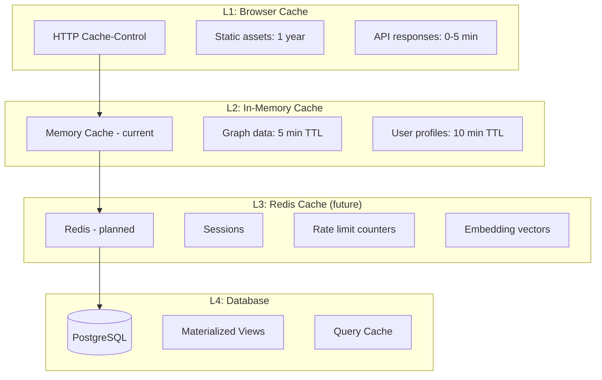
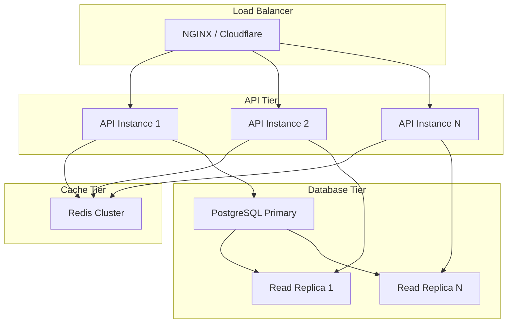

# SV-OS Performance Guide

> **Scaling and optimization strategies** | **Date**: July 22, 2026

---

## Performance Philosophy

1. **Measure first** — Never optimize without data. Profile before and after.
2. **Optimize at the right level** — Database queries > API responses > Rendering
3. **Cache aggressively, invalidate precisely** — Cache is the #1 performance lever
4. **Design for scale** — Patterns should work at 100 nodes AND 1M nodes

---

## Database Optimization

### Index Strategy

| Table             | Current Indexes                                  | Recommended Additions                                    |
| ----------------- | ------------------------------------------------ | -------------------------------------------------------- |
| `knowledge_nodes` | slug, type, difficulty, search_vector, published | Composite: (type, difficulty), (node_type, is_published) |
| `knowledge_edges` | source, target, relationship, (source+target)    | Composite: (source, relationship_type)                   |
| `user_progress`   | user_id, node_id, status                         | Composite: (user_id, status) for dashboard               |
| `activity_logs`   | user_id, action, entity, created_at              | Partition by month                                       |
| `search_history`  | user_id, created_at                              | Composite: (query_hash, created_at)                      |

### Query Optimization Tips

```sql
-- BAD: SELECT * on large tables
SELECT * FROM knowledge_nodes WHERE ...;

-- GOOD: Select only needed columns
SELECT id, slug, title, node_type FROM knowledge_nodes WHERE ...;

-- BAD: N+1 queries in loop
for node in nodes:
    edges = await get_edges(node.id)  -- N queries!

-- GOOD: Batch query
node_ids = [n.id for n in nodes]
edges = await get_edges_for_nodes(node_ids)  -- 1 query
```

### Connection Pooling

```python
# Current configuration (apps/api/app/core/config.py)
DB_POOL_SIZE = 10          # Base connections
DB_MAX_OVERFLOW = 20       # Max additional connections
DB_POOL_PRE_PING = True    # Verify connections before use

# Production tuning (based on concurrent users)
# 100 concurrent users → pool_size=20, max_overflow=40
# 1000 concurrent users → pool_size=50, max_overflow=100 (+ PgBouncer)
```

---

## Caching Strategy

### Cache Layers



### Current Cache Implementation

```python
# In-memory cache (apps/api/app/infrastructure/cache/)
class CacheBackend(ABC):
    async def get(key: str) -> Any | None
    async def set(key: str, value: Any, ttl: int)
    async def delete(key: str)
    async def clear()

# Default TTLs:
CACHE_TTL = {
    'graph_full': 300,       # 5 min
    'graph_stats': 300,      # 5 min
    'user_profile': 600,     # 10 min
    'search_results': 120,   # 2 min
    'recommendations': 300,  # 5 min
}
```

### Redis Migration Plan

| Step | Action                       | Benefit                       |
| ---- | ---------------------------- | ----------------------------- |
| 1    | Deploy Redis instance        | Shared cache across instances |
| 2    | Implement RedisCache backend | Replace InMemoryCache         |
| 3    | Migrate rate limiting        | Centralized rate counters     |
| 4    | Cache embedding vectors      | Avoid re-computation          |
| 5    | Cache search results         | 50%+ search latency reduction |

---

## Memory Management

### GraphEngine Memory

```python
# Current: All nodes and edges in memory
# Memory calculation:
# 1000 nodes × ~1KB = ~1MB
# 5000 edges × ~500B = ~2.5MB
# Total: ~3.5MB for typical graph
#
# 100K nodes × ~1KB = ~100MB
# 500K edges × ~500B = ~250MB
# Total: ~350MB — still reasonable for single instance

# Memory limits:
MAX_NODES_MEMORY = 100_000   # Soft limit
MAX_EDGES_MEMORY = 500_000   # Soft limit
```

### Memory Optimization Tips

| Strategy                        | Savings                                | Complexity |
| ------------------------------- | -------------------------------------- | ---------- |
| Lazy-load node details          | 60% (don't load content until needed)  | Low        |
| Compress metadata JSON          | 30% (remove whitespace)                | Low        |
| Index only required fields      | 40% (don't index slug in memory twice) | Medium     |
| Use `__slots__` for dataclasses | 20% (less dict overhead)               | Low        |
| Limit snapshot history          | Variable (configurable)                | Low        |

---

## Lazy Loading

### Backend Lazy Loading

```python
# Before: Load everything
async def get_full_graph():
    nodes = await node_repo.get_all()  # Loads all nodes
    edges = await edge_repo.get_all()  # Loads all edges

# After: Lazy load details
async def get_graph_preview():
    nodes = await node_repo.get_all_light()  # Only id, slug, title, type
    edges = await edge_repo.get_all_light()  # Only source, target, type

async def get_node_detail(node_id):
    return await node_repo.get_with_content(node_id)  # Load full content
```

### Frontend Lazy Loading

| Technique          | When to Use                  | Implementation                                         |
| ------------------ | ---------------------------- | ------------------------------------------------------ |
| `React.lazy()`     | Heavy pages (graph, chat)    | `const GraphPage = lazy(() => import('./graph/page'))` |
| `next/dynamic`     | Client-side only components  | `dynamic(() => import('reactflow'), { ssr: false })`   |
| Infinite scroll    | Large lists (search results) | `IntersectionObserver` + pagination                    |
| Virtual scrolling  | 500+ items                   | `react-window` or `@tanstack/virtual`                  |
| Image lazy loading | Resource thumbnails          | `loading="lazy"` attribute                             |

---

## Streaming

### API Streaming (Future)

```python
# For large graph responses, stream instead of batch
from fastapi.responses import StreamingResponse

async def stream_graph():
    async def generate():
        yield '{"nodes": ['
        first = True
        async for node in node_repo.stream_all():
            if not first:
                yield ','
            yield json.dumps(node)
            first = False
        yield ']}'
    return StreamingResponse(generate(), media_type="application/json")
```

### Frontend Streaming

```tsx
// AI Chat streaming
const response = await fetch('/api/v1/ai/chat', {
  method: 'POST',
  body: JSON.stringify({ message }),
});

const reader = response.body.getReader();
const decoder = new TextDecoder();

while (true) {
  const { done, value } = await reader.read();
  if (done) break;
  const text = decoder.decode(value);
  // Append to chat incrementally
}
```

---

## Graph Optimization

### For 10K+ Nodes

| Strategy             | Description                                | Impact                          |
| -------------------- | ------------------------------------------ | ------------------------------- |
| Level-of-detail      | Show fewer nodes at zoomed-out levels      | 10x rendering improvement       |
| Chunked loading      | Load graph in tiles/regions                | 5x initial load improvement     |
| WebGL rendering      | Use GPU for graph layout                   | 100x rendering for large graphs |
| Server-side layout   | Compute layout on server, send coordinates | Avoid browser computation       |
| Graph simplification | Merge low-importance nodes at high zoom    | Exponential improvement         |

### GraphEngine Scale

```python
# Current: Single-node in-memory
# Medium scale: GraphEngine + Redis for persistence
# Large scale: Graph database (Neo4j/ArangoDB) behind GraphEngine interface

# The GraphEngine interface is abstract enough that
# switching to a graph database requires no API changes
```

---

## Search Optimization

### PostgreSQL Full-Text Search

| Optimization                      | Impact               | Effort        |
| --------------------------------- | -------------------- | ------------- |
| GIN indexes on TSVECTOR           | Required             | Already done  |
| `plainto_tsquery` vs `to_tsquery` | 2x faster            | Query change  |
| Limit results early               | Reduce memory        | WHERE + LIMIT |
| Materialized search view          | Pre-compute rankings | Medium        |

### Semantic Search Optimization

| Optimization                 | Impact                              | Effort |
| ---------------------------- | ----------------------------------- | ------ |
| Cache embeddings             | 10x (don't re-embed on each search) | Low    |
| Batch similar queries        | 5x (group by embedding hash)        | Medium |
| Approximate nearest neighbor | 100x (IVFFlat index in pgvector)    | High   |
| Embedding quantization       | 4x memory reduction                 | Medium |

---

## Rendering Optimization

### React Performance

| Technique          | When                    | Implementation                                     |
| ------------------ | ----------------------- | -------------------------------------------------- |
| `React.memo`       | Pure components         | `export default memo(KnowledgeNode)`               |
| `useMemo`          | Expensive computations  | `const sorted = useMemo(() => sort(data), [data])` |
| `useCallback`      | Stable function refs    | `const onClick = useCallback(() => ..., [])`       |
| Virtual list       | Large lists             | Use `react-window`                                 |
| Debounced input    | Search, filters         | `useDebounce` hook                                 |
| Image optimization | Next.js Image component | `<Image priority={false} />`                       |

### Bundle Optimization

```javascript
// next.config.ts (current optimizations)
experimental: {
  optimizePackageImports: [
    'lucide-react',           // Tree-shake icons
    '@radix-ui/react-dialog',  // Tree-shake radix
    // ... more packages
  ],
}

// Additional optimizations:
// - Use dynamic imports for heavy components
// - Configure proper chunk splitting
// - Enable gzip/brotli compression
```

---

## Scaling for Millions

### Horizontal Scaling



### Million-Node Graph Strategy

| Challenge                    | Solution                     | Status     |
| ---------------------------- | ---------------------------- | ---------- |
| In-memory GraphEngine limits | Shard by domain/subject      | ⬜ Planned |
| Graph traversal latency      | Graph DB backend (Neo4j)     | ⬜ Planned |
| Search latency               | Elasticsearch or MeiliSearch | ⬜ Planned |
| Embedding storage            | pgvector or Pinecone         | 🟡 Planned |
| Recommendation computation   | Async batch processing       | 🬜 Planned  |

---

_Cross-reference: [SECURITY_GUIDE.md](./SECURITY_GUIDE.md), [DEPLOYMENT_GUIDE.md](./DEPLOYMENT_GUIDE.md)_
