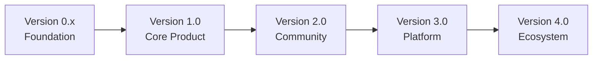
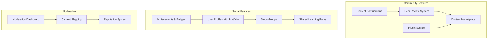
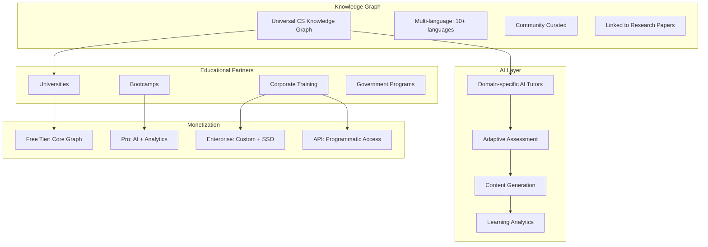
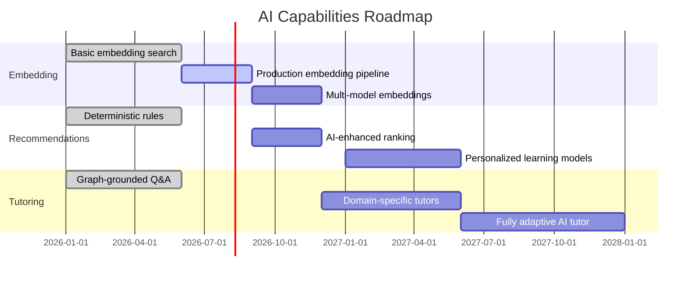

# SV-OS Product Evolution

> **Future product vision and roadmap** | **Date**: July 22, 2026

---

## Product Maturity Model



| Version | Phase        | Focus                                                     | Target           |
| ------- | ------------ | --------------------------------------------------------- | ---------------- |
| 0.x     | Foundation   | Infrastructure, architecture, core features               | Internal         |
| 1.0     | Core Product | Knowledge import, search, recommendations, learning paths | Early adopters   |
| 2.0     | Community    | User contributions, plugin system, content marketplace    | Community growth |
| 3.0     | Platform     | API platform, embedding, enterprise features              | Business         |
| 4.0     | Ecosystem    | Global knowledge graph, AI tutors, partnerships           | Mass adoption    |

---

## Version 1.0 — Core Product

**Status**: 🔴 Not started | **Target**: Q4 2026

### Goals

- Complete knowledge import pipeline (JSON, CSV, Markdown)
- Full-text and semantic search
- Deterministic recommendations
- Basic learning path generation
- Career path mapping
- User progress tracking

### Key Features

| Feature                     | Priority | Status         | Dependencies         |
| --------------------------- | -------- | -------------- | -------------------- |
| Knowledge import (JSON)     | P0       | 🟡 Designed    | ImportEngine         |
| Knowledge import (CSV)      | P1       | 🟡 Designed    | JSON import          |
| Knowledge import (Markdown) | P2       | 🟡 Designed    | JSON import          |
| Full-text search            | P0       | ✅ Implemented | SearchEngine         |
| Semantic search             | P1       | ✅ Implemented | Embedding providers  |
| Hybrid search               | P1       | 🟡 Designed    | FTS + semantic       |
| Next-item recommendations   | P0       | ✅ Implemented | RecommendationEngine |
| Daily/weekly digests        | P1       | 🟡 Designed    | Recommendations      |
| Learning path generation    | P1       | ✅ Implemented | LearningPathEngine   |
| Career path mapping         | P2       | 🟡 Designed    | CareerEngine         |
| Spaced repetition           | P2       | 🟡 Designed    | RevisionEngine       |
| User progress dashboard     | P1       | ✅ Implemented | Frontend             |

### Success Metrics

| Metric                   | Target                 |
| ------------------------ | ---------------------- |
| Knowledge nodes          | 1000+                  |
| Active users             | 100+                   |
| Search accuracy          | 90%+                   |
| Recommendation relevance | "Good" in user surveys |
| API uptime               | 99.9%+                 |

---

## Version 2.0 — Community

**Target**: Q2 2027

### Goals

- Enable community content contributions
- Plugin system for custom engines
- Content marketplace for premium resources
- Collaborative graph editing
- Community ratings and reviews

### Key Features



### Business Model

| Revenue Stream        | Description                          | Model               |
| --------------------- | ------------------------------------ | ------------------- |
| Content marketplace   | Premium learning paths and resources | Commission (20%)    |
| API access            | Programmatic graph access            | SaaS tiered pricing |
| Enterprise license    | Private deployment, SSO, audit       | Annual subscription |
| Community sponsorship | Promoted content (ethical)           | Flat fee            |

---

## Version 3.0 — Platform

**Target**: Q4 2027

### Goals

- Public API platform for third-party developers
- Embedding SV-OS graph in external sites
- Enterprise features (SSO, audit, compliance)
- AI-powered personalized tutoring
- Mobile applications

### Key Features

| Feature           | Description                        | Target User |
| ----------------- | ---------------------------------- | ----------- |
| Public API        | Rate-limited, API-key based access | Developers  |
| Embeddable widget | Embed graph in documentation sites | Docs teams  |
| SSO integration   | SAML, OIDC, Google Workspace       | Enterprise  |
| Audit logging     | Complete user action audit trail   | Enterprise  |
| AI tutor          | Personalized AI learning assistant | All users   |
| Mobile apps       | iOS + Android native apps          | All users   |
| Offline mode      | Downloadable graph for offline use | All users   |

### Enterprise Features

```yaml
enterprise_plan:
  features:
    - SSO / SAML / OIDC
    - Team management
    - Custom content domains
    - Audit logging (1 year retention)
    - Dedicated support
    - SLA (99.95% uptime)
    - Private deployment option
    - Usage analytics dashboard
  pricing: 'Custom per-seat pricing'
```

---

## Version 4.0 — Ecosystem

**Target**: 2028+

### Goals

- Global, community-curated knowledge graph
- AI tutors specialized by domain
- University and school partnerships
- Research integration (arXiv, papers)
- Multi-language support

### Vision



---

## Enterprise Market

### Target Segments

| Segment          | Need                     | Solution                   | Price Point |
| ---------------- | ------------------------ | -------------------------- | ----------- |
| Tech companies   | Onboard junior engineers | Custom learning paths      | $10-50K/yr  |
| Bootcamps        | Curriculum design        | Graph-based curriculum     | $5-20K/yr   |
| Universities     | CS program mapping       | Degree requirement mapping | $20-100K/yr |
| Consulting firms | Skill assessment         | Skill gap analysis         | $10-30K/yr  |

---

## Schools & Universities

### Academic Integration

```yaml
university_features:
  - Curriculum mapping (map courses to graph nodes)
  - Degree requirement tracking
  - Prerequisite chain visualization
  - Student progress dashboard
  - Course recommendation engine
  - Research paper integration

implementation:
  - LTI 1.3 standard integration (LMS compatibility)
  - Roster import (SIS integration)
  - Gradebook export
  - Academic calendar support
```

---

## Research Integration

### Connecting Research to the Graph

```yaml
research_integration:
  sources:
    - arXiv API (daily paper ingestion)
    - Semantic Scholar API (citation graph)
    - DBLP (computer science bibliography)
    - OpenAlex (open research index)

  mapping:
    - Extract key concepts from paper abstracts
    - Link papers to existing graph nodes
    - Create citation networks as graph edges
    - Track research trends over time

  features:
    - "What's new in X" — recent papers mapped to topics
    - "Research frontier" — emerging concept detection
    - "Who's working on X" — researcher discovery
```

---

## AI Future

### AI Evolution Timeline



---

## Community & Open Source

### Growing the Community

| Stage    | Goal              | Actions                                              |
| -------- | ----------------- | ---------------------------------------------------- |
| Launch   | 100 contributors  | Documentation, good first issues, contributor guides |
| Growth   | 1000 contributors | Plugin system, content contests, mentorship program  |
| Maturity | 10K+ contributors | Foundation, governance model, conference             |

### Open Source Governance

```yaml
governance:
  model: 'Benevolent Dictator for Life (BDFL) → Meritocracy'
  initial:
    - Core team (3-5 maintainers)
    - Committers (5-10 active contributors)
    - Contributors (everyone else)

  decision_making:
    - Technical decisions: Core team consensus
    - Product direction: BDFL with community input
    - Content curation: Community voting + moderation

  future:
    - Move to foundation model (Apache-style)
    - Elected technical committee
    - Community-elected product council
```

---

## Business Model Evolution

| Phase    | Model                   | Revenue  | Timeline |
| -------- | ----------------------- | -------- | -------- |
| Launch   | Free, open source       | $0       | 2026     |
| Growth   | Freemium (Pro features) | $10K/mo  | 2027     |
| Scale    | Enterprise + API        | $100K/mo | 2028     |
| Maturity | Platform + Marketplace  | $1M+/mo  | 2029+    |

---

_Cross-reference: [IMPLEMENTATION_ROADMAP.md](./IMPLEMENTATION_ROADMAP.md), [ARCHITECTURE.md](./ARCHITECTURE.md)_
