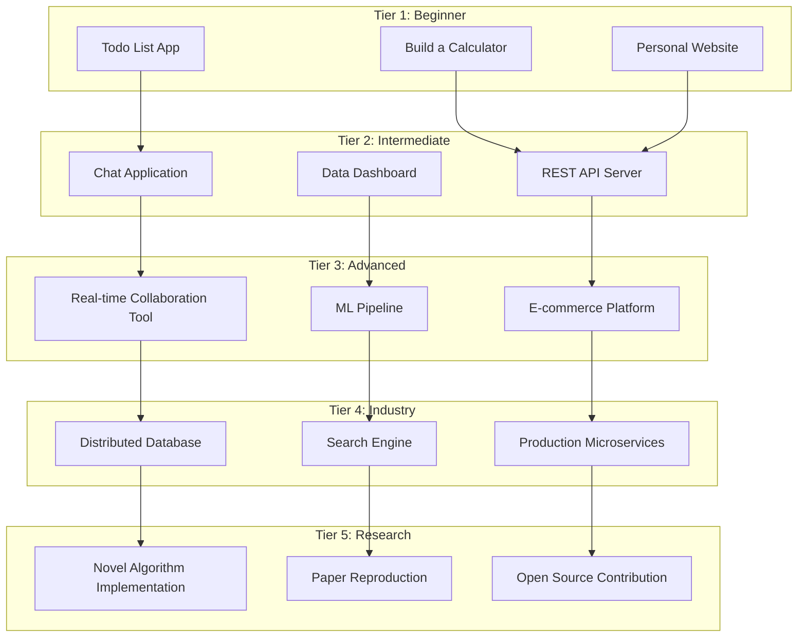

# SV-OS Project Engine

> **Design**: Complete specification for project-driven learning  
> **Date**: July 22, 2026 | **Status**: Design Complete  
> **Cross-reference**: [LEARNING_ENGINE.md](./LEARNING_ENGINE.md), [JOURNEY_DESIGN.md](./JOURNEY_DESIGN.md), [SIMULATION_FRAMEWORK.md](./SIMULATION_FRAMEWORK.md)

---

## Philosophy

Projects are the bridge between knowledge and capability. In SV-OS:

- **Projects unlock naturally** — based on the learner's current mastery
- **Projects teach** — not just test. A project reveals gaps and teaches through discovery
- **Projects connect** — every project ties multiple concepts together
- **Projects build portfolio** — completed projects become career evidence

---

## Project Tier System



---

## Project Specification

Every project in SV-OS follows a complete specification:

```yaml
project:
  # Identity
  slug: 'build-rest-api-server'
  title: 'Build a REST API Server'
  difficulty: intermediate
  tier: 2

  # Context
  description: >
    "Build a production-ready REST API for a library management system.
     This project teaches API design, database integration, error handling,
     and testing."

  learning_objectives:
    - 'Design RESTful API endpoints'
    - 'Implement CRUD operations with a database'
    - 'Handle errors and edge cases gracefully'
    - 'Write automated tests for API endpoints'
    - 'Document API with OpenAPI/Swagger'

  # Prerequisites (auto-checked against learner mastery)
  knowledge_requirements:
    required:
      - node_id: 'http-protocol' # Must have mastery ≥ 0.5
      - node_id: 'javascript-basics'
      - node_id: 'json-format'
    recommended:
      - node_id: 'express-js' # Optional but helpful
      - node_id: 'sql-basics'

  # Skills gained
  skills_gained:
    - 'REST API Design'
    - 'Server-side Development'
    - 'Database Integration'
    - 'API Testing'

  # Deliverables
  deliverables:
    - 'Working API server with 5+ endpoints'
    - 'Database schema and migrations'
    - 'API documentation (OpenAPI)'
    - 'Test suite (20+ tests)'
    - 'Deployment configuration'

  # Structure
  milestones:
    - title: 'Setup & Planning'
      tasks:
        - 'Initialize Node.js project'
        - 'Set up Express server'
        - 'Design database schema'
        - 'Plan API endpoints'
      estimated_hours: 2

    - title: 'Core Implementation'
      tasks:
        - 'Implement book CRUD endpoints'
        - 'Implement author CRUD endpoints'
        - 'Add input validation'
        - 'Add error handling middleware'
      estimated_hours: 6

    - title: 'Database Integration'
      tasks:
        - 'Connect to database'
        - 'Implement data models'
        - 'Write database migrations'
        - 'Implement search/filter endpoints'
      estimated_hours: 4

    - title: 'Testing & Documentation'
      tasks:
        - 'Write unit tests'
        - 'Write integration tests'
        - 'Generate API documentation'
        - 'Test all endpoints'
      estimated_hours: 4

    - title: 'Deployment'
      tasks:
        - 'Add Docker configuration'
        - 'Deploy to cloud platform'
        - 'Configure domain and SSL'
        - 'Verify production readiness'
      estimated_hours: 4

  # Evaluation criteria
  evaluation:
    criteria:
      - 'All endpoints work correctly'
      - 'Error handling covers all edge cases'
      - 'Test coverage ≥ 80%'
      - 'API documentation is complete and accurate'
      - 'Deployment is accessible via public URL'
    auto_check: true # Automated tests can verify most criteria

  # Portfolio value
  portfolio:
    value_rating: 8/10 # How impressive is this for employers?
    demonstrates:
      - 'Full-stack capability'
      - 'API design skills'
      - 'Testing discipline'
      - 'DevOps awareness'

  # Career relevance
  career_relevance:
    careers: ['Backend Developer', 'Full Stack Developer', 'API Engineer']
    companies: ['Any tech company']
    interview_topics: ['REST principles', 'Database design', 'API testing']
```

---

## Project Unlock Logic

Projects do not appear until the learner is ready:

```python
class ProjectUnlockEngine:
    """
    Decides when a project is available to a learner.
    """

    async def get_available_projects(
        self,
        user_id: UUID,
        limit: int = 5
    ) -> list[AvailableProject]:
        """Return projects the learner can start now."""

        all_projects = await project_service.get_all()
        available = []

        for project in all_projects:
            unlock_status = await self._check_unlock(user_id, project)
            if unlock_status.available:
                available.append(AvailableProject(
                    project=project,
                    readiness=unlock_status.readiness,
                    suggested_milestones=unlock_status.next_steps
                ))

        # Sort by readiness (most ready first)
        available.sort(key=lambda x: x.readiness, reverse=True)
        return available[:limit]

    async def _check_unlock(
        self,
        user_id: UUID,
        project: ProjectSpec
    ) -> UnlockStatus:
        """Check if a specific project is unlocked."""

        required_met = 0
        required_total = len(project.knowledge_requirements.required)
        recommended_met = 0
        recommended_total = len(project.knowledge_requirements.recommended)

        for req in project.knowledge_requirements.required:
            mastery = await mastery_service.get(user_id, req.node_id)
            if mastery >= 0.5:
                required_met += 1

        for req in project.knowledge_requirements.recommended:
            mastery = await mastery_service.get(user_id, req.node_id)
            if mastery >= 0.5:
                recommended_met += 1

        # Calculate readiness score
        if required_total == 0:
            required_ratio = 1.0
        else:
            required_ratio = required_met / required_total

        if recommended_total == 0:
            recommended_ratio = 1.0
        else:
            recommended_ratio = recommended_met / recommended_total

        readiness = (required_ratio * 0.8) + (recommended_ratio * 0.2)

        # Project is available when >70% of required knowledge is met
        available = required_ratio >= 0.7

        return UnlockStatus(
            available=available,
            readiness=readiness,
            missing_required=[r for r in project.knowledge_requirements.required
                            if not self._is_met(user_id, r)],
            next_steps=self._suggest_next_steps(project, readiness)
        )
```

---

## Project Progress Tracking

```python
@dataclass
class ProjectProgress:
    """Tracks a learner's progress through a project."""

    project_slug: str
    user_id: UUID

    # Milestone progress
    milestones: list[MilestoneProgress]
    current_milestone_index: int

    # Time tracking
    started_at: datetime
    last_activity_at: datetime
    total_hours_spent: float
    estimated_remaining_hours: float

    # Mastery impact
    mastery_gained: dict[UUID, float]  # node_id -> mastery increase

    # Evaluation
    evaluation_status: str  # "not_submitted", "pending_review", "passed", "revision"
    auto_check_results: list[CheckResult]
    reviewer_feedback: str | None

    @property
    def completion_percentage(self) -> float:
        completed = sum(1 for m in self.milestones if m.completed)
        return (completed / len(self.milestones)) * 100

@dataclass
class MilestoneProgress:
    title: str
    tasks: list[TaskProgress]
    estimated_hours: int
    started_at: datetime | None
    completed_at: datetime | None

    @property
    def completed(self) -> bool:
        return all(t.completed for t in self.tasks)

@dataclass
class TaskProgress:
    description: str
    completed: bool
    completed_at: datetime | None
    notes: str | None
    artifacts: list[str]  # Links to completed work
```

---

## Project Recommendation

When a learner is considering their next project:

```yaml
recommendation_factors:
  knowledge_readiness:
    weight: 0.4
    description: 'How many prerequisites are met?'

  skill_gap:
    weight: 0.3
    description: "Does this project fill a gap in the learner's profile?"

  career_relevance:
    weight: 0.2
    description: "How relevant is this project to the learner's career goal?"

  interest_match:
    weight: 0.1
    description: "Does the project topic match the learner's interests?"
```

---

## Project Evaluation

Projects are evaluated through a combination of automated checks and optional peer/human review:

| Evaluation Method     | Speed          | Depth   | Used For            |
| --------------------- | -------------- | ------- | ------------------- |
| Auto-check tests      | Instant        | Shallow | Core requirements   |
| Code quality analysis | < 1 min        | Medium  | Structure, patterns |
| Peer review           | 1-48 hours     | Deep    | Design decisions    |
| Mentor review         | Schedule-based | Deepest | Advanced evaluation |

---

_Cross-reference: [LEARNING_ENGINE.md](./LEARNING_ENGINE.md), [SIMULATION_FRAMEWORK.md](./SIMULATION_FRAMEWORK.md), [KNOWLEDGE_GRAPH_DESIGN.md](./KNOWLEDGE_GRAPH_DESIGN.md)_
