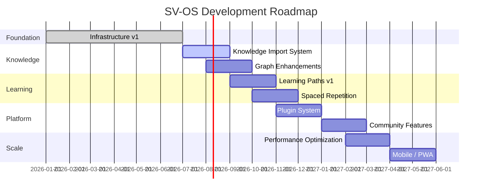

# SV-OS Project Overview

> **Project**: Silicon Valley Learning OS | **Status**: Infrastructure Milestone v1 | **Date**: July 22, 2026

---

## Vision

**Become the definitive interactive map for Computer Science learning** — the "Google Maps for Computer Science" that every developer worldwide uses to navigate their learning journey.

---

## Mission

Provide an open, interactive knowledge graph platform that:

- **Maps** every CS concept, technology, tool, project, and career into a navigable graph
- **Guides** learners through clear prerequisite chains and optimal learning paths
- **Tracks** individual progress with detailed analytics and spaced repetition
- **Recommends** what to study next using deterministic, explainable rules
- **Connects** learning to real-world outcomes (careers, projects, skills)
- **Integrates** AI for contextual assistance without replacing human curation

---

## Long-Term Goal

A self-sustaining, community-driven learning ecosystem where:

1. **Learners** navigate the CS landscape with clarity — always knowing what to study next and why
2. **Content creators** contribute nodes, edges, resources, and learning paths
3. **Educators** use the graph to design curricula and track student progress
4. **Employers** define skill requirements mapped directly to the knowledge graph
5. **AI assistants** provide personalized tutoring grounded in the graph

---

## Why SV-OS Exists

### The Problem

Computer Science education suffers from a fundamental **map problem**:

| Problem                     | Impact                                                                         |
| --------------------------- | ------------------------------------------------------------------------------ |
| **Too many topics**         | Thousands of concepts, technologies, tools — impossible to see the big picture |
| **No prerequisite clarity** | "Learn React" — but do you need JavaScript first? HTML? Web fundamentals?      |
| **Information overload**    | Infinite tutorials, courses, bootcamps — no structured path                    |
| **Career uncertainty**      | "Learn to code" — for what? Web dev? ML? Systems? DevOps?                      |
| **Progress blindness**      | What do you know? What should you review? What's next?                         |
| **Wasted effort**           | Months learning irrelevant topics because the dependency chain was unclear     |

### The Solution

SV-OS solves this by treating CS knowledge as a **navigable graph**:

```
Instead of:  "Learn X"
SV-OS says:  "You are here → X requires Y and Z → Y requires A →
              You know A → Here's your optimal next step"
```

### Key Differentiators

| Feature                  | SV-OS                      | Traditional platforms |
| ------------------------ | -------------------------- | --------------------- |
| Knowledge representation | Graph (nodes + edges)      | Linear course lists   |
| Prerequisite tracking    | Automatic, multi-level     | Manual, course-level  |
| Learning path generation | Dynamic, multi-strategy    | Fixed curriculum      |
| Career mapping           | Graph-based requirements   | Static lists          |
| Progress granularity     | Per-concept                | Per-course            |
| Recommendations          | Deterministic, explainable | Black-box algorithms  |
| AI integration           | Graph-grounded RAG         | Generic chatbots      |

---

## Target Users

### Primary

| User Type                  | Need                        | How SV-OS Helps                                  |
| -------------------------- | --------------------------- | ------------------------------------------------ |
| **Self-taught developers** | Know what to study next     | Personalized learning paths, prerequisite chains |
| **CS students**            | Supplement formal education | Graph visualization, career roadmaps             |
| **Career switchers**       | Navigate into tech          | Career requirement mapping, skill gap analysis   |

### Secondary

| User Type            | Need             | How SV-OS Helps                            |
| -------------------- | ---------------- | ------------------------------------------ |
| **Educators**        | Design curricula | Graph-based topic dependency analysis      |
| **Tech leads**       | Onboard juniors  | Structured learning paths for team members |
| **Content creators** | Identify gaps    | Graph coverage analysis                    |

---

## Architecture at a Glance

```
┌─────────────────────────────────────────────────────┐
│                  Frontend (Next.js 15)               │
│  Dashboard  Graph  Careers  Learning  Progress  AI   │
└──────────────────────┬──────────────────────────────┘
                       │ HTTP REST (JSON)
                       ▼
┌─────────────────────────────────────────────────────┐
│               Backend API (FastAPI)                  │
│  ┌──────┐ ┌──────┐ ┌──────┐ ┌──────┐ ┌──────┐     │
│  │Auth  │ │Graph │ │Career│ │Learn │ │AI    │     │
│  │API   │ │API   │ │API   │ │API   │ │API   │     │
│  └──┬───┘ └──┬───┘ └──┬───┘ └──┬───┘ └──┬───┘     │
│     └────────┴────────┴────────┴────────┘          │
│                      │                             │
│  ┌──────────────────────────────────────────────┐  │
│  │         Engine System (20 engines)            │  │
│  │  Graph │ Knowledge │ Traversal │ Search      │  │
│  │  Career│ Learning  │ Recomm.   │ Analytics   │  │
│  └──────────────────────────────────────────────┘  │
│                      │                             │
│  ┌──────────────────────────────────────────────┐  │
│  │  Repositories → UnitOfWork → PostgreSQL      │  │
│  └──────────────────────────────────────────────┘  │
└─────────────────────────────────────────────────────┘
```

---

## Technology Stack

| Layer               | Technology                   | Version           |
| ------------------- | ---------------------------- | ----------------- |
| Frontend            | Next.js + React + TypeScript | 15.3 / 19.1 / 5.8 |
| Styling             | Tailwind CSS + Radix UI      | 4.1               |
| Graph Visualization | React Flow                   | 11.11             |
| State (Server)      | TanStack React Query         | 5.75              |
| State (Client)      | Zustand                      | 5.0               |
| Backend             | FastAPI + Python             | 0.115 / 3.12      |
| ORM                 | SQLAlchemy + asyncpg         | 2.0 / 0.30        |
| Database            | PostgreSQL                   | 16                |
| Migrations          | Alembic                      | 1.14              |
| Validation          | Pydantic v2                  | 2.10              |
| Auth                | JWT (python-jose) + bcrypt   | 3.3               |
| AI Embeddings       | OpenAI / Gemini / Ollama     | Pluggable         |
| Container           | Docker + Docker Compose      | Latest            |
| CI/CD               | GitHub Actions               | —                 |
| Package Manager     | pnpm                         | 10.8              |
| Build Orchestrator  | Turborepo                    | 2.5               |
| Monorepo            | pnpm workspaces              | —                 |

---

## Current Status

```
Infrastructure Milestone v1 — ✅ ACHIEVED

  Docker builds     → ✅ Green
  CI pipeline       → ✅ Green
  Architecture      → ✅ Stabilized
  Database schema   → ✅ Finalized
  Engine system     → ✅ 19 engines registered
  Graph engine      → ✅ Feature-complete
  Traversal engine  → ✅ 15 algorithms implemented
  Recommendation    → ✅ 8 priority rules
  Search engine     → ✅ 6 search modes
  Knowledge import  → 🟡 Next phase
  Learning paths    → 🟡 Strategy implementations
  AI context engine → 🟡 Production tuning
```

---

## Future Roadmap (High-Level)



---

## Key Design Decisions

| Decision                             | Rationale                                          | Status |
| ------------------------------------ | -------------------------------------------------- | ------ |
| **Adjacency list** for graph storage | Simple, recursive CTEs, no extra infrastructure    | ✅     |
| **In-memory GraphEngine**            | Fast traversal, indexes, snapshots                 | ✅     |
| **Deterministic recommendations**    | Explainable, debuggable, no ML dependency          | ✅     |
| **Engine lifecycle**                 | Formal init/start/stop, dependency graph           | ✅     |
| **Unit of Work pattern**             | Transaction atomicity, clean separation            | ✅     |
| **Multi-strategy learning paths**    | Dependency, shortest, semester, daily, weekly      | ✅     |
| **Pluggable AI providers**           | OpenAI, Gemini, Ollama — swap without code changes | ✅     |
| **JWT auth + Supabase ready**        | Stateless, scalable, future migration path         | ✅     |

---

## License

**MIT** — Open source, free for all use cases.

---

_Cross-reference: [CURRENT_PROGRESS.md](./CURRENT_PROGRESS.md), [ARCHITECTURE.md](./ARCHITECTURE.md), [IMPLEMENTATION_ROADMAP.md](./IMPLEMENTATION_ROADMAP.md)_
