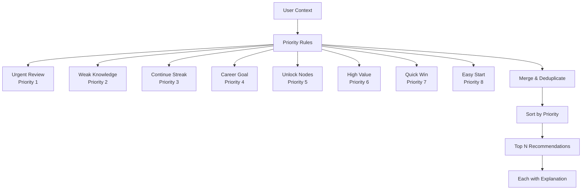
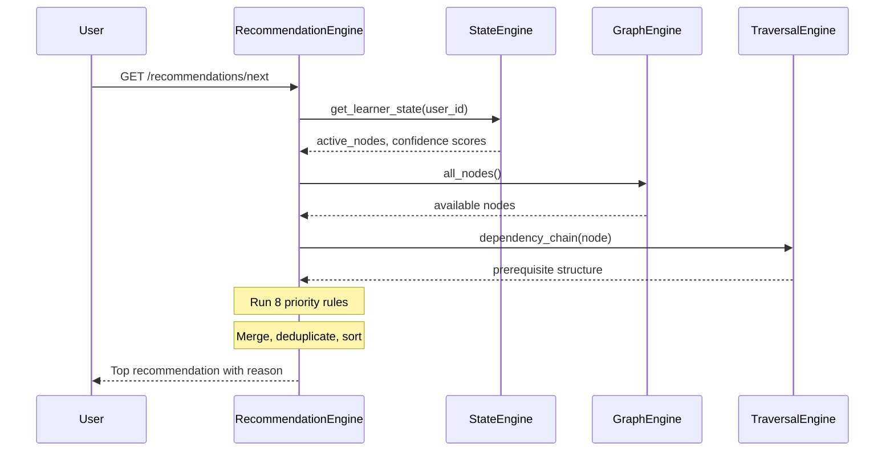
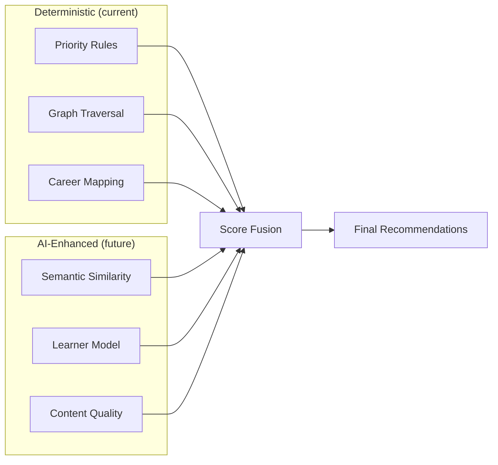

# SV-OS Recommendation Engine

> **Design**: Complete recommendation algorithms for learning, careers, projects, and content  
> **Date**: July 22, 2026 | **Status**: Design Complete

---

## Philosophy

SV-OS recommendations are **deterministic and explainable**. Every recommendation comes with a reason. No black-box ML, no hidden scores. The engine uses priority-based rules that are:

1. **Deterministic** — Same inputs always produce same outputs
2. **Explainable** — Every recommendation says WHY
3. **Debuggable** — Priority order can be inspected
4. **Configurable** — Weights and priorities are adjustable



---

## Priority Rules

### Priority 1: Urgent Review

**Purpose**: Items due for spaced repetition review. Highest priority because forgetting is costly.

**Algorithm**:

```python
async def get_urgent_review_candidates(user_id: UUID) -> list[Recommendation]:
    """Find items with low confidence that need review."""
    learner_state = await state_engine.get_learner_state(user_id)

    for node_id, state in learner_state.active_nodes.items():
        confidence = state.confidence

        if confidence < 0.3:
            # CRITICAL — needs immediate review
            priority = 1
            reason = "Critical — confidence is very low (needs review)"
        elif confidence < 0.5:
            # Needs review
            priority = 1
            reason = "Confidence dropping — review recommended"
        elif confidence < 0.7 and state.days_since_review > 7:
            # Due for periodic review
            priority = 1
            reason = "Due for periodic review"
```

**Data Sources**: StateEngine (learner_state), RevisionEngine (review schedule)

---

### Priority 2: Reinforce Weak Knowledge

**Purpose**: Items the learner has engaged with but hasn't fully mastered.

**Algorithm**:

```python
async def get_weak_knowledge_candidates(user_id: UUID) -> list[Recommendation]:
    """Find items with moderate-low confidence for reinforcement."""
    learner_state = await state_engine.get_learner_state(user_id)

    # Sort by confidence ascending
    weak_items = sorted(
        learner_state.active_nodes.items(),
        key=lambda x: x[1].confidence
    )

    # Return items with 0.3 <= confidence < 0.7 (not critical, not mastered)
    for node_id, state in weak_items[:10]:
        if 0.3 <= state.confidence < 0.7:
            yield Recommendation(
                node_id=node_id,
                priority=2,
                reason=f"Confidence is {state.confidence:.0%} — reinforce your understanding"
            )
```

---

### Priority 3: Continue Learning Streak

**Purpose**: Items connected to what the learner is currently studying.

**Algorithm**:

```python
async def get_streak_candidates(user_id: UUID) -> list[Recommendation]:
    """Find nodes connected to the learner's active session."""
    active_nodes = await get_active_learning_nodes(user_id)

    for active_node in active_nodes[:3]:
        # Find immediate neighbors in the graph
        neighbors = await traversal_engine.subgraph(active_node.id, depth=1)

        for neighbor in neighbors['nodes']:
            if not is_completed(user_id, neighbor.id):
                yield Recommendation(
                    node_id=neighbor.id,
                    priority=3,
                    reason=f"Next step from: {active_node.title}"
                )
```

---

### Priority 4: Career Requirement

**Purpose**: Items needed for the learner's target career path.

**Algorithm**:

```python
async def get_career_candidates(user_id: UUID) -> list[Recommendation]:
    """Find uncompleted nodes required for target career."""
    target_career = await get_user_career_goal(user_id)
    if not target_career:
        return []

    # Get all required nodes for this career
    requirements = await career_engine.get_requirements(target_career.id)

    for req in requirements:
        if not is_completed(user_id, req.node_id):
            yield Recommendation(
                node_id=req.node_id,
                priority=4,
                reason=f"Required for career: {target_career.title}",
                metadata={"requirement_type": req.type, "career": target_career.title}
            )
```

---

### Priority 5: Unlock Maximum Nodes

**Purpose**: Items that unblock the most downstream content.

**Algorithm**:

```python
async def get_unlock_candidates(user_id: UUID) -> list[Recommendation]:
    """Find nodes that unlock many downstream nodes."""
    all_nodes = await graph_engine.all_nodes()

    for node in all_nodes:
        if is_completed(user_id, node.id):
            continue

        # Count unblocked dependents
        chain = await traversal_engine.reverse_dependency_chain(node.id)
        unlocked_count = count_uncompleted(chain, user_id)

        if unlocked_count >= 3:
            yield Recommendation(
                node_id=node.id,
                priority=5,
                reason=f"Unlocks {unlocked_count} downstream topics"
            )
```

---

### Priority 6: Highest Dependency Value

**Purpose**: Items that are prerequisites for many other nodes (high leverage).

**Algorithm**:

```python
async def get_dependency_value_candidates(user_id: UUID) -> list[Recommendation]:
    """Find nodes with the most dependents (high-value prerequisites)."""
    scored = []
    for node in all_nodes:
        if is_completed(user_id, node.id):
            continue
        dependents = await traversal_engine.count_dependents(node.id)
        scored.append((dependents, node))

    # Sort by dependent count descending
    scored.sort(reverse=True, key=lambda x: x[0])

    for count, node in scored[:10]:
        if count >= 2:
            yield Recommendation(
                node_id=node.id,
                priority=6,
                reason=f"High value — {count} other topics depend on this"
            )
```

---

### Priority 7: Quick Win

**Purpose**: Items with short estimated completion time.

**Algorithm**:

```python
async def get_quick_win_candidates(user_id: UUID) -> list[Recommendation]:
    """Find shortest uncompleted items for quick progress."""
    all_nodes = await graph_engine.all_nodes()
    available = [n for n in all_nodes
                 if not is_completed(user_id, n.id)
                 and prerequisites_met(user_id, n)]

    # Sort by estimated time ascending
    available.sort(key=lambda n: n.estimated_minutes or 999)

    for node in available[:10]:
        if (node.estimated_minutes or 30) <= 30:
            yield Recommendation(
                node_id=node.id,
                priority=7,
                reason=f"Quick win — only {node.estimated_minutes} minutes"
            )
```

---

### Priority 8: Easiest First

**Purpose**: Items with the lowest difficulty level.

**Algorithm**:

```python
async def get_easiest_candidates(user_id: UUID) -> list[Recommendation]:
    """Find easiest uncompleted items."""
    beginner_nodes = await graph_engine.get_nodes_by_type_and_difficulty(
        difficulty='beginner'
    )

    for node in beginner_nodes:
        if not is_completed(user_id, node.id):
            yield Recommendation(
                node_id=node.id,
                priority=8,
                reason="Beginner level — easiest to start with"
            )
```

---

## Recommendation Types

### 1. Next-Item Recommendation

**Purpose**: Single best next thing to study right now.



**Output**:

```json
{
  "node_id": "550e8400-...",
  "title": "JavaScript Promises",
  "slug": "javascript-promises",
  "node_type": "concept",
  "difficulty": "intermediate",
  "priority": 3,
  "priority_label": "Continue Learning Streak",
  "reason": "Next step from your current topic: JavaScript Async"
}
```

---

### 2. Daily Digest

**Purpose**: Top 5-10 items for today. Focuses on review + weak knowledge.

| Priority Range | Number  | Focus           |
| -------------- | ------- | --------------- |
| 1              | 2 items | Urgent review   |
| 2              | 2 items | Weak knowledge  |
| 3              | 1 item  | Continue streak |

---

### 3. Weekly Plan

**Purpose**: 15-20 items for the week. Broader scope.

| Priority Range | Number  | Focus              |
| -------------- | ------- | ------------------ |
| 1-2            | 5 items | Review + reinforce |
| 3              | 3 items | Current streak     |
| 4-5            | 5 items | Career + unlock    |
| 6-8            | 5 items | Quick wins + easy  |

---

### 4. Career Path Recommendations

**Purpose**: Full sequence toward a career goal.

```python
async def career_recommendations(career_slug: str, user_id: UUID) -> dict:
    """Generate complete career path with recommendations."""
    career = await career_service.get_by_slug(career_slug)
    requirements = await career_engine.get_requirements(career.id)

    # Group by type
    groups = {
        'required': [],
        'recommended': [],
        'bonus': [],
    }

    for req in requirements:
        status = await get_progress(user_id, req.node_id)
        entry = {**req, 'status': status}
        groups[req.requirement_type].append(entry)

    return {
        'career': career,
        'groups': groups,
        'completion_percentage': calculate_completion(groups),
        'estimated_remaining_hours': estimate_time(groups),
        'recommended_start': find_starting_point(groups, user_id),
    }
```

---

### 5. Resource Recommendations

**Purpose**: Best learning resources for a given node.

```python
async def resource_recommendations(node_id: UUID) -> list[dict]:
    """Rank resources for a node by quality indicators."""
    resources = await resource_service.get_by_node(node_id)

    def score(resource):
        score = 0.0
        if resource.is_free: score += 0.3
        if resource.rating and resource.rating >= 4.5: score += 0.2
        if resource.difficulty == 'beginner': score += 0.1
        if resource.platform in ['official', 'documentation']: score += 0.2
        return score

    resources.sort(key=score, reverse=True)
    return resources[:5]
```

---

### 6. Project Recommendations

**Purpose**: Projects that apply recently learned knowledge.

```python
async def project_recommendations(user_id: UUID) -> list[dict]:
    """Find projects that match the learner's current knowledge."""
    completed_nodes = await get_completed_node_ids(user_id)

    projects = await project_service.get_all()
    scored_projects = []

    for project in projects:
        requirements = await project_service.get_requirements(project.id)
        required_ids = [r.node_id for r in requirements if r.type == 'required']

        match_ratio = len(set(completed_nodes) & set(required_ids)) / len(required_ids)

        if match_ratio >= 0.7:  # 70% of prerequisites met
            scored_projects.append((match_ratio, project))

    scored_projects.sort(reverse=True, key=lambda x: x[0])
    return scored_projects[:5]
```

---

### 7. Skill Gap Analysis

**Purpose**: Identify missing skills for a target role.

**Algorithm**:

```python
async def skill_gap_analysis(user_id: UUID, target_career: str) -> dict:
    """Compare current skills against career requirements."""
    current_skills = await get_user_skills(user_id)
    required_skills = await career_engine.get_required_skills(target_career)

    gaps = []
    for skill in required_skills:
        if skill.slug not in current_skills:
            gaps.append({
                'skill': skill,
                'priority': skill.importance,
                'estimated_time': skill.estimated_minutes,
                'learning_path': await get_prerequisite_chain(skill.node_id)
            })

    # Sort gaps by priority (most important first)
    gaps.sort(key=lambda g: g['priority'], reverse=True)

    return {
        'current_skill_count': len(current_skills),
        'required_skill_count': len(required_skills),
        'gap_count': len(gaps),
        'estimated_fill_time': sum(g['estimated_time'] for g in gaps),
        'gaps': gaps,
        'recommended_first': gaps[0] if gaps else None,
    }
```

---

### 8. Adaptive Learning Path

**Purpose**: Dynamically adjust learning path based on progress.

```python
async def adaptive_path(user_id: UUID, goal_node_id: UUID) -> dict:
    """Generate and adjust a learning path based on user progress."""
    # Start with standard dependency-ordered path
    path = await learning_path_engine.generate_dependency_roadmap(goal_node_id)

    # Mark completed items
    for milestone in path.milestones:
        for node in milestone.nodes:
            node.completed = is_completed(user_id, node.node_id)

    # Find first uncompleted milestone
    path.completion_percentage = calculate_completion(path)

    # Skip completed milestones for "next step"
    current_milestone = find_current_milestone(path)

    # Adjust difficulty if user is breezing through or struggling
    if user_is_accelerating(user_id):
        path = await accelerate_path(path)
    elif user_is_struggling(user_id):
        path = await add_remediation(path, user_id)

    return path
```

---

## Configuration

### Priority Weights

```yaml
recommendations:
  max_results: 20
  daily_digest_count: 8
  weekly_plan_count: 20

  priority_rules:
    urgent_review:
      enabled: true
      confidence_threshold: 0.5
    weak_knowledge:
      enabled: true
      min_confidence: 0.3
      max_confidence: 0.7
    continue_streak:
      enabled: true
      max_streak_nodes: 3
    career_requirement:
      enabled: true
    unlock_nodes:
      enabled: true
      min_unlock_count: 3
    dependency_value:
      enabled: true
      min_dependents: 2
    quick_win:
      enabled: true
      max_minutes: 30
    easiest_first:
      enabled: true
      difficulty: 'beginner'
```

---

## Future AI Recommendations

### AI-Enhanced Scoring

Once AI embeddings are in production, the recommendation engine can be enhanced with:

| Enhancement                    | Description                                         | Priority |
| ------------------------------ | --------------------------------------------------- | -------- |
| **Semantic matching**          | Find nodes semantically similar to current learning | P2       |
| **Knowledge graph completion** | Predict missing edges from embeddings               | P3       |
| **Learner modeling**           | Build per-user learning model from behavior         | P3       |
| **Content quality scoring**    | Use LLM to assess content quality                   | P3       |
| **Personalized difficulty**    | Adjust difficulty based on user's past performance  | P3       |

### Hybrid Recommendation Flow



---

_Cross-reference: [LEARNING_PATH_ENGINE.md](./LEARNING_PATH_ENGINE.md), [SEARCH_ARCHITECTURE.md](./SEARCH_ARCHITECTURE.md), [KNOWLEDGE_VALIDATION.md](./KNOWLEDGE_VALIDATION.md)_
