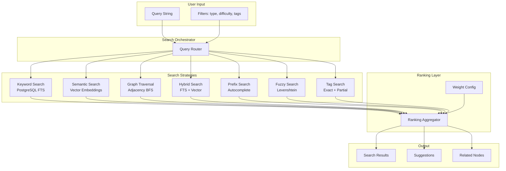
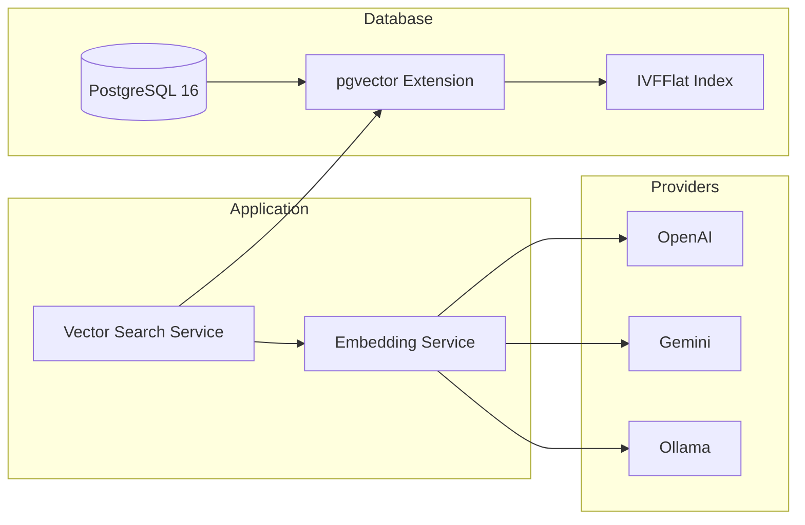

# SV-OS Search Architecture

> **Design**: Complete search system covering keyword, semantic, hybrid, graph traversal, and vector search  
> **Date**: July 22, 2026 | **Status**: Design Complete

---

## Search System Overview



---

## Search Strategies

### 1. Keyword Search (PostgreSQL FTS)

**Engine**: PostgreSQL `tsvector` + `tsquery`  
**Latency**: < 50ms  
**Coverage**: All published knowledge nodes

#### Weight Configuration

| Field       | Weight          | Index                         |
| ----------- | --------------- | ----------------------------- |
| Title       | **A** (highest) | `setweight(to_tsvector(...))` |
| Description | **B**           | `setweight(to_tsvector(...))` |
| Content     | **C**           | `setweight(to_tsvector(...))` |

#### Query Pattern

```sql
SELECT title, slug, node_type, difficulty,
    ts_rank(search_vector, plainto_tsquery('english', :query)) AS rank
FROM knowledge_nodes
WHERE search_vector @@ plainto_tsquery('english', :query)
    AND is_published = true
    AND is_deleted = false
ORDER BY rank DESC
LIMIT 20;
```

#### Strengths

- Fast, no external dependencies
- Good for exact/partial title matches
- Works without any AI infrastructure

#### Weaknesses

- No semantic understanding (doesn't know "JS" = "JavaScript")
- No cross-lingual support
- Sensitive to spelling errors

---

### 2. Semantic Search (Vector Embeddings)

**Engine**: Embedding providers (OpenAI, Gemini, Ollama) + in-memory vector comparison  
**Latency**: 100-500ms (depends on provider)  
**Coverage**: All indexed nodes with embeddings

#### Pipeline

```python
class SemanticSearchService:
    async def search(self, query: str, top_k: int = 20) -> list[SearchResult]:
        # 1. Generate query embedding
        query_vector = await self.embedding_service.embed(query)

        # 2. Compare against all node embeddings (cosine similarity)
        results = []
        for node_id, node_embedding in self.embedding_index.items():
            similarity = cosine_similarity(query_vector, node_embedding)
            results.append((similarity, node_id))

        # 3. Sort by similarity
        results.sort(reverse=True, key=lambda x: x[0])

        # 4. Return top K
        return results[:top_k]
```

#### Strengths

- Understands synonyms ("JS", "JavaScript", "ECMAScript")
- Language-agnostic (embeddings capture meaning)
- Works with partial/incomplete queries

#### Weaknesses

- Requires external API calls (cost, latency)
- Cold start — new nodes not searchable until embedded
- No exact match guarantee

---

### 3. Graph Traversal Search

**Engine**: TraversalEngine (in-memory BFS)  
**Latency**: < 10ms (in-memory)  
**Coverage**: All nodes loaded in GraphEngine

#### Strategies

| Strategy               | Description                     | Use Case                                 |
| ---------------------- | ------------------------------- | ---------------------------------------- |
| **Neighborhood**       | Find nodes near a starting node | "What's related to React?"               |
| **Prerequisite chain** | Follow PREREQUISITE_OF edges    | "What do I need before ML?"              |
| **Reverse dependency** | Find dependents of a node       | "What depends on Python?"                |
| **BFS expansion**      | Breadth-first to depth N        | "Show me everything connected to Docker" |

#### Query API

```python
# Find prerequisite chain
GET /graph/prerequisites/{node_id}
# Returns: [[direct_prereqs], [prereqs_of_prereqs], ...]

# Explore neighborhood
GET /graph/explore/{node_id}?depth=2&relationship_type=prerequisite
# Returns: { node, neighbors: { outgoing: [...], incoming: [...] } }
```

#### Strengths

- Instant (in-memory)
- Explains relationships (shows WHY two nodes are connected)
- No indexing needed

#### Weaknesses

- No text search capability
- Requires a starting node (can't search from nothing)

---

### 4. Hybrid Search

**Engine**: HybridSearchService (FTS + Semantic combined)  
**Latency**: 150-600ms  
**Coverage**: All published nodes

#### Algorithm

```python
class HybridSearchService:
    async def search(self, query: str) -> list[SearchResult]:
        # 1. Run both searches independently
        fts_results = await self.fts_search(query)       # PostgreSQL
        semantic_results = await self.semantic_search(query)  # Embeddings

        # 2. Normalize scores to 0.0-1.0 range
        fts_normalized = self.normalize_scores(fts_results)
        semantic_normalized = self.normalize_scores(semantic_results)

        # 3. Weighted fusion
        hybrid_scores = {}
        alpha = 0.6  # FTS weight (can be tuned per query type)

        for node_id, score in fts_normalized:
            hybrid_scores[node_id] = alpha * score

        for node_id, score in semantic_normalized:
            hybrid_scores[node_id] = hybrid_scores.get(node_id, 0) + (1 - alpha) * score

        # 4. Sort and return
        return self.sort_and_paginate(hybrid_scores)
```

#### Alpha Tuning

| Query Type                      | α (FTS weight) | Rationale                     |
| ------------------------------- | -------------- | ----------------------------- |
| Known term ("React")            | 0.7            | Exact match important         |
| Conceptual ("state management") | 0.3            | Semantic understanding needed |
| Code ("Promise.all")            | 0.8            | Exact code syntax             |
| Abbreviation ("ML")             | 0.5            | Balance exact + expansion     |

---

### 5. Autocomplete / Prefix Search

**Engine**: SearchEngine (prefix mode)  
**Latency**: < 5ms (in-memory)  
**Coverage**: Node titles + slugs

```python
async def autocomplete(self, prefix: str, limit: int = 10) -> list[str]:
    """Return matching titles/slugs for autocomplete dropdown."""
    results = await self.search_engine.search_prefix(prefix, limit=limit)
    return [r['title'] for r in results['items']]
```

#### Trigger

- User types 3+ characters
- Debounce 300ms
- Return top 10 matches

---

### 6. Fuzzy Search

**Engine**: SearchEngine (fuzzy mode with Levenshtein distance)  
**Latency**: < 20ms (in-memory)  
**Coverage**: Node titles + descriptions

| Distance | Match Quality  | Example           |
| -------- | -------------- | ----------------- |
| 0        | Exact          | "React" → "React" |
| 1        | Minor typo     | "Rect" → "React"  |
| 2        | Extended typo  | "Reatc" → "React" |
| 3+       | Unlikely match | Too distant       |

#### Primary Use

- Spell correction for zero-result searches
- "Did you mean?" suggestions

---

### 7. Tag Search

**Engine**: SearchEngine (tag mode)  
**Latency**: < 10ms (in-memory)  
**Coverage**: Tags on entities

```python
async def search_by_tag(self, tag: str) -> list[dict]:
    """Find all nodes with a specific tag."""
    return await self.search_engine.search_tags(tag)
```

---

## Ranking Algorithm

### Score Components

| Component           | Weight | Source                      |
| ------------------- | ------ | --------------------------- |
| Text relevance      | 40%    | TSVECTOR rank or FTS score  |
| Semantic similarity | 25%    | Cosine similarity           |
| Popularity          | 15%    | view_count + bookmark_count |
| Importance          | 10%    | Prerequisite count          |
| Freshness           | 10%    | Recency (created_at)        |

### Score Computation

```python
final_score = (
    0.40 * text_relevance +
    0.25 * semantic_similarity +
    0.15 * popularity_normalized +
    0.10 * importance_normalized +
    0.10 * freshness_normalized
)
```

### Boost/Burden Factors

| Factor                 | Effect          | Applied When               |
| ---------------------- | --------------- | -------------------------- |
| Published              | ×1.0 (no boost) | All results                |
| High demand career     | +0.05 boost     | Career nodes               |
| Beginner difficulty    | +0.05 boost     | If query suggests beginner |
| Expert difficulty      | -0.05 burden    | If query suggests beginner |
| Official documentation | +0.05 boost     | Resource results           |

---

## Filtering

### Available Filters

| Filter       | Type     | Values                                              |
| ------------ | -------- | --------------------------------------------------- |
| `node_type`  | Enum     | subject, concept, technology, tool, career, project |
| `difficulty` | Enum     | beginner, intermediate, advanced, expert            |
| `status`     | Enum     | published, draft                                    |
| `tags`       | String[] | Any tag slug                                        |
| `date_from`  | Date     | `>=` created_at                                     |
| `date_to`    | Date     | `<=` created_at                                     |
| `sort_by`    | String   | relevance, title, created_at, difficulty            |
| `sort_order` | String   | asc, desc                                           |

### Filter Application Order

1. Text search (broadest)
2. Type filter (narrow)
3. Difficulty filter (narrow)
4. Tag filter (narrow)
5. Date range (narrow)
6. Sort + paginate (final)

---

## Search Suggestions

### Types of Suggestions

| Type                 | Trigger        | Example                                                |
| -------------------- | -------------- | ------------------------------------------------------ |
| **Autocomplete**     | 3+ chars typed | "rea" → "React", "React Hooks", "Reactive Programming" |
| **Did you mean?**    | 0 results      | "Rect" → "Did you mean: React?"                        |
| **Related searches** | Results found  | "React" → "Vue.js", "JavaScript", "Components"         |
| **Trending**         | Empty search   | Today's most searched topics                           |

### Related Node Suggestions

When viewing a node, suggest:

```python
async def get_related_suggestions(node_id: UUID) -> dict:
    return {
        "prerequisites": [...],      # PREREQUISITE_OF (incoming)
        "follow_ups": [...],         # LEADS_TO (outgoing)
        "similar": [...],            # SIMILAR_TO
        "careers": [...],            # CAREER_REQUIRES (this node)
        "projects": [...],           # PROJECT_REQUIRES (this node)
    }
```

---

## Career Search

### Career → Learning Path Mapping

```python
async def career_search(career_slug: str) -> dict:
    """Return full search context for a career."""
    career = await get_career(career_slug)
    requirements = await get_career_requirements(career_slug)

    return {
        "career": career,
        "required_skills": requirements['required'],
        "recommended_skills": requirements['recommended'],
        "bonus_skills": requirements['bonus'],
        "learning_path": await generate_path(career.node_id),
        "average_salary": career.average_salary,
        "demand_outlook": career.demand_level,
        "related_careers": await get_related_careers(career_slug),
    }
```

---

## Learning Search

### Search Within Learning Context

```python
async def learning_search(user_id: UUID, query: str) -> dict:
    """Search tailored to a learner's context."""
    return {
        "results": await hybrid_search(query),
        "completed_nodes": [...],     # Already learned — filter out
        "in_progress": [...],         # Currently learning — show progress
        "recommended_next": [...],    # Next best step
        "weak_areas": [...],          # Low confidence — review recommended
    }
```

---

## Future Vector Search (pgvector)

### Architecture



### Schema

```sql
-- pgvector extension (0.7+)
CREATE EXTENSION vector;

-- Embeddings table (separate from main node table for flexibility)
CREATE TABLE node_embeddings (
    id UUID PRIMARY KEY DEFAULT gen_random_uuid(),
    node_id UUID NOT NULL REFERENCES knowledge_nodes(id) ON DELETE CASCADE,
    model VARCHAR(100) NOT NULL,
    embedding vector(1536),  -- dimensions match provider
    created_at TIMESTAMPTZ NOT NULL DEFAULT NOW(),
    UNIQUE (node_id, model)
);

-- IVFFlat index for approximate nearest neighbor search
CREATE INDEX idx_embeddings_ivfflat
    ON node_embeddings
    USING ivfflat (embedding vector_cosine_ops)
    WITH (lists = 100);
```

### Query Pattern

```sql
SELECT n.title, n.slug, n.node_type,
    1 - (e.embedding <=> :query_embedding) AS similarity
FROM node_embeddings e
JOIN knowledge_nodes n ON n.id = e.node_id
WHERE n.is_published = true
ORDER BY e.embedding <=> :query_embedding
LIMIT 20;
```

### Migration Path

| Step | Description                                   | Complexity            |
| ---- | --------------------------------------------- | --------------------- |
| 1    | Install pgvector extension                    | Low                   |
| 2    | Create embeddings table                       | Low                   |
| 3    | Backfill existing node embeddings             | High (many API calls) |
| 4    | Replace in-memory index with pgvector queries | Medium                |
| 5    | Add IVFFlat index                             | Low                   |
| 6    | Implement incremental embedding updates       | Low                   |

---

## Performance Targets

| Search Type                      | P50   | P95   | P99   |
| -------------------------------- | ----- | ----- | ----- |
| Keyword (FTS)                    | 20ms  | 50ms  | 100ms |
| Prefix (autocomplete)            | 5ms   | 10ms  | 20ms  |
| Fuzzy                            | 10ms  | 30ms  | 50ms  |
| Tag                              | 5ms   | 15ms  | 30ms  |
| Graph traversal                  | 2ms   | 10ms  | 50ms  |
| Semantic (in-memory, 1000 nodes) | 100ms | 200ms | 500ms |
| Semantic (pgvector, 100K nodes)  | 50ms  | 100ms | 200ms |
| Hybrid                           | 150ms | 300ms | 600ms |

---

_Cross-reference: [KNOWLEDGE_SCHEMA.md](./KNOWLEDGE_SCHEMA.md), [GRAPH_RELATIONSHIPS.md](./GRAPH_RELATIONSHIPS.md), [RECOMMENDATION_ENGINE.md](./RECOMMENDATION_ENGINE.md)_
