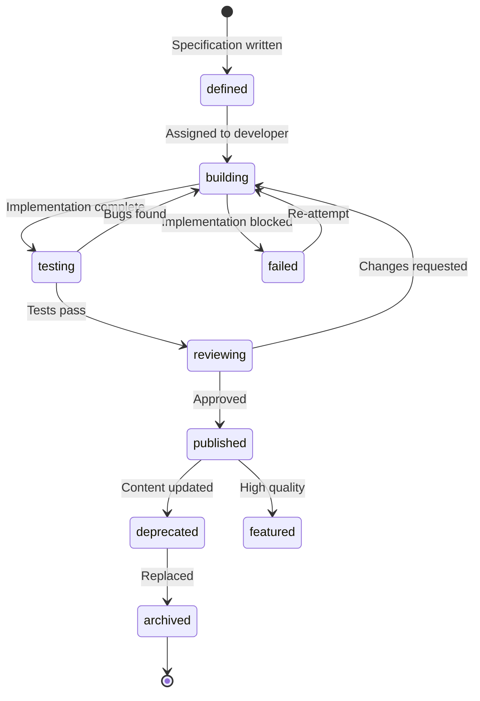

# SV-OS Simulation Framework

> **Design**: Complete specification for interactive simulators  
> **Date**: July 22, 2026 | **Status**: Design Complete  
> **Cross-reference**: [LEARNING_ENGINE.md](./LEARNING_ENGINE.md), [VISUAL_LEARNING_SYSTEM.md](./VISUAL_LEARNING_SYSTEM.md), [JOURNEY_DESIGN.md](./JOURNEY_DESIGN.md)

---

## Philosophy

A simulator is worth a thousand words. SV-OS uses interactive simulators to make abstract concepts tangible.

Every concept that can be visualized, simulated, or animated **will** have a simulator. Simulators are the bridge between theory and intuition.

---

## Simulator Categories

| Category             | Example Simulators                        | Target Concepts     |
| -------------------- | ----------------------------------------- | ------------------- |
| **CPU & Processors** | CPU Scheduler, Pipeline, Cache            | OS, Architecture    |
| **Memory**           | Paging, Segmentation, Allocation          | OS, Architecture    |
| **Networking**       | Packet Routing, TCP Handshake, DNS        | Networks            |
| **Data Structures**  | Array, List, Tree, Hash Table, Graph      | DSA                 |
| **Algorithms**       | Sorting, Search, Pathfinding, DP          | Algorithms          |
| **Compilers**        | Lexer, Parser, AST Walker                 | Compilers           |
| **Databases**        | Query Execution, Indexing, Transactions   | DBMS                |
| **Concurrency**      | Thread Scheduler, Lock Manager, Race      | OS, Concurrency     |
| **ML**               | Perceptron, Neural Net, Decision Tree     | ML                  |
| **Systems**          | File System, Process Lifecycle            | OS                  |
| **Math**             | Function Plotter, Matrix Ops, Probability | Math for CS         |
| **Networks**         | Protocol Stack, Load Balancer             | Distributed Systems |

---

## Simulator Design Pattern

Every simulator follows a consistent architecture:

```python
@dataclass
class SimulatorSpec:
    """Blueprint for every simulator in SV-OS."""

    # Identity
    id: UUID
    slug: str                    # "cpu-scheduler"
    title: str                   # "CPU Scheduler Simulator"
    target_concept: UUID         # Links to knowledge graph node

    # Learning objectives
    learning_objectives: list[str]
    # e.g., ["Understand FCFS scheduling", "Visualize context switching"]

    # Interaction model
    interaction_model: str
    # "step-through" | "real-time" | "batch-input" | "sandbox"

    # Inputs
    inputs: list[SimulatorInput]
    # e.g., [process_list, scheduling_algorithm, time_quantum]

    # Visualization
    visualization: VisualizationSpec
    # e.g., { type: "gantt-chart", animations: true, colors: [...] }

    # Assessment
    has_assessment: bool
    checkpoint_questions: list[CheckpointQuestion]

    # Difficulty levels
    difficulty_levels: list[DifficultyLevel]
    # e.g., [{ level: "beginner", presets: [...], guidance: "full" }]

    # Metadata
    estimated_minutes: int
    min_browser: str              # "es2020", "webgl" etc.
    keyboard_shortcuts: list[Shortcut]

class SimulatorInput:
    name: str
    type: str                    # "number", "text", "select", "code", "file"
    default_value: Any
    constraints: dict | None     # { min: 0, max: 10, step: 1 }
    description: str

class VisualizationSpec:
    type: str                    # "gantt", "graph", "tree", "timeline",
                                 # "stack", "grid", "3d", "custom"
    rendering: str               # "svg", "canvas", "webgl", "dom"
    animations: bool
    colors: list[str] | None
    zoomable: bool
    pannable: bool
    speed_control: bool          # Playback speed adjuster
```

---

## Category Deep Dives

### 1. CPU Scheduler Simulator

| Property              | Value                                                                                                          |
| --------------------- | -------------------------------------------------------------------------------------------------------------- |
| **Target Concept**    | CPU Scheduling                                                                                                 |
| **Interaction Model** | Step-through + Real-time                                                                                       |
| **Input**             | Process list (arrival time, burst time), scheduling algorithm (FCFS, SJF, RR, Priority), time quantum (for RR) |
| **Visualization**     | Gantt chart + Ready queue animation + Timeline                                                                 |
| **Difficulty Levels** | 4 (beginner → expert)                                                                                          |

**Learning Objectives**:

1. Understand how scheduling algorithms decide process order
2. Visualize context switching and process states
3. Compare algorithms on metrics: throughput, turnaround, waiting time
4. Predict scheduling behavior given process characteristics

**Interaction Flow**:

```
1. Select scheduling algorithm
2. Add processes (arrival time, burst time, priority)
3. Click "Run" → see processes animate through the scheduler
4. Step-through mode: Click "Next" to advance one scheduling decision
5. Real-time mode: Watch processes execute in real-time
6. Compare: Run multiple algorithms side-by-side
7. Metrics panel updates in real-time
```

**Visual Design**:

```
┌─────────────────────────────────────────────────────────────┐
│  CPU Scheduler                               ⚙️ Presets  │
│  ─────────────────────────────────────────────────────────  │
│  [SJF] [FCFS] [RR: q=4] [Priority] ▸ Custom               │
│                                                             │
│  Processes:                              Ready Queue:       │
│  ┌───┬────┬────┬────┐                    ┌─────────────┐  │
│  │ P │ AT │ BT │ Pri│                    │ [P2] [P4]   │  │
│  ├───┼────┼────┼────┤                    └─────────────┘  │
│  │ P1│ 0  │ 8  │ 3  │                                    │
│  │ P2│ 1  │ 4  │ 1  │   CPU: [█ P1 ██]  (running)       │
│  │ P3│ 2  │ 9  │ 2  │                                    │
│  │ P4│ 3  │ 5  │ 1  │   Gantt Chart:                      │
│  └───┴────┴────┴────┘   ┌─────────────────────────┐       │
│                          │ P1 │ P2 │ P1 │ P3 │ P4  │       │
│  [+ Add Process]         │ 0-1│ 1-2│ 2-4│ 4-7│ 7-9 │       │
│                          └─────────────────────────┘       │
│  Metrics:                                                  │
│  ┌──────────────────────────────────────┐                   │
│  │ Avg Waiting: 4.2  │ Avg Turnaround:  │                   │
│  │                  │ 8.7              │                   │
│  │ Throughput: 0.44 │ CPU Utilization:  │                   │
│  │                  │ 92%              │                   │
│  └──────────────────────────────────────┘                   │
│  [▶ Run] [⏸ Pause] [⏭ Step] [🔄 Reset] [📊 Compare]      │
└─────────────────────────────────────────────────────────────┘
```

---

### 2. Sorting Algorithm Visualizer

| Property              | Value                                             |
| --------------------- | ------------------------------------------------- |
| **Target Concept**    | Sorting Algorithms                                |
| **Interaction Model** | Step-through + Real-time + Batch                  |
| **Input**             | Array of numbers (size 5-50), algorithm selection |
| **Visualization**     | Bar chart with color-coded comparisons            |
| **Difficulty Levels** | 3                                                 |

**Learning Objectives**:

1. Understand how each sorting algorithm works internally
2. Compare time complexity visually (see the difference between O(n²) and O(n log n))
3. Trace through algorithm steps manually
4. Predict next comparison/swap

**Visual Features**:

- Bar height = value, color = state (unsorted, comparing, swapping, sorted)
- Operation counter (comparisons, swaps)
- Code panel showing highlighted current line
- Comparison mode (2 algorithms side-by-side)

---

### 3. Network Packet Routing Simulator

| Property              | Value                                               |
| --------------------- | --------------------------------------------------- |
| **Target Concept**    | Network Routing                                     |
| **Interaction Model** | Sandbox (draw network, watch routing)               |
| **Input**             | Network topology, routing protocol (OSPF, BGP, RIP) |
| **Visualization**     | Graph with animated packets                         |
| **Difficulty Levels** | 3                                                   |

**Visual Design**:

```
┌─────────────────────────────────────────────────────────────┐
│  Network Routing Simulator                                  │
│  ─────────────────────────────────────────────────────────  │
│                                                             │
│  Topology:              ┌───┐    Packets in transit:        │
│                         │R1 │ ●                             │
│                        ╱│   │╲                            │
│                     ●  │└───┘ │ ●                          │
│                    ┌───┐     ┌───┐                         │
│                    │R2 │ ● ──│R3 │                         │
│                    │   │     │   │                         │
│                    └───┘     └───┘                         │
│                       │        │                           │
│                       ●        ●                           │
│                                                             │
│  [📦 Send Packet from A to B]                              │
│  [Protocol: OSPF]  [▶ Animate]  [⏭ Step]                  │
│                                                             │
│  Routing Tables:                                            │
│  ┌──────────┬──────────┬────────┐                           │
│  │ Router   │ Destination│ Next Hop│                       │
│  ├──────────┼──────────┼────────┤                           │
│  │ R1       │ A        │ Local  │                           │
│  │ R1       │ B        │ R2     │                           │
│  └──────────┴──────────┴────────┘                           │
└─────────────────────────────────────────────────────────────┘
```

---

### 4. Memory Management Simulator

| Property              | Value                                                         |
| --------------------- | ------------------------------------------------------------- |
| **Target Concept**    | Paging, Segmentation, Memory Allocation                       |
| **Interaction Model** | Step-through + Configuration                                  |
| **Input**             | Process memory requirements, page size, replacement algorithm |
| **Visualization**     | Memory grid with page mapping animation                       |
| **Difficulty Levels** | 4                                                             |

**Learning Objectives**:

1. Understand virtual-to-physical address translation
2. Visualize page replacement (FIFO, LRU, Optimal, Clock)
3. See fragmentation in real-time
4. Tune page size and observe TLB performance

---

### 5. Database Query Execution Simulator

| Property              | Value                                |
| --------------------- | ------------------------------------ |
| **Target Concept**    | Query Processing                     |
| **Interaction Model** | Write query → see execution plan     |
| **Input**             | SQL query, table schema              |
| **Visualization**     | Execution plan tree + step animation |
| **Difficulty Levels** | 3                                    |

**Visual Features**:

- SQL input with syntax highlighting
- Execution plan tree (animated step-by-step)
- Index usage visualized
- Row count and cost at each node
- Compare different query plans

---

### 6. Neural Network Simulator

| Property              | Value                                                    |
| --------------------- | -------------------------------------------------------- |
| **Target Concept**    | Neural Networks                                          |
| **Interaction Model** | Build + Train + Visualize                                |
| **Input**             | Layer configuration, activation functions, learning rate |
| **Visualization**     | Network graph + training charts + weight heatmaps        |
| **Difficulty Levels** | 3                                                        |

**Learning Objectives**:

1. Understand forward propagation visually
2. See backpropagation update weights in real-time
3. Observe overfitting, underfitting, convergence
4. Tune hyperparameters and see immediate effects

**Visual Design**:

```
┌─────────────────────────────────────────────────────────────┐
│  Neural Network Simulator                                   │
│  ─────────────────────────────────────────────────────────  │
│                                                             │
│  Network:                                                    │
│  Input[4] → Dense[8, ReLU] → Dense[4, ReLU] → Output[3]    │
│                                                             │
│  ┌────┐    ┌────┐    ┌────┐    ┌────┐                      │
│  │ ○○ │ →  │ ○○○│ →  │ ○○○│ →  │ ○○ │                      │
│  │ ○○ │    │○○○○│    │○ ○○│    │  ○  │                      │
│  │    │    │○○○ │    │ ○○○│    │  ○  │                      │
│  └────┘    └────┘    └────┘    └────┘                      │
│       ←───── Weights animate ─────→                        │
│                                                             │
│  Training:                              Epoch 42/100        │
│  ┌──────────────────────────────┐      Loss: 0.034          │
│  │  Loss ╱╲    ╱╲   ╱╲         │      Acc:  0.97           │
│  │   ╱╱╲╲╱╲╱╲╱╲╱╲╲╱╲         │                             │
│  │   ╱          ╲╱ ╲╱         │                             │
│  │  ────────────────────────────│                             │
│  │  0                42    100 │                             │
│  └──────────────────────────────┘                             │
│                                                             │
│  [▶ Train] [⏭ Step] [⚙️ Hyperparams] [📊 Confusion]       │
└─────────────────────────────────────────────────────────────┘
```

---

## Simulator Lifecycle



---

## Simulator Assessment

Every simulator includes checkpoint questions that test understanding:

```yaml
assessment:
  type: interactive-quiz

  questions:
    - type: prediction
      prompt: 'What happens next in the CPU scheduler when P3 arrives?'
      interaction: 'Click to advance one step, then verify'
      evaluation: "Compare user's prediction with actual outcome"

    - type: configuration
      prompt: 'Configure the scheduler to minimize average waiting time'
      options: [FCFS, SJF, RR q=1, RR q=4, Priority]
      evaluation: 'Correct if optimal algorithm selected'

    - type: explanation
      prompt: 'Why does SJF perform better than FCFS for this workload?'
      format: 'Multiple choice + free text explanation'
```

---

## Extensibility

Simulators are designed to be added independently:

```yaml
adding_a_new_simulator:
  steps:
    1. Define: Write SimulatorSpec in simulators/{slug}/spec.json
    2. Build: Implement in simulators/{slug}/index.html
    3. Import: Register in simulators/registry.json
    4. Link: Connect to knowledge graph node (HAS_SIMULATOR edge)
    5. Test: Verify with test suite
    6. Publish: Available to learners who reach the target concept

  conventions:
    - Every simulator is a self-contained directory
    - No framework dependencies (vanilla JS when possible)
    - Web components for framework-agnostic integration
    - iFrame sandboxing for security
    - Keyboard accessible
```

---

_Cross-reference: [VISUAL_LEARNING_SYSTEM.md](./VISUAL_LEARNING_SYSTEM.md), [LEARNING_ENGINE.md](./LEARNING_ENGINE.md), [JOURNEY_DESIGN.md](./JOURNEY_DESIGN.md)_
