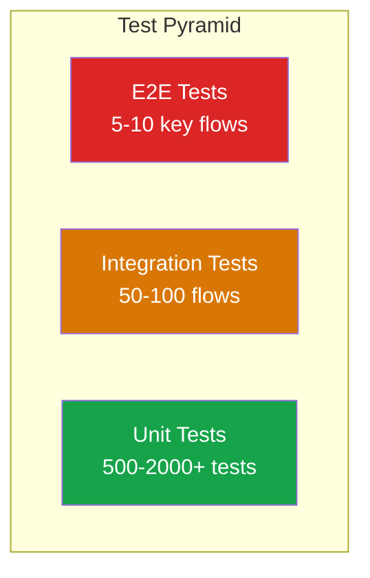

# SV-OS Testing Strategy

> **Complete testing system design** | **Date**: July 22, 2026

---

## Testing Philosophy

1. **Test behavior, not implementation** — Tests should validate what the system does, not how it does it
2. **Test at the right level** — Unit tests for logic, integration for flows, E2E for critical paths
3. **Test pyramid** — Lots of unit tests, fewer integration tests, few E2E tests
4. **Deterministic tests** — Tests should pass every time, not be flaky
5. **Test alongside code** — Write tests at the same time as implementation



---

## Test Types

### 1. Unit Tests

**Purpose**: Test individual functions, classes, and methods in isolation.  
**Tool**: pytest (backend), vitest (frontend)  
**Coverage Target**: 85%+  
**Location**: Alongside implementation files

| Module         | What to Test                        | Example                              |
| -------------- | ----------------------------------- | ------------------------------------ |
| Utilities      | Pure functions, formatters, helpers | `test_format_relative_time()`        |
| Validators     | Validation logic, constraints       | `test_validate_slug_format()`        |
| Engines        | Algorithm correctness               | `test_bfs_traversal_depth()`         |
| Schemas        | Pydantic validation                 | `test_login_request_invalid_email()` |
| Frontend utils | Array/string/number helpers         | `test_array_chunk()`                 |

**Pattern**:

```python
# tests/services/test_some_feature.py
async def test_create_valid_input():
    """Should create entity with valid data."""
    uow = UnitOfWork(session)
    service = SomeService(uow)
    result = await service.create(name="test", value=42)
    assert result.name == "test"
    assert result.value == 42
```

---

### 2. Integration Tests

**Purpose**: Test interactions between modules (service + repo, endpoint + service).  
**Tool**: pytest + httpx AsyncClient (backend), vitest + React Testing Library (frontend)  
**Coverage Target**: 60%+  
**Location**: `tests/` (backend), `__tests__/` (frontend)

| Scenario          | What to Test                                 |
| ----------------- | -------------------------------------------- |
| Auth flow         | Register → login → access protected endpoint |
| Graph CRUD        | Create node → create edge → query graph      |
| Progress tracking | Start learning → update progress → get stats |
| Search            | Import nodes → search → verify results       |
| Recommendations   | Complete prerequisites → get recommendations |

**Pattern**:

```python
async def test_full_graph_flow(async_client, db_session):
    """End-to-end graph creation and query."""
    # Create nodes
    resp = await async_client.post("/api/v1/nodes", json={...})
    assert resp.status_code == 201
    node_id = resp.json()["data"]["id"]

    # Create edge
    resp = await async_client.post("/api/v1/edges", json={...})
    assert resp.status_code == 201

    # Query graph
    resp = await async_client.get("/api/v1/graph/full")
    assert resp.status_code == 200
    assert len(resp.json()["data"]["nodes"]) == 2
```

---

### 3. Knowledge Validation Tests

**Purpose**: Test import validation, deduplication, and graph integrity.  
**Tool**: pytest  
**Coverage Target**: 90%+

| Test                                 | Description                              |
| ------------------------------------ | ---------------------------------------- |
| `test_validate_schema_missing_field` | Rejects import without required fields   |
| `test_validate_constraint_self_loop` | Rejects edge with same source and target |
| `test_dedup_exact_slug_match`        | Detects exact slug duplicates            |
| `test_dedup_fuzzy_title_match`       | Detects fuzzy title duplicates           |
| `test_validate_circular_dependency`  | Detects cycles in prerequisite chains    |
| `test_validate_broken_reference`     | Flags edges to non-existent nodes        |

---

### 4. Graph Tests

**Purpose**: Test graph algorithms and traversal correctness.  
**Tool**: pytest

| Algorithm            | Test Cases                                              |
| -------------------- | ------------------------------------------------------- |
| BFS                  | Basic traversal, max depth, cycle handling, empty graph |
| DFS                  | Basic traversal, max depth, ordering                    |
| Shortest path        | Direct path, multi-hop path, no path, same node         |
| Topological sort     | Linear graph, DAG with branches, cyclic (error)         |
| Connected components | Single component, multiple components, isolated node    |
| Cycle detection      | No cycle, simple cycle, complex cycle                   |
| Subgraph extraction  | Depth 1, depth 2, with relationship filter              |
| Dependency chain     | Single level, multi-level, max depth                    |

---

### 5. Import Tests

**Purpose**: Test all import formats and the full pipeline.  
**Tool**: pytest  
**Coverage Target**: 90%+

| Format   | Test Cases                                                                |
| -------- | ------------------------------------------------------------------------- |
| JSON     | Valid, missing fields, malformed, empty, large (1000 nodes)               |
| CSV      | Valid, header mapping, column count mismatch, encoding                    |
| Markdown | Full frontmatter, minimal frontmatter, no frontmatter, content extraction |
| YAML     | Valid, anchor references, complex nesting                                 |
| SQLite   | Expected schema, mismatched schema, empty tables                          |
| Pipeline | Full pipeline run, validation failure, dedup resolution                   |

---

### 6. API Tests

**Purpose**: Test every API endpoint for correctness, auth, and error handling.  
**Tool**: pytest + httpx AsyncClient  
**Coverage Target**: 80%+

| Test Category   | What to Test                            |
| --------------- | --------------------------------------- |
| Success path    | Valid request → 200/201 response        |
| Auth protection | No token → 401, expired token → 401     |
| Validation      | Invalid input → 422 with error messages |
| Not found       | Non-existent ID → 404                   |
| Conflict        | Duplicate creation → 409                |
| Pagination      | Default, custom page size, cursor       |

---

### 7. Frontend Tests

**Purpose**: Test React components, hooks, and utilities.  
**Tool**: vitest + React Testing Library + jsdom  
**Coverage Target**: 70%+

| Test Type   | What to Test                                   | Location         |
| ----------- | ---------------------------------------------- | ---------------- |
| Component   | Rendering, user interactions, state changes    | Near component   |
| Hook        | State management, side effects, error handling | Near hook        |
| Utility     | Pure function correctness                      | `lib/__tests__/` |
| Integration | Page-level flows (rendering, loading, error)   | Feature test     |

**Pattern**:

```tsx
// __tests__/Button.test.tsx
import { render, screen, fireEvent } from '@testing-library/react';
import { Button } from '@/components/ui/button';

describe('Button', () => {
  it('renders children', () => {
    render(<Button>Click me</Button>);
    expect(screen.getByText('Click me')).toBeInTheDocument();
  });

  it('calls onClick when clicked', () => {
    const handleClick = vi.fn();
    render(<Button onClick={handleClick}>Click</Button>);
    fireEvent.click(screen.getByText('Click'));
    expect(handleClick).toHaveBeenCalledTimes(1);
  });
});
```

---

### 8. Performance Tests

**Purpose**: Ensure system meets latency and throughput targets.  
**Tool**: k6 / locust (API), Lighthouse (frontend)  
**Frequency**: Weekly in CI

| Test                        | Target           | Tool       |
| --------------------------- | ---------------- | ---------- |
| API response time (p95)     | < 200ms          | k6         |
| API throughput              | 1000 req/s       | k6         |
| Graph load time (500 nodes) | < 2s             | Lighthouse |
| Search response             | < 500ms          | Custom     |
| Page load (initial)         | < 3s             | Lighthouse |
| Concurrent users            | 100 simultaneous | k6         |

---

### 9. Regression Tests

**Purpose**: Ensure existing functionality isn't broken by changes.  
**Strategy**: Run full test suite in CI on every PR.  
**Tool**: pytest + vitest (in CI pipeline)

| Test Selection      | When to Run    |
| ------------------- | -------------- |
| Full backend suite  | Every PR       |
| Full frontend suite | Every PR       |
| Integration tests   | Every PR       |
| E2E tests           | Before release |

---

## Test Folder Structure

```
apps/api/tests/
├── conftest.py                 # Shared fixtures
├── factories/                  # Test data factories
├── migrations/                 # Migration tests
├── repositories/               # Repository tests
├── services/                   # 12+ service test files
│   ├── test_auth_service.py
│   ├── test_graph_analytics.py
│   ├── test_rag_engine.py
│   └── ...
├── test_engine_lifecycle.py
├── test_graph_platform.py
├── test_health.py
├── test_ms56_engines.py
├── test_ms7_platform.py
├── test_ms8_platform.py
└── test_platform_foundation.py

apps/web/src/lib/__tests__/
└── index.test.ts               # Frontend utility tests

# Future test locations:
apps/api/tests/
├── import/                     # Import pipeline tests
├── validation/                 # Validation tests
├── performance/                # Performance benchmarks
└── e2e/                        # End-to-end tests
```

---

## CI Test Integration

```yaml
# In ci.yml (current) — tests run on every PR
- name: Backend Tests
  working-directory: apps/api
  run: python -m pytest tests/ -vv --tb=long -ra --maxfail=1

# Future enhancements:
- name: Frontend Tests
  working-directory: apps/web
  run: pnpm test

- name: Performance Tests
  run: k6 run tests/performance/smoke.js

- name: Coverage Report
  run: pytest --cov=app --cov-report=xml tests/
```

---

## Coverage Goals

| Module                | Current | Target    | Priority |
| --------------------- | ------- | --------- | -------- |
| Backend: Repositories | ~40%    | 90%+      | High     |
| Backend: Services     | ~60%    | 85%+      | High     |
| Backend: Engines      | ~50%    | 75%+      | High     |
| Backend: API          | ~30%    | 80%+      | High     |
| Frontend: Utilities   | ~10%    | 90%+      | Medium   |
| Frontend: Components  | ~0%     | 70%+      | Medium   |
| Frontend: Hooks       | ~0%     | 70%+      | Medium   |
| Frontend: Pages       | ~0%     | 60%+      | Medium   |
| Integration           | ~20%    | 60%+      | Low      |
| E2E                   | 0%      | Key flows | Low      |

---

## Future AI Evaluation Tests

| Test Type                | Purpose                                       | Implementation                |
| ------------------------ | --------------------------------------------- | ----------------------------- |
| Embedding quality        | Verify embeddings are semantically meaningful | Cosine similarity benchmarks  |
| RAG accuracy             | Measure response groundedness                 | Human evaluation of citations |
| Search relevance         | Precision and recall at K                     | Labeled test queries          |
| Recommendation diversity | Recommendations not stuck on one topic        | Category distribution check   |
| Hallucination detection  | AI responses are grounded in graph            | Automated fact-checking       |

---

_Cross-reference: [ENGINEERING_STANDARDS.md](./ENGINEERING_STANDARDS.md), [IMPLEMENTATION_GUIDE.md](./IMPLEMENTATION_GUIDE.md)_
